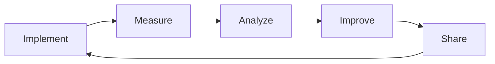
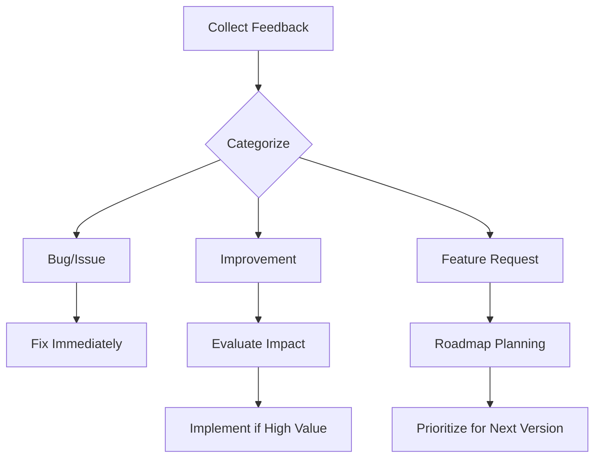

# 🔄 SDLC 4.3 Continuous Improvement Guide
## Version: 4.3 - Design-First Enhanced Framework with AI+Human Orchestration
## Date: [Current Date]
## Status: ACTIVE
## Framework: SDLC 4.3 Compliant
## Sponsor: Minh Tam Solution (MTS)
## Brand: Universal Development Framework for All Projects

---

## 🔄 **SDLC UPGRADE PROCESS INTEGRATION**

### **📋 Standardized Upgrade Process**
The **SDLC Upgrade Process Guide** provides a standardized, repeatable process for all SDLC version upgrades. This guide ensures consistency across all upgrades and eliminates the need for repeated instructions.

**Key Benefits:**
- **Zero Guidance Required**: Teams can execute upgrades independently
- **Consistent Quality**: Standardized process ensures high-quality results
- **Time Efficiency**: Eliminates repeated instruction cycles
- **Knowledge Preservation**: All lessons learned documented for future use

**Reference Document**: [SDLC-UPGRADE-PROCESS-GUIDE.md](./SDLC-UPGRADE-PROCESS-GUIDE.md)

---

## 🎯 **CONTINUOUS IMPROVEMENT PRINCIPLES**

1. **Learn from Experience**: Every project teaches valuable lessons
2. **Share Knowledge**: Community wisdom benefits everyone
3. **Measure Everything**: Data drives improvement decisions
4. **Iterate Rapidly**: Small, frequent improvements over big changes
5. **Stay Current**: Technology evolves, framework must follow
6. **Standardize Processes**: Document and standardize successful approaches

### The SDLC Improvement Cycle


---

## 📊 Metrics-Driven Improvement

### Key Performance Indicators (KPIs)

#### Development Metrics
```yaml
velocity_metrics:
  story_points_per_sprint:
    baseline: [Track initial velocity]
    target: [10% improvement quarterly]
    measurement: [Sprint tracking tools]
  
  cycle_time:
    baseline: [Current average]
    target: [20% reduction]
    measurement: [Git analytics]
  
  deployment_frequency:
    baseline: [Current frequency]
    target: [Daily deployments]
    measurement: [CI/CD metrics]
```

#### Quality Metrics
```yaml
quality_metrics:
  defect_density:
    baseline: [Bugs per KLOC]
    target: [<5 per KLOC]
    measurement: [Bug tracking system]
  
  test_coverage:
    baseline: [Current coverage]
    target: [>85%]
    measurement: [Coverage tools]
  
  code_review_effectiveness:
    baseline: [Issues found in review]
    target: [Catch 90% pre-production]
    measurement: [Review analytics]
```

#### Team Metrics
```yaml
team_metrics:
  satisfaction_score:
    baseline: [Current NPS]
    target: [>8/10]
    measurement: [Quarterly surveys]
  
  knowledge_sharing:
    baseline: [Documentation created]
    target: [1 article/dev/month]
    measurement: [Wiki contributions]
  
  skill_development:
    baseline: [Training hours]
    target: [40 hours/year/person]
    measurement: [Learning platform]
```

### Measurement Framework
```javascript
// metrics-collector.js
class SDLCMetricsCollector {
    constructor() {
        this.metrics = {
            development: {},
            quality: {},
            team: {},
            business: {}
        };
    }
    
    collectDaily() {
        // Automated daily metrics
        this.collectCommitMetrics();
        this.collectBuildMetrics();
        this.collectTestMetrics();
    }
    
    collectWeekly() {
        // Weekly team metrics
        this.collectSprintMetrics();
        this.collectCodeReviewMetrics();
        this.collectDeploymentMetrics();
    }
    
    generateInsights() {
        // AI-powered insights
        return {
            trends: this.analyzeTrends(),
            recommendations: this.generateRecommendations(),
            alerts: this.identifyIssues()
        };
    }
}
```

---

## 🚀 Improvement Process

### 1. Identify Improvement Areas

#### Regular Assessment Schedule
- **Daily**: Stand-up observations
- **Weekly**: Sprint metrics review
- **Monthly**: Process retrospectives
- **Quarterly**: Framework evaluation
- **Annually**: Major version planning

#### Assessment Tools
```markdown
## Improvement Identification Checklist

### Process Improvements
- [ ] Are there repetitive manual tasks?
- [ ] Which processes cause delays?
- [ ] Where do errors commonly occur?
- [ ] What causes rework?
- [ ] Which standards are unclear?

### Technical Improvements
- [ ] What tools need upgrading?
- [ ] Which patterns need refinement?
- [ ] Where is technical debt accumulating?
- [ ] What performance issues exist?
- [ ] Which integrations are problematic?

### Team Improvements
- [ ] Where is knowledge lacking?
- [ ] Which skills need development?
- [ ] What communication gaps exist?
- [ ] Where is collaboration difficult?
- [ ] What causes team friction?
```

### 2. Implement Improvements

#### Improvement Implementation Framework
```yaml
improvement_process:
  step_1_propose:
    - identify_problem
    - document_current_state
    - design_solution
    - estimate_impact
    - get_approval
  
  step_2_pilot:
    - select_pilot_team
    - implement_change
    - measure_results
    - gather_feedback
    - refine_approach
  
  step_3_rollout:
    - create_rollout_plan
    - train_teams
    - implement_broadly
    - monitor_adoption
    - measure_impact
  
  step_4_standardize:
    - update_documentation
    - create_templates
    - automate_where_possible
    - share_learnings
    - celebrate_success
```

#### Change Management
```javascript
// change-management.js
class ChangeManagement {
    proposeImprovement(improvement) {
        return {
            id: generateId(),
            title: improvement.title,
            description: improvement.description,
            impact: this.assessImpact(improvement),
            effort: this.estimateEffort(improvement),
            roi: this.calculateROI(improvement),
            risks: this.identifyRisks(improvement),
            plan: this.createImplementationPlan(improvement)
        };
    }
    
    trackImprovement(id) {
        return {
            status: this.getStatus(id),
            metrics: this.getMetrics(id),
            feedback: this.getFeedback(id),
            blockers: this.getBlockers(id),
            nextSteps: this.getNextSteps(id)
        };
    }
}
```

### 3. Share Learnings

#### Knowledge Sharing Channels
1. **Internal Wiki**: Document all improvements
2. **Team Presentations**: Monthly show-and-tell
3. **Community Forum**: Share with SDLC community
4. **Blog Posts**: Public learnings
5. **Conference Talks**: Industry sharing

#### Documentation Template
```markdown
# Improvement Case Study: [Title]

## Problem Statement
[What problem were we solving?]

## Solution Approach
[How did we solve it?]

## Implementation Details
[Technical details and code samples]

## Results
- **Before**: [Metrics before improvement]
- **After**: [Metrics after improvement]
- **Impact**: [Business impact]

## Lessons Learned
[What worked, what didn't]

## Recommendations
[Advice for others implementing similar improvements]

## Resources
[Links, code, templates]
```

---

## 🏗️ Framework Contribution

### How to Contribute to MTS SDLC Framework

#### Contribution Types
1. **Bug Fixes**: Identify and fix issues
2. **Feature Additions**: Propose new features
3. **Documentation**: Improve guides and examples
4. **Templates**: Share useful templates
5. **Case Studies**: Share success stories
6. **Tools**: Develop supporting tools
7. **Translations**: Localize content

#### Contribution Process
```bash
# 1. Fork the repository
git clone https://github.com/sdlc-framework/sdlc-3.3.3.git
cd sdlc-3.3.3

# 2. Create feature branch
git checkout -b improvement/your-improvement

# 3. Make changes
# Follow SDLC 4.3 standards!

# 4. Test thoroughly
python scripts/compliance/sdlc_scanner.py
# Must achieve 90%+ compliance

# 5. Document changes
# Update relevant documentation

# 6. Submit pull request
git push origin improvement/your-improvement
# Create PR with detailed description
```

#### Contribution Guidelines
```yaml
contribution_standards:
  code_quality:
    - compliance_score: ">= 90%"
    - test_coverage: ">= 85%"
    - documentation: "Complete"
    - peer_review: "Required"
  
  documentation:
    - language: "English"
    - format: "Markdown"
    - examples: "Required"
    - diagrams: "When helpful"
  
  process:
    - issue_first: "Create issue before PR"
    - small_changes: "One feature per PR"
    - tests_required: "All changes need tests"
    - backwards_compatible: "Don't break existing"
```

---

## 🎓 Learning & Development

### Continuous Learning Program

#### Individual Learning Path
```markdown
## SDLC 4.3 Mastery Path

### Level 1: Foundation (Month 1-2)
- [ ] Complete basic training
- [ ] Implement first project
- [ ] Pass foundation certification
- [ ] Document learnings

### Level 2: Practitioner (Month 3-6)
- [ ] Lead team implementation
- [ ] Contribute improvements
- [ ] Mentor newcomers
- [ ] Advanced certification

### Level 3: Expert (Month 7-12)
- [ ] Design custom solutions
- [ ] Develop tools/extensions
- [ ] Speak at conferences
- [ ] Expert certification

### Level 4: Master (Year 2+)
- [ ] Framework contributions
- [ ] Industry thought leadership
- [ ] Training development
- [ ] Master certification
```

#### Team Learning Activities
1. **Weekly Tech Talks**: Share learnings
2. **Monthly Workshops**: Hands-on practice
3. **Quarterly Hackathons**: Innovation time
4. **Annual Conference**: Industry learning
5. **Certification Programs**: Formal recognition

### Innovation Time
```yaml
innovation_allocation:
  "20%_time": 
    purpose: "Explore improvements"
    activities:
      - Research new tools
      - Prototype solutions
      - Learn new skills
      - Contribute to framework
    
  hackathon_days:
    frequency: "Quarterly"
    duration: "2 days"
    output: "Working prototypes"
    
  learning_budget:
    allocation: "$2000/person/year"
    usage:
      - Courses
      - Conferences
      - Books
      - Tools
```

---

## 🔄 Feedback Loops

### Gathering Feedback

#### Feedback Channels
```javascript
// feedback-system.js
const feedbackChannels = {
    automated: {
        metrics: "Continuous monitoring",
        alerts: "Automated issue detection",
        analytics: "Usage pattern analysis"
    },
    
    structured: {
        surveys: "Quarterly satisfaction",
        retrospectives: "Sprint retrospectives",
        reviews: "Code review feedback",
        audits: "Compliance audits"
    },
    
    informal: {
        standups: "Daily observations",
        slackChannel: "#sdlc-feedback",
        suggestions: "Suggestion box",
        coffeeChats: "Informal discussions"
    }
};
```

#### Feedback Processing


### Acting on Feedback
1. **Acknowledge**: Respond within 48 hours
2. **Analyze**: Assess impact and feasibility
3. **Prioritize**: Use impact/effort matrix
4. **Communicate**: Share decisions transparently
5. **Implement**: Follow improvement process
6. **Follow-up**: Circle back with results

---

## 🏆 Recognition & Rewards

### Contribution Recognition

#### Recognition Levels
1. **Contributor**: First accepted contribution
2. **Active Contributor**: 5+ contributions
3. **Core Contributor**: 20+ contributions
4. **Framework Champion**: Major improvements
5. **Hall of Fame**: Transformational contributions

#### Reward System
```yaml
rewards:
  individual:
    - Public recognition
    - Certificate of contribution
    - Conference speaking opportunities
    - Training opportunities
    - Career advancement priority
  
  team:
    - Team excellence awards
    - Innovation bonuses
    - Conference attendance
    - Team celebrations
    - Public case studies
```

---

## 📈 Improvement Tracking

### Progress Dashboard
```javascript
// improvement-dashboard.js
class ImprovementDashboard {
    constructor() {
        this.improvements = [];
        this.metrics = {};
        this.trends = {};
    }
    
    trackImprovement(improvement) {
        return {
            id: improvement.id,
            status: improvement.status,
            impact: this.measureImpact(improvement),
            adoption: this.measureAdoption(improvement),
            feedback: this.collectFeedback(improvement),
            roi: this.calculateROI(improvement)
        };
    }
    
    generateReport() {
        return {
            totalImprovements: this.improvements.length,
            successRate: this.calculateSuccessRate(),
            averageImpact: this.calculateAverageImpact(),
            topContributors: this.getTopContributors(),
            nextPriorities: this.identifyNextPriorities()
        };
    }
}
```

### Success Stories Archive
- Document all successful improvements
- Share metrics and impact
- Create reusable templates
- Build improvement library
- Celebrate achievements

---

## 🌐 Community Building

### SDLC Community

#### Community Platforms
- **Forum**: community.sdlc-framework.com
- **Slack**: sdlc-framework.slack.com
- **GitHub**: github.com/sdlc-framework
- **LinkedIn**: MTS SDLC Framework Group
- **Twitter**: @SDLCFramework

#### Community Activities
1. **Monthly Meetups**: Virtual and in-person
2. **Annual Conference**: SDLCCon
3. **Webinar Series**: Best practices
4. **Open Source Days**: Contribution sprints
5. **Certification Programs**: Professional development

### Building Internal Community
```markdown
## Internal SDLC Community Blueprint

### Structure
- Executive Sponsors
- Framework Champions
- Team Representatives
- Subject Matter Experts

### Activities
- Weekly office hours
- Monthly showcases
- Quarterly workshops
- Annual summit

### Communication
- Dedicated Slack channels
- Wiki/documentation site
- Newsletter
- Dashboard/metrics

### Support
- Mentorship program
- Pair programming
- Documentation help
- Tool development
```

---

## 🔮 Future Evolution

### Roadmap Contribution
Teams can influence framework evolution by:
1. Submitting feature requests
2. Voting on priorities
3. Contributing code
4. Sharing use cases
5. Participating in beta testing

### Innovation Areas
- AI/ML integration
- Automation opportunities
- Performance optimization
- Security enhancements
- Developer experience
- Cloud-native features
- Mobile development
- IoT/Edge computing

---

## ✅ Improvement Checklist

### Weekly
- [ ] Review sprint metrics
- [ ] Identify bottlenecks
- [ ] Share team learnings
- [ ] Update documentation

### Monthly
- [ ] Analyze trends
- [ ] Implement quick wins
- [ ] Share success stories
- [ ] Plan improvements

### Quarterly
- [ ] Major retrospective
- [ ] Framework evaluation
- [ ] Contribution review
- [ ] Training assessment

### Annually
- [ ] Version planning
- [ ] Strategic review
- [ ] Community contribution
- [ ] Certification renewal

---

## 📞 Support for Improvement

### Resources
- **Improvement Guide**: This document
- **Templates**: /templates/improvement/
- **Tools**: /tools/metrics/
- **Examples**: /case-studies/improvements/

### Get Help
- **Email**: improve@sdlc-framework.com
- **Slack**: #continuous-improvement
- **Office Hours**: Thursdays 2-3 PM
- **Mentorship**: mentor@sdlc-framework.com

---

*"The best framework is one that evolves with its users"*

*SDLC 4.3 Continuous Improvement Guide*  
*© 2025 Minh Tam Solution*  
*Together We Build Better*