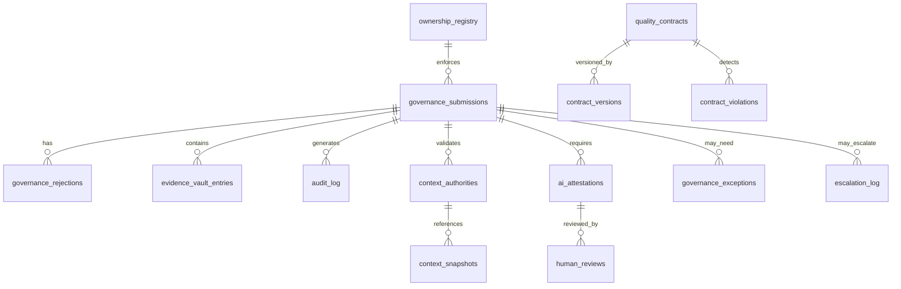

# Database Schema Design
## 14-Table Governance System Architecture

**Version**: 1.0.0
**Date**: January 27, 2026
**Authority**: Phase 0 Deliverable #5 (48-hour CTO Gate Review)
**Prerequisites**: CTO Addendum 1 (Expand from 6 → 14 tables)
**Phase**: PRE-PHASE 0 → PHASE 0 → WEEK 1

---

## 📋 DOCUMENT PURPOSE

**Goal**: Design 14-table database schema for Governance System v1.0 with:
- Zero-downtime migration strategy
- <100ms P95 query performance
- 7-year audit retention
- Foreign key cascades for data integrity

**Success Criteria**:
- All queries <100ms (P95)
- Zero data loss during migrations
- 7-year compliance audit trail
- Foreign key integrity enforced

---

## 🗄️ TABLE INVENTORY (14 Tables)

### Original 6 Tables (Planned)

```yaml
1. governance_submissions:
   Purpose: Track all code submissions for governance validation
   Rows: 10K/month (120K/year)
   Indexes: 3

2. governance_rejections:
   Purpose: Store rejection reasons and feedback
   Rows: 3K/month (30% rejection rate)
   Indexes: 2

3. evidence_vault_entries:
   Purpose: Metadata for evidence stored in MinIO
   Rows: 50K/month (5 evidence per submission)
   Indexes: 4

4. audit_log:
   Purpose: Immutable audit trail (who did what when)
   Rows: 100K/month (all governance actions)
   Indexes: 5
   Retention: 7 years (HIPAA/SOC 2 compliance)

5. ownership_registry:
   Purpose: File ownership annotations
   Rows: 5K (codebase files)
   Indexes: 2

6. quality_contracts:
   Purpose: Policy-as-code rules (YAML contracts)
   Rows: 50 contracts
   Indexes: 2
```

### CTO Added 8 Tables (Expanded)

```yaml
7. context_authorities:
   Purpose: Context linkage validation results
   Rows: 10K/month
   Indexes: 3

8. context_snapshots:
   Purpose: Historical context state (ADRs, AGENTS.md)
   Rows: 1K/month (snapshot on change)
   Indexes: 2

9. contract_versions:
   Purpose: Policy contract versioning
   Rows: 200/year (contract evolution)
   Indexes: 2

10. contract_violations:
    Purpose: Policy violation details
    Rows: 5K/month
    Indexes: 3

11. ai_attestations:
    Purpose: AI-generated code attestations
    Rows: 5K/month (50% AI content)
    Indexes: 3

12. human_reviews:
    Purpose: Human review of AI code
    Rows: 5K/month
    Indexes: 2

13. governance_exceptions:
    Purpose: Break glass / exception requests
    Rows: 50/month (rare)
    Indexes: 3

14. escalation_log:
    Purpose: Red/Orange PR escalations to CEO
    Rows: 2K/month (20% escalation rate)
    Indexes: 4
```

---

## 📐 ENTITY-RELATIONSHIP DIAGRAM

### Core Entities



---

## 📊 TABLE SCHEMAS (Detailed)

### 1. governance_submissions

**Purpose**: Central table for all code submissions requiring governance validation.

```sql
CREATE TABLE governance_submissions (
    -- Primary Key
    id UUID PRIMARY KEY DEFAULT gen_random_uuid(),

    -- Submission Metadata
    project_id UUID NOT NULL REFERENCES projects(id) ON DELETE CASCADE,
    pr_number INTEGER,
    task_id UUID REFERENCES tasks(id) ON DELETE SET NULL,
    branch_name VARCHAR(255) NOT NULL,
    commit_sha VARCHAR(40) NOT NULL,

    -- Submitter Info
    submitted_by UUID NOT NULL REFERENCES users(id) ON DELETE RESTRICT,
    submitted_at TIMESTAMP NOT NULL DEFAULT NOW(),

    -- Submission Content
    diff_summary TEXT,
    files_changed JSONB NOT NULL,  -- [{path, additions, deletions}]
    total_lines_added INTEGER NOT NULL DEFAULT 0,
    total_lines_deleted INTEGER NOT NULL DEFAULT 0,

    -- Governance Status
    status VARCHAR(50) NOT NULL DEFAULT 'pending',
        -- Enum: pending | validating | passed | failed | escalated
    vibecoding_index NUMERIC(5,2),  -- 0.00 to 100.00
    routing VARCHAR(50),
        -- Enum: auto_approve | tech_lead_review | ceo_should_review | ceo_must_review

    -- Validation Results
    passed_checks JSONB,  -- [{check_name, passed, details}]
    failed_checks JSONB,
    validation_completed_at TIMESTAMP,

    -- Performance Tracking
    validation_duration_ms INTEGER,  -- Target: <500ms

    -- Timestamps
    created_at TIMESTAMP NOT NULL DEFAULT NOW(),
    updated_at TIMESTAMP NOT NULL DEFAULT NOW(),

    -- Indexes
    CONSTRAINT check_vibecoding_index CHECK (vibecoding_index >= 0 AND vibecoding_index <= 100)
);

-- Indexes for Performance (<100ms P95)
CREATE INDEX idx_submissions_project_id ON governance_submissions(project_id);
CREATE INDEX idx_submissions_status ON governance_submissions(status);
CREATE INDEX idx_submissions_submitted_at ON governance_submissions(submitted_at DESC);
CREATE INDEX idx_submissions_vibecoding_index ON governance_submissions(vibecoding_index) WHERE vibecoding_index IS NOT NULL;
```

**Performance Targets**:
- Query by project_id: <50ms (P95)
- Query by status: <30ms (P95)
- Query by vibecoding_index: <20ms (P95)

**Retention**: 2 years (archivable to cold storage)

---

### 2. governance_rejections

**Purpose**: Store rejection reasons with actionable feedback.

```sql
CREATE TABLE governance_rejections (
    -- Primary Key
    id UUID PRIMARY KEY DEFAULT gen_random_uuid(),

    -- Foreign Key
    submission_id UUID NOT NULL REFERENCES governance_submissions(id) ON DELETE CASCADE,

    -- Rejection Details
    rejection_reason VARCHAR(255) NOT NULL,
        -- Enum: missing_ownership | missing_intent | stage_violation | etc
    rejection_category VARCHAR(100) NOT NULL,
        -- Enum: compliance | quality | security | context
    severity VARCHAR(50) NOT NULL,
        -- Enum: error | warning | info

    -- Feedback (from feedback_templates.yaml)
    feedback_template_id VARCHAR(100),
    feedback_message TEXT NOT NULL,
    feedback_cli_command TEXT,
    documentation_link TEXT,

    -- Resolution
    resolved BOOLEAN NOT NULL DEFAULT FALSE,
    resolved_at TIMESTAMP,
    resolved_by UUID REFERENCES users(id) ON DELETE SET NULL,

    -- Timestamps
    created_at TIMESTAMP NOT NULL DEFAULT NOW(),
    updated_at TIMESTAMP NOT NULL DEFAULT NOW()
);

-- Indexes
CREATE INDEX idx_rejections_submission_id ON governance_rejections(submission_id);
CREATE INDEX idx_rejections_resolved ON governance_rejections(resolved) WHERE NOT resolved;
```

---

### 3. evidence_vault_entries

**Purpose**: Metadata for evidence artifacts stored in MinIO S3.

```sql
CREATE TABLE evidence_vault_entries (
    -- Primary Key
    id UUID PRIMARY KEY DEFAULT gen_random_uuid(),

    -- Foreign Key
    submission_id UUID NOT NULL REFERENCES governance_submissions(id) ON DELETE CASCADE,
    project_id UUID NOT NULL REFERENCES projects(id) ON DELETE CASCADE,

    -- Evidence Metadata
    evidence_type VARCHAR(100) NOT NULL,
        -- Enum: intent_statement | ownership_declaration | adr_linkage |
        --       test_coverage_report | security_scan_report | ai_attestation
    evidence_name VARCHAR(255) NOT NULL,
    evidence_description TEXT,

    -- Storage Location (MinIO S3)
    s3_bucket VARCHAR(255) NOT NULL,
    s3_key TEXT NOT NULL,
    s3_url TEXT NOT NULL,

    -- File Metadata
    file_size_bytes BIGINT NOT NULL,
    mime_type VARCHAR(100) NOT NULL,
    sha256_hash VARCHAR(64) NOT NULL,  -- Integrity verification

    -- Evidence Lifecycle (8 states)
    state VARCHAR(50) NOT NULL DEFAULT 'uploaded',
        -- Enum: uploaded | validating | validated | rejected | archived | deleted
    state_changed_at TIMESTAMP NOT NULL DEFAULT NOW(),

    -- Access Control
    uploaded_by UUID NOT NULL REFERENCES users(id) ON DELETE RESTRICT,
    uploaded_at TIMESTAMP NOT NULL DEFAULT NOW(),

    -- Timestamps
    created_at TIMESTAMP NOT NULL DEFAULT NOW(),
    updated_at TIMESTAMP NOT NULL DEFAULT NOW(),

    -- Integrity Constraint
    UNIQUE(s3_bucket, s3_key)
);

-- Indexes
CREATE INDEX idx_evidence_submission_id ON evidence_vault_entries(submission_id);
CREATE INDEX idx_evidence_project_id ON evidence_vault_entries(project_id);
CREATE INDEX idx_evidence_type ON evidence_vault_entries(evidence_type);
CREATE INDEX idx_evidence_state ON evidence_vault_entries(state);
```

**Retention**: 7 years (HIPAA/SOC 2 compliance)

---

### 4. audit_log

**Purpose**: Immutable audit trail for all governance actions (HIPAA/SOC 2 compliance).

```sql
CREATE TABLE audit_log (
    -- Primary Key
    id UUID PRIMARY KEY DEFAULT gen_random_uuid(),

    -- Actor
    user_id UUID REFERENCES users(id) ON DELETE SET NULL,
    user_email VARCHAR(255) NOT NULL,
    user_role VARCHAR(50),
    ip_address INET,

    -- Action
    action VARCHAR(100) NOT NULL,
        -- Enum: submit_pr | approve_gate | reject_gate | break_glass |
        --       override_decision | escalate_to_ceo | etc
    action_category VARCHAR(50) NOT NULL,
        -- Enum: governance | security | exception | calibration

    -- Target
    target_type VARCHAR(100),
        -- Enum: submission | gate | policy | evidence | exception
    target_id UUID,

    -- Context
    project_id UUID REFERENCES projects(id) ON DELETE SET NULL,
    submission_id UUID REFERENCES governance_submissions(id) ON DELETE SET NULL,

    -- Details
    action_details JSONB,  -- Flexible structure for action-specific data
    outcome VARCHAR(50),
        -- Enum: success | failure | pending

    -- Timestamp (IMMUTABLE - never updated)
    timestamp TIMESTAMP NOT NULL DEFAULT NOW()
);

-- Indexes for Fast Audit Queries
CREATE INDEX idx_audit_user_id ON audit_log(user_id);
CREATE INDEX idx_audit_timestamp ON audit_log(timestamp DESC);
CREATE INDEX idx_audit_action ON audit_log(action);
CREATE INDEX idx_audit_project_id ON audit_log(project_id);
CREATE INDEX idx_audit_submission_id ON audit_log(submission_id);

-- Immutability: Prevent UPDATE/DELETE (PostgreSQL trigger)
CREATE OR REPLACE FUNCTION prevent_audit_log_modification()
RETURNS TRIGGER AS $$
BEGIN
    RAISE EXCEPTION 'Audit log is immutable - UPDATE/DELETE forbidden';
END;
$$ LANGUAGE plpgsql;

CREATE TRIGGER audit_log_immutable
    BEFORE UPDATE OR DELETE ON audit_log
    FOR EACH ROW
    EXECUTE FUNCTION prevent_audit_log_modification();
```

**Retention**: 7 years (NEVER delete, archivable to cold storage after 1 year)

**Performance Target**: <50ms (P95) for audit queries by user/project/timestamp

---

### 5. ownership_registry

**Purpose**: File ownership annotations (enforces Principle 2: NO CODE WITHOUT OWNERSHIP).

```sql
CREATE TABLE ownership_registry (
    -- Primary Key
    id UUID PRIMARY KEY DEFAULT gen_random_uuid(),

    -- File Metadata
    project_id UUID NOT NULL REFERENCES projects(id) ON DELETE CASCADE,
    file_path TEXT NOT NULL,
    file_hash VARCHAR(64),  -- SHA256 of file content

    -- Ownership
    owner_user_id UUID REFERENCES users(id) ON DELETE SET NULL,
    owner_team_id UUID REFERENCES teams(id) ON DELETE SET NULL,
    ownership_source VARCHAR(50) NOT NULL,
        -- Enum: codeowners | git_blame | directory_pattern | task_creator | manual
    ownership_confidence NUMERIC(3,2),  -- 0.00 to 1.00

    -- Module Classification
    module_name VARCHAR(255),
    module_type VARCHAR(100),
        -- Enum: service | controller | repository | utility | etc

    -- Timestamps
    declared_at TIMESTAMP NOT NULL DEFAULT NOW(),
    last_verified_at TIMESTAMP,
    created_at TIMESTAMP NOT NULL DEFAULT NOW(),
    updated_at TIMESTAMP NOT NULL DEFAULT NOW(),

    -- Unique Constraint
    UNIQUE(project_id, file_path)
);

-- Indexes
CREATE INDEX idx_ownership_project_file ON ownership_registry(project_id, file_path);
CREATE INDEX idx_ownership_owner_user ON ownership_registry(owner_user_id);
```

---

### 6. quality_contracts

**Purpose**: Policy-as-Code rules (YAML contracts compiled to OPA Rego).

```sql
CREATE TABLE quality_contracts (
    -- Primary Key
    id UUID PRIMARY KEY DEFAULT gen_random_uuid(),

    -- Contract Metadata
    contract_name VARCHAR(255) NOT NULL UNIQUE,
    contract_category VARCHAR(100) NOT NULL,
        -- Enum: architecture | testing | security | documentation | ai_governance
    contract_description TEXT NOT NULL,

    -- Contract Content
    contract_yaml TEXT NOT NULL,  -- Original YAML
    contract_rego TEXT,  -- Compiled OPA Rego (nullable, may compile on-demand)

    -- Versioning
    version VARCHAR(50) NOT NULL DEFAULT '1.0.0',
    is_active BOOLEAN NOT NULL DEFAULT TRUE,
    deprecated_at TIMESTAMP,

    -- Ownership
    created_by UUID NOT NULL REFERENCES users(id) ON DELETE RESTRICT,
    approved_by UUID REFERENCES users(id) ON DELETE SET NULL,

    -- Timestamps
    created_at TIMESTAMP NOT NULL DEFAULT NOW(),
    updated_at TIMESTAMP NOT NULL DEFAULT NOW()
);

-- Indexes
CREATE INDEX idx_contracts_active ON quality_contracts(is_active) WHERE is_active = TRUE;
CREATE INDEX idx_contracts_category ON quality_contracts(contract_category);
```

---

### 7. context_authorities

**Purpose**: Context linkage validation results (Principle 3: NO CHANGE WITHOUT TRACEABILITY).

```sql
CREATE TABLE context_authorities (
    -- Primary Key
    id UUID PRIMARY KEY DEFAULT gen_random_uuid(),

    -- Foreign Key
    submission_id UUID NOT NULL REFERENCES governance_submissions(id) ON DELETE CASCADE,
    project_id UUID NOT NULL REFERENCES projects(id) ON DELETE CASCADE,

    -- Context Validation Results
    has_adr_linkage BOOLEAN NOT NULL DEFAULT FALSE,
    linked_adrs JSONB,  -- [{adr_id, adr_title, relevance_score}]

    has_design_doc BOOLEAN NOT NULL DEFAULT FALSE,
    linked_design_docs JSONB,

    agents_md_freshness_days INTEGER,
    agents_md_stale BOOLEAN NOT NULL DEFAULT FALSE,

    module_annotation_consistent BOOLEAN NOT NULL DEFAULT TRUE,
    module_annotation_issues JSONB,

    -- Validation Status
    validation_status VARCHAR(50) NOT NULL DEFAULT 'pending',
        -- Enum: pending | passed | failed
    validation_errors JSONB,

    -- Context Snapshot Reference
    context_snapshot_id UUID REFERENCES context_snapshots(id) ON DELETE SET NULL,

    -- Performance
    validation_duration_ms INTEGER,

    -- Timestamps
    created_at TIMESTAMP NOT NULL DEFAULT NOW(),
    updated_at TIMESTAMP NOT NULL DEFAULT NOW()
);

-- Indexes
CREATE INDEX idx_context_submission_id ON context_authorities(submission_id);
CREATE INDEX idx_context_project_id ON context_authorities(project_id);
CREATE INDEX idx_context_status ON context_authorities(validation_status);
```

---

### 8. context_snapshots

**Purpose**: Historical context state (ADRs, AGENTS.md) for reproducible validation.

```sql
CREATE TABLE context_snapshots (
    -- Primary Key
    id UUID PRIMARY KEY DEFAULT gen_random_uuid(),

    -- Project Context
    project_id UUID NOT NULL REFERENCES projects(id) ON DELETE CASCADE,
    commit_sha VARCHAR(40) NOT NULL,

    -- Snapshot Content
    adrs JSONB NOT NULL,  -- [{id, title, status, content_hash}]
    agents_md_content TEXT,
    agents_md_hash VARCHAR(64),

    design_docs JSONB,
    module_registry JSONB,

    -- Snapshot Metadata
    snapshot_reason VARCHAR(255),
        -- Enum: adr_created | adr_updated | agents_md_updated | scheduled
    snapshot_size_bytes BIGINT,

    -- Timestamps
    created_at TIMESTAMP NOT NULL DEFAULT NOW()
);

-- Indexes
CREATE INDEX idx_snapshots_project_id ON context_snapshots(project_id);
CREATE INDEX idx_snapshots_commit_sha ON context_snapshots(commit_sha);
CREATE INDEX idx_snapshots_created_at ON context_snapshots(created_at DESC);
```

**Retention**: 2 years (archivable)

---

### 9. contract_versions

**Purpose**: Policy contract versioning (track contract evolution over time).

```sql
CREATE TABLE contract_versions (
    -- Primary Key
    id UUID PRIMARY KEY DEFAULT gen_random_uuid(),

    -- Foreign Key
    contract_id UUID NOT NULL REFERENCES quality_contracts(id) ON DELETE CASCADE,

    -- Version Metadata
    version VARCHAR(50) NOT NULL,
    version_description TEXT,

    -- Version Content
    contract_yaml TEXT NOT NULL,
    contract_rego TEXT,

    -- Change Tracking
    changed_by UUID NOT NULL REFERENCES users(id) ON DELETE RESTRICT,
    change_reason TEXT,

    -- Timestamps
    created_at TIMESTAMP NOT NULL DEFAULT NOW(),

    -- Unique Constraint
    UNIQUE(contract_id, version)
);

-- Indexes
CREATE INDEX idx_contract_versions_contract_id ON contract_versions(contract_id);
CREATE INDEX idx_contract_versions_created_at ON contract_versions(created_at DESC);
```

---

### 10. contract_violations

**Purpose**: Policy violation details (link to specific contracts).

```sql
CREATE TABLE contract_violations (
    -- Primary Key
    id UUID PRIMARY KEY DEFAULT gen_random_uuid(),

    -- Foreign Keys
    submission_id UUID NOT NULL REFERENCES governance_submissions(id) ON DELETE CASCADE,
    contract_id UUID NOT NULL REFERENCES quality_contracts(id) ON DELETE CASCADE,

    -- Violation Details
    violation_type VARCHAR(255) NOT NULL,
    violation_severity VARCHAR(50) NOT NULL,
        -- Enum: error | warning | info
    violation_message TEXT NOT NULL,

    -- Location
    file_path TEXT,
    line_number INTEGER,

    -- Resolution
    resolved BOOLEAN NOT NULL DEFAULT FALSE,
    resolved_at TIMESTAMP,
    resolution_notes TEXT,

    -- Timestamps
    created_at TIMESTAMP NOT NULL DEFAULT NOW(),
    updated_at TIMESTAMP NOT NULL DEFAULT NOW()
);

-- Indexes
CREATE INDEX idx_violations_submission_id ON contract_violations(submission_id);
CREATE INDEX idx_violations_contract_id ON contract_violations(contract_id);
CREATE INDEX idx_violations_resolved ON contract_violations(resolved) WHERE NOT resolved;
```

---

### 11. ai_attestations

**Purpose**: AI-generated code attestations (Principle 4: NO AI OUTPUT WITHOUT EXPLAINABILITY).

```sql
CREATE TABLE ai_attestations (
    -- Primary Key
    id UUID PRIMARY KEY DEFAULT gen_random_uuid(),

    -- Foreign Key
    submission_id UUID NOT NULL REFERENCES governance_submissions(id) ON DELETE CASCADE,
    project_id UUID NOT NULL REFERENCES projects(id) ON DELETE CASCADE,

    -- AI Session Metadata
    ai_provider VARCHAR(100) NOT NULL,
        -- Enum: ollama | claude | gpt-4o | deepcode
    model_version VARCHAR(255) NOT NULL,
    session_id VARCHAR(255),
    prompt_hash VARCHAR(64),

    -- AI-Generated Content
    ai_generated_files JSONB NOT NULL,  -- [{path, lines_added}]
    total_ai_lines INTEGER NOT NULL DEFAULT 0,

    -- Human Review (MANDATORY)
    review_time_minutes INTEGER NOT NULL,
    minimum_review_time_minutes INTEGER NOT NULL,
        -- Calculated: ai_lines * 2 seconds / 60
    review_sufficient BOOLEAN NOT NULL DEFAULT FALSE,

    modifications_made TEXT,  -- What developer changed and why
    understanding_confirmed BOOLEAN NOT NULL DEFAULT FALSE,

    -- Attestation
    attested_by UUID NOT NULL REFERENCES users(id) ON DELETE RESTRICT,
    attested_at TIMESTAMP NOT NULL DEFAULT NOW(),

    -- Timestamps
    created_at TIMESTAMP NOT NULL DEFAULT NOW(),
    updated_at TIMESTAMP NOT NULL DEFAULT NOW(),

    -- Constraints
    CONSTRAINT check_review_time CHECK (review_time_minutes >= 0),
    CONSTRAINT check_review_sufficient CHECK (
        review_sufficient = (review_time_minutes >= minimum_review_time_minutes)
    )
);

-- Indexes
CREATE INDEX idx_attestations_submission_id ON ai_attestations(submission_id);
CREATE INDEX idx_attestations_project_id ON ai_attestations(project_id);
CREATE INDEX idx_attestations_attested_by ON ai_attestations(attested_by);
```

---

### 12. human_reviews

**Purpose**: Human review of AI-generated code (tracks review quality).

```sql
CREATE TABLE human_reviews (
    -- Primary Key
    id UUID PRIMARY KEY DEFAULT gen_random_uuid(),

    -- Foreign Key
    attestation_id UUID NOT NULL REFERENCES ai_attestations(id) ON DELETE CASCADE,
    submission_id UUID NOT NULL REFERENCES governance_submissions(id) ON DELETE CASCADE,

    -- Reviewer
    reviewed_by UUID NOT NULL REFERENCES users(id) ON DELETE RESTRICT,
    reviewer_role VARCHAR(50) NOT NULL,
        -- Enum: developer | tech_lead | senior_dev | cto

    -- Review Details
    review_duration_minutes INTEGER NOT NULL,
    review_notes TEXT,

    -- Review Findings
    issues_found INTEGER NOT NULL DEFAULT 0,
    issues_fixed INTEGER NOT NULL DEFAULT 0,
    code_quality_rating INTEGER,  -- 1-5 scale
        CONSTRAINT check_quality_rating CHECK (code_quality_rating BETWEEN 1 AND 5),

    -- Timestamps
    reviewed_at TIMESTAMP NOT NULL DEFAULT NOW(),
    created_at TIMESTAMP NOT NULL DEFAULT NOW()
);

-- Indexes
CREATE INDEX idx_reviews_attestation_id ON human_reviews(attestation_id);
CREATE INDEX idx_reviews_reviewed_by ON human_reviews(reviewed_by);
```

---

### 13. governance_exceptions

**Purpose**: Break glass / exception requests (emergency bypass for P0/P1 incidents).

```sql
CREATE TABLE governance_exceptions (
    -- Primary Key
    id UUID PRIMARY KEY DEFAULT gen_random_uuid(),

    -- Foreign Key
    submission_id UUID NOT NULL REFERENCES governance_submissions(id) ON DELETE CASCADE,
    project_id UUID NOT NULL REFERENCES projects(id) ON DELETE CASCADE,

    -- Exception Request
    exception_type VARCHAR(100) NOT NULL,
        -- Enum: break_glass | stage_bypass | policy_override | emergency_hotfix
    severity VARCHAR(50) NOT NULL,
        -- Enum: P0 | P1 | P2
    reason TEXT NOT NULL,

    -- Incident Details
    incident_ticket VARCHAR(255),  -- JIRA/Linear ticket ID
    rollback_plan TEXT NOT NULL,

    -- Approval Workflow
    requested_by UUID NOT NULL REFERENCES users(id) ON DELETE RESTRICT,
    requested_at TIMESTAMP NOT NULL DEFAULT NOW(),

    approved_by UUID REFERENCES users(id) ON DELETE SET NULL,
    approved_at TIMESTAMP,

    approval_status VARCHAR(50) NOT NULL DEFAULT 'pending',
        -- Enum: pending | approved | rejected | auto_reverted

    -- Break Glass Specifics
    break_glass_activated BOOLEAN NOT NULL DEFAULT FALSE,
    auto_revert_at TIMESTAMP,  -- 24 hours after activation
    post_incident_review_completed BOOLEAN NOT NULL DEFAULT FALSE,

    -- Timestamps
    created_at TIMESTAMP NOT NULL DEFAULT NOW(),
    updated_at TIMESTAMP NOT NULL DEFAULT NOW()
);

-- Indexes
CREATE INDEX idx_exceptions_submission_id ON governance_exceptions(submission_id);
CREATE INDEX idx_exceptions_project_id ON governance_exceptions(project_id);
CREATE INDEX idx_exceptions_approval_status ON governance_exceptions(approval_status);
CREATE INDEX idx_exceptions_auto_revert ON governance_exceptions(auto_revert_at) WHERE auto_revert_at IS NOT NULL;
```

---

### 14. escalation_log

**Purpose**: Red/Orange PR escalations to CEO (tracks CEO involvement).

```sql
CREATE TABLE escalation_log (
    -- Primary Key
    id UUID PRIMARY KEY DEFAULT gen_random_uuid(),

    -- Foreign Key
    submission_id UUID NOT NULL REFERENCES governance_submissions(id) ON DELETE CASCADE,
    project_id UUID NOT NULL REFERENCES projects(id) ON DELETE CASCADE,

    -- Escalation Details
    escalation_reason VARCHAR(255) NOT NULL,
        -- Enum: vibecoding_index_red | vibecoding_index_orange | critical_path |
        --       exception_request | ceo_override_requested
    vibecoding_index NUMERIC(5,2),

    escalated_to UUID NOT NULL REFERENCES users(id) ON DELETE RESTRICT,
        -- CEO, CTO, or Senior Leadership
    escalated_by UUID NOT NULL REFERENCES users(id) ON DELETE RESTRICT,
    escalated_at TIMESTAMP NOT NULL DEFAULT NOW(),

    -- CEO Decision
    ceo_decision VARCHAR(50),
        -- Enum: approve | reject | request_changes | escalate_further
    ceo_decision_notes TEXT,
    ceo_decision_at TIMESTAMP,
    ceo_review_duration_minutes INTEGER,

    -- Feedback to System (Calibration)
    ceo_agrees_with_index BOOLEAN,
        -- NULL: not yet decided, TRUE: agrees, FALSE: disagrees (override)
    calibration_feedback TEXT,

    -- Timestamps
    created_at TIMESTAMP NOT NULL DEFAULT NOW(),
    updated_at TIMESTAMP NOT NULL DEFAULT NOW()
);

-- Indexes
CREATE INDEX idx_escalation_submission_id ON escalation_log(submission_id);
CREATE INDEX idx_escalation_project_id ON escalation_log(project_id);
CREATE INDEX idx_escalation_to ON escalation_log(escalated_to);
CREATE INDEX idx_escalation_decision ON escalation_log(ceo_decision) WHERE ceo_decision IS NOT NULL;
```

---

## 🚀 MIGRATION STRATEGY (Zero-Downtime)

### Phase 1: Pre-Migration (Week 0)

```yaml
Actions:
  - Create migration scripts (Alembic)
  - Validate scripts in staging
  - Performance benchmark queries in staging
  - Backup strategy tested
  - Rollback procedure documented

Validation:
  - All migrations reversible (down migrations)
  - No data loss in staging tests
  - Query performance <100ms (P95) in staging

Duration: 3 days
```

### Phase 2: Database Schema Creation (Week 1 Day 1)

```yaml
Approach: Blue-Green Migration

Steps:
  1. Create new schema in parallel (no downtime)
  2. Deploy dual-write application layer:
     - Write to both old + new schemas
     - Read from old schema (no behavior change)
  3. Backfill new schema with historical data (async)
  4. Verify data consistency (checksums)

Rollback Plan:
  - If issues: Disable dual-write, continue old schema
  - Zero user impact

Duration: 4 hours
```

### Phase 3: Data Backfill (Week 1 Day 1-2)

```yaml
Approach: Async Backfill with Validation

Steps:
  1. Copy existing governance data to new 14-table schema
  2. Run data validation queries (checksums, row counts)
  3. Performance test queries in new schema
  4. Flag any inconsistencies for manual review

Validation:
  - Row counts match: old vs new
  - SHA256 checksums match for critical data
  - Query performance <100ms (P95)

Duration: 24 hours (async)
```

### Phase 4: Cutover (Week 1 Day 2)

```yaml
Approach: Gradual Traffic Shift

Steps:
  1. Enable read from new schema (10% traffic)
  2. Monitor error rate, latency
  3. Increase gradually: 10% → 50% → 100%
  4. Stop writes to old schema
  5. Deprecate old schema (keep for 7 days)

Rollback Plan:
  - If error rate >1%: Immediate rollback to old schema
  - Zero data loss (dual-write maintained)

Duration: 6 hours
```

### Phase 5: Cleanup (Week 1 Day 3)

```yaml
Actions:
  - Remove dual-write logic from application
  - Archive old schema (7-day retention)
  - Document migration learnings

Duration: 2 hours
```

---

## 📈 INDEX STRATEGY (<100ms P95 Performance)

### Indexing Principles

```yaml
1. Primary Key Indexes (Automatic):
   - All tables have UUID primary key (indexed)

2. Foreign Key Indexes (MANDATORY):
   - All foreign keys indexed for JOIN performance

3. Query-Specific Indexes:
   - Identify slow queries (EXPLAIN ANALYZE)
   - Add indexes for WHERE/ORDER BY columns

4. Composite Indexes:
   - Multi-column WHERE clauses
   - Example: (project_id, status, created_at)

5. Partial Indexes:
   - WHERE clauses with conditions
   - Example: WHERE status = 'pending'

6. JSONB GIN Indexes:
   - For JSONB column queries
   - Example: files_changed @> '{"path": "auth_service.py"}'
```

### Critical Indexes for Performance

```sql
-- Most Frequent Query: "Get submissions by project"
CREATE INDEX idx_submissions_project_status ON governance_submissions(project_id, status, created_at DESC);

-- CEO Dashboard: "Pending Red/Orange PRs"
CREATE INDEX idx_submissions_routing_pending ON governance_submissions(routing, status) WHERE status = 'pending';

-- Evidence Vault: "Get evidence by submission"
CREATE INDEX idx_evidence_submission_type ON evidence_vault_entries(submission_id, evidence_type);

-- Audit Log: "Who did what when"
CREATE INDEX idx_audit_user_timestamp ON audit_log(user_id, timestamp DESC);

-- Escalation Log: "CEO pending decisions"
CREATE INDEX idx_escalation_pending ON escalation_log(escalated_to, ceo_decision) WHERE ceo_decision IS NULL;
```

### Query Performance Benchmarks

```yaml
Expected Query Performance (P95):
  - List submissions by project: <50ms
  - Get submission details: <20ms
  - List pending CEO reviews: <30ms
  - Audit log by user: <50ms
  - Evidence by submission: <20ms

Optimization Strategy:
  - EXPLAIN ANALYZE all queries >100ms
  - Add missing indexes
  - Rewrite inefficient queries
  - Consider PostgreSQL pg_stat_statements for monitoring
```

---

## 🗄️ RETENTION POLICIES

### Data Retention Rules

```yaml
audit_log:
  retention: 7 years (HIPAA/SOC 2 compliance)
  archival: After 1 year → move to cold storage (S3 Glacier)
  delete: NEVER (immutable, legal requirement)

evidence_vault_entries:
  retention: 7 years (HIPAA/SOC 2 compliance)
  archival: After 1 year → MinIO lifecycle policy (Glacier)
  delete: After 7 years (automated)

governance_submissions:
  retention: 2 years (active)
  archival: After 2 years → cold storage
  delete: After 5 years (automated)

context_snapshots:
  retention: 2 years (active)
  archival: After 2 years → cold storage
  delete: After 5 years (automated)

governance_exceptions:
  retention: 5 years (incident response)
  archival: After 2 years → cold storage
  delete: After 5 years (automated)

escalation_log:
  retention: 3 years (CEO decisions)
  archival: After 1 year → cold storage
  delete: After 3 years (automated)
```

### Archival Strategy

```sql
-- Automated Archival Job (Runs monthly)
CREATE OR REPLACE FUNCTION archive_old_submissions()
RETURNS VOID AS $$
BEGIN
    -- Move submissions older than 2 years to archive table
    INSERT INTO governance_submissions_archive
    SELECT * FROM governance_submissions
    WHERE created_at < NOW() - INTERVAL '2 years';

    -- Delete archived rows
    DELETE FROM governance_submissions
    WHERE created_at < NOW() - INTERVAL '2 years';
END;
$$ LANGUAGE plpgsql;
```

---

## 🔐 FOREIGN KEY CASCADES

### Cascade Rules

```yaml
ON DELETE CASCADE:
  - governance_submissions → governance_rejections
  - governance_submissions → evidence_vault_entries
  - governance_submissions → context_authorities
  - governance_submissions → contract_violations
  - governance_submissions → ai_attestations
  - governance_submissions → governance_exceptions
  - governance_submissions → escalation_log

  Rationale: If submission deleted, all related data should be deleted

ON DELETE RESTRICT:
  - users → governance_submissions (submitted_by)
  - users → ai_attestations (attested_by)

  Rationale: Cannot delete user if they have active submissions

ON DELETE SET NULL:
  - tasks → governance_submissions (task_id)
  - users → governance_rejections (resolved_by)

  Rationale: If task/user deleted, keep submission but clear reference
```

---

## ✅ VALIDATION CHECKLIST

**Before Week 1 execution:**

- [ ] All 14 tables designed with proper constraints
- [ ] Foreign key relationships defined
- [ ] Indexes created for <100ms (P95) performance
- [ ] Retention policies documented
- [ ] Zero-downtime migration strategy validated in staging
- [ ] Rollback procedure tested (<5 minutes)
- [ ] Query performance benchmarked in staging
- [ ] Archival automation implemented (cron job)

**CTO Gate Review Criteria:**

- [ ] ER diagram complete and accurate
- [ ] All table schemas include proper constraints
- [ ] Performance targets achievable (<100ms P95)
- [ ] Retention policies meet HIPAA/SOC 2 requirements
- [ ] Migration strategy is zero-downtime
- [ ] Rollback tested successfully in staging

---

**Document Status**: ✅ **COMPLETE**
**Next**: Document 6 - MONITORING-PLAN.md (Final Phase 0 deliverable)
**Phase 0 Progress**: 5/6 documents complete (83%)
