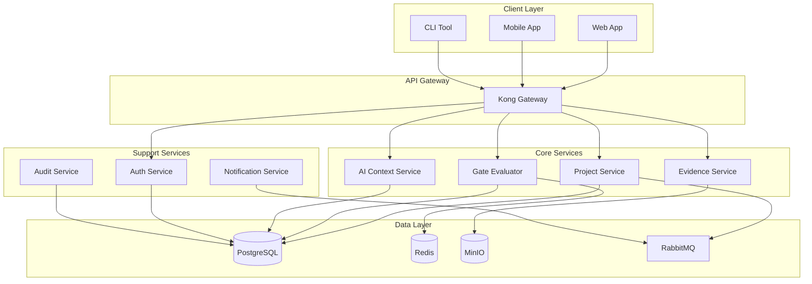

# ADR-004: Microservices Architecture Decision

**Status**: ACCEPTED
**Date**: November 13, 2025
**Decision Makers**: Technical Architecture Board, CTO, Lead Engineers
**Tags**: `architecture`, `microservices`, `scalability`, `deployment`

## Context and Problem Statement

The SDLC Orchestrator requires a scalable, maintainable architecture that can support:
- Independent scaling of components (AI engine, Gate evaluator, Evidence manager)
- Technology diversity (Python for AI, Go for high-performance services, Node.js for real-time)
- Team autonomy and parallel development
- Zero-downtime deployments
- Progressive feature rollouts

### Requirements Analysis
- **Scalability**: Support 10,000+ concurrent projects
- **Isolation**: Failures in one component shouldn't cascade
- **Deployment**: Independent deployment cycles for services
- **Technology**: Allow polyglot development
- **Compliance**: Maintain AGPL containment boundaries

## Decision Drivers

1. **Business Drivers**
   - Time-to-market for new features
   - Operational cost optimization
   - Multi-tenant isolation requirements
   - Enterprise integration capabilities

2. **Technical Drivers**
   - Service autonomy and resilience
   - Horizontal scalability
   - Technology stack flexibility
   - Development team productivity

3. **Operational Drivers**
   - Independent deployment pipelines
   - Service-level monitoring
   - Fault isolation
   - Progressive rollouts

## Considered Options

### Option 1: Monolithic Architecture
- **Pros**: Simple deployment, easier debugging, lower latency
- **Cons**: Scaling bottlenecks, technology lock-in, deployment risks
- **Verdict**: REJECTED - Doesn't meet scalability requirements

### Option 2: Service-Oriented Architecture (SOA)
- **Pros**: Service reusability, enterprise integration
- **Cons**: Heavy governance, ESB bottlenecks, complex orchestration
- **Verdict**: REJECTED - Too heavyweight for agile development

### Option 3: Microservices Architecture
- **Pros**: Independent scaling, technology diversity, team autonomy
- **Cons**: Operational complexity, network latency, data consistency
- **Verdict**: ACCEPTED - Best fits our requirements

### Option 4: Serverless Architecture
- **Pros**: No infrastructure management, automatic scaling
- **Cons**: Vendor lock-in, cold starts, limited runtime
- **Verdict**: REJECTED - AI workloads need persistent connections

## Decision

We will adopt a **Microservices Architecture** with the following structure:

### Core Services

```yaml
services:
  # Core Business Services
  project-service:
    technology: Node.js
    database: PostgreSQL
    scaling: Horizontal (2-20 instances)

  gate-evaluator-service:
    technology: Go
    database: PostgreSQL + Redis
    scaling: Horizontal (5-50 instances)

  evidence-service:
    technology: Python
    storage: MinIO (S3-compatible)
    scaling: Horizontal (3-30 instances)

  ai-context-service:
    technology: Python
    database: PostgreSQL + pgvector
    scaling: Vertical + Horizontal (2-10 instances)

  # Supporting Services
  auth-service:
    technology: Go
    database: PostgreSQL
    scaling: Horizontal (2-10 instances)

  notification-service:
    technology: Node.js
    queue: RabbitMQ
    scaling: Horizontal (2-10 instances)

  audit-service:
    technology: Go
    database: PostgreSQL (partitioned)
    scaling: Horizontal (2-5 instances)

  # API Gateway
  api-gateway:
    technology: Kong/Nginx
    features: Rate limiting, authentication, routing
    scaling: Horizontal (3-10 instances)
```

### Service Communication



### Communication Patterns

1. **Synchronous Communication**
   - REST APIs for client-service communication
   - gRPC for internal service-to-service (high performance)
   - GraphQL for complex queries (via gateway)

2. **Asynchronous Communication**
   - RabbitMQ for event-driven workflows
   - Redis Pub/Sub for real-time notifications
   - Kafka for audit log streaming (future)

### Service Boundaries

```yaml
bounded_contexts:
  project_management:
    services: [project-service]
    aggregate_root: Project
    events: [ProjectCreated, StageTransitioned]

  gate_evaluation:
    services: [gate-evaluator-service]
    aggregate_root: GateEvaluation
    events: [GateEvaluated, EvidenceRequested]

  evidence_management:
    services: [evidence-service]
    aggregate_root: Evidence
    events: [EvidenceUploaded, EvidenceValidated]

  ai_assistance:
    services: [ai-context-service]
    aggregate_root: AIContext
    events: [ContextGenerated, RecommendationMade]
```

## Implementation Strategy

### Phase 1: Core Services (Months 1-2)
```yaml
sprint_1-2:
  - Setup service scaffolding
  - Implement project-service
  - Deploy auth-service

sprint_3-4:
  - Implement gate-evaluator-service
  - Setup API gateway
  - Initial integration testing
```

### Phase 2: Supporting Services (Months 2-3)
```yaml
sprint_5-6:
  - Deploy evidence-service
  - Implement notification-service
  - Setup monitoring infrastructure

sprint_7-8:
  - Deploy ai-context-service
  - Implement audit-service
  - End-to-end testing
```

### Phase 3: Production Hardening (Month 4)
```yaml
sprint_9-10:
  - Circuit breakers implementation
  - Service mesh deployment (Istio)
  - Chaos engineering tests
  - Performance optimization
```

## Service Templates

### Standard Service Structure
```
service-name/
├── api/               # API definitions (OpenAPI/Proto)
├── cmd/               # Entry points
├── internal/          # Internal packages
├── pkg/               # Public packages
├── config/            # Configuration
├── migrations/        # Database migrations
├── tests/             # Test suites
├── Dockerfile         # Container definition
├── Makefile          # Build automation
└── README.md         # Service documentation
```

### Service Configuration
```yaml
# service-config.yml
service:
  name: gate-evaluator
  version: 1.0.0
  port: 8080

database:
  host: ${DB_HOST}
  port: 5432
  name: gate_evaluator
  pool_size: 20

cache:
  redis:
    host: ${REDIS_HOST}
    ttl: 300

messaging:
  rabbitmq:
    host: ${MQ_HOST}
    exchange: sdlc_events

monitoring:
  metrics_port: 9090
  health_path: /health
  ready_path: /ready
```

## Consequences

### Positive Consequences
1. **Independent Scaling**: Each service scales based on its load
2. **Technology Diversity**: Use best tool for each job
3. **Team Autonomy**: Teams own their services end-to-end
4. **Fault Isolation**: Failures don't cascade
5. **Deployment Flexibility**: Deploy services independently

### Negative Consequences
1. **Operational Complexity**: More services to manage
2. **Network Latency**: Inter-service communication overhead
3. **Data Consistency**: Distributed transactions complexity
4. **Debugging Complexity**: Distributed tracing required
5. **Infrastructure Cost**: More resources needed

### Mitigation Strategies
```yaml
complexity_mitigation:
  - Service mesh for traffic management (Istio)
  - Centralized logging (ELK stack)
  - Distributed tracing (Jaeger)
  - API gateway for routing
  - Service templates for consistency

latency_mitigation:
  - gRPC for internal communication
  - Redis caching layer
  - Connection pooling
  - Circuit breakers

consistency_mitigation:
  - Saga pattern for distributed transactions
  - Event sourcing for audit trail
  - Eventual consistency where acceptable
  - Idempotent operations
```

## Monitoring and Observability

### Key Metrics
```yaml
service_metrics:
  - Request rate (req/s)
  - Error rate (< 0.1%)
  - Latency (p50, p95, p99)
  - Saturation (CPU, memory)

business_metrics:
  - Gate evaluations per minute
  - Evidence processing time
  - AI response latency
  - Project creation rate
```

### Monitoring Stack
```yaml
monitoring:
  metrics: Prometheus + Grafana
  logging: ELK Stack (Elasticsearch, Logstash, Kibana)
  tracing: Jaeger
  alerting: PagerDuty
  dashboard: Custom React dashboard
```

## Security Considerations

### Service-to-Service Authentication
```yaml
authentication:
  method: mTLS
  certificate_rotation: 30 days
  service_accounts: Per-service identity

authorization:
  method: OAuth 2.0 + JWT
  policy_engine: Open Policy Agent (OPA)
  rbac: Service-level permissions
```

### Network Security
```yaml
network:
  service_mesh: Istio
  encryption: TLS 1.3
  network_policies: Kubernetes NetworkPolicies
  ingress: WAF-protected
```

## Migration Path

### From Monolith to Microservices


## Decision Review

### Review Triggers
- Performance degradation > 10%
- Operational costs increase > 30%
- New technology paradigm emergence
- Team size changes significantly

### Success Metrics (6-month review)
- Service autonomy achieved: ✓
- Independent deployments: > 100/month
- Mean time to recovery: < 5 minutes
- Service uptime: > 99.9%
- Development velocity: +40%

## References

- [Martin Fowler - Microservices](https://martinfowler.com/microservices/)
- [Sam Newman - Building Microservices](https://samnewman.io/books/building_microservices/)
- [DDD and Microservices](https://docs.microsoft.com/en-us/dotnet/architecture/microservices/)
- [CNCF Cloud Native Trail Map](https://github.com/cncf/trailmap)
- [The Twelve-Factor App](https://12factor.net/)

## Appendix: Service Catalog

| Service | Technology | Database | Scaling | Owner Team |
|---------|------------|----------|---------|------------|
| project-service | Node.js | PostgreSQL | 2-20 | Platform |
| gate-evaluator | Go | PostgreSQL + Redis | 5-50 | Quality |
| evidence-service | Python | MinIO | 3-30 | Data |
| ai-context | Python | PostgreSQL + pgvector | 2-10 | AI |
| auth-service | Go | PostgreSQL | 2-10 | Security |
| notification | Node.js | RabbitMQ | 2-10 | Platform |
| audit-service | Go | PostgreSQL | 2-5 | Compliance |

---

*This ADR is part of the SDLC Orchestrator Architecture Documentation*
*Last reviewed: November 13, 2025*
*Next review: February 13, 2026*