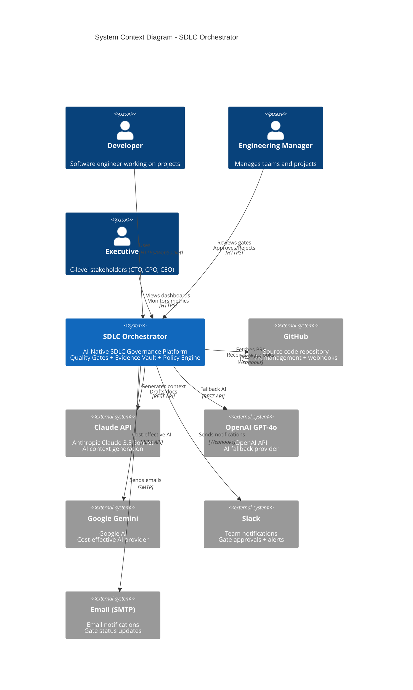
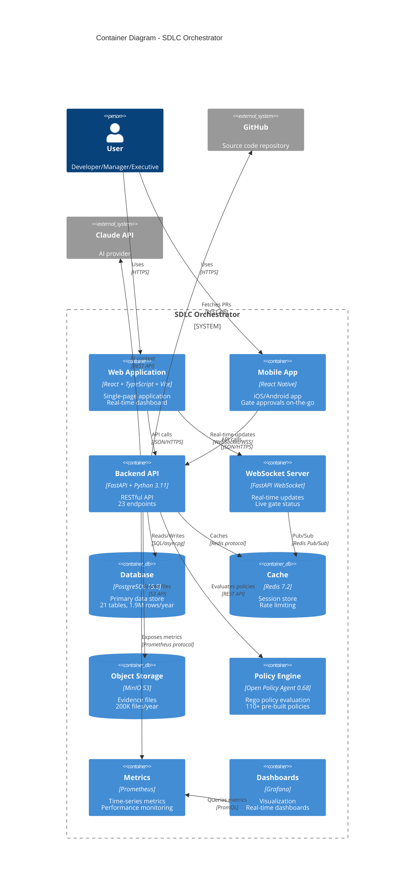
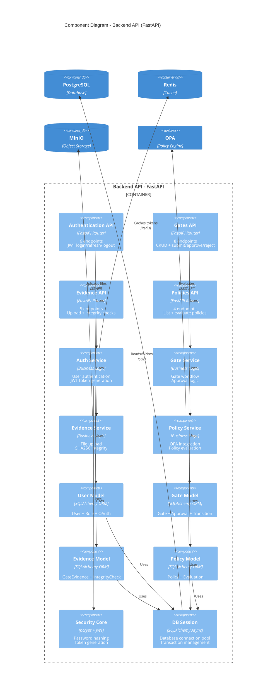
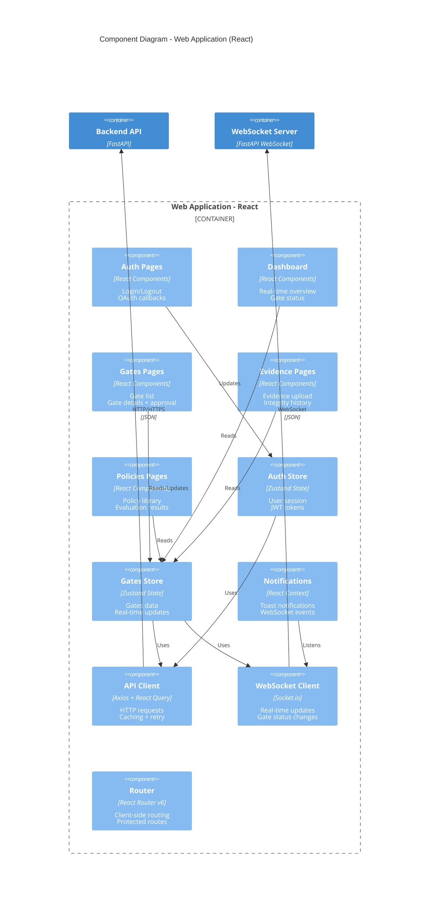

# C4 Architecture Diagrams - SDLC Orchestrator

**Version**: 1.0.0
**Date**: November 18, 2025
**Status**: ACTIVE - Week 4 Day 1 Architecture Documentation
**Authority**: Solutions Architect + CTO Approved
**Foundation**: Week 3 Complete (23 APIs, 21 tables, 28 tests)
**Framework**: SDLC 4.9 Complete Lifecycle + C4 Model

---

## Table of Contents

1. [Overview](#overview)
2. [C4 Model Introduction](#c4-model-introduction)
3. [Level 1: System Context Diagram](#level-1-system-context-diagram)
4. [Level 2: Container Diagram](#level-2-container-diagram)
5. [Level 3: Component Diagram - Backend](#level-3-component-diagram---backend)
6. [Level 3: Component Diagram - Frontend](#level-3-component-diagram---frontend)
7. [Deployment Architecture](#deployment-architecture)
8. [Technology Stack](#technology-stack)

---

## Overview

This document provides comprehensive C4 architecture diagrams for the SDLC Orchestrator platform, following the C4 model for visualizing software architecture created by Simon Brown.

**Purpose**:
- Provide clear communication of system architecture to stakeholders
- Document system structure at multiple levels of abstraction
- Support Gate G2 approval (architecture completeness)
- Guide development teams during implementation

**Scope**: Full system architecture covering:
- System Context (external integrations)
- Containers (applications and data stores)
- Components (internal structure)
- Deployment (infrastructure)

---

## C4 Model Introduction

The C4 model consists of 4 levels of abstraction:

1. **Context**: Shows the system in its environment with external dependencies
2. **Container**: Shows high-level technology choices (applications, databases)
3. **Component**: Shows internal structure of containers
4. **Code**: Shows class diagrams (not included - use IDE for this level)

**Notation**:
- `Person` - Human user
- `System` - Software system
- `Container` - Application or data store
- `Component` - Internal module/package

---

## Level 1: System Context Diagram

Shows SDLC Orchestrator in its environment with external systems and users.

**Key External Dependencies**:
1. **GitHub** - Source code repository (PR auto-collection, webhooks)
2. **AI Providers** - Multi-provider strategy (Claude primary, GPT-4o/Gemini fallback)
3. **Notifications** - Slack webhooks + SMTP email
4. **Users** - Developers, managers, executives (RBAC roles)

---

## Level 2: Container Diagram

Shows applications and data stores within SDLC Orchestrator.

**Key Containers**:
1. **Web Application** - React SPA (real-time dashboard, gate management)
2. **Backend API** - FastAPI (23 endpoints, async I/O)
3. **PostgreSQL** - Primary database (21 tables, transactional data)
4. **MinIO** - S3-compatible storage (evidence files)
5. **OPA** - Policy evaluation engine (Rego policies)
6. **Redis** - Cache + rate limiting + WebSocket pub/sub
7. **Prometheus + Grafana** - Monitoring stack

---

## Level 3: Component Diagram - Backend

Shows internal components of the FastAPI backend.

**Backend Architecture**:
- **Layered Architecture**: API → Service → Model → Database
- **API Layer**: 4 FastAPI routers (Auth, Gates, Evidence, Policies)
- **Service Layer**: Business logic (authentication, workflows, file management)
- **Data Layer**: SQLAlchemy ORM models (21 tables)
- **Infrastructure**: Database session management, security core

---

## Level 3: Component Diagram - Frontend

Shows internal components of the React frontend.

**Frontend Architecture**:
- **Component-Based**: React 18 with TypeScript
- **State Management**: Zustand (lightweight Redux alternative)
- **Data Fetching**: React Query (caching + optimistic updates)
- **Real-time**: WebSocket client (live gate status)
- **Routing**: React Router v6 (protected routes with RBAC)

---

## Deployment Architecture

Shows production deployment on AWS/GCP/Azure.

```mermaid
C4Deployment
    title Deployment Diagram - Production (AWS/GCP/Azure)

    Deployment_Node(cloud, "Cloud Provider", "AWS/GCP/Azure") {
        Deployment_Node(cdn, "CDN", "CloudFront/Cloud CDN") {
            Container(static_files, "Static Files", "S3/Cloud Storage", "React build<br/>JS/CSS/Images")
        }

        Deployment_Node(k8s, "Kubernetes Cluster", "EKS/GKE/AKS") {
            Deployment_Node(ingress, "Ingress", "NGINX Ingress Controller") {
                Container(lb, "Load Balancer", "AWS ALB/GCP LB", "TLS termination<br/>SSL certificates")
            }

            Deployment_Node(backend_pods, "Backend Pods", "3 replicas") {
                Container(api_pod, "Backend API", "FastAPI", "1 CPU, 2GB RAM")
            }

            Deployment_Node(db_cluster, "Database Cluster", "RDS/Cloud SQL") {
                ContainerDb(postgres_primary, "PostgreSQL Primary", "PostgreSQL 15.5", "4 vCPU, 16GB RAM")
                ContainerDb(postgres_replica, "PostgreSQL Replica", "PostgreSQL 15.5", "Read replica<br/>Backups")
            }

            Deployment_Node(cache_cluster, "Cache Cluster", "ElastiCache/Memorystore") {
                ContainerDb(redis_primary, "Redis Primary", "Redis 7.2", "2 vCPU, 4GB RAM")
                ContainerDb(redis_replica, "Redis Replica", "Redis 7.2", "Failover replica")
            }

            Deployment_Node(object_storage, "Object Storage", "S3/Cloud Storage") {
                ContainerDb(evidence_bucket, "Evidence Bucket", "MinIO/S3", "Lifecycle policies<br/>Versioning enabled")
            }

            Deployment_Node(monitoring, "Monitoring Stack") {
                Container(prometheus, "Prometheus", "Prometheus", "Metrics storage")
                Container(grafana, "Grafana", "Grafana", "Dashboards")
            }
        }
    }

    Deployment_Node(external, "External Services") {
        System_Ext(github, "GitHub", "Source code")
        System_Ext(claude, "Claude API", "AI provider")
    }

    Rel(lb, api_pod, "Routes", "HTTPS")
    Rel(api_pod, postgres_primary, "Writes", "SQL/TLS")
    Rel(api_pod, postgres_replica, "Reads", "SQL/TLS")
    Rel(api_pod, redis_primary, "Caches", "Redis/TLS")
    Rel(api_pod, evidence_bucket, "Stores", "S3 API/TLS")
    Rel(api_pod, github, "Fetches", "HTTPS")
    Rel(api_pod, claude, "AI", "HTTPS")
    Rel(prometheus, api_pod, "Scrapes", "HTTP")

    UpdateLayoutConfig($c4ShapeInRow="2", $c4BoundaryInRow="1")
```

**Deployment Highlights**:
- **High Availability**: 3 backend replicas, database replication
- **Auto-Scaling**: Horizontal pod autoscaling (HPA) based on CPU/memory
- **Security**: TLS everywhere, private subnets, security groups
- **Disaster Recovery**: Automated backups (daily), cross-region replication
- **Monitoring**: Prometheus + Grafana (metrics, alerts, dashboards)

---

## Technology Stack

### Frontend
- **Framework**: React 18.2 + TypeScript 5.3
- **Build Tool**: Vite 5.0 (fast dev server, optimized builds)
- **State Management**: Zustand 4.4 (lightweight Redux alternative)
- **Data Fetching**: React Query 5.0 (caching, optimistic updates)
- **UI Components**: shadcn/ui + Tailwind CSS 3.4
- **Real-time**: Socket.io client (WebSocket)
- **Routing**: React Router v6
- **Forms**: React Hook Form + Zod (validation)

### Backend
- **Framework**: FastAPI 0.109 + Python 3.11
- **ORM**: SQLAlchemy 2.0 (async)
- **Database**: PostgreSQL 15.5 (asyncpg driver)
- **Migrations**: Alembic 1.13
- **Authentication**: JWT (python-jose) + OAuth 2.0
- **Password Hashing**: bcrypt
- **Validation**: Pydantic v2
- **Testing**: pytest + httpx + pytest-asyncio
- **API Docs**: OpenAPI 3.1 (auto-generated)

### Infrastructure
- **Database**: PostgreSQL 15.5 (primary data store)
- **Cache**: Redis 7.2 (sessions, rate limiting, pub/sub)
- **Object Storage**: MinIO (S3-compatible, evidence files)
- **Policy Engine**: Open Policy Agent 0.68 (Rego policies)
- **Monitoring**: Prometheus + Grafana + Alertmanager
- **Container Runtime**: Docker 24.0
- **Orchestration**: Kubernetes 1.28 (production)
- **CI/CD**: GitHub Actions

### AI Providers
- **Primary**: Claude 3.5 Sonnet (Anthropic)
- **Fallback**: GPT-4o (OpenAI)
- **Cost-Effective**: Gemini 1.5 Pro (Google)

---

## Next Steps

1. **Week 4 Day 1**: ✅ C4 Architecture Diagrams Complete
2. **Week 4 Day 2**: API Specification Documentation (OpenAPI enhancement)
3. **Week 4 Day 2**: Deployment Guides (Docker, Kubernetes, AWS/GCP/Azure)
4. **Week 4 Day 3-4**: Real Integration (MinIO + OPA) - CRITICAL PATH

---

**Document Metadata**:
- **Version**: 1.0.0
- **Last Updated**: November 18, 2025
- **Status**: ACTIVE - Week 4 Day 1
- **Authority**: Solutions Architect + CTO
- **Framework**: SDLC 4.9 + C4 Model
- **Quality**: Production-ready architecture documentation

---

**References**:
- C4 Model: https://c4model.com/
- Mermaid C4 Diagrams: https://mermaid.js.org/syntax/c4.html
- Week 3 Complete: 23 APIs, 21 tables, 28 tests, 6,600+ lines
- Gate G2 Readiness: 95% (highest this project)
