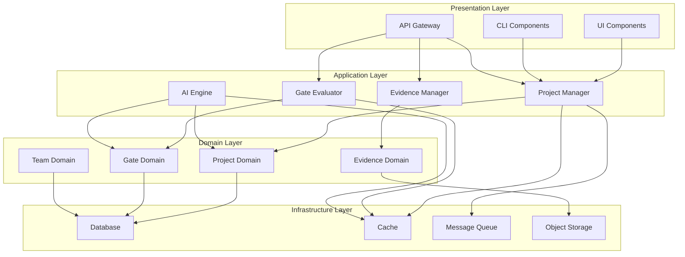

# Component Architecture Document

**Version**: 1.0.0
**Date**: November 13, 2025
**Author**: System Architecture Team
**Status**: APPROVED
**Review Cycle**: Quarterly

## Executive Summary

This document defines the component architecture for the SDLC Orchestrator platform, detailing the modular structure, component interactions, dependency management, and architectural patterns that ensure scalability, maintainability, and testability across the system.

## Architectural Overview

### Component Hierarchy


## Core Components

### 1. Project Management Component

```typescript
// Project Management Component Architecture
export class ProjectManagementComponent {
  // Component Interface
  interface IProjectManager {
    createProject(input: CreateProjectInput): Promise<Project>;
    updateProject(id: string, input: UpdateProjectInput): Promise<Project>;
    deleteProject(id: string): Promise<void>;
    transitionStage(projectId: string, targetStage: Stage): Promise<StageTransition>;
    getProjectMetrics(projectId: string): Promise<ProjectMetrics>;
  }

  // Component Implementation
  class ProjectManager implements IProjectManager {
    constructor(
      private projectRepo: IProjectRepository,
      private eventBus: IEventBus,
      private cache: ICacheManager,
      private validator: IProjectValidator
    ) {}

    async createProject(input: CreateProjectInput): Promise<Project> {
      // Validate input
      await this.validator.validateCreateInput(input);

      // Create project entity
      const project = new Project({
        ...input,
        id: generateId(),
        currentStage: Stage.WHY,
        createdAt: new Date()
      });

      // Persist to database
      await this.projectRepo.save(project);

      // Publish event
      await this.eventBus.publish(new ProjectCreatedEvent(project));

      // Cache project
      await this.cache.set(`project:${project.id}`, project, TTL.MEDIUM);

      return project;
    }

    async transitionStage(projectId: string, targetStage: Stage): Promise<StageTransition> {
      const project = await this.projectRepo.findById(projectId);

      // Validate transition
      if (!this.canTransition(project.currentStage, targetStage)) {
        throw new InvalidTransitionError(project.currentStage, targetStage);
      }

      // Check gate requirements
      const gate = await this.checkGateRequirements(project, targetStage);

      if (!gate.passed) {
        throw new GateNotPassedError(gate);
      }

      // Perform transition
      project.currentStage = targetStage;
      await this.projectRepo.update(project);

      // Publish event
      await this.eventBus.publish(new StageTransitionedEvent({
        projectId,
        fromStage: project.currentStage,
        toStage: targetStage,
        timestamp: new Date()
      }));

      return new StageTransition(project, targetStage);
    }
  }
}
```

### 2. Gate Evaluation Component

```typescript
// Gate Evaluation Component Architecture
export class GateEvaluationComponent {
  // Evaluation Engine
  class GateEvaluationEngine {
    private evaluators: Map<GateType, IGateEvaluator>;

    constructor() {
      this.initializeEvaluators();
    }

    private initializeEvaluators() {
      this.evaluators = new Map([
        [GateType.G0_1, new InitialGateEvaluator()],
        [GateType.G0_2, new PlanningGateEvaluator()],
        [GateType.G1, new AnalysisGateEvaluator()],
        [GateType.G2, new DesignGateEvaluator()],
        [GateType.G3, new BuildGateEvaluator()],
        [GateType.G4, new TestGateEvaluator()],
        [GateType.G5, new DeployGateEvaluator()],
        [GateType.G6, new OperateGateEvaluator()],
        [GateType.G7, new IntegrateGateEvaluator()],
        [GateType.G8, new CollaborateGateEvaluator()],
        [GateType.G9, new GovernGateEvaluator()],
      ]);
    }

    async evaluateGate(
      project: Project,
      gate: Gate,
      evidence: Evidence[]
    ): Promise<GateEvaluation> {
      const evaluator = this.evaluators.get(gate.type);

      if (!evaluator) {
        throw new UnsupportedGateError(gate.type);
      }

      // Perform evaluation
      const evaluation = await evaluator.evaluate({
        project,
        gate,
        evidence,
        context: await this.buildEvaluationContext(project, gate)
      });

      // Apply policy rules
      const policyResult = await this.applyPolicies(evaluation, project.policyPacks);

      // Generate recommendations
      const recommendations = await this.generateRecommendations(evaluation);

      return {
        ...evaluation,
        policyResult,
        recommendations,
        evaluatedAt: new Date()
      };
    }

    private async applyPolicies(
      evaluation: GateEvaluation,
      policyPacks: PolicyPack[]
    ): Promise<PolicyResult> {
      const policyEngine = new PolicyEngine();

      const results = await Promise.all(
        policyPacks.map(pack => policyEngine.evaluate(evaluation, pack))
      );

      return {
        passed: results.every(r => r.passed),
        violations: results.flatMap(r => r.violations),
        warnings: results.flatMap(r => r.warnings)
      };
    }
  }

  // Individual Gate Evaluators
  class AnalysisGateEvaluator implements IGateEvaluator {
    async evaluate(context: EvaluationContext): Promise<GateEvaluation> {
      const criteria = [
        this.checkRequirementsCompleteness(context),
        this.checkStakeholderApproval(context),
        this.checkRiskAssessment(context),
        this.checkBusinessCase(context),
        this.checkTechnicalFeasibility(context),
      ];

      const results = await Promise.all(criteria);

      return {
        gateId: context.gate.id,
        projectId: context.project.id,
        passed: results.every(r => r.passed),
        score: this.calculateScore(results),
        criteria: results,
        evidence: context.evidence
      };
    }

    private async checkRequirementsCompleteness(
      context: EvaluationContext
    ): Promise<CriterionResult> {
      const requirements = await this.extractRequirements(context.evidence);

      return {
        name: 'Requirements Completeness',
        passed: requirements.completeness >= 0.95,
        score: requirements.completeness,
        details: requirements.gaps,
        evidence: requirements.evidenceIds
      };
    }
  }
}
```

### 3. Evidence Management Component

```typescript
// Evidence Management Component Architecture
export class EvidenceManagementComponent {
  // Evidence Manager
  class EvidenceManager {
    constructor(
      private storage: IObjectStorage,
      private metadata: IMetadataStore,
      private validator: IEvidenceValidator,
      private processor: IEvidenceProcessor
    ) {}

    async uploadEvidence(input: UploadEvidenceInput): Promise<Evidence> {
      // Validate file
      await this.validator.validateFile(input.file);

      // Process evidence
      const processed = await this.processor.process(input.file);

      // Extract metadata
      const metadata = await this.extractMetadata(processed);

      // Store in object storage
      const storageResult = await this.storage.upload({
        key: this.generateKey(input),
        body: processed.content,
        contentType: processed.mimeType,
        metadata: metadata
      });

      // Create evidence record
      const evidence = new Evidence({
        id: generateId(),
        projectId: input.projectId,
        gateId: input.gateId,
        title: input.title,
        description: input.description,
        fileUrl: storageResult.url,
        fileSize: processed.size,
        mimeType: processed.mimeType,
        hash: processed.hash,
        metadata: metadata,
        uploadedBy: input.userId,
        uploadedAt: new Date(),
        status: EvidenceStatus.PENDING_VALIDATION
      });

      // Save to database
      await this.metadata.save(evidence);

      // Trigger validation
      await this.triggerValidation(evidence);

      return evidence;
    }

    async validateEvidence(evidenceId: string): Promise<ValidationResult> {
      const evidence = await this.metadata.findById(evidenceId);

      // Run validation pipeline
      const validations = [
        this.validateFormat(evidence),
        this.validateContent(evidence),
        this.validateCompliance(evidence),
        this.validateAuthenticity(evidence)
      ];

      const results = await Promise.all(validations);

      const validationResult = {
        evidenceId,
        passed: results.every(r => r.valid),
        validations: results,
        validatedAt: new Date()
      };

      // Update evidence status
      evidence.status = validationResult.passed
        ? EvidenceStatus.VALIDATED
        : EvidenceStatus.VALIDATION_FAILED;

      await this.metadata.update(evidence);

      return validationResult;
    }

    private async validateContent(evidence: Evidence): Promise<ValidationCheck> {
      // Content analysis
      const content = await this.storage.download(evidence.fileUrl);
      const analysis = await this.processor.analyzeContent(content);

      return {
        type: 'content',
        valid: analysis.quality >= 0.8,
        score: analysis.quality,
        details: analysis.issues
      };
    }
  }

  // Evidence Processor
  class EvidenceProcessor implements IEvidenceProcessor {
    async process(file: File): Promise<ProcessedEvidence> {
      const pipeline = [
        this.sanitize,
        this.compress,
        this.watermark,
        this.encrypt
      ];

      let processed = file;
      for (const step of pipeline) {
        processed = await step(processed);
      }

      return {
        content: processed,
        size: processed.size,
        mimeType: file.type,
        hash: await this.calculateHash(processed)
      };
    }

    private async sanitize(file: File): Promise<File> {
      // Remove metadata and potential threats
      const sanitized = await this.removeMaliciousContent(file);
      return this.stripMetadata(sanitized);
    }

    private async compress(file: File): Promise<File> {
      if (file.size > COMPRESSION_THRESHOLD) {
        return this.applyCompression(file, CompressionLevel.MEDIUM);
      }
      return file;
    }
  }
}
```

### 4. AI Context Engine Component

```typescript
// AI Context Engine Component Architecture
export class AIContextEngineComponent {
  // AI Context Manager
  class AIContextManager {
    private providers: Map<string, IAIProvider>;
    private contextBuilder: IContextBuilder;
    private cache: IContextCache;

    constructor() {
      this.initializeProviders();
    }

    private initializeProviders() {
      this.providers = new Map([
        ['ollama', new OllamaProvider({
          baseUrl: 'https://api.nqh.vn',
          model: 'qwen2.5:14b'
        })],
        ['claude', new ClaudeProvider({
          apiKey: process.env.CLAUDE_API_KEY,
          model: 'claude-3-opus'
        })],
        ['openai', new OpenAIProvider({
          apiKey: process.env.OPENAI_API_KEY,
          model: 'gpt-4-turbo'
        })]
      ]);
    }

    async generateContext(request: ContextRequest): Promise<AIContext> {
      // Build context
      const context = await this.contextBuilder.build({
        project: request.project,
        stage: request.stage,
        gate: request.gate,
        evidence: request.evidence,
        history: await this.getHistory(request.project.id)
      });

      // Check cache
      const cacheKey = this.generateCacheKey(context);
      const cached = await this.cache.get(cacheKey);

      if (cached && !request.forceRefresh) {
        return cached;
      }

      // Generate with primary provider
      try {
        const response = await this.generateWithProvider('ollama', context);
        await this.cache.set(cacheKey, response, TTL.AI_CONTEXT);
        return response;
      } catch (error) {
        // Fallback to cloud provider
        console.warn('Ollama failed, falling back to cloud provider', error);
        return this.generateWithProvider('claude', context);
      }
    }

    private async generateWithProvider(
      providerId: string,
      context: Context
    ): Promise<AIContext> {
      const provider = this.providers.get(providerId);

      if (!provider) {
        throw new ProviderNotFoundError(providerId);
      }

      const prompt = this.buildPrompt(context);
      const response = await provider.generate(prompt);

      return {
        content: response.content,
        recommendations: this.extractRecommendations(response),
        insights: this.extractInsights(response),
        riskFactors: this.extractRiskFactors(response),
        provider: providerId,
        generatedAt: new Date(),
        tokenUsage: response.usage
      };
    }

    private buildPrompt(context: Context): string {
      return `
        You are an SDLC expert assistant. Analyze the following project context:

        Project: ${context.project.name}
        Current Stage: ${context.stage}
        Target Gate: ${context.gate}

        Evidence Provided:
        ${context.evidence.map(e => `- ${e.title}: ${e.description}`).join('\n')}

        Previous Gates Passed:
        ${context.history.gates.map(g => `- ${g.name}: ${g.score}%`).join('\n')}

        Please provide:
        1. Assessment of readiness for ${context.gate}
        2. Specific recommendations for improvement
        3. Risk factors to consider
        4. Suggested evidence gaps to fill
      `;
    }
  }

  // Context Builder
  class ContextBuilder implements IContextBuilder {
    async build(input: ContextInput): Promise<Context> {
      const enriched = await this.enrichContext(input);

      return {
        project: enriched.project,
        stage: enriched.stage,
        gate: enriched.gate,
        evidence: enriched.evidence,
        history: enriched.history,
        metadata: {
          projectSize: this.calculateProjectSize(enriched.project),
          complexity: this.assessComplexity(enriched),
          teamCapability: await this.assessTeamCapability(enriched.project.team),
          timeline: this.calculateTimeline(enriched)
        }
      };
    }

    private async enrichContext(input: ContextInput): Promise<EnrichedContext> {
      // Add historical patterns
      const patterns = await this.findSimilarProjects(input.project);

      // Add compliance requirements
      const compliance = await this.getComplianceRequirements(input.project);

      // Add team performance metrics
      const teamMetrics = await this.getTeamMetrics(input.project.team);

      return {
        ...input,
        patterns,
        compliance,
        teamMetrics
      };
    }
  }
}
```

### 5. Authentication & Authorization Component

```typescript
// Authentication & Authorization Component Architecture
export class AuthenticationComponent {
  // Auth Manager
  class AuthManager {
    private tokenService: ITokenService;
    private userService: IUserService;
    private mfaService: IMFAService;
    private sessionStore: ISessionStore;

    async authenticate(credentials: Credentials): Promise<AuthResult> {
      // Validate credentials
      const user = await this.userService.validateCredentials(credentials);

      if (!user) {
        throw new InvalidCredentialsError();
      }

      // Check MFA requirement
      if (this.requiresMFA(user)) {
        return {
          requiresMFA: true,
          mfaToken: await this.mfaService.generateChallenge(user)
        };
      }

      // Generate tokens
      const tokens = await this.generateTokens(user);

      // Create session
      await this.createSession(user, tokens);

      return {
        user,
        tokens,
        requiresMFA: false
      };
    }

    async verifyMFA(mfaToken: string, code: string): Promise<AuthResult> {
      const verification = await this.mfaService.verifyCode(mfaToken, code);

      if (!verification.valid) {
        throw new InvalidMFACodeError();
      }

      const user = await this.userService.findById(verification.userId);
      const tokens = await this.generateTokens(user);

      await this.createSession(user, tokens);

      return { user, tokens, requiresMFA: false };
    }

    private async generateTokens(user: User): Promise<TokenPair> {
      const accessToken = await this.tokenService.generateAccessToken({
        userId: user.id,
        email: user.email,
        roles: user.roles,
        permissions: await this.getUserPermissions(user)
      });

      const refreshToken = await this.tokenService.generateRefreshToken({
        userId: user.id,
        tokenFamily: generateTokenFamily()
      });

      return { accessToken, refreshToken };
    }

    private requiresMFA(user: User): boolean {
      // C-Suite always requires MFA
      if (user.roles.some(r => C_SUITE_ROLES.includes(r))) {
        return true;
      }

      // Check user preference
      return user.preferences?.mfaEnabled ?? false;
    }
  }

  // Authorization Service
  class AuthorizationService {
    private policyEngine: IPolicyEngine;
    private roleHierarchy: RoleHierarchy;

    async authorize(
      user: User,
      resource: Resource,
      action: Action
    ): Promise<AuthorizationResult> {
      // Check role-based access
      const roleAccess = await this.checkRoleAccess(user.roles, resource, action);

      if (roleAccess.denied) {
        return { allowed: false, reason: roleAccess.reason };
      }

      // Check attribute-based access
      const attributeAccess = await this.checkAttributeAccess(user, resource, action);

      if (attributeAccess.denied) {
        return { allowed: false, reason: attributeAccess.reason };
      }

      // Check policy rules
      const policyResult = await this.policyEngine.evaluate({
        subject: user,
        resource,
        action,
        context: await this.buildContext()
      });

      return {
        allowed: policyResult.allow,
        reason: policyResult.reason,
        conditions: policyResult.conditions
      };
    }

    private async checkRoleAccess(
      roles: Role[],
      resource: Resource,
      action: Action
    ): Promise<AccessCheck> {
      const permissions = await this.roleHierarchy.getPermissions(roles);

      const hasPermission = permissions.some(p =>
        p.resource === resource.type && p.actions.includes(action)
      );

      return {
        denied: !hasPermission,
        reason: hasPermission ? null : 'Insufficient role permissions'
      };
    }
  }
}
```

## Component Interactions

### Interaction Patterns

```typescript
// Event-Driven Communication
export class ComponentInteractionPatterns {
  // Event Bus Implementation
  class EventBus implements IEventBus {
    private subscribers: Map<string, EventHandler[]> = new Map();

    subscribe(eventType: string, handler: EventHandler): void {
      const handlers = this.subscribers.get(eventType) || [];
      handlers.push(handler);
      this.subscribers.set(eventType, handlers);
    }

    async publish(event: Event): Promise<void> {
      const handlers = this.subscribers.get(event.type) || [];

      await Promise.all(
        handlers.map(handler => this.executeHandler(handler, event))
      );
    }

    private async executeHandler(handler: EventHandler, event: Event): Promise<void> {
      try {
        await handler(event);
      } catch (error) {
        console.error(`Handler failed for event ${event.type}:`, error);
        // Implement retry logic or dead letter queue
      }
    }
  }

  // Command Pattern
  class CommandBus implements ICommandBus {
    private handlers: Map<string, CommandHandler> = new Map();

    register(commandType: string, handler: CommandHandler): void {
      this.handlers.set(commandType, handler);
    }

    async execute<T>(command: Command): Promise<T> {
      const handler = this.handlers.get(command.type);

      if (!handler) {
        throw new HandlerNotFoundError(command.type);
      }

      return handler.handle(command);
    }
  }

  // Query Pattern
  class QueryBus implements IQueryBus {
    private handlers: Map<string, QueryHandler> = new Map();

    register(queryType: string, handler: QueryHandler): void {
      this.handlers.set(queryType, handler);
    }

    async query<T>(query: Query): Promise<T> {
      const handler = this.handlers.get(query.type);

      if (!handler) {
        throw new HandlerNotFoundError(query.type);
      }

      // Check cache first
      const cached = await this.checkCache(query);
      if (cached) return cached;

      const result = await handler.handle(query);

      // Cache result
      await this.cacheResult(query, result);

      return result;
    }
  }
}
```

### Component Communication Matrix

| Source Component | Target Component | Communication Type | Pattern | Frequency |
|-----------------|-----------------|-------------------|---------|-----------|
| Project Manager | Gate Evaluator | Async | Event | On stage transition |
| Gate Evaluator | Evidence Manager | Sync | Query | During evaluation |
| Evidence Manager | AI Context | Async | Event | On upload |
| AI Context | All Components | Async | Pub/Sub | On generation |
| Auth Service | All Components | Sync | Middleware | Every request |
| Audit Service | All Components | Async | Event | On state change |

## Dependency Management

### Dependency Injection Container

```typescript
// DI Container Configuration
export class DependencyContainer {
  private container: Container;

  constructor() {
    this.container = new Container();
    this.registerDependencies();
  }

  private registerDependencies(): void {
    // Infrastructure
    this.container.bind<IDatabase>(TYPES.Database)
      .to(PostgreSQLDatabase)
      .inSingletonScope();

    this.container.bind<ICache>(TYPES.Cache)
      .to(RedisCache)
      .inSingletonScope();

    this.container.bind<IMessageQueue>(TYPES.MessageQueue)
      .to(RabbitMQQueue)
      .inSingletonScope();

    // Repositories
    this.container.bind<IProjectRepository>(TYPES.ProjectRepository)
      .to(ProjectRepository)
      .inRequestScope();

    this.container.bind<IGateRepository>(TYPES.GateRepository)
      .to(GateRepository)
      .inRequestScope();

    // Services
    this.container.bind<IProjectService>(TYPES.ProjectService)
      .to(ProjectService)
      .inRequestScope();

    this.container.bind<IGateEvaluator>(TYPES.GateEvaluator)
      .to(GateEvaluator)
      .inRequestScope();

    // AI Providers
    this.container.bind<IAIProvider>(TYPES.AIProvider)
      .to(OllamaProvider)
      .whenTargetNamed('primary');

    this.container.bind<IAIProvider>(TYPES.AIProvider)
      .to(ClaudeProvider)
      .whenTargetNamed('fallback');
  }

  resolve<T>(type: symbol): T {
    return this.container.get<T>(type);
  }
}
```

## Component Testing Strategy

### Unit Testing

```typescript
// Component Unit Tests
describe('ProjectManager Component', () => {
  let projectManager: ProjectManager;
  let mockRepo: MockProjectRepository;
  let mockEventBus: MockEventBus;

  beforeEach(() => {
    mockRepo = new MockProjectRepository();
    mockEventBus = new MockEventBus();
    projectManager = new ProjectManager(mockRepo, mockEventBus);
  });

  describe('createProject', () => {
    it('should create project and publish event', async () => {
      const input = createProjectInput();

      const project = await projectManager.createProject(input);

      expect(project.id).toBeDefined();
      expect(mockRepo.save).toHaveBeenCalledWith(expect.objectContaining({
        name: input.name
      }));
      expect(mockEventBus.publish).toHaveBeenCalledWith(
        expect.objectContaining({
          type: 'ProjectCreated'
        })
      );
    });

    it('should validate input before creation', async () => {
      const invalidInput = { name: '' };

      await expect(projectManager.createProject(invalidInput))
        .rejects.toThrow(ValidationError);
    });
  });
});
```

### Integration Testing

```typescript
// Component Integration Tests
describe('Component Integration', () => {
  let container: TestContainer;

  beforeAll(async () => {
    container = await createTestContainer();
    await container.start();
  });

  afterAll(async () => {
    await container.stop();
  });

  it('should handle complete gate evaluation flow', async () => {
    // Create project
    const projectManager = container.resolve<IProjectManager>(TYPES.ProjectManager);
    const project = await projectManager.createProject({
      name: 'Test Project',
      description: 'Integration test'
    });

    // Upload evidence
    const evidenceManager = container.resolve<IEvidenceManager>(TYPES.EvidenceManager);
    const evidence = await evidenceManager.uploadEvidence({
      projectId: project.id,
      file: createMockFile(),
      gateId: 'G1'
    });

    // Evaluate gate
    const gateEvaluator = container.resolve<IGateEvaluator>(TYPES.GateEvaluator);
    const evaluation = await gateEvaluator.evaluateGate(project.id, 'G1');

    expect(evaluation.passed).toBe(true);
    expect(evaluation.evidence).toContain(evidence.id);
  });
});
```

## Performance Optimization

### Component Performance Patterns

```typescript
// Performance Optimization Patterns
export class PerformancePatterns {
  // Lazy Loading
  class LazyComponent<T> {
    private instance: T | null = null;
    private factory: () => Promise<T>;

    constructor(factory: () => Promise<T>) {
      this.factory = factory;
    }

    async getInstance(): Promise<T> {
      if (!this.instance) {
        this.instance = await this.factory();
      }
      return this.instance;
    }
  }

  // Component Pooling
  class ComponentPool<T> {
    private available: T[] = [];
    private inUse: Set<T> = new Set();
    private factory: () => T;
    private maxSize: number;

    constructor(factory: () => T, maxSize: number = 10) {
      this.factory = factory;
      this.maxSize = maxSize;
    }

    async acquire(): Promise<T> {
      let component = this.available.pop();

      if (!component && this.inUse.size < this.maxSize) {
        component = this.factory();
      }

      if (!component) {
        // Wait for component to become available
        await this.waitForAvailable();
        return this.acquire();
      }

      this.inUse.add(component);
      return component;
    }

    release(component: T): void {
      this.inUse.delete(component);
      this.available.push(component);
    }
  }

  // Batch Processing
  class BatchProcessor<T, R> {
    private queue: Array<{ item: T; resolve: (result: R) => void }> = [];
    private processing = false;
    private batchSize: number;
    private processor: (items: T[]) => Promise<R[]>;

    constructor(processor: (items: T[]) => Promise<R[]>, batchSize = 100) {
      this.processor = processor;
      this.batchSize = batchSize;
    }

    async process(item: T): Promise<R> {
      return new Promise((resolve) => {
        this.queue.push({ item, resolve });
        this.triggerProcessing();
      });
    }

    private async triggerProcessing(): Promise<void> {
      if (this.processing || this.queue.length === 0) return;

      this.processing = true;

      while (this.queue.length > 0) {
        const batch = this.queue.splice(0, this.batchSize);
        const items = batch.map(b => b.item);

        const results = await this.processor(items);

        batch.forEach((b, index) => {
          b.resolve(results[index]);
        });
      }

      this.processing = false;
    }
  }
}
```

## Component Monitoring

### Monitoring Implementation

```typescript
// Component Monitoring
export class ComponentMonitoring {
  // Metrics Collector
  class MetricsCollector {
    private metrics: Map<string, Metric> = new Map();

    recordLatency(component: string, operation: string, duration: number): void {
      const key = `${component}.${operation}.latency`;
      this.getOrCreateMetric(key, MetricType.HISTOGRAM).record(duration);
    }

    incrementCounter(component: string, event: string): void {
      const key = `${component}.${event}.count`;
      this.getOrCreateMetric(key, MetricType.COUNTER).increment();
    }

    recordGauge(component: string, metric: string, value: number): void {
      const key = `${component}.${metric}`;
      this.getOrCreateMetric(key, MetricType.GAUGE).set(value);
    }

    private getOrCreateMetric(key: string, type: MetricType): Metric {
      let metric = this.metrics.get(key);
      if (!metric) {
        metric = MetricFactory.create(key, type);
        this.metrics.set(key, metric);
      }
      return metric;
    }
  }

  // Health Checks
  class ComponentHealthCheck {
    private checks: Map<string, HealthCheck> = new Map();

    register(component: string, check: HealthCheck): void {
      this.checks.set(component, check);
    }

    async checkHealth(): Promise<HealthStatus> {
      const results = await Promise.all(
        Array.from(this.checks.entries()).map(async ([name, check]) => ({
          component: name,
          status: await check.check()
        }))
      );

      const allHealthy = results.every(r => r.status.healthy);

      return {
        healthy: allHealthy,
        components: results,
        timestamp: new Date()
      };
    }
  }
}
```

## Security Patterns

### Component Security

```typescript
// Security Patterns for Components
export class ComponentSecurity {
  // Input Validation
  class InputValidator {
    private validators: Map<string, ValidationRule[]> = new Map();

    register(type: string, rules: ValidationRule[]): void {
      this.validators.set(type, rules);
    }

    async validate(type: string, input: any): Promise<ValidationResult> {
      const rules = this.validators.get(type);

      if (!rules) {
        throw new NoValidatorError(type);
      }

      const errors: ValidationError[] = [];

      for (const rule of rules) {
        const result = await rule.validate(input);
        if (!result.valid) {
          errors.push(result.error);
        }
      }

      return {
        valid: errors.length === 0,
        errors
      };
    }
  }

  // Rate Limiting
  class RateLimiter {
    private limiters: Map<string, TokenBucket> = new Map();

    async checkLimit(key: string, component: string): Promise<boolean> {
      const limiterKey = `${component}:${key}`;
      let limiter = this.limiters.get(limiterKey);

      if (!limiter) {
        limiter = new TokenBucket(
          this.getLimitConfig(component)
        );
        this.limiters.set(limiterKey, limiter);
      }

      return limiter.consume(1);
    }

    private getLimitConfig(component: string): LimitConfig {
      // Component-specific rate limits
      const configs: Record<string, LimitConfig> = {
        'ai-context': { capacity: 100, refillRate: 10 },
        'gate-evaluator': { capacity: 1000, refillRate: 100 },
        'evidence-upload': { capacity: 50, refillRate: 5 }
      };

      return configs[component] || { capacity: 500, refillRate: 50 };
    }
  }
}
```

## Conclusion

This Component Architecture Document provides a comprehensive blueprint for building scalable, maintainable, and testable components within the SDLC Orchestrator platform. Regular reviews ensure continued alignment with system requirements and emerging patterns.

---

*Document Version: 1.0.0*
*Last Updated: November 13, 2025*
*Next Review: February 13, 2026*
*Owner: System Architecture Team*