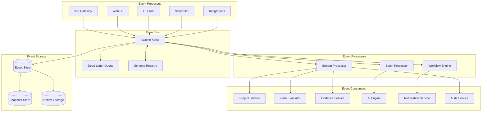

# Event-Driven Architecture Document

**Version**: 1.0.0
**Date**: November 13, 2025
**Author**: System Architecture Team
**Status**: APPROVED
**Review Cycle**: Quarterly

## Executive Summary

This document defines the event-driven architecture (EDA) for the SDLC Orchestrator platform, detailing event schemas, event flows, messaging patterns, and event processing strategies. Our EDA enables loose coupling, scalability, and real-time responsiveness across the system.

## Event Architecture Overview

### High-Level Event Flow


## Event Taxonomy

### Domain Events
```typescript
// Base Event Structure
export interface DomainEvent {
  eventId: string;           // UUID v4
  eventType: string;          // Event type identifier
  aggregateId: string;        // Aggregate root ID
  aggregateType: string;      // Aggregate type
  eventVersion: string;       // Event schema version
  timestamp: Date;            // Event occurrence time
  correlationId: string;      // Correlation across events
  causationId?: string;       // Causing event ID
  metadata: EventMetadata;    // Event metadata
  payload: any;               // Event payload
}

export interface EventMetadata {
  userId?: string;
  tenantId: string;
  source: string;
  ipAddress?: string;
  userAgent?: string;
  sessionId?: string;
  traceId: string;
  spanId: string;
}

// Project Domain Events
export namespace ProjectEvents {
  export interface ProjectCreated extends DomainEvent {
    eventType: 'PROJECT_CREATED';
    payload: {
      projectId: string;
      name: string;
      description: string;
      templateId: string;
      teamId: string;
      policyPackIds: string[];
      metadata: ProjectMetadata;
    };
  }

  export interface StageTransitioned extends DomainEvent {
    eventType: 'STAGE_TRANSITIONED';
    payload: {
      projectId: string;
      fromStage: Stage;
      toStage: Stage;
      transitionReason: string;
      approvedBy?: string;
      conditions?: TransitionCondition[];
    };
  }

  export interface ProjectArchived extends DomainEvent {
    eventType: 'PROJECT_ARCHIVED';
    payload: {
      projectId: string;
      archiveReason: string;
      retentionPeriod: number;
      canRestore: boolean;
    };
  }
}

// Gate Domain Events
export namespace GateEvents {
  export interface GateEvaluationStarted extends DomainEvent {
    eventType: 'GATE_EVALUATION_STARTED';
    payload: {
      evaluationId: string;
      projectId: string;
      gateId: string;
      triggerType: 'MANUAL' | 'AUTOMATED' | 'SCHEDULED';
      triggeredBy: string;
      criteria: GateCriterion[];
    };
  }

  export interface GateEvaluationCompleted extends DomainEvent {
    eventType: 'GATE_EVALUATION_COMPLETED';
    payload: {
      evaluationId: string;
      projectId: string;
      gateId: string;
      passed: boolean;
      score: number;
      results: CriterionResult[];
      recommendations: string[];
      nextSteps: string[];
    };
  }

  export interface GateOverridden extends DomainEvent {
    eventType: 'GATE_OVERRIDDEN';
    payload: {
      gateId: string;
      projectId: string;
      overriddenBy: string;
      reason: string;
      riskAcceptance: boolean;
      expiresAt?: Date;
    };
  }
}

// Evidence Domain Events
export namespace EvidenceEvents {
  export interface EvidenceUploaded extends DomainEvent {
    eventType: 'EVIDENCE_UPLOADED';
    payload: {
      evidenceId: string;
      projectId: string;
      gateId: string;
      fileName: string;
      fileSize: number;
      mimeType: string;
      uploadedBy: string;
      storageUrl: string;
    };
  }

  export interface EvidenceValidated extends DomainEvent {
    eventType: 'EVIDENCE_VALIDATED';
    payload: {
      evidenceId: string;
      validationResult: 'PASSED' | 'FAILED' | 'PARTIAL';
      validationChecks: ValidationCheck[];
      issues: ValidationIssue[];
    };
  }

  export interface EvidenceExpired extends DomainEvent {
    eventType: 'EVIDENCE_EXPIRED';
    payload: {
      evidenceId: string;
      expirationReason: string;
      archivedLocation?: string;
    };
  }
}
```

### Integration Events
```typescript
// External System Events
export namespace IntegrationEvents {
  export interface GitHubPushReceived extends DomainEvent {
    eventType: 'GITHUB_PUSH_RECEIVED';
    payload: {
      repository: string;
      branch: string;
      commits: Commit[];
      pusher: string;
      compareUrl: string;
    };
  }

  export interface JenkinsBuiltCompleted extends DomainEvent {
    eventType: 'JENKINS_BUILD_COMPLETED';
    payload: {
      jobName: string;
      buildNumber: number;
      result: 'SUCCESS' | 'FAILURE' | 'UNSTABLE' | 'ABORTED';
      duration: number;
      artifacts: Artifact[];
      testResults?: TestResults;
    };
  }

  export interface SonarQubeAnalysisCompleted extends DomainEvent {
    eventType: 'SONARQUBE_ANALYSIS_COMPLETED';
    payload: {
      projectKey: string;
      taskId: string;
      status: 'SUCCESS' | 'FAILED' | 'PENDING';
      qualityGate: QualityGateResult;
      metrics: SonarMetrics;
    };
  }

  export interface JiraIssueUpdated extends DomainEvent {
    eventType: 'JIRA_ISSUE_UPDATED';
    payload: {
      issueKey: string;
      issueType: string;
      summary: string;
      status: string;
      assignee?: string;
      customFields: Record<string, any>;
    };
  }
}
```

### System Events
```typescript
// System and Infrastructure Events
export namespace SystemEvents {
  export interface ServiceStarted extends DomainEvent {
    eventType: 'SERVICE_STARTED';
    payload: {
      serviceName: string;
      version: string;
      instanceId: string;
      startTime: Date;
      configuration: ServiceConfig;
    };
  }

  export interface HealthCheckFailed extends DomainEvent {
    eventType: 'HEALTH_CHECK_FAILED';
    payload: {
      serviceName: string;
      checkType: string;
      error: string;
      severity: 'LOW' | 'MEDIUM' | 'HIGH' | 'CRITICAL';
      affectedComponents: string[];
    };
  }

  export interface RateLimitExceeded extends DomainEvent {
    eventType: 'RATE_LIMIT_EXCEEDED';
    payload: {
      userId?: string;
      ipAddress: string;
      endpoint: string;
      limit: number;
      windowSeconds: number;
      attemptCount: number;
    };
  }

  export interface SecurityIncident extends DomainEvent {
    eventType: 'SECURITY_INCIDENT';
    payload: {
      incidentType: string;
      severity: 'LOW' | 'MEDIUM' | 'HIGH' | 'CRITICAL';
      description: string;
      affectedResources: string[];
      remediationSteps: string[];
    };
  }
}
```

## Event Processing Patterns

### Event Sourcing Implementation
```typescript
// Event Store Implementation
export class EventStore {
  private kafka: KafkaProducer;
  private postgres: PostgresClient;
  private snapshots: SnapshotStore;

  async append(event: DomainEvent): Promise<void> {
    // Validate event
    await this.validateEvent(event);

    // Store in database (for queries)
    await this.postgres.query(
      `INSERT INTO events (
        event_id, event_type, aggregate_id, aggregate_type,
        event_version, timestamp, correlation_id, causation_id,
        metadata, payload
      ) VALUES ($1, $2, $3, $4, $5, $6, $7, $8, $9, $10)`,
      [
        event.eventId,
        event.eventType,
        event.aggregateId,
        event.aggregateType,
        event.eventVersion,
        event.timestamp,
        event.correlationId,
        event.causationId,
        JSON.stringify(event.metadata),
        JSON.stringify(event.payload)
      ]
    );

    // Publish to Kafka
    await this.kafka.send({
      topic: this.getTopicForEvent(event),
      messages: [{
        key: event.aggregateId,
        value: JSON.stringify(event),
        headers: {
          'event-type': event.eventType,
          'correlation-id': event.correlationId,
          'schema-version': event.eventVersion
        }
      }]
    });

    // Check if snapshot is needed
    await this.checkSnapshot(event.aggregateId, event.aggregateType);
  }

  async getEvents(
    aggregateId: string,
    fromVersion?: number
  ): Promise<DomainEvent[]> {
    // Try to load from snapshot
    const snapshot = await this.snapshots.getLatest(aggregateId);

    const query = snapshot
      ? `SELECT * FROM events
         WHERE aggregate_id = $1 AND version > $2
         ORDER BY version ASC`
      : `SELECT * FROM events
         WHERE aggregate_id = $1
         ORDER BY version ASC`;

    const params = snapshot
      ? [aggregateId, snapshot.version]
      : [aggregateId];

    const result = await this.postgres.query(query, params);

    return result.rows.map(row => ({
      eventId: row.event_id,
      eventType: row.event_type,
      aggregateId: row.aggregate_id,
      aggregateType: row.aggregate_type,
      eventVersion: row.event_version,
      timestamp: row.timestamp,
      correlationId: row.correlation_id,
      causationId: row.causation_id,
      metadata: row.metadata,
      payload: row.payload
    }));
  }

  private async checkSnapshot(
    aggregateId: string,
    aggregateType: string
  ): Promise<void> {
    const eventCount = await this.getEventCount(aggregateId);

    if (eventCount % 100 === 0) {
      // Create snapshot every 100 events
      await this.createSnapshot(aggregateId, aggregateType);
    }
  }

  private async createSnapshot(
    aggregateId: string,
    aggregateType: string
  ): Promise<void> {
    // Rebuild aggregate from events
    const events = await this.getEvents(aggregateId);
    const aggregate = this.rebuildAggregate(aggregateType, events);

    // Store snapshot
    await this.snapshots.save({
      aggregateId,
      aggregateType,
      version: events.length,
      data: aggregate,
      timestamp: new Date()
    });
  }
}
```

### CQRS Implementation
```typescript
// Command Handler
export class CommandHandler {
  private eventStore: EventStore;
  private projections: ProjectionManager;

  async handle(command: Command): Promise<CommandResult> {
    // Load aggregate
    const events = await this.eventStore.getEvents(command.aggregateId);
    const aggregate = this.rebuildAggregate(events);

    // Validate command
    const validation = aggregate.canExecute(command);
    if (!validation.valid) {
      throw new CommandValidationError(validation.errors);
    }

    // Execute command and get events
    const newEvents = aggregate.execute(command);

    // Store events
    for (const event of newEvents) {
      await this.eventStore.append(event);
    }

    // Update read models
    await this.projections.update(newEvents);

    return {
      success: true,
      aggregateId: command.aggregateId,
      version: aggregate.version + newEvents.length,
      events: newEvents
    };
  }
}

// Query Handler
export class QueryHandler {
  private readModels: ReadModelStore;
  private cache: CacheManager;

  async handle(query: Query): Promise<QueryResult> {
    // Check cache
    const cacheKey = this.getCacheKey(query);
    const cached = await this.cache.get(cacheKey);

    if (cached) {
      return cached;
    }

    // Execute query against read model
    const result = await this.executeQuery(query);

    // Cache result
    await this.cache.set(cacheKey, result, query.cacheTTL || 300);

    return result;
  }

  private async executeQuery(query: Query): Promise<any> {
    switch (query.type) {
      case 'GET_PROJECT_DETAILS':
        return this.readModels.projects.findById(query.projectId);

      case 'GET_GATE_STATUS':
        return this.readModels.gates.getStatus(query.projectId, query.gateId);

      case 'SEARCH_EVIDENCE':
        return this.readModels.evidence.search(query.filters);

      case 'GET_METRICS':
        return this.readModels.metrics.aggregate(query.timeRange);

      default:
        throw new UnknownQueryError(query.type);
    }
  }
}

// Projection Manager
export class ProjectionManager {
  private projections: Map<string, Projection>;

  async update(events: DomainEvent[]): Promise<void> {
    for (const event of events) {
      const projections = this.getProjectionsForEvent(event.eventType);

      await Promise.all(
        projections.map(projection => projection.handle(event))
      );
    }
  }

  registerProjection(eventType: string, projection: Projection): void {
    const key = `${eventType}:${projection.name}`;
    this.projections.set(key, projection);
  }
}

// Example Projection
export class ProjectDetailsProjection implements Projection {
  name = 'project-details';

  async handle(event: DomainEvent): Promise<void> {
    switch (event.eventType) {
      case 'PROJECT_CREATED':
        await this.handleProjectCreated(event as ProjectEvents.ProjectCreated);
        break;

      case 'STAGE_TRANSITIONED':
        await this.handleStageTransitioned(event as ProjectEvents.StageTransitioned);
        break;

      case 'GATE_EVALUATION_COMPLETED':
        await this.handleGateCompleted(event as GateEvents.GateEvaluationCompleted);
        break;
    }
  }

  private async handleProjectCreated(event: ProjectEvents.ProjectCreated): Promise<void> {
    await this.db.projects.insert({
      id: event.payload.projectId,
      name: event.payload.name,
      description: event.payload.description,
      currentStage: 'WHY',
      status: 'ACTIVE',
      createdAt: event.timestamp,
      updatedAt: event.timestamp
    });
  }
}
```

### Saga Pattern Implementation
```typescript
// Saga Orchestrator
export class SagaOrchestrator {
  private sagas: Map<string, Saga>;
  private sagaStore: SagaStore;

  async startSaga(sagaType: string, initiatingEvent: DomainEvent): Promise<string> {
    const saga = this.sagas.get(sagaType);

    if (!saga) {
      throw new SagaNotFoundError(sagaType);
    }

    const sagaInstance = await this.createSagaInstance(saga, initiatingEvent);

    await this.executeSaga(sagaInstance);

    return sagaInstance.id;
  }

  private async executeSaga(instance: SagaInstance): Promise<void> {
    while (!instance.isComplete()) {
      try {
        // Get next step
        const step = instance.getNextStep();

        // Execute step
        const result = await this.executeStep(step);

        // Update saga state
        instance.markStepComplete(step.id, result);

        // Persist state
        await this.sagaStore.save(instance);

        // Publish step completed event
        await this.publishStepEvent(instance, step, result);

      } catch (error) {
        // Handle compensation
        await this.compensate(instance, error);
        break;
      }
    }
  }

  private async compensate(instance: SagaInstance, error: Error): Promise<void> {
    const compensationSteps = instance.getCompensationSteps();

    for (const step of compensationSteps) {
      try {
        await this.executeCompensation(step);
        instance.markCompensated(step.id);
      } catch (compensationError) {
        // Log and continue with other compensations
        console.error(`Compensation failed for step ${step.id}:`, compensationError);
      }
    }

    instance.markFailed(error);
    await this.sagaStore.save(instance);
  }
}

// Example Saga: Project Creation
export class ProjectCreationSaga implements Saga {
  name = 'project-creation';

  getSteps(): SagaStep[] {
    return [
      {
        id: 'create-project',
        command: 'CreateProject',
        compensation: 'DeleteProject'
      },
      {
        id: 'setup-repository',
        command: 'SetupGitRepository',
        compensation: 'DeleteRepository'
      },
      {
        id: 'configure-ci-cd',
        command: 'ConfigureCICD',
        compensation: 'RemoveCICD'
      },
      {
        id: 'create-jira-project',
        command: 'CreateJiraProject',
        compensation: 'DeleteJiraProject'
      },
      {
        id: 'setup-monitoring',
        command: 'SetupMonitoring',
        compensation: 'RemoveMonitoring'
      },
      {
        id: 'send-notifications',
        command: 'SendProjectCreatedNotifications',
        compensation: null  // No compensation needed
      }
    ];
  }
}
```

## Event Streaming

### Kafka Configuration
```yaml
# Kafka Topics Configuration
topics:
  # Domain Events
  project-events:
    partitions: 10
    replication-factor: 3
    retention-ms: 604800000  # 7 days
    segment-ms: 86400000     # 1 day
    compression-type: lz4
    cleanup-policy: delete

  gate-events:
    partitions: 5
    replication-factor: 3
    retention-ms: 2592000000  # 30 days
    segment-ms: 86400000
    compression-type: lz4
    cleanup-policy: delete

  evidence-events:
    partitions: 8
    replication-factor: 3
    retention-ms: 7776000000  # 90 days
    segment-ms: 86400000
    compression-type: lz4
    cleanup-policy: delete

  # Integration Events
  integration-events:
    partitions: 5
    replication-factor: 3
    retention-ms: 259200000   # 3 days
    segment-ms: 43200000      # 12 hours
    compression-type: snappy
    cleanup-policy: delete

  # System Events
  system-events:
    partitions: 3
    replication-factor: 3
    retention-ms: 86400000    # 1 day
    segment-ms: 21600000      # 6 hours
    compression-type: snappy
    cleanup-policy: delete

  # Audit Events (Permanent)
  audit-events:
    partitions: 20
    replication-factor: 3
    retention-ms: -1          # Infinite
    segment-ms: 604800000     # 7 days
    compression-type: gzip
    cleanup-policy: compact

  # Dead Letter Queue
  dlq:
    partitions: 3
    replication-factor: 3
    retention-ms: 604800000   # 7 days
    segment-ms: 86400000
    compression-type: lz4
    cleanup-policy: delete
```

### Stream Processing
```typescript
// Kafka Streams Processor
export class EventStreamProcessor {
  private streams: KafkaStreams;

  async initialize(): Promise<void> {
    const builder = new StreamsBuilder();

    // Project event stream processing
    this.processProjectStream(builder);

    // Gate evaluation stream processing
    this.processGateStream(builder);

    // Evidence validation stream processing
    this.processEvidenceStream(builder);

    // Metrics aggregation
    this.aggregateMetrics(builder);

    this.streams = new KafkaStreams(builder.build(), this.config);
    await this.streams.start();
  }

  private processProjectStream(builder: StreamsBuilder): void {
    const projectStream = builder.stream('project-events');

    // Filter and transform project events
    const enrichedProjects = projectStream
      .filter((key, value) => value.eventType !== 'PROJECT_VIEWED')
      .mapValues(event => this.enrichProjectEvent(event));

    // Branch based on event type
    const branches = enrichedProjects.branch(
      (key, value) => value.eventType === 'PROJECT_CREATED',
      (key, value) => value.eventType === 'STAGE_TRANSITIONED',
      (key, value) => true  // Default branch
    );

    // Process project creation
    branches[0]
      .selectKey((key, value) => value.payload.teamId)
      .groupByKey()
      .windowedBy(TimeWindows.of(Duration.ofHours(1)))
      .count()
      .toStream()
      .to('team-project-counts');

    // Process stage transitions
    branches[1]
      .selectKey((key, value) => value.payload.toStage)
      .groupByKey()
      .windowedBy(TimeWindows.of(Duration.ofDays(1)))
      .count()
      .toStream()
      .to('stage-transition-metrics');
  }

  private processGateStream(builder: StreamsBuilder): void {
    const gateStream = builder.stream('gate-events');

    // Calculate gate pass rates
    const passRates = gateStream
      .filter((key, value) => value.eventType === 'GATE_EVALUATION_COMPLETED')
      .selectKey((key, value) => value.payload.gateId)
      .groupByKey()
      .windowedBy(TimeWindows.of(Duration.ofDays(7)))
      .aggregate(
        () => ({ passed: 0, failed: 0, total: 0 }),
        (key, value, aggregate) => {
          aggregate.total++;
          if (value.payload.passed) {
            aggregate.passed++;
          } else {
            aggregate.failed++;
          }
          return aggregate;
        }
      );

    passRates
      .mapValues(agg => ({
        passRate: agg.passed / agg.total,
        failRate: agg.failed / agg.total,
        total: agg.total
      }))
      .toStream()
      .to('gate-metrics');
  }

  private aggregateMetrics(builder: StreamsBuilder): void {
    // Join multiple streams for comprehensive metrics
    const projectTable = builder.table('project-events');
    const gateTable = builder.table('gate-events');
    const evidenceTable = builder.table('evidence-events');

    const joined = projectTable
      .join(
        gateTable,
        (project, gate) => ({
          projectId: project.aggregateId,
          projectName: project.payload.name,
          currentStage: project.payload.currentStage,
          lastGate: gate.payload.gateId,
          gateStatus: gate.payload.passed
        })
      )
      .join(
        evidenceTable,
        (projectGate, evidence) => ({
          ...projectGate,
          evidenceCount: evidence.payload.count,
          lastEvidence: evidence.timestamp
        })
      );

    // Output to metrics topic
    joined.toStream().to('aggregated-metrics');
  }
}
```

## Event Choreography

### Event Flow Orchestration
```typescript
// Event Choreographer
export class EventChoreographer {
  private rules: ChoreographyRule[];
  private eventBus: EventBus;

  async processEvent(event: DomainEvent): Promise<void> {
    const applicableRules = this.rules.filter(rule =>
      rule.matches(event)
    );

    for (const rule of applicableRules) {
      await this.executeRule(rule, event);
    }
  }

  private async executeRule(
    rule: ChoreographyRule,
    event: DomainEvent
  ): Promise<void> {
    // Evaluate conditions
    if (rule.condition && !await rule.condition(event)) {
      return;
    }

    // Execute actions
    for (const action of rule.actions) {
      try {
        const command = action.buildCommand(event);
        await this.eventBus.sendCommand(command);
      } catch (error) {
        await this.handleActionError(rule, action, error);
      }
    }

    // Publish follow-up events
    if (rule.publishEvents) {
      for (const eventBuilder of rule.publishEvents) {
        const followUpEvent = eventBuilder(event);
        await this.eventBus.publish(followUpEvent);
      }
    }
  }
}

// Choreography Rules
export const choreographyRules: ChoreographyRule[] = [
  {
    name: 'auto-trigger-next-gate',
    matches: (event) => event.eventType === 'GATE_EVALUATION_COMPLETED',
    condition: async (event) => event.payload.passed === true,
    actions: [
      {
        buildCommand: (event) => ({
          type: 'TransitionStage',
          aggregateId: event.payload.projectId,
          payload: {
            toStage: getNextStage(event.payload.gateId)
          }
        })
      }
    ]
  },

  {
    name: 'notify-on-gate-failure',
    matches: (event) => event.eventType === 'GATE_EVALUATION_COMPLETED',
    condition: async (event) => event.payload.passed === false,
    actions: [
      {
        buildCommand: (event) => ({
          type: 'SendNotification',
          payload: {
            recipients: ['team-lead', 'project-manager'],
            template: 'gate-failed',
            data: event.payload
          }
        })
      }
    ]
  },

  {
    name: 'archive-expired-evidence',
    matches: (event) => event.eventType === 'EVIDENCE_EXPIRED',
    actions: [
      {
        buildCommand: (event) => ({
          type: 'ArchiveEvidence',
          aggregateId: event.payload.evidenceId,
          payload: {
            archiveLocation: 's3://archive-bucket/evidence/',
            deleteOriginal: true
          }
        })
      }
    ]
  }
];
```

## Event Monitoring

### Event Metrics
```typescript
// Event Monitoring Service
export class EventMonitoring {
  private prometheus: PrometheusClient;

  setupMetrics(): void {
    // Event counters
    this.eventCounter = new Counter({
      name: 'events_total',
      help: 'Total number of events',
      labelNames: ['event_type', 'status']
    });

    // Event processing duration
    this.eventDuration = new Histogram({
      name: 'event_processing_duration_seconds',
      help: 'Event processing duration in seconds',
      labelNames: ['event_type', 'processor'],
      buckets: [0.001, 0.005, 0.01, 0.05, 0.1, 0.5, 1, 5, 10]
    });

    // Event lag
    this.eventLag = new Gauge({
      name: 'event_lag_seconds',
      help: 'Event processing lag in seconds',
      labelNames: ['topic', 'partition', 'consumer_group']
    });

    // Dead letter queue size
    this.dlqSize = new Gauge({
      name: 'dlq_size',
      help: 'Number of messages in dead letter queue',
      labelNames: ['topic']
    });
  }

  recordEvent(event: DomainEvent, status: 'success' | 'failure'): void {
    this.eventCounter.labels(event.eventType, status).inc();
  }

  recordProcessingTime(
    eventType: string,
    processor: string,
    duration: number
  ): void {
    this.eventDuration.labels(eventType, processor).observe(duration);
  }

  updateEventLag(
    topic: string,
    partition: number,
    consumerGroup: string,
    lag: number
  ): void {
    this.eventLag.labels(topic, partition.toString(), consumerGroup).set(lag);
  }
}
```

### Event Tracing
```typescript
// Distributed Tracing for Events
export class EventTracing {
  private tracer: Tracer;

  async traceEvent(
    event: DomainEvent,
    handler: (event: DomainEvent) => Promise<void>
  ): Promise<void> {
    const span = this.tracer.startSpan('event.process', {
      attributes: {
        'event.id': event.eventId,
        'event.type': event.eventType,
        'event.aggregate_id': event.aggregateId,
        'event.correlation_id': event.correlationId
      }
    });

    try {
      await handler(event);
      span.setStatus({ code: SpanStatusCode.OK });
    } catch (error) {
      span.setStatus({
        code: SpanStatusCode.ERROR,
        message: error.message
      });
      span.recordException(error);
      throw error;
    } finally {
      span.end();
    }
  }
}
```

## Event Security

### Event Encryption and Signing
```typescript
// Event Security Manager
export class EventSecurityManager {
  private encryptor: Encryptor;
  private signer: Signer;

  async secureEvent(event: DomainEvent): Promise<SecuredEvent> {
    // Encrypt sensitive payload fields
    const encryptedPayload = await this.encryptSensitiveData(event.payload);

    // Sign the event
    const signature = await this.signer.sign({
      ...event,
      payload: encryptedPayload
    });

    return {
      ...event,
      payload: encryptedPayload,
      signature,
      encryptedFields: this.getEncryptedFields(event.payload)
    };
  }

  async verifyEvent(event: SecuredEvent): Promise<boolean> {
    // Verify signature
    const signatureValid = await this.signer.verify(event, event.signature);

    if (!signatureValid) {
      throw new InvalidEventSignatureError(event.eventId);
    }

    // Decrypt payload if needed
    if (event.encryptedFields?.length > 0) {
      event.payload = await this.decryptPayload(event.payload, event.encryptedFields);
    }

    return true;
  }

  private async encryptSensitiveData(payload: any): Promise<any> {
    const encrypted = { ...payload };
    const sensitiveFields = this.identifySensitiveFields(payload);

    for (const field of sensitiveFields) {
      const value = this.getFieldValue(payload, field);
      if (value) {
        const encryptedValue = await this.encryptor.encrypt(value);
        this.setFieldValue(encrypted, field, encryptedValue);
      }
    }

    return encrypted;
  }
}
```

## Event Schema Management

### Schema Registry
```typescript
// Schema Registry Client
export class SchemaRegistry {
  private schemas: Map<string, EventSchema> = new Map();

  async registerSchema(
    eventType: string,
    schema: EventSchema
  ): Promise<number> {
    const schemaId = await this.store.register({
      subject: eventType,
      schema: JSON.stringify(schema),
      schemaType: 'JSON'
    });

    this.schemas.set(eventType, schema);

    return schemaId;
  }

  async validateEvent(event: DomainEvent): Promise<ValidationResult> {
    const schema = await this.getSchema(event.eventType, event.eventVersion);

    if (!schema) {
      throw new SchemaNotFoundError(event.eventType, event.eventVersion);
    }

    return this.validator.validate(event, schema);
  }

  async evolveSchema(
    eventType: string,
    newSchema: EventSchema
  ): Promise<void> {
    const currentSchema = await this.getLatestSchema(eventType);

    // Check compatibility
    const compatibility = await this.checkCompatibility(currentSchema, newSchema);

    if (!compatibility.isCompatible) {
      throw new SchemaIncompatibleError(compatibility.errors);
    }

    // Register new version
    await this.registerSchema(eventType, newSchema);
  }
}
```

### Event Schema Examples
```json
{
  "ProjectCreated": {
    "$schema": "http://json-schema.org/draft-07/schema#",
    "type": "object",
    "required": ["eventId", "eventType", "timestamp", "payload"],
    "properties": {
      "eventId": {
        "type": "string",
        "format": "uuid"
      },
      "eventType": {
        "type": "string",
        "const": "PROJECT_CREATED"
      },
      "timestamp": {
        "type": "string",
        "format": "date-time"
      },
      "payload": {
        "type": "object",
        "required": ["projectId", "name", "teamId"],
        "properties": {
          "projectId": {
            "type": "string",
            "format": "uuid"
          },
          "name": {
            "type": "string",
            "minLength": 1,
            "maxLength": 255
          },
          "description": {
            "type": "string",
            "maxLength": 1000
          },
          "teamId": {
            "type": "string",
            "format": "uuid"
          },
          "policyPackIds": {
            "type": "array",
            "items": {
              "type": "string",
              "format": "uuid"
            }
          }
        }
      }
    }
  }
}
```

## Event Recovery and Replay

### Event Replay System
```typescript
// Event Replay Service
export class EventReplayService {
  private eventStore: EventStore;
  private replayProcessor: ReplayProcessor;

  async replayEvents(request: ReplayRequest): Promise<ReplayResult> {
    // Validate replay request
    this.validateReplayRequest(request);

    // Create replay session
    const session = await this.createReplaySession(request);

    try {
      // Fetch events to replay
      const events = await this.fetchEventsForReplay(request);

      // Process events in order
      for (const event of events) {
        await this.replayEvent(event, session);
      }

      // Complete replay session
      await this.completeReplaySession(session);

      return {
        sessionId: session.id,
        eventsReplayed: events.length,
        status: 'SUCCESS',
        completedAt: new Date()
      };
    } catch (error) {
      await this.failReplaySession(session, error);
      throw error;
    }
  }

  private async fetchEventsForReplay(
    request: ReplayRequest
  ): Promise<DomainEvent[]> {
    const query = {
      aggregateId: request.aggregateId,
      eventTypes: request.eventTypes,
      fromTimestamp: request.fromTimestamp,
      toTimestamp: request.toTimestamp
    };

    return this.eventStore.query(query);
  }

  private async replayEvent(
    event: DomainEvent,
    session: ReplaySession
  ): Promise<void> {
    // Mark event as replay
    const replayEvent = {
      ...event,
      metadata: {
        ...event.metadata,
        isReplay: true,
        replaySessionId: session.id,
        originalEventId: event.eventId,
        replayTimestamp: new Date()
      }
    };

    // Process with special replay handler
    await this.replayProcessor.process(replayEvent);

    // Record replay progress
    await this.recordReplayProgress(session, event);
  }
}
```

## Conclusion

This Event-Driven Architecture provides a robust foundation for building scalable, loosely coupled, and responsive systems. The architecture supports complex event flows, ensures reliability through proper event sourcing and CQRS patterns, and maintains system observability through comprehensive monitoring and tracing.

---

*Document Version: 1.0.0*
*Last Updated: November 13, 2025*
*Next Review: February 13, 2026*
*Owner: System Architecture Team*