# Integration Architecture Document

**Version**: 1.0.0
**Date**: November 13, 2025
**Author**: Integration Architecture Team
**Status**: APPROVED
**Review Cycle**: Quarterly

## Executive Summary

This document defines the integration architecture for the SDLC Orchestrator platform, detailing how the system integrates with external services, tools, and platforms. Our architecture supports both synchronous and asynchronous integration patterns while maintaining security, reliability, and performance.

## Integration Overview

### Integration Landscape

```mermaid
graph TB
    subgraph "SDLC Orchestrator Core"
        CORE[Core Platform]
        GATEWAY[Integration Gateway]
        ADAPTER[Adapter Layer]
        ORCHESTRATOR[Integration Orchestrator]
    end

    subgraph "Development Tools"
        GIT[Git Providers]
        IDE[IDEs/Editors]
        BUILD[Build Systems]
    end

    subgraph "CI/CD Platforms"
        JENKINS[Jenkins]
        GITHUB[GitHub Actions]
        GITLAB[GitLab CI]
        AZURE[Azure DevOps]
    end

    subgraph "Project Management"
        JIRA[Jira]
        ASANA[Asana]
        MONDAY[Monday.com]
        TRELLO[Trello]
    end

    subgraph "Quality & Testing"
        SONAR[SonarQube]
        SELENIUM[Selenium]
        JUNIT[Test Frameworks]
        POSTMAN[API Testing]
    end

    subgraph "Communication"
        SLACK[Slack]
        TEAMS[MS Teams]
        EMAIL[Email Services]
        WEBHOOK[Webhooks]
    end

    subgraph "Cloud Providers"
        AWS[AWS Services]
        AZURE_CLOUD[Azure Cloud]
        GCP[Google Cloud]
    end

    subgraph "AI Services"
        OLLAMA[Ollama API]
        OPENAI[OpenAI]
        CLAUDE[Claude API]
    end

    GIT --> ADAPTER
    IDE --> ADAPTER
    BUILD --> ADAPTER

    JENKINS --> GATEWAY
    GITHUB --> GATEWAY
    GITLAB --> GATEWAY
    AZURE --> GATEWAY

    JIRA --> GATEWAY
    ASANA --> GATEWAY
    MONDAY --> GATEWAY
    TRELLO --> GATEWAY

    SONAR --> ADAPTER
    SELENIUM --> ADAPTER
    JUNIT --> ADAPTER
    POSTMAN --> ADAPTER

    SLACK --> ORCHESTRATOR
    TEAMS --> ORCHESTRATOR
    EMAIL --> ORCHESTRATOR
    WEBHOOK --> ORCHESTRATOR

    AWS --> GATEWAY
    AZURE_CLOUD --> GATEWAY
    GCP --> GATEWAY

    OLLAMA --> ADAPTER
    OPENAI --> ADAPTER
    CLAUDE --> ADAPTER

    ADAPTER --> CORE
    GATEWAY --> CORE
    ORCHESTRATOR --> CORE
```


## Integration Patterns

### 1. Adapter Pattern Implementation

```typescript
// Base Adapter Interface
export interface IntegrationAdapter {
  connect(): Promise<void>;
  disconnect(): Promise<void>;
  healthCheck(): Promise<HealthStatus>;
  execute(operation: Operation): Promise<Result>;
  transform(data: any, direction: 'inbound' | 'outbound'): any;
}

// GitHub Integration Adapter
export class GitHubAdapter implements IntegrationAdapter {
  private client: Octokit;
  private config: GitHubConfig;
  private rateLimiter: RateLimiter;

  constructor(config: GitHubConfig) {
    this.config = config;
    this.client = new Octokit({
      auth: config.token,
      baseUrl: config.baseUrl || 'https://api.github.com'
    });
    this.rateLimiter = new RateLimiter({
      maxRequests: 5000,
      window: '1h'
    });
  }

  async connect(): Promise<void> {
    // Validate connection
    const { data } = await this.client.rest.users.getAuthenticated();
    console.log(`Connected to GitHub as ${data.login}`);
  }

  async execute(operation: Operation): Promise<Result> {
    await this.rateLimiter.acquire();

    switch (operation.type) {
      case 'CREATE_ISSUE':
        return this.createIssue(operation.params);
      case 'CREATE_PR':
        return this.createPullRequest(operation.params);
      case 'GET_COMMITS':
        return this.getCommits(operation.params);
      case 'TRIGGER_WORKFLOW':
        return this.triggerWorkflow(operation.params);
      case 'GET_CHECKS':
        return this.getCheckRuns(operation.params);
      default:
        throw new UnsupportedOperationError(operation.type);
    }
  }

  private async createPullRequest(params: CreatePRParams): Promise<Result> {
    const pr = await this.client.rest.pulls.create({
      owner: params.owner,
      repo: params.repo,
      title: params.title,
      body: this.generatePRBody(params),
      head: params.sourceBranch,
      base: params.targetBranch,
      draft: params.draft || false
    });

    // Add labels if specified
    if (params.labels?.length) {
      await this.client.rest.issues.addLabels({
        owner: params.owner,
        repo: params.repo,
        issue_number: pr.data.number,
        labels: params.labels
      });
    }

    // Request reviewers
    if (params.reviewers?.length) {
      await this.client.rest.pulls.requestReviewers({
        owner: params.owner,
        repo: params.repo,
        pull_number: pr.data.number,
        reviewers: params.reviewers
      });
    }

    return {
      success: true,
      data: this.transform(pr.data, 'inbound')
    };
  }

  transform(data: any, direction: 'inbound' | 'outbound'): any {
    if (direction === 'inbound') {
      // Transform GitHub data to internal format
      return {
        id: data.id,
        externalId: data.node_id,
        title: data.title,
        description: data.body,
        status: this.mapStatus(data.state),
        author: {
          id: data.user?.id,
          username: data.user?.login,
          email: data.user?.email
        },
        createdAt: new Date(data.created_at),
        updatedAt: new Date(data.updated_at),
        metadata: {
          url: data.html_url,
          number: data.number
        }
      };
    } else {
      // Transform internal data to GitHub format
      return {
        title: data.title,
        body: data.description,
        state: this.mapInternalStatus(data.status)
      };
    }
  }
}
```

### 2. Jenkins Integration

```typescript
// Jenkins Integration Service
export class JenkinsIntegration {
  private client: JenkinsClient;
  private webhookHandler: WebhookHandler;

  async triggerPipeline(params: PipelineParams): Promise<BuildResult> {
    // Map SDLC stage to Jenkins job
    const jobName = this.mapStageToJob(params.stage);

    // Prepare build parameters
    const buildParams = {
      PROJECT_ID: params.projectId,
      STAGE: params.stage,
      GATE: params.gate,
      EVIDENCE_URLS: params.evidenceUrls.join(','),
      CALLBACK_URL: this.generateCallbackUrl(params.projectId)
    };

    // Trigger build
    const build = await this.client.job.build({
      name: jobName,
      parameters: buildParams
    });

    // Register callback handler
    this.webhookHandler.register(params.projectId, async (result) => {
      await this.processBuildResult(params.projectId, result);
    });

    return {
      buildNumber: build.number,
      queueId: build.queueId,
      status: 'PENDING',
      estimatedDuration: build.estimatedDuration
    };
  }

  async processBuildResult(projectId: string, result: JenkinsBuildResult): Promise<void> {
    // Extract test results
    const testResults = await this.extractTestResults(result);

    // Extract artifacts
    const artifacts = await this.downloadArtifacts(result);

    // Create evidence from build
    const evidence = await this.createEvidenceFromBuild({
      projectId,
      buildNumber: result.number,
      status: result.status,
      testResults,
      artifacts,
      logs: result.consoleOutput
    });

    // Update gate evaluation
    await this.gateService.addEvidence(projectId, evidence);
  }

  // Jenkins Pipeline Configuration
  generateJenkinsfile(project: Project): string {
    return `
pipeline {
    agent any

    environment {
        PROJECT_ID = '${project.id}'
        STAGE = '${project.currentStage}'
        SDLC_API = credentials('sdlc-api-key')
    }

    stages {
        stage('Initialize') {
            steps {
                script {
                    // Register with SDLC Orchestrator
                    sh """
                        curl -X POST \\
                        -H "Authorization: Bearer \${SDLC_API}" \\
                        -H "Content-Type: application/json" \\
                        -d '{"projectId": "\${PROJECT_ID}", "stage": "BUILD", "status": "IN_PROGRESS"}' \\
                        https://api.sdlc-orchestrator.com/v1/builds/register
                    """
                }
            }
        }

        stage('Build') {
            steps {
                sh 'npm install'
                sh 'npm run build'
            }
        }

        stage('Test') {
            parallel {
                stage('Unit Tests') {
                    steps {
                        sh 'npm run test:unit'
                        junit 'reports/unit-tests.xml'
                    }
                }
                stage('Integration Tests') {
                    steps {
                        sh 'npm run test:integration'
                        junit 'reports/integration-tests.xml'
                    }
                }
            }
        }

        stage('Quality Gates') {
            steps {
                script {
                    // Run SonarQube analysis
                    withSonarQubeEnv('SonarQube') {
                        sh 'npm run sonar'
                    }

                    // Wait for quality gate
                    timeout(time: 1, unit: 'HOURS') {
                        waitForQualityGate abortPipeline: true
                    }
                }
            }
        }

        stage('Upload Evidence') {
            steps {
                script {
                    // Upload test results and artifacts as evidence
                    sh """
                        curl -X POST \\
                        -H "Authorization: Bearer \${SDLC_API}" \\
                        -F "file=@reports/test-results.tar.gz" \\
                        -F "projectId=\${PROJECT_ID}" \\
                        -F "gateId=G3" \\
                        -F "type=TEST_RESULTS" \\
                        https://api.sdlc-orchestrator.com/v1/evidence/upload
                    """
                }
            }
        }
    }

    post {
        always {
            // Report status back to SDLC Orchestrator
            script {
                sh """
                    curl -X POST \\
                    -H "Authorization: Bearer \${SDLC_API}" \\
                    -H "Content-Type: application/json" \\
                    -d '{"projectId": "\${PROJECT_ID}", "buildNumber": "\${BUILD_NUMBER}", "status": "\${currentBuild.result}"}' \\
                    https://api.sdlc-orchestrator.com/v1/builds/complete
                """
            }
        }
    }
}
    `;
  }
}
```

### 3. Jira Integration

```typescript
// Jira Integration Service
export class JiraIntegration {
  private client: JiraClient;
  private fieldMapper: FieldMapper;
  private syncEngine: SyncEngine;

  async syncProject(sdlcProject: Project): Promise<SyncResult> {
    // Create or update Jira project
    const jiraProject = await this.ensureJiraProject(sdlcProject);

    // Sync epics for each stage
    const epics = await this.syncStageEpics(sdlcProject, jiraProject);

    // Sync gate criteria as tasks
    const tasks = await this.syncGateCriteria(sdlcProject, jiraProject);

    // Create custom fields for SDLC metadata
    await this.ensureCustomFields(jiraProject);

    // Setup webhooks for bidirectional sync
    await this.setupWebhooks(jiraProject, sdlcProject);

    return {
      projectKey: jiraProject.key,
      epicsCreated: epics.length,
      tasksCreated: tasks.length,
      webhooksConfigured: true
    };
  }

  private async syncStageEpics(
    sdlcProject: Project,
    jiraProject: JiraProject
  ): Promise<JiraEpic[]> {
    const epics: JiraEpic[] = [];

    for (const stage of SDLC_STAGES) {
      const epic = await this.client.epic.create({
        project: jiraProject.key,
        name: `Stage: ${stage.name}`,
        summary: `SDLC Stage ${stage.id}: ${stage.description}`,
        customFields: {
          'sdlc_stage_id': stage.id,
          'sdlc_project_id': sdlcProject.id,
          'target_gate': stage.gate,
          'estimated_duration': stage.estimatedDuration
        }
      });

      // Create stories for stage activities
      await this.createStageStories(epic, stage, sdlcProject);

      epics.push(epic);
    }

    return epics;
  }

  private async syncGateCriteria(
    sdlcProject: Project,
    jiraProject: JiraProject
  ): Promise<JiraTask[]> {
    const tasks: JiraTask[] = [];

    for (const gate of sdlcProject.gates) {
      for (const criterion of gate.criteria) {
        const task = await this.client.issue.create({
          project: jiraProject.key,
          issuetype: 'Task',
          summary: `${gate.name}: ${criterion.name}`,
          description: this.generateTaskDescription(criterion),
          labels: ['sdlc-gate', gate.id],
          customFields: {
            'sdlc_gate_id': gate.id,
            'sdlc_criterion_id': criterion.id,
            'evidence_required': criterion.evidenceRequired,
            'acceptance_criteria': criterion.acceptanceCriteria
          },
          components: [{ name: 'SDLC-Gates' }]
        });

        // Create subtasks for evidence collection
        if (criterion.evidenceRequired) {
          await this.createEvidenceSubtasks(task, criterion);
        }

        tasks.push(task);
      }
    }

    return tasks;
  }

  // Jira Webhook Handler
  async handleJiraWebhook(event: JiraWebhookEvent): Promise<void> {
    switch (event.webhookEvent) {
      case 'jira:issue_updated':
        await this.handleIssueUpdate(event.issue);
        break;

      case 'jira:issue_created':
        await this.handleIssueCreation(event.issue);
        break;

      case 'jira:worklog_created':
        await this.handleWorklog(event.worklog);
        break;

      case 'jira:sprint_closed':
        await this.handleSprintClosure(event.sprint);
        break;

      case 'jira:version_released':
        await this.handleVersionRelease(event.version);
        break;
    }
  }

  private async handleIssueUpdate(issue: JiraIssue): Promise<void> {
    // Check if this is a gate-related task
    if (issue.labels?.includes('sdlc-gate')) {
      const gateId = issue.customFields['sdlc_gate_id'];
      const status = this.mapJiraStatusToSDLC(issue.status);

      // Update gate criterion status
      await this.gateService.updateCriterionStatus(gateId, {
        criterionId: issue.customFields['sdlc_criterion_id'],
        status,
        completedBy: issue.assignee?.emailAddress,
        completedAt: status === 'COMPLETED' ? new Date() : null
      });

      // If all criteria completed, trigger gate evaluation
      if (await this.allCriteriaCompleted(gateId)) {
        await this.gateService.triggerEvaluation(gateId);
      }
    }
  }

  // JQL Query Builder
  buildJQLQuery(filters: ProjectFilters): string {
    const conditions: string[] = [];

    if (filters.projectId) {
      conditions.push(`"sdlc_project_id" = "${filters.projectId}"`);
    }

    if (filters.stage) {
      conditions.push(`"sdlc_stage_id" = "${filters.stage}"`);
    }

    if (filters.gate) {
      conditions.push(`"sdlc_gate_id" = "${filters.gate}"`);
    }

    if (filters.dateRange) {
      conditions.push(
        `created >= "${filters.dateRange.start}" AND created <= "${filters.dateRange.end}"`
      );
    }

    return conditions.join(' AND ');
  }
}
```

### 4. Slack Integration

```typescript
// Slack Integration Service
export class SlackIntegration {
  private client: WebClient;
  private socketMode: SocketModeClient;
  private eventHandler: SlackEventHandler;

  async initialize(): Promise<void> {
    this.client = new WebClient(this.config.botToken);

    this.socketMode = new SocketModeClient({
      appToken: this.config.appToken
    });

    await this.registerEventHandlers();
    await this.socketMode.start();
  }

  // Send notifications
  async sendNotification(notification: Notification): Promise<void> {
    const message = this.buildSlackMessage(notification);

    await this.client.chat.postMessage({
      channel: notification.channel || this.config.defaultChannel,
      ...message
    });
  }

  private buildSlackMessage(notification: Notification): SlackMessage {
    switch (notification.type) {
      case 'GATE_EVALUATION_COMPLETE':
        return this.buildGateEvaluationMessage(notification);

      case 'EVIDENCE_REQUIRED':
        return this.buildEvidenceRequestMessage(notification);

      case 'STAGE_TRANSITION':
        return this.buildStageTransitionMessage(notification);

      case 'PROJECT_MILESTONE':
        return this.buildMilestoneMessage(notification);

      default:
        return this.buildGenericMessage(notification);
    }
  }

  private buildGateEvaluationMessage(notification: Notification): SlackMessage {
    const evaluation = notification.data;
    const color = evaluation.passed ? 'good' : 'danger';

    return {
      text: `Gate ${evaluation.gateName} Evaluation Complete`,
      attachments: [
        {
          color,
          fields: [
            {
              title: 'Project',
              value: evaluation.projectName,
              short: true
            },
            {
              title: 'Gate',
              value: evaluation.gateName,
              short: true
            },
            {
              title: 'Status',
              value: evaluation.passed ? '✅ Passed' : '❌ Failed',
              short: true
            },
            {
              title: 'Score',
              value: `${evaluation.score}%`,
              short: true
            }
          ],
          actions: [
            {
              type: 'button',
              text: 'View Details',
              url: `${this.config.appUrl}/projects/${evaluation.projectId}/gates/${evaluation.gateId}`
            },
            {
              type: 'button',
              text: 'View Evidence',
              url: `${this.config.appUrl}/projects/${evaluation.projectId}/evidence`
            }
          ],
          footer: 'SDLC Orchestrator',
          ts: Math.floor(Date.now() / 1000)
        }
      ]
    };
  }

  // Slash Commands
  async handleSlashCommand(command: SlashCommand): Promise<SlackResponse> {
    switch (command.command) {
      case '/sdlc-status':
        return this.handleStatusCommand(command);

      case '/sdlc-gate':
        return this.handleGateCommand(command);

      case '/sdlc-evidence':
        return this.handleEvidenceCommand(command);

      case '/sdlc-report':
        return this.handleReportCommand(command);

      default:
        return {
          text: `Unknown command: ${command.command}`
        };
    }
  }

  private async handleGateCommand(command: SlashCommand): Promise<SlackResponse> {
    const [action, ...params] = command.text.split(' ');

    switch (action) {
      case 'evaluate':
        const [projectId, gateId] = params;
        const result = await this.gateService.evaluateGate(projectId, gateId);

        return {
          response_type: 'in_channel',
          text: 'Gate Evaluation Triggered',
          attachments: [{
            text: `Evaluation for Gate ${gateId} has been initiated for project ${projectId}`,
            fields: [
              {
                title: 'Evaluation ID',
                value: result.evaluationId,
                short: true
              },
              {
                title: 'Estimated Time',
                value: `${result.estimatedTime} minutes`,
                short: true
              }
            ]
          }]
        };

      case 'status':
        const [projectId2] = params;
        const gates = await this.gateService.getProjectGates(projectId2);

        return this.formatGatesStatus(gates);

      default:
        return {
          text: 'Usage: /sdlc-gate [evaluate|status] [project-id] [gate-id]'
        };
    }
  }

  // Interactive Components
  async handleInteraction(interaction: SlackInteraction): Promise<void> {
    switch (interaction.type) {
      case 'block_actions':
        await this.handleBlockAction(interaction);
        break;

      case 'view_submission':
        await this.handleViewSubmission(interaction);
        break;

      case 'view_closed':
        await this.handleViewClosed(interaction);
        break;
    }
  }

  private async handleBlockAction(interaction: SlackInteraction): Promise<void> {
    const action = interaction.actions[0];

    switch (action.action_id) {
      case 'approve_gate':
        await this.approveGate(action.value, interaction.user.id);
        break;

      case 'reject_gate':
        await this.openRejectionModal(action.value, interaction.trigger_id);
        break;

      case 'upload_evidence':
        await this.openEvidenceModal(action.value, interaction.trigger_id);
        break;
    }

    // Update original message
    await this.client.chat.update({
      channel: interaction.channel.id,
      ts: interaction.message.ts,
      text: 'Action processed',
      attachments: [{
        text: `${action.action_id} executed by <@${interaction.user.id}>`
      }]
    });
  }
}
```

### 5. SonarQube Integration

```typescript
// SonarQube Integration Service
export class SonarQubeIntegration {
  private client: SonarQubeClient;
  private webhookReceiver: WebhookReceiver;

  async analyzeProject(project: Project): Promise<AnalysisResult> {
    // Trigger analysis
    const analysis = await this.client.analysis.create({
      projectKey: this.generateProjectKey(project),
      branch: project.currentBranch,
      parameters: {
        'sonar.projectName': project.name,
        'sonar.projectVersion': project.version,
        'sonar.sources': project.sourcePaths.join(','),
        'sonar.tests': project.testPaths.join(','),
        'sonar.coverage.jacoco.xmlReportPaths': 'coverage/jacoco.xml',
        'sonar.javascript.lcov.reportPaths': 'coverage/lcov.info'
      }
    });

    // Wait for analysis completion
    const result = await this.waitForAnalysis(analysis.taskId);

    // Fetch quality gate status
    const qualityGate = await this.client.qualityGates.getProjectStatus(
      project.externalIds.sonarqube
    );

    // Transform to internal format
    return this.transformAnalysisResult(result, qualityGate);
  }

  async setupQualityProfile(project: Project): Promise<void> {
    // Create custom quality profile based on SDLC requirements
    const profile = await this.client.qualityProfiles.create({
      name: `SDLC-${project.policyPack}`,
      language: project.primaryLanguage,
      baseProfile: 'Sonar way'
    });

    // Activate rules based on policy pack
    const rules = this.mapPolicyPackToRules(project.policyPack);

    for (const rule of rules) {
      await this.client.qualityProfiles.activateRule({
        key: profile.key,
        rule: rule.key,
        severity: rule.severity,
        params: rule.params
      });
    }

    // Assign profile to project
    await this.client.qualityProfiles.addProject({
      project: project.externalIds.sonarqube,
      profile: profile.key
    });
  }

  // Quality Gate Mapping
  private mapSDLCGateToSonarGate(gate: Gate): QualityGateConfig {
    const config: QualityGateConfig = {
      name: `SDLC_${gate.id}`,
      conditions: []
    };

    // Map gate criteria to SonarQube metrics
    switch (gate.id) {
      case 'G3': // Build Gate
        config.conditions.push(
          { metric: 'new_bugs', op: 'GT', error: '0' },
          { metric: 'new_vulnerabilities', op: 'GT', error: '0' },
          { metric: 'new_code_smells', op: 'GT', error: '10' }
        );
        break;

      case 'G4': // Test Gate
        config.conditions.push(
          { metric: 'coverage', op: 'LT', error: '80' },
          { metric: 'new_coverage', op: 'LT', error: '80' },
          { metric: 'test_success_density', op: 'LT', error: '95' }
        );
        break;

      case 'G5': // Deploy Gate
        config.conditions.push(
          { metric: 'security_rating', op: 'GT', error: '1' },
          { metric: 'reliability_rating', op: 'GT', error: '1' },
          { metric: 'security_hotspots_reviewed', op: 'LT', error: '100' }
        );
        break;
    }

    return config;
  }

  // Webhook Handler for Quality Gate Results
  async handleQualityGateWebhook(event: SonarWebhookEvent): Promise<void> {
    const project = await this.projectService.findByExternalId(
      'sonarqube',
      event.project.key
    );

    if (!project) {
      console.warn(`Project not found for SonarQube key: ${event.project.key}`);
      return;
    }

    // Create evidence from analysis
    const evidence = await this.createEvidenceFromAnalysis(event, project);

    // Update gate evaluation
    const gateId = this.mapAnalysisToGate(event.analysisId);
    await this.gateService.addEvidence(project.id, gateId, evidence);

    // Send notifications if quality gate failed
    if (event.qualityGate.status === 'ERROR') {
      await this.notificationService.send({
        type: 'QUALITY_GATE_FAILED',
        recipients: project.team.members,
        data: {
          project: project.name,
          gate: event.qualityGate.name,
          failedConditions: event.qualityGate.conditions.filter(c => c.status === 'ERROR')
        }
      });
    }
  }
}
```

### 6. Cloud Provider Integrations

```typescript
// AWS Integration
export class AWSIntegration {
  private s3: S3Client;
  private cloudFormation: CloudFormationClient;
  private codePipeline: CodePipelineClient;
  private lambda: LambdaClient;

  async deployInfrastructure(project: Project, stage: Stage): Promise<DeploymentResult> {
    // Generate CloudFormation template
    const template = this.generateCloudFormationTemplate(project, stage);

    // Create or update stack
    const stackName = `sdlc-${project.id}-${stage}`;

    const stack = await this.cloudFormation.send(
      new CreateStackCommand({
        StackName: stackName,
        TemplateBody: JSON.stringify(template),
        Parameters: [
          { ParameterKey: 'ProjectId', ParameterValue: project.id },
          { ParameterKey: 'Stage', ParameterValue: stage },
          { ParameterKey: 'Environment', ParameterValue: this.getEnvironment(stage) }
        ],
        Tags: [
          { Key: 'Project', Value: project.name },
          { Key: 'ManagedBy', Value: 'SDLC-Orchestrator' }
        ],
        Capabilities: ['CAPABILITY_IAM']
      })
    );

    // Wait for stack creation
    await this.waitForStackComplete(stackName);

    // Get stack outputs
    const outputs = await this.getStackOutputs(stackName);

    return {
      stackId: stack.StackId,
      outputs,
      status: 'SUCCESS'
    };
  }

  private generateCloudFormationTemplate(project: Project, stage: Stage): any {
    return {
      AWSTemplateFormatVersion: '2010-09-09',
      Description: `SDLC Orchestrator infrastructure for ${project.name} - ${stage}`,

      Parameters: {
        ProjectId: { Type: 'String' },
        Stage: { Type: 'String' },
        Environment: { Type: 'String' }
      },

      Resources: {
        // S3 Bucket for artifacts
        ArtifactBucket: {
          Type: 'AWS::S3::Bucket',
          Properties: {
            BucketName: `sdlc-artifacts-${project.id}-${stage}`.toLowerCase(),
            VersioningConfiguration: { Status: 'Enabled' },
            LifecycleConfiguration: {
              Rules: [{
                Id: 'DeleteOldArtifacts',
                Status: 'Enabled',
                ExpirationInDays: 90
              }]
            }
          }
        },

        // Lambda for gate evaluation
        GateEvaluatorFunction: {
          Type: 'AWS::Lambda::Function',
          Properties: {
            FunctionName: `sdlc-gate-evaluator-${project.id}`,
            Runtime: 'nodejs18.x',
            Handler: 'index.handler',
            Code: {
              ZipFile: this.getGateEvaluatorCode()
            },
            Environment: {
              Variables: {
                PROJECT_ID: { Ref: 'ProjectId' },
                STAGE: { Ref: 'Stage' },
                SDLC_API_URL: 'https://api.sdlc-orchestrator.com/v1'
              }
            }
          }
        },

        // CodePipeline for CI/CD
        Pipeline: {
          Type: 'AWS::CodePipeline::Pipeline',
          Properties: {
            Name: `sdlc-pipeline-${project.id}`,
            RoleArn: { 'Fn::GetAtt': ['CodePipelineRole', 'Arn'] },
            ArtifactStore: {
              Type: 'S3',
              Location: { Ref: 'ArtifactBucket' }
            },
            Stages: this.generatePipelineStages(project, stage)
          }
        }
      },

      Outputs: {
        BucketName: {
          Value: { Ref: 'ArtifactBucket' },
          Export: { Name: `${stackName}:BucketName` }
        },
        PipelineName: {
          Value: { Ref: 'Pipeline' },
          Export: { Name: `${stackName}:PipelineName` }
        }
      }
    };
  }

  // S3 Evidence Storage
  async uploadEvidence(evidence: Evidence): Promise<string> {
    const key = `evidence/${evidence.projectId}/${evidence.gateId}/${evidence.id}`;

    await this.s3.send(
      new PutObjectCommand({
        Bucket: this.config.evidenceBucket,
        Key: key,
        Body: evidence.content,
        ContentType: evidence.mimeType,
        Metadata: {
          projectId: evidence.projectId,
          gateId: evidence.gateId,
          uploadedBy: evidence.uploadedBy,
          hash: evidence.hash
        },
        ServerSideEncryption: 'AES256'
      })
    );

    // Generate presigned URL for access
    const command = new GetObjectCommand({
      Bucket: this.config.evidenceBucket,
      Key: key
    });

    const url = await getSignedUrl(this.s3, command, {
      expiresIn: 3600 * 24 * 7 // 7 days
    });

    return url;
  }
}

// Azure Integration
export class AzureIntegration {
  private resourceManager: ResourceManagementClient;
  private devOpsClient: AzureDevOpsClient;
  private storageClient: StorageClient;

  async setupAzureDevOpsPipeline(project: Project): Promise<PipelineResult> {
    // Create Azure DevOps project
    const azureProject = await this.devOpsClient.projects.create({
      name: project.name,
      description: project.description,
      visibility: 'private',
      capabilities: {
        versioncontrol: { sourceControlType: 'Git' },
        processTemplate: { templateTypeId: 'adcc42ab-9882-485e-a3ed-7678f01f66bc' }
      }
    });

    // Create build pipeline
    const buildPipeline = await this.devOpsClient.pipelines.create({
      project: azureProject.id,
      name: `${project.name}-CI`,
      configuration: {
        type: 'yaml',
        path: '/azure-pipelines.yml',
        repository: {
          type: 'azureReposGit',
          id: azureProject.defaultRepo.id
        }
      }
    });

    // Create release pipeline
    const releasePipeline = await this.createReleasePipeline(project, azureProject);

    // Setup service connections
    await this.setupServiceConnections(azureProject);

    return {
      projectId: azureProject.id,
      buildPipelineId: buildPipeline.id,
      releasePipelineId: releasePipeline.id,
      url: azureProject.url
    };
  }

  // Azure Pipelines YAML Generator
  generateAzurePipelinesYaml(project: Project): string {
    return `
# Azure DevOps Pipeline for SDLC Orchestrator
trigger:
  branches:
    include:
    - main
    - develop
  paths:
    exclude:
    - docs/*
    - README.md

pool:
  vmImage: 'ubuntu-latest'

variables:
  - group: sdlc-orchestrator
  - name: projectId
    value: '${project.id}'
  - name: buildConfiguration
    value: 'Release'

stages:
- stage: Build
  displayName: 'Build Stage (Gate G3)'
  jobs:
  - job: BuildJob
    displayName: 'Build and Test'
    steps:
    - task: NodeTool@0
      inputs:
        versionSpec: '18.x'
      displayName: 'Install Node.js'

    - script: |
        npm ci
        npm run build
      displayName: 'Build Application'

    - script: npm test -- --coverage
      displayName: 'Run Tests'

    - task: PublishTestResults@2
      inputs:
        testResultsFormat: 'JUnit'
        testResultsFiles: '**/test-results.xml'
      displayName: 'Publish Test Results'

    - task: PublishCodeCoverageResults@1
      inputs:
        codeCoverageTool: 'Cobertura'
        summaryFileLocation: '$(System.DefaultWorkingDirectory)/coverage/cobertura-coverage.xml'
      displayName: 'Publish Code Coverage'

    - task: SonarQubePrepare@5
      inputs:
        SonarQube: 'SonarQube Connection'
        scannerMode: 'CLI'
        configMode: 'file'
      displayName: 'Prepare SonarQube Analysis'

    - task: SonarQubeAnalyze@5
      displayName: 'Run SonarQube Analysis'

    - task: SonarQubePublish@5
      inputs:
        pollingTimeoutSec: '300'
      displayName: 'Publish SonarQube Results'

    - script: |
        curl -X POST \
          -H "Authorization: Bearer $(SDLC_API_KEY)" \
          -H "Content-Type: application/json" \
          -d '{"projectId": "$(projectId)", "gate": "G3", "status": "PASSED"}' \
          https://api.sdlc-orchestrator.com/v1/gates/update
      displayName: 'Report Gate G3 Status'

- stage: SecurityScan
  displayName: 'Security Scanning (Gate G5)'
  dependsOn: Build
  jobs:
  - job: SecurityJob
    displayName: 'Security Analysis'
    steps:
    - task: WhiteSource@21
      inputs:
        cwd: '$(System.DefaultWorkingDirectory)'
        projectName: '${project.name}'
      displayName: 'WhiteSource Security Scan'

    - task: CredScan@3
      displayName: 'Credential Scanner'

    - task: PostAnalysis@2
      inputs:
        GdnBreakGdnToolCredScan: true
      displayName: 'Post Analysis'

    - script: |
        curl -X POST \
          -H "Authorization: Bearer $(SDLC_API_KEY)" \
          -F "file=@$(System.DefaultWorkingDirectory)/security-report.json" \
          -F "projectId=$(projectId)" \
          -F "gateId=G5" \
          -F "type=SECURITY_SCAN" \
          https://api.sdlc-orchestrator.com/v1/evidence/upload
      displayName: 'Upload Security Evidence'

- stage: Deploy
  displayName: 'Deployment Stage (Gate G6)'
  dependsOn: SecurityScan
  condition: and(succeeded(), eq(variables['Build.SourceBranch'], 'refs/heads/main'))
  jobs:
  - deployment: DeployJob
    displayName: 'Deploy to Production'
    environment: 'production'
    strategy:
      runOnce:
        deploy:
          steps:
          - script: echo "Deploying to production"
            displayName: 'Deploy Application'

          - script: |
              curl -X POST \
                -H "Authorization: Bearer $(SDLC_API_KEY)" \
                -H "Content-Type: application/json" \
                -d '{"projectId": "$(projectId)", "stage": "DEPLOY", "status": "COMPLETED"}' \
                https://api.sdlc-orchestrator.com/v1/stages/transition
            displayName: 'Update SDLC Stage'
    `;
  }
}
```

## API Integration Framework

### REST API Client Factory

```typescript
// Generic REST API Client
export class RestApiClientFactory {
  private clients: Map<string, RestApiClient> = new Map();

  createClient(config: ApiClientConfig): RestApiClient {
    const client = new RestApiClient({
      baseUrl: config.baseUrl,
      auth: this.createAuthStrategy(config.auth),
      timeout: config.timeout || 30000,
      retryPolicy: config.retryPolicy || new ExponentialBackoffRetry(),
      interceptors: [
        new LoggingInterceptor(),
        new MetricsInterceptor(),
        new ErrorHandlerInterceptor()
      ]
    });

    this.clients.set(config.name, client);
    return client;
  }

  private createAuthStrategy(authConfig: AuthConfig): AuthStrategy {
    switch (authConfig.type) {
      case 'bearer':
        return new BearerTokenAuth(authConfig.token);
      case 'basic':
        return new BasicAuth(authConfig.username, authConfig.password);
      case 'oauth2':
        return new OAuth2Auth(authConfig.clientId, authConfig.clientSecret);
      case 'apikey':
        return new ApiKeyAuth(authConfig.key, authConfig.header);
      default:
        throw new Error(`Unsupported auth type: ${authConfig.type}`);
    }
  }
}

// Rate Limiting and Retry Logic
export class RateLimitedClient {
  private limiter: RateLimiter;
  private retryPolicy: RetryPolicy;

  async execute<T>(request: Request): Promise<T> {
    await this.limiter.acquire();

    let lastError: Error;
    for (let attempt = 0; attempt <= this.retryPolicy.maxRetries; attempt++) {
      try {
        const response = await this.sendRequest(request);

        if (response.status === 429) {
          // Rate limited, wait and retry
          const retryAfter = this.parseRetryAfter(response.headers);
          await this.delay(retryAfter);
          continue;
        }

        if (response.ok) {
          return response.json();
        }

        throw new ApiError(response.status, response.statusText);
      } catch (error) {
        lastError = error;

        if (!this.retryPolicy.shouldRetry(error, attempt)) {
          throw error;
        }

        const delay = this.retryPolicy.getDelay(attempt);
        await this.delay(delay);
      }
    }

    throw lastError;
  }
}
```

## WebHook Management

### Webhook Registry

```typescript
// Webhook Management System
export class WebhookRegistry {
  private webhooks: Map<string, WebhookConfig> = new Map();
  private handlers: Map<string, WebhookHandler> = new Map();

  async registerWebhook(config: WebhookConfig): Promise<string> {
    const webhookId = generateId();
    const secret = this.generateSecret();

    // Store webhook configuration
    await this.store.save({
      id: webhookId,
      ...config,
      secret,
      createdAt: new Date(),
      active: true
    });

    // Register with external service
    if (config.autoRegister) {
      await this.registerWithService(config, webhookId, secret);
    }

    this.webhooks.set(webhookId, config);

    return webhookId;
  }

  async handleWebhook(
    webhookId: string,
    headers: Headers,
    body: any
  ): Promise<void> {
    const config = this.webhooks.get(webhookId);

    if (!config) {
      throw new WebhookNotFoundError(webhookId);
    }

    // Verify signature
    if (!this.verifySignature(headers, body, config.secret)) {
      throw new InvalidSignatureError();
    }

    // Get handler
    const handler = this.handlers.get(config.handlerType);

    if (!handler) {
      throw new HandlerNotFoundError(config.handlerType);
    }

    // Process webhook
    try {
      await handler.process({
        webhookId,
        source: config.source,
        event: this.extractEventType(headers, body),
        data: body,
        receivedAt: new Date()
      });
    } catch (error) {
      await this.handleError(webhookId, error);
    }
  }

  private verifySignature(
    headers: Headers,
    body: any,
    secret: string
  ): boolean {
    const signature = headers['x-hub-signature-256'] ||
                     headers['x-signature'] ||
                     headers['x-webhook-signature'];

    if (!signature) {
      return false;
    }

    const computed = crypto
      .createHmac('sha256', secret)
      .update(JSON.stringify(body))
      .digest('hex');

    return crypto.timingSafeEqual(
      Buffer.from(signature),
      Buffer.from(computed)
    );
  }
}
```

## Integration Monitoring

### Health Checks

```typescript
// Integration Health Monitoring
export class IntegrationHealthMonitor {
  private healthChecks: Map<string, HealthCheck> = new Map();

  async checkAllIntegrations(): Promise<HealthReport> {
    const results = await Promise.allSettled(
      Array.from(this.healthChecks.entries()).map(
        async ([name, check]) => ({
          name,
          status: await check.execute()
        })
      )
    );

    const report: HealthReport = {
      timestamp: new Date(),
      integrations: [],
      overallStatus: 'healthy'
    };

    for (const result of results) {
      if (result.status === 'fulfilled') {
        report.integrations.push(result.value);

        if (result.value.status.status !== 'healthy') {
          report.overallStatus = 'degraded';
        }
      } else {
        report.integrations.push({
          name: 'unknown',
          status: {
            status: 'unhealthy',
            error: result.reason
          }
        });
        report.overallStatus = 'unhealthy';
      }
    }

    return report;
  }

  // Individual Health Checks
  registerHealthCheck(name: string, check: HealthCheck): void {
    this.healthChecks.set(name, check);
  }
}

// Example Health Check Implementation
class GitHubHealthCheck implements HealthCheck {
  async execute(): Promise<HealthStatus> {
    try {
      const start = Date.now();
      const response = await fetch('https://api.github.com/status');
      const latency = Date.now() - start;

      const data = await response.json();

      return {
        status: data.status === 'operational' ? 'healthy' : 'degraded',
        latency,
        details: {
          message: data.body,
          components: data.components
        }
      };
    } catch (error) {
      return {
        status: 'unhealthy',
        error: error.message
      };
    }
  }
}
```

## Conclusion

This Integration Architecture provides a comprehensive framework for connecting the SDLC Orchestrator with external systems and services. The architecture ensures reliable, secure, and performant integrations while maintaining flexibility for future extensions.

---

*Document Version: 1.0.0*
*Last Updated: November 13, 2025*
*Next Review: February 13, 2026*
*Owner: Integration Architecture Team*