# Technical Design Document (TDD)

**Version**: v1.0
**Date**: November 13, 2025
**Owner**: Tech Lead, System Architect
**Stage**: Stage 02 (HOW - Design & Architecture)
**Framework**: SDLC 4.9
**Status**: ✅ APPROVED

---

## 1. Overview

This document provides **technical design diagrams** for SDLC Orchestrator using:
- **System Architecture Diagrams** (high-level components)
- **Sequence Diagrams** (workflow interactions)
- **State Diagrams** (state machines)
- **Component Architecture** (layered design)

**Diagram Format**: Mermaid (markdown-renderable, version-controlled)

**Related Documents**:
- [System-Architecture-Document.md](./System-Architecture-Document.md)
- [ADR-001-Database-Choice.md](./Architecture-Decisions/ADR-001-Database-Choice.md)
- [ADR-002-Authentication-Model.md](./Architecture-Decisions/ADR-002-Authentication-Model.md)
- [ADR-003-API-Strategy.md](./Architecture-Decisions/ADR-003-API-Strategy.md)

---

## 2. System Architecture Diagram

### 2.1 High-Level Architecture

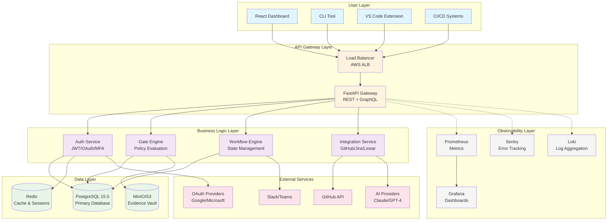
```mermaid
graph TB
    subgraph "User Layer"
        UI[React Dashboard]
        CLI[CLI Tool]
        VSCode[VS Code Extension]
        CICD[CI/CD Systems]
    end

    subgraph "API Gateway Layer"
        LB[Load Balancer<br/>AWS ALB]
        API[FastAPI Gateway<br/>REST + GraphQL]
    end

    subgraph "Business Logic Layer"
        GE[Gate Engine<br/>Policy Evaluation]
        WF[Workflow Engine<br/>State Management]
        INT[Integration Service<br/>GitHub/Jira/Linear]
        AUTH[Auth Service<br/>JWT/OAuth/MFA]
    end

    subgraph "Data Layer"
        PG[(PostgreSQL 15.5<br/>Primary Database)]
        REDIS[(Redis<br/>Cache & Sessions)]
        MINIO[(MinIO/S3<br/>Evidence Vault)]
    end

    subgraph "External Services"
        GITHUB[GitHub API]
        OAUTH[OAuth Providers<br/>Google/Microsoft]
        AI[AI Providers<br/>Claude/GPT-4]
        SLACK[Slack/Teams]
    end

    subgraph "Observability Layer"
        PROM[Prometheus<br/>Metrics]
        GRAFANA[Grafana<br/>Dashboards]
        SENTRY[Sentry<br/>Error Tracking]
        LOKI[Loki<br/>Log Aggregation]
    end

    %% User connections
    UI --> LB
    CLI --> LB
    VSCode --> LB
    CICD --> LB

    %% API Gateway connections
    LB --> API
    API --> AUTH
    API --> GE
    API --> WF
    API --> INT

    %% Business Logic connections
    AUTH --> PG
    AUTH --> REDIS
    GE --> PG
    WF --> PG
    INT --> GITHUB
    AUTH --> OAUTH

    %% Data Layer connections
    GE --> MINIO
    INT --> AI

    %% Notification connections
    WF --> SLACK

    %% Monitoring connections
    API -.-> PROM
    API -.-> SENTRY
    API -.-> LOKI
    PROM --> GRAFANA

    classDef userLayer fill:#e1f5fe
    classDef apiLayer fill:#fff3e0
    classDef businessLayer fill:#f3e5f5
    classDef dataLayer fill:#e8f5e9
    classDef externalLayer fill:#fce4ec
    classDef observabilityLayer fill:#f5f5f5

    class UI,CLI,VSCode,CICD userLayer
    class LB,API apiLayer
    class GE,WF,INT,AUTH businessLayer
    class PG,REDIS,MINIO dataLayer
    class GITHUB,OAUTH,AI,SLACK externalLayer
    class PROM,GRAFANA,SENTRY,LOKI observabilityLayer
```

---

### 2.2 Data Flow Architecture

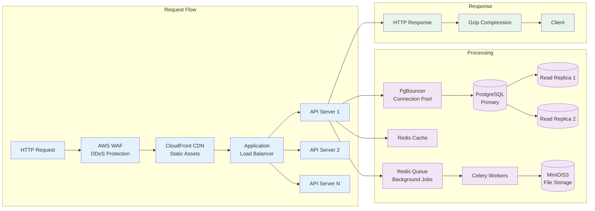
```mermaid
graph LR
    subgraph "Request Flow"
        REQ[HTTP Request] --> WAF[AWS WAF<br/>DDoS Protection]
        WAF --> CF[CloudFront CDN<br/>Static Assets]
        CF --> ALB[Application<br/>Load Balancer]
        ALB --> API1[API Server 1]
        ALB --> API2[API Server 2]
        ALB --> API3[API Server N]
    end

    subgraph "Processing"
        API1 --> POOL[PgBouncer<br/>Connection Pool]
        POOL --> PG[(PostgreSQL<br/>Primary)]
        PG --> REP1[(Read Replica 1)]
        PG --> REP2[(Read Replica 2)]

        API1 --> CACHE[Redis Cache]
        API1 --> QUEUE[Redis Queue<br/>Background Jobs]
        QUEUE --> WORKER[Celery Workers]
        WORKER --> MINIO[(MinIO/S3<br/>File Storage)]
    end

    subgraph "Response"
        API1 --> RESP[HTTP Response]
        RESP --> GZIP[Gzip Compression]
        GZIP --> CLIENT[Client]
    end

    classDef request fill:#e3f2fd
    classDef processing fill:#f3e5f5
    classDef response fill:#e8f5e9

    class REQ,WAF,CF,ALB,API1,API2,API3 request
    class POOL,PG,REP1,REP2,CACHE,QUEUE,WORKER,MINIO processing
    class RESP,GZIP,CLIENT response
```

---

## 3. Sequence Diagrams

### 3.1 User Login Flow (JWT + MFA)

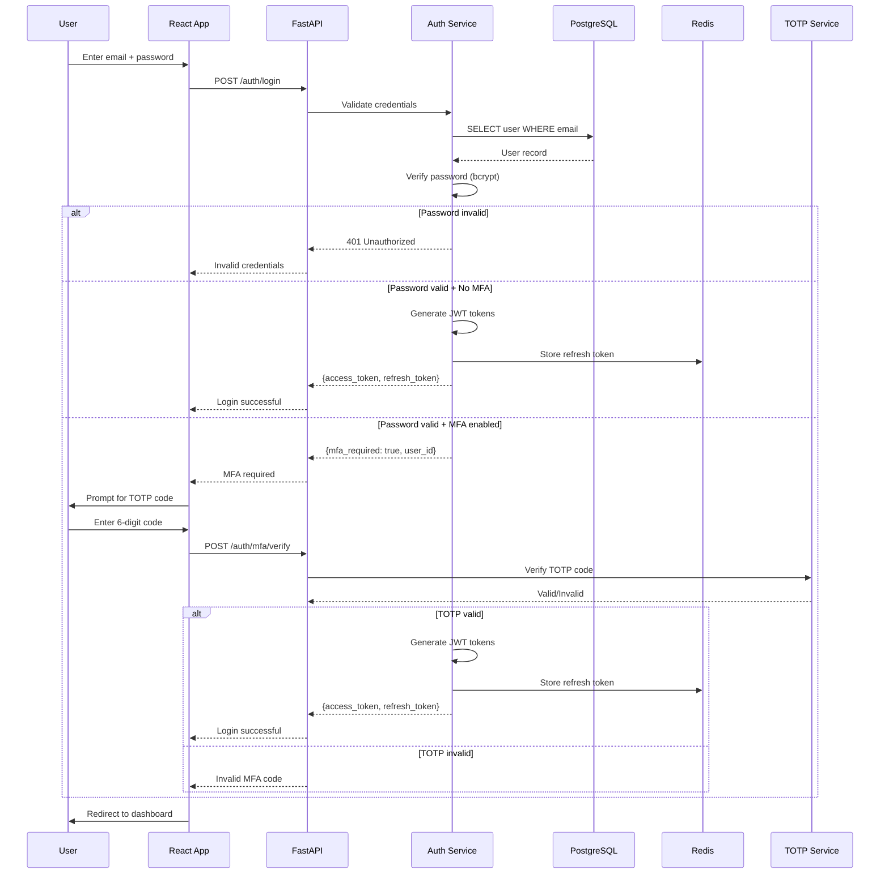
```mermaid
sequenceDiagram
    participant U as User
    participant UI as React App
    participant API as FastAPI
    participant AUTH as Auth Service
    participant DB as PostgreSQL
    participant REDIS as Redis
    participant MFA as TOTP Service

    U->>UI: Enter email + password
    UI->>API: POST /auth/login
    API->>AUTH: Validate credentials
    AUTH->>DB: SELECT user WHERE email
    DB-->>AUTH: User record
    AUTH->>AUTH: Verify password (bcrypt)

    alt Password invalid
        AUTH-->>API: 401 Unauthorized
        API-->>UI: Invalid credentials
    else Password valid + No MFA
        AUTH->>AUTH: Generate JWT tokens
        AUTH->>REDIS: Store refresh token
        AUTH-->>API: {access_token, refresh_token}
        API-->>UI: Login successful
    else Password valid + MFA enabled
        AUTH-->>API: {mfa_required: true, user_id}
        API-->>UI: MFA required
        UI->>U: Prompt for TOTP code
        U->>UI: Enter 6-digit code
        UI->>API: POST /auth/mfa/verify
        API->>MFA: Verify TOTP code
        MFA-->>API: Valid/Invalid

        alt TOTP valid
            AUTH->>AUTH: Generate JWT tokens
            AUTH->>REDIS: Store refresh token
            AUTH-->>API: {access_token, refresh_token}
            API-->>UI: Login successful
        else TOTP invalid
            API-->>UI: Invalid MFA code
        end
    end

    UI->>U: Redirect to dashboard
```

---

### 3.2 Gate Approval Workflow (Multi-Approver)

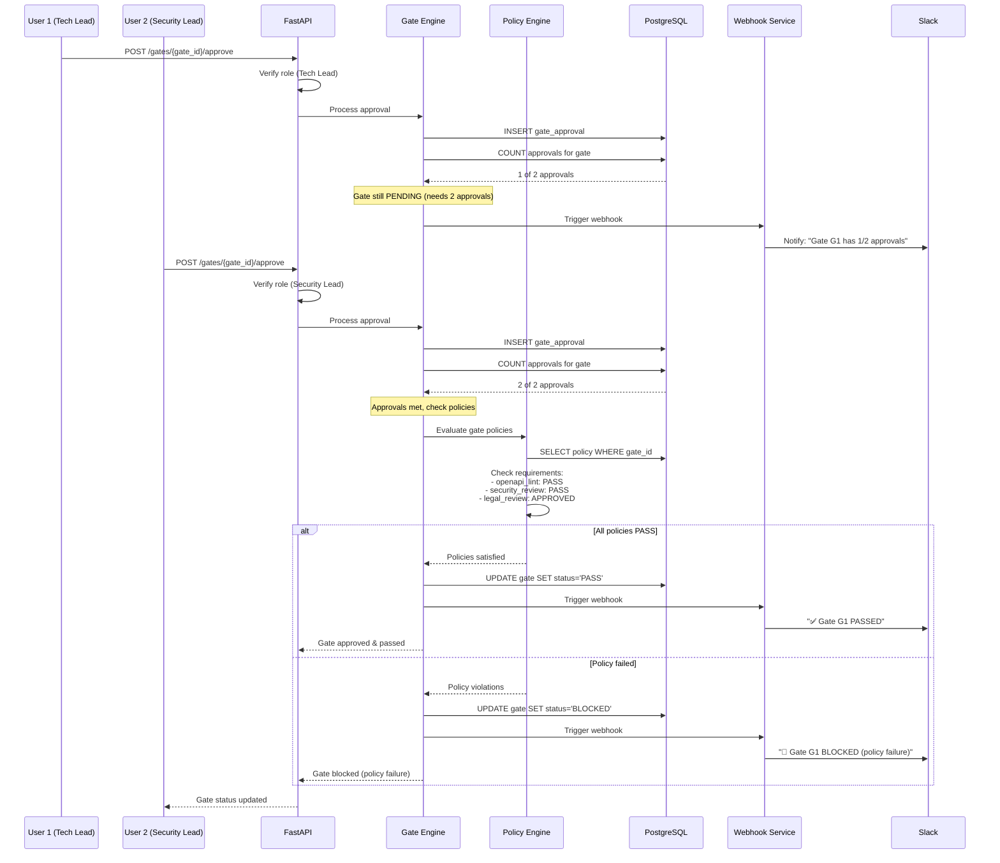
```mermaid
sequenceDiagram
    participant U1 as User 1 (Tech Lead)
    participant U2 as User 2 (Security Lead)
    participant API as FastAPI
    participant GE as Gate Engine
    participant PE as Policy Engine
    participant DB as PostgreSQL
    participant WH as Webhook Service
    participant SLACK as Slack

    U1->>API: POST /gates/{gate_id}/approve
    API->>API: Verify role (Tech Lead)
    API->>GE: Process approval
    GE->>DB: INSERT gate_approval
    GE->>DB: COUNT approvals for gate
    DB-->>GE: 1 of 2 approvals

    Note over GE: Gate still PENDING (needs 2 approvals)

    GE->>WH: Trigger webhook
    WH->>SLACK: Notify: "Gate G1 has 1/2 approvals"

    U2->>API: POST /gates/{gate_id}/approve
    API->>API: Verify role (Security Lead)
    API->>GE: Process approval
    GE->>DB: INSERT gate_approval
    GE->>DB: COUNT approvals for gate
    DB-->>GE: 2 of 2 approvals

    Note over GE: Approvals met, check policies

    GE->>PE: Evaluate gate policies
    PE->>DB: SELECT policy WHERE gate_id
    PE->>PE: Check requirements:<br/>- openapi_lint: PASS<br/>- security_review: PASS<br/>- legal_review: APPROVED

    alt All policies PASS
        PE-->>GE: Policies satisfied
        GE->>DB: UPDATE gate SET status='PASS'
        GE->>WH: Trigger webhook
        WH->>SLACK: "✅ Gate G1 PASSED"
        GE-->>API: Gate approved & passed
    else Policy failed
        PE-->>GE: Policy violations
        GE->>DB: UPDATE gate SET status='BLOCKED'
        GE->>WH: Trigger webhook
        WH->>SLACK: "🚫 Gate G1 BLOCKED (policy failure)"
        GE-->>API: Gate blocked (policy failure)
    end

    API-->>U2: Gate status updated
```

---

### 3.3 Evidence Upload Flow

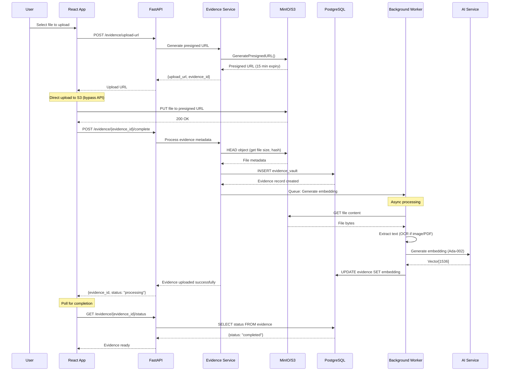
```mermaid
sequenceDiagram
    participant U as User
    participant UI as React App
    participant API as FastAPI
    participant EV as Evidence Service
    participant MINIO as MinIO/S3
    participant DB as PostgreSQL
    participant WORKER as Background Worker
    participant AI as AI Service

    U->>UI: Select file to upload
    UI->>API: POST /evidence/upload-url
    API->>EV: Generate presigned URL
    EV->>MINIO: GeneratePresignedURL()
    MINIO-->>EV: Presigned URL (15 min expiry)
    EV-->>API: {upload_url, evidence_id}
    API-->>UI: Upload URL

    Note over UI: Direct upload to S3 (bypass API)

    UI->>MINIO: PUT file to presigned URL
    MINIO-->>UI: 200 OK

    UI->>API: POST /evidence/{evidence_id}/complete
    API->>EV: Process evidence metadata
    EV->>MINIO: HEAD object (get file size, hash)
    MINIO-->>EV: File metadata

    EV->>DB: INSERT evidence_vault
    DB-->>EV: Evidence record created

    EV->>WORKER: Queue: Generate embedding

    Note over WORKER: Async processing

    WORKER->>MINIO: GET file content
    MINIO-->>WORKER: File bytes
    WORKER->>WORKER: Extract text (OCR if image/PDF)
    WORKER->>AI: Generate embedding (Ada-002)
    AI-->>WORKER: Vector[1536]
    WORKER->>DB: UPDATE evidence SET embedding

    EV-->>API: Evidence uploaded successfully
    API-->>UI: {evidence_id, status: "processing"}

    Note over UI: Poll for completion

    UI->>API: GET /evidence/{evidence_id}/status
    API->>DB: SELECT status FROM evidence
    DB-->>API: {status: "completed"}
    API-->>UI: Evidence ready
```

---

### 3.4 GitHub PR Sync Flow

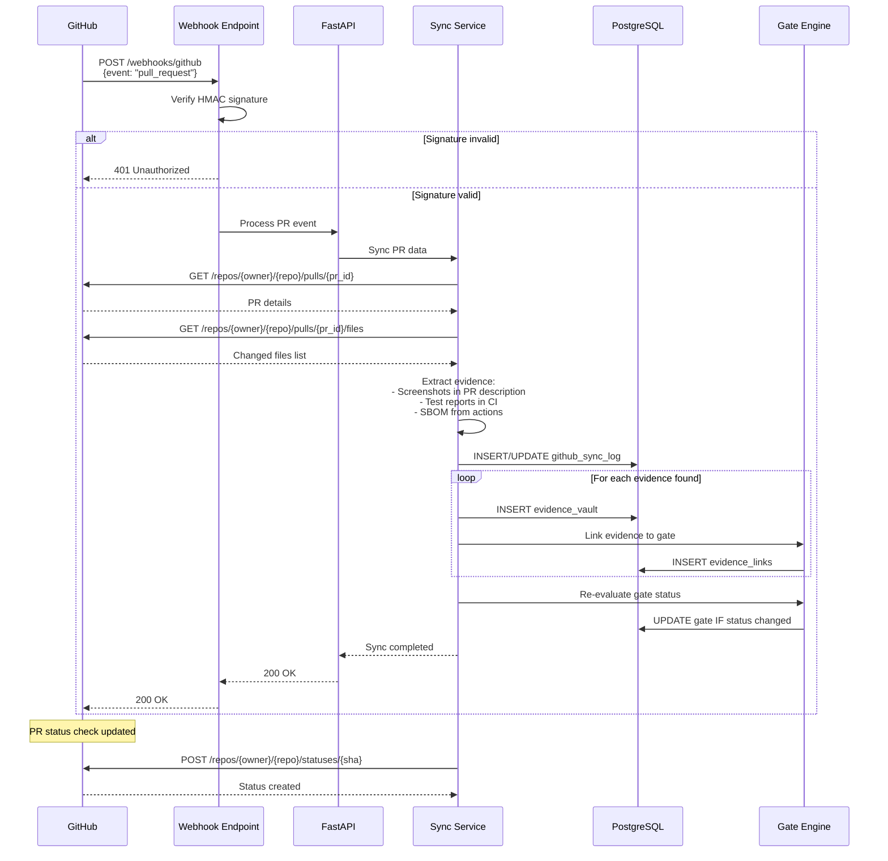
```mermaid
sequenceDiagram
    participant GH as GitHub
    participant WH as Webhook Endpoint
    participant API as FastAPI
    participant SYNC as Sync Service
    participant DB as PostgreSQL
    participant GE as Gate Engine

    GH->>WH: POST /webhooks/github<br/>{event: "pull_request"}
    WH->>WH: Verify HMAC signature

    alt Signature invalid
        WH-->>GH: 401 Unauthorized
    else Signature valid
        WH->>API: Process PR event
        API->>SYNC: Sync PR data

        SYNC->>GH: GET /repos/{owner}/{repo}/pulls/{pr_id}
        GH-->>SYNC: PR details

        SYNC->>GH: GET /repos/{owner}/{repo}/pulls/{pr_id}/files
        GH-->>SYNC: Changed files list

        SYNC->>SYNC: Extract evidence:<br/>- Screenshots in PR description<br/>- Test reports in CI<br/>- SBOM from actions

        SYNC->>DB: INSERT/UPDATE github_sync_log

        loop For each evidence found
            SYNC->>DB: INSERT evidence_vault
            SYNC->>GE: Link evidence to gate
            GE->>DB: INSERT evidence_links
        end

        SYNC->>GE: Re-evaluate gate status
        GE->>DB: UPDATE gate IF status changed

        SYNC-->>API: Sync completed
        API-->>WH: 200 OK
        WH-->>GH: 200 OK
    end

    Note over GH: PR status check updated

    SYNC->>GH: POST /repos/{owner}/{repo}/statuses/{sha}
    GH-->>SYNC: Status created
```

---

### 3.5 GraphQL Dashboard Query Flow

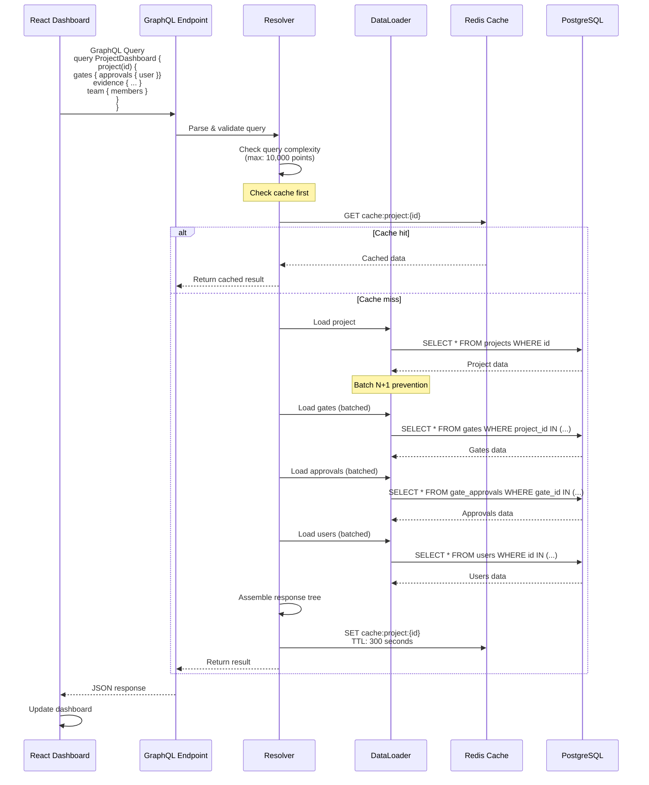
```mermaid
sequenceDiagram
    participant UI as React Dashboard
    participant GQL as GraphQL Endpoint
    participant RESOLVER as Resolver
    participant LOADER as DataLoader
    participant CACHE as Redis Cache
    participant DB as PostgreSQL

    UI->>GQL: GraphQL Query<br/>query ProjectDashboard {<br/>  project(id) {<br/>    gates { approvals { user }}<br/>    evidence { ... }<br/>    team { members }<br/>  }<br/>}

    GQL->>RESOLVER: Parse & validate query
    RESOLVER->>RESOLVER: Check query complexity<br/>(max: 10,000 points)

    Note over RESOLVER: Check cache first

    RESOLVER->>CACHE: GET cache:project:{id}

    alt Cache hit
        CACHE-->>RESOLVER: Cached data
        RESOLVER-->>GQL: Return cached result
    else Cache miss
        RESOLVER->>LOADER: Load project
        LOADER->>DB: SELECT * FROM projects WHERE id
        DB-->>LOADER: Project data

        Note over LOADER: Batch N+1 prevention

        RESOLVER->>LOADER: Load gates (batched)
        LOADER->>DB: SELECT * FROM gates WHERE project_id IN (...)
        DB-->>LOADER: Gates data

        RESOLVER->>LOADER: Load approvals (batched)
        LOADER->>DB: SELECT * FROM gate_approvals WHERE gate_id IN (...)
        DB-->>LOADER: Approvals data

        RESOLVER->>LOADER: Load users (batched)
        LOADER->>DB: SELECT * FROM users WHERE id IN (...)
        DB-->>LOADER: Users data

        RESOLVER->>RESOLVER: Assemble response tree

        RESOLVER->>CACHE: SET cache:project:{id}<br/>TTL: 300 seconds

        RESOLVER-->>GQL: Return result
    end

    GQL-->>UI: JSON response
    UI->>UI: Update dashboard
```

---

## 4. State Diagrams

### 4.1 Gate State Machine

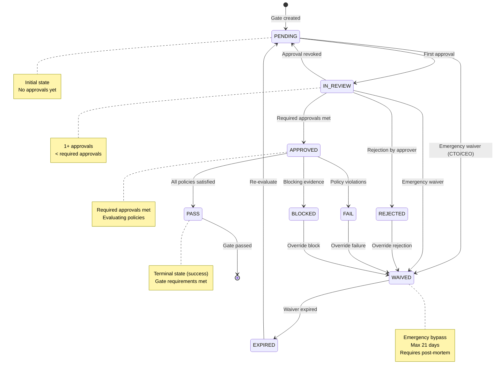
```mermaid
stateDiagram-v2
    [*] --> PENDING: Gate created

    PENDING --> IN_REVIEW: First approval

    IN_REVIEW --> APPROVED: Required approvals met
    IN_REVIEW --> REJECTED: Rejection by approver
    IN_REVIEW --> PENDING: Approval revoked

    APPROVED --> PASS: All policies satisfied
    APPROVED --> FAIL: Policy violations
    APPROVED --> BLOCKED: Blocking evidence

    PENDING --> WAIVED: Emergency waiver (CTO/CEO)
    IN_REVIEW --> WAIVED: Emergency waiver
    REJECTED --> WAIVED: Override rejection
    FAIL --> WAIVED: Override failure
    BLOCKED --> WAIVED: Override block

    WAIVED --> EXPIRED: Waiver expired
    EXPIRED --> PENDING: Re-evaluate

    PASS --> [*]: Gate passed

    note right of PENDING
        Initial state
        No approvals yet
    end note

    note right of IN_REVIEW
        1+ approvals
        < required approvals
    end note

    note right of APPROVED
        Required approvals met
        Evaluating policies
    end note

    note right of PASS
        Terminal state (success)
        Gate requirements met
    end note

    note right of WAIVED
        Emergency bypass
        Max 21 days
        Requires post-mortem
    end note
```

---

### 4.2 Project Lifecycle State Machine

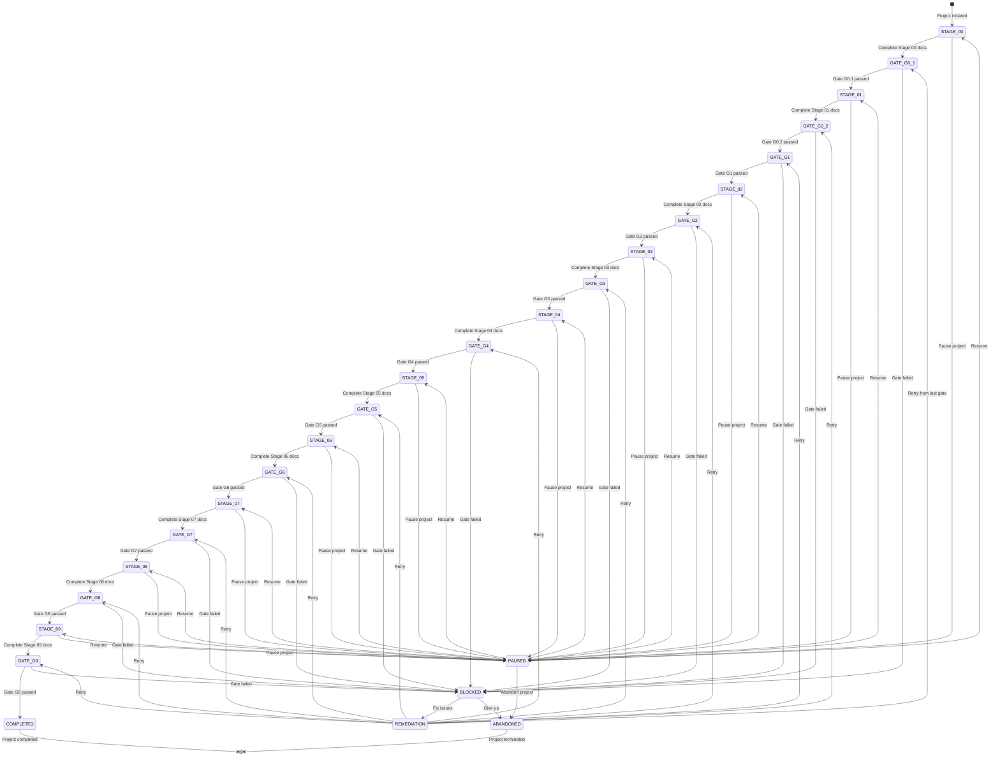
```mermaid
stateDiagram-v2
    [*] --> STAGE_00: Project initiated

    STAGE_00 --> GATE_G0_1: Complete Stage 00 docs
    GATE_G0_1 --> STAGE_01: Gate G0.1 passed

    STAGE_01 --> GATE_G0_2: Complete Stage 01 docs
    GATE_G0_2 --> GATE_G1: Gate G0.2 passed
    GATE_G1 --> STAGE_02: Gate G1 passed

    STAGE_02 --> GATE_G2: Complete Stage 02 docs
    GATE_G2 --> STAGE_03: Gate G2 passed

    STAGE_03 --> GATE_G3: Complete Stage 03 docs
    GATE_G3 --> STAGE_04: Gate G3 passed

    STAGE_04 --> GATE_G4: Complete Stage 04 docs
    GATE_G4 --> STAGE_05: Gate G4 passed

    STAGE_05 --> GATE_G5: Complete Stage 05 docs
    GATE_G5 --> STAGE_06: Gate G5 passed

    STAGE_06 --> GATE_G6: Complete Stage 06 docs
    GATE_G6 --> STAGE_07: Gate G6 passed

    STAGE_07 --> GATE_G7: Complete Stage 07 docs
    GATE_G7 --> STAGE_08: Gate G7 passed

    STAGE_08 --> GATE_G8: Complete Stage 08 docs
    GATE_G8 --> STAGE_09: Gate G8 passed

    STAGE_09 --> GATE_G9: Complete Stage 09 docs
    GATE_G9 --> COMPLETED: Gate G9 passed

    COMPLETED --> [*]: Project completed

    %% Failure paths
    GATE_G0_1 --> BLOCKED: Gate failed
    GATE_G0_2 --> BLOCKED: Gate failed
    GATE_G1 --> BLOCKED: Gate failed
    GATE_G2 --> BLOCKED: Gate failed
    GATE_G3 --> BLOCKED: Gate failed
    GATE_G4 --> BLOCKED: Gate failed
    GATE_G5 --> BLOCKED: Gate failed
    GATE_G6 --> BLOCKED: Gate failed
    GATE_G7 --> BLOCKED: Gate failed
    GATE_G8 --> BLOCKED: Gate failed
    GATE_G9 --> BLOCKED: Gate failed

    BLOCKED --> REMEDIATION: Fix issues
    REMEDIATION --> GATE_G0_1: Retry from last gate
    REMEDIATION --> GATE_G0_2: Retry
    REMEDIATION --> GATE_G1: Retry
    REMEDIATION --> GATE_G2: Retry
    REMEDIATION --> GATE_G3: Retry
    REMEDIATION --> GATE_G4: Retry
    REMEDIATION --> GATE_G5: Retry
    REMEDIATION --> GATE_G6: Retry
    REMEDIATION --> GATE_G7: Retry
    REMEDIATION --> GATE_G8: Retry
    REMEDIATION --> GATE_G9: Retry

    %% Pause/Resume
    STAGE_00 --> PAUSED: Pause project
    STAGE_01 --> PAUSED: Pause project
    STAGE_02 --> PAUSED: Pause project
    STAGE_03 --> PAUSED: Pause project
    STAGE_04 --> PAUSED: Pause project
    STAGE_05 --> PAUSED: Pause project
    STAGE_06 --> PAUSED: Pause project
    STAGE_07 --> PAUSED: Pause project
    STAGE_08 --> PAUSED: Pause project
    STAGE_09 --> PAUSED: Pause project

    PAUSED --> STAGE_00: Resume
    PAUSED --> STAGE_01: Resume
    PAUSED --> STAGE_02: Resume
    PAUSED --> STAGE_03: Resume
    PAUSED --> STAGE_04: Resume
    PAUSED --> STAGE_05: Resume
    PAUSED --> STAGE_06: Resume
    PAUSED --> STAGE_07: Resume
    PAUSED --> STAGE_08: Resume
    PAUSED --> STAGE_09: Resume

    %% Abandon
    PAUSED --> ABANDONED: Abandon project
    BLOCKED --> ABANDONED: Give up
    ABANDONED --> [*]: Project terminated
```

---

### 4.3 Evidence Status State Machine

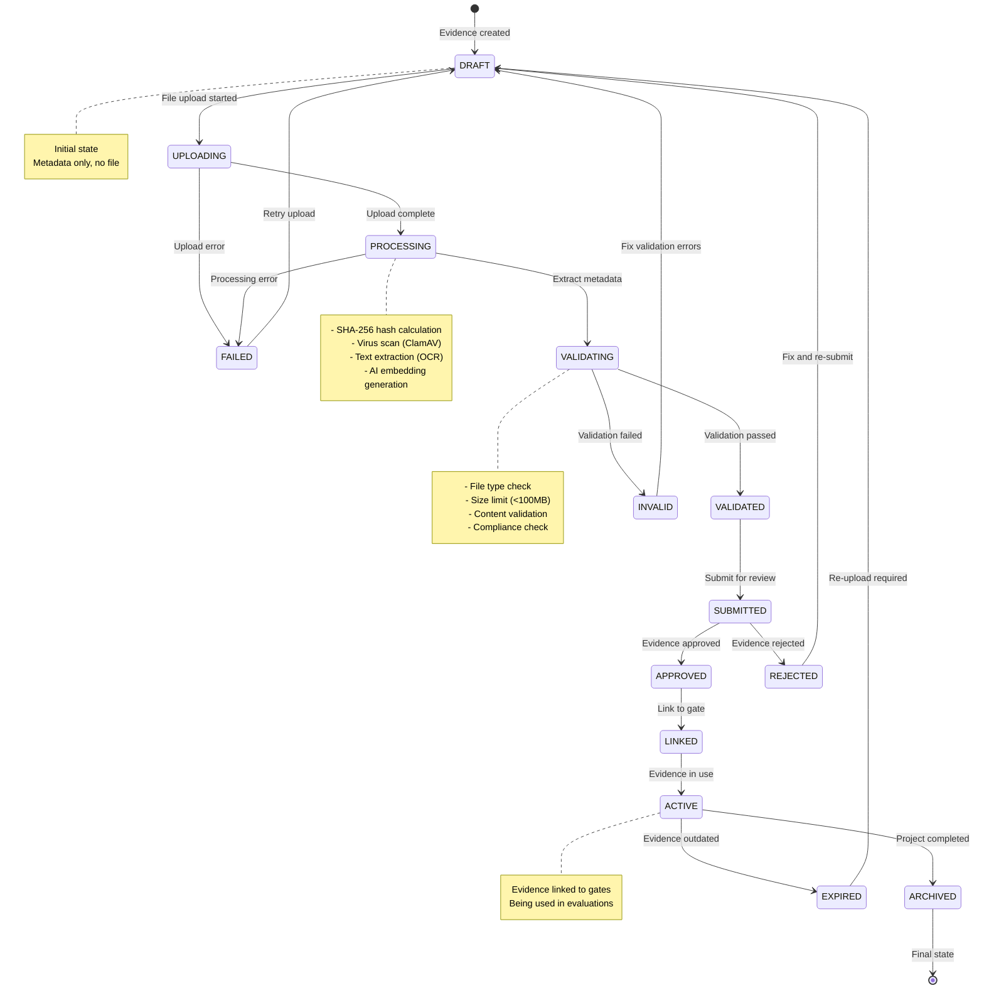
```mermaid
stateDiagram-v2
    [*] --> DRAFT: Evidence created

    DRAFT --> UPLOADING: File upload started

    UPLOADING --> PROCESSING: Upload complete
    UPLOADING --> FAILED: Upload error

    PROCESSING --> VALIDATING: Extract metadata
    PROCESSING --> FAILED: Processing error

    VALIDATING --> VALIDATED: Validation passed
    VALIDATING --> INVALID: Validation failed

    VALIDATED --> SUBMITTED: Submit for review

    SUBMITTED --> APPROVED: Evidence approved
    SUBMITTED --> REJECTED: Evidence rejected

    APPROVED --> LINKED: Link to gate

    LINKED --> ACTIVE: Evidence in use

    ACTIVE --> ARCHIVED: Project completed
    ACTIVE --> EXPIRED: Evidence outdated

    EXPIRED --> DRAFT: Re-upload required

    REJECTED --> DRAFT: Fix and re-submit

    INVALID --> DRAFT: Fix validation errors

    FAILED --> DRAFT: Retry upload

    ARCHIVED --> [*]: Final state

    note right of DRAFT
        Initial state
        Metadata only, no file
    end note

    note right of PROCESSING
        - SHA-256 hash calculation
        - Virus scan (ClamAV)
        - Text extraction (OCR)
        - AI embedding generation
    end note

    note right of VALIDATING
        - File type check
        - Size limit (<100MB)
        - Content validation
        - Compliance check
    end note

    note right of ACTIVE
        Evidence linked to gates
        Being used in evaluations
    end note
```

---

## 5. Component Architecture

### 5.1 Layered Architecture

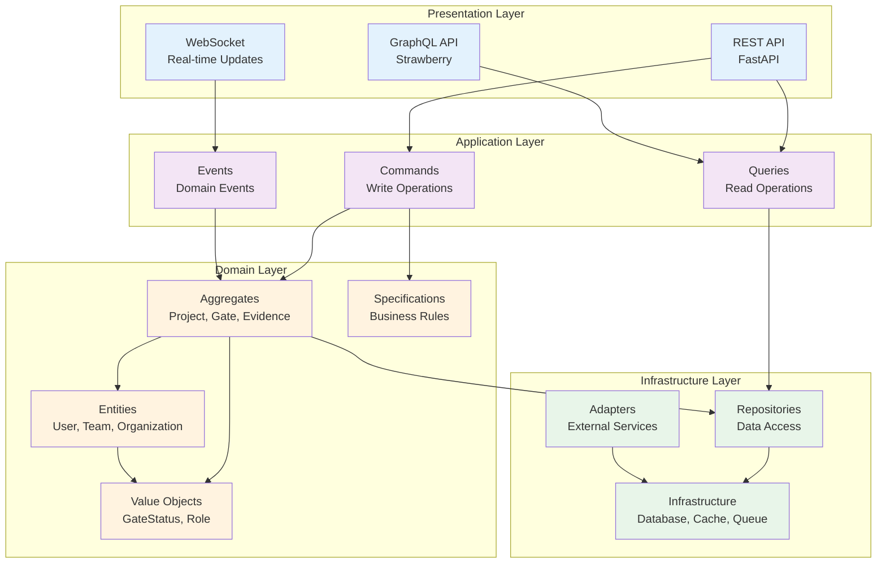
```mermaid
graph TB
    subgraph "Presentation Layer"
        REST[REST API<br/>FastAPI]
        GQL[GraphQL API<br/>Strawberry]
        WS[WebSocket<br/>Real-time Updates]
    end

    subgraph "Application Layer"
        CMD[Commands<br/>Write Operations]
        QRY[Queries<br/>Read Operations]
        EVT[Events<br/>Domain Events]
    end

    subgraph "Domain Layer"
        AGG[Aggregates<br/>Project, Gate, Evidence]
        ENT[Entities<br/>User, Team, Organization]
        VO[Value Objects<br/>GateStatus, Role]
        SPEC[Specifications<br/>Business Rules]
    end

    subgraph "Infrastructure Layer"
        REPO[Repositories<br/>Data Access]
        ADAPT[Adapters<br/>External Services]
        INFRA[Infrastructure<br/>Database, Cache, Queue]
    end

    REST --> CMD
    REST --> QRY
    GQL --> QRY
    WS --> EVT

    CMD --> AGG
    CMD --> SPEC
    QRY --> REPO
    EVT --> AGG

    AGG --> ENT
    AGG --> VO
    ENT --> VO

    AGG --> REPO
    REPO --> INFRA
    ADAPT --> INFRA

    classDef presentation fill:#e3f2fd
    classDef application fill:#f3e5f5
    classDef domain fill:#fff3e0
    classDef infrastructure fill:#e8f5e9

    class REST,GQL,WS presentation
    class CMD,QRY,EVT application
    class AGG,ENT,VO,SPEC domain
    class REPO,ADAPT,INFRA infrastructure
```

---

### 5.2 Hexagonal Architecture (Ports & Adapters)

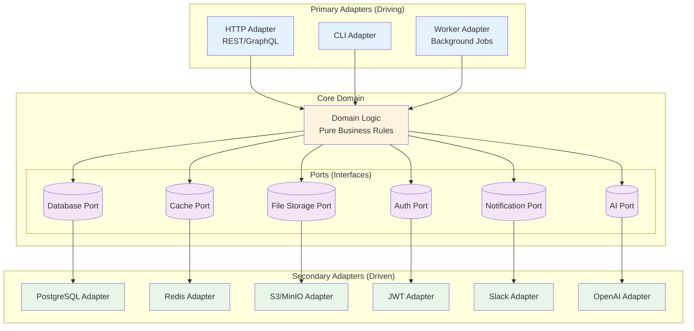
```mermaid
graph TB
    subgraph "Core Domain"
        DOMAIN[Domain Logic<br/>Pure Business Rules]

        subgraph "Ports (Interfaces)"
            IDB[(Database Port)]
            ICACHE[(Cache Port)]
            IFILE[(File Storage Port)]
            IAUTH[(Auth Port)]
            INOTIF[(Notification Port)]
            IAI[(AI Port)]
        end
    end

    subgraph "Primary Adapters (Driving)"
        HTTP[HTTP Adapter<br/>REST/GraphQL]
        CLI[CLI Adapter]
        WORKER[Worker Adapter<br/>Background Jobs]
    end

    subgraph "Secondary Adapters (Driven)"
        PGADAPT[PostgreSQL Adapter]
        REDISADAPT[Redis Adapter]
        S3ADAPT[S3/MinIO Adapter]
        JWTADAPT[JWT Adapter]
        SLACKADAPT[Slack Adapter]
        OAIADAPT[OpenAI Adapter]
    end

    HTTP --> DOMAIN
    CLI --> DOMAIN
    WORKER --> DOMAIN

    DOMAIN --> IDB
    DOMAIN --> ICACHE
    DOMAIN --> IFILE
    DOMAIN --> IAUTH
    DOMAIN --> INOTIF
    DOMAIN --> IAI

    IDB --> PGADAPT
    ICACHE --> REDISADAPT
    IFILE --> S3ADAPT
    IAUTH --> JWTADAPT
    INOTIF --> SLACKADAPT
    IAI --> OAIADAPT

    classDef core fill:#fff3e0
    classDef port fill:#f3e5f5
    classDef primary fill:#e3f2fd
    classDef secondary fill:#e8f5e9

    class DOMAIN core
    class IDB,ICACHE,IFILE,IAUTH,INOTIF,IAI port
    class HTTP,CLI,WORKER primary
    class PGADAPT,REDISADAPT,S3ADAPT,JWTADAPT,SLACKADAPT,OAIADAPT secondary
```

---

### 5.3 Event-Driven Architecture

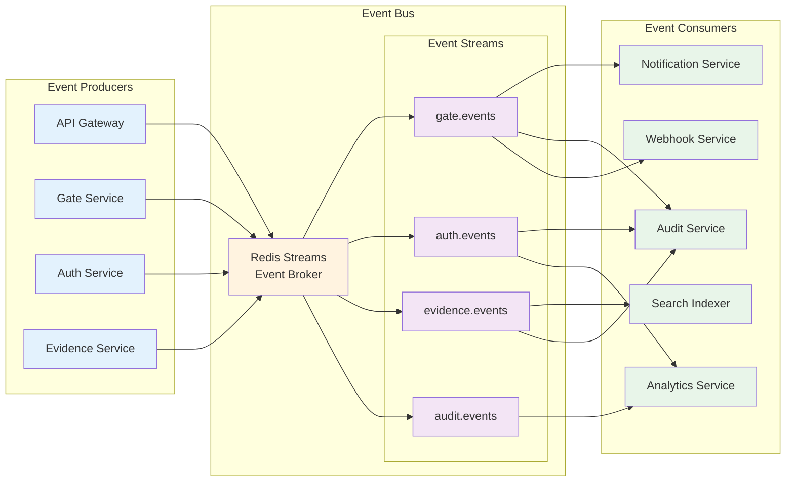
```mermaid
graph LR
    subgraph "Event Producers"
        API[API Gateway]
        GATE[Gate Service]
        AUTH[Auth Service]
        EVIDENCE[Evidence Service]
    end

    subgraph "Event Bus"
        BROKER[Redis Streams<br/>Event Broker]

        subgraph "Event Streams"
            GATE_STREAM[gate.events]
            AUTH_STREAM[auth.events]
            EVIDENCE_STREAM[evidence.events]
            AUDIT_STREAM[audit.events]
        end
    end

    subgraph "Event Consumers"
        NOTIF[Notification Service]
        AUDIT[Audit Service]
        ANALYTICS[Analytics Service]
        WEBHOOK[Webhook Service]
        SEARCH[Search Indexer]
    end

    API --> BROKER
    GATE --> BROKER
    AUTH --> BROKER
    EVIDENCE --> BROKER

    BROKER --> GATE_STREAM
    BROKER --> AUTH_STREAM
    BROKER --> EVIDENCE_STREAM
    BROKER --> AUDIT_STREAM

    GATE_STREAM --> NOTIF
    GATE_STREAM --> AUDIT
    GATE_STREAM --> WEBHOOK

    AUTH_STREAM --> AUDIT
    AUTH_STREAM --> ANALYTICS

    EVIDENCE_STREAM --> SEARCH
    EVIDENCE_STREAM --> AUDIT

    AUDIT_STREAM --> ANALYTICS

    classDef producer fill:#e3f2fd
    classDef broker fill:#fff3e0
    classDef stream fill:#f3e5f5
    classDef consumer fill:#e8f5e9

    class API,GATE,AUTH,EVIDENCE producer
    class BROKER broker
    class GATE_STREAM,AUTH_STREAM,EVIDENCE_STREAM,AUDIT_STREAM stream
    class NOTIF,AUDIT,ANALYTICS,WEBHOOK,SEARCH consumer
```

---

### 5.4 Microservices Architecture (Future State)

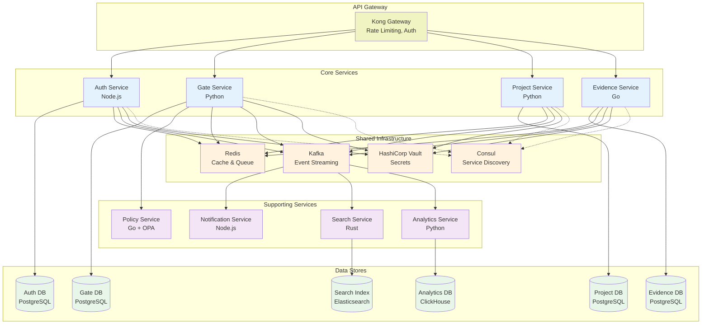
```mermaid
graph TB
    subgraph "API Gateway"
        KONG[Kong Gateway<br/>Rate Limiting, Auth]
    end

    subgraph "Core Services"
        AUTH_SVC[Auth Service<br/>Node.js]
        GATE_SVC[Gate Service<br/>Python]
        PROJECT_SVC[Project Service<br/>Python]
        EVIDENCE_SVC[Evidence Service<br/>Go]
    end

    subgraph "Supporting Services"
        NOTIF_SVC[Notification Service<br/>Node.js]
        SEARCH_SVC[Search Service<br/>Rust]
        ANALYTICS_SVC[Analytics Service<br/>Python]
        POLICY_SVC[Policy Service<br/>Go + OPA]
    end

    subgraph "Data Stores"
        AUTH_DB[(Auth DB<br/>PostgreSQL)]
        GATE_DB[(Gate DB<br/>PostgreSQL)]
        PROJECT_DB[(Project DB<br/>PostgreSQL)]
        EVIDENCE_DB[(Evidence DB<br/>PostgreSQL)]
        SEARCH_INDEX[(Search Index<br/>Elasticsearch)]
        ANALYTICS_DB[(Analytics DB<br/>ClickHouse)]
    end

    subgraph "Shared Infrastructure"
        KAFKA[Kafka<br/>Event Streaming]
        REDIS[Redis<br/>Cache & Queue]
        VAULT[HashiCorp Vault<br/>Secrets]
        CONSUL[Consul<br/>Service Discovery]
    end

    KONG --> AUTH_SVC
    KONG --> GATE_SVC
    KONG --> PROJECT_SVC
    KONG --> EVIDENCE_SVC

    AUTH_SVC --> AUTH_DB
    GATE_SVC --> GATE_DB
    PROJECT_SVC --> PROJECT_DB
    EVIDENCE_SVC --> EVIDENCE_DB

    GATE_SVC --> POLICY_SVC

    AUTH_SVC --> REDIS
    GATE_SVC --> REDIS
    PROJECT_SVC --> REDIS
    EVIDENCE_SVC --> REDIS

    AUTH_SVC --> KAFKA
    GATE_SVC --> KAFKA
    PROJECT_SVC --> KAFKA
    EVIDENCE_SVC --> KAFKA

    KAFKA --> NOTIF_SVC
    KAFKA --> SEARCH_SVC
    KAFKA --> ANALYTICS_SVC

    SEARCH_SVC --> SEARCH_INDEX
    ANALYTICS_SVC --> ANALYTICS_DB

    AUTH_SVC --> VAULT
    GATE_SVC --> VAULT
    PROJECT_SVC --> VAULT
    EVIDENCE_SVC --> VAULT

    AUTH_SVC -.-> CONSUL
    GATE_SVC -.-> CONSUL
    PROJECT_SVC -.-> CONSUL
    EVIDENCE_SVC -.-> CONSUL

    classDef gateway fill:#f0f4c3
    classDef core fill:#e3f2fd
    classDef support fill:#f3e5f5
    classDef data fill:#e8f5e9
    classDef infra fill:#fff3e0

    class KONG gateway
    class AUTH_SVC,GATE_SVC,PROJECT_SVC,EVIDENCE_SVC core
    class NOTIF_SVC,SEARCH_SVC,ANALYTICS_SVC,POLICY_SVC support
    class AUTH_DB,GATE_DB,PROJECT_DB,EVIDENCE_DB,SEARCH_INDEX,ANALYTICS_DB data
    class KAFKA,REDIS,VAULT,CONSUL infra
```

---

## 6. Security Architecture

### 6.1 Zero Trust Security Model

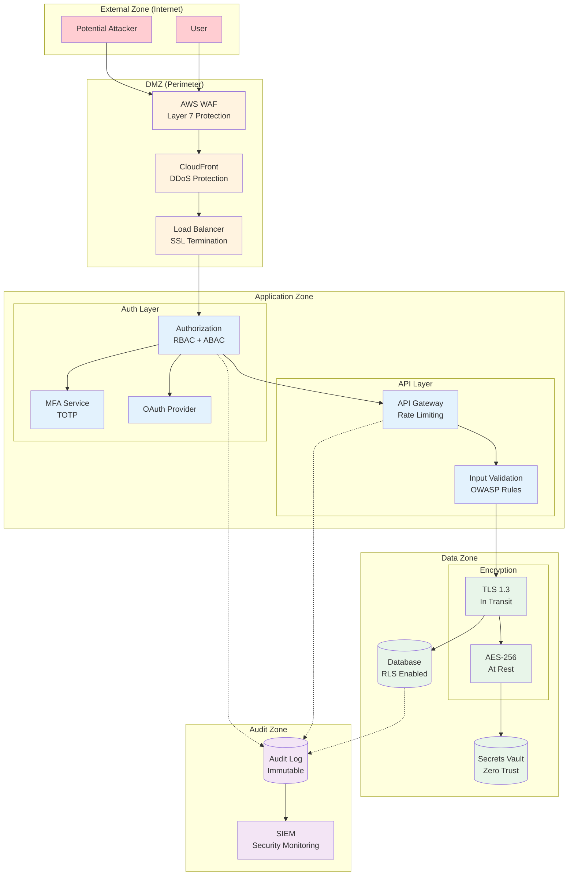
```mermaid
graph TB
    subgraph "External Zone (Internet)"
        USER[User]
        ATTACKER[Potential Attacker]
    end

    subgraph "DMZ (Perimeter)"
        WAF[AWS WAF<br/>Layer 7 Protection]
        CDN[CloudFront<br/>DDoS Protection]
        LB[Load Balancer<br/>SSL Termination]
    end

    subgraph "Application Zone"
        subgraph "Auth Layer"
            AUTHZ[Authorization<br/>RBAC + ABAC]
            MFA[MFA Service<br/>TOTP]
            OAUTH[OAuth Provider]
        end

        subgraph "API Layer"
            API[API Gateway<br/>Rate Limiting]
            VALIDATE[Input Validation<br/>OWASP Rules]
        end
    end

    subgraph "Data Zone"
        subgraph "Encryption"
            TLS[TLS 1.3<br/>In Transit]
            AES[AES-256<br/>At Rest]
        end

        DB[(Database<br/>RLS Enabled)]
        VAULT[(Secrets Vault<br/>Zero Trust)]
    end

    subgraph "Audit Zone"
        AUDIT[(Audit Log<br/>Immutable)]
        SIEM[SIEM<br/>Security Monitoring]
    end

    USER --> WAF
    ATTACKER --> WAF
    WAF --> CDN
    CDN --> LB
    LB --> AUTHZ
    AUTHZ --> MFA
    AUTHZ --> OAUTH
    AUTHZ --> API
    API --> VALIDATE
    VALIDATE --> TLS
    TLS --> DB
    TLS --> AES
    AES --> VAULT

    API -.-> AUDIT
    AUTHZ -.-> AUDIT
    DB -.-> AUDIT
    AUDIT --> SIEM

    classDef external fill:#ffcdd2
    classDef dmz fill:#fff3e0
    classDef app fill:#e3f2fd
    classDef data fill:#e8f5e9
    classDef audit fill:#f3e5f5

    class USER,ATTACKER external
    class WAF,CDN,LB dmz
    class AUTHZ,MFA,OAUTH,API,VALIDATE app
    class TLS,AES,DB,VAULT data
    class AUDIT,SIEM audit
```

---

## 7. Deployment Architecture

### 7.1 Kubernetes Deployment (Production)

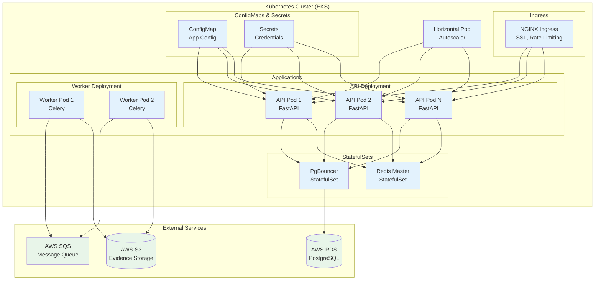
```mermaid
graph TB
    subgraph "Kubernetes Cluster (EKS)"
        subgraph "Ingress"
            INGRESS[NGINX Ingress<br/>SSL, Rate Limiting]
        end

        subgraph "Applications"
            subgraph "API Deployment"
                API1[API Pod 1<br/>FastAPI]
                API2[API Pod 2<br/>FastAPI]
                API3[API Pod N<br/>FastAPI]
            end

            subgraph "Worker Deployment"
                WORKER1[Worker Pod 1<br/>Celery]
                WORKER2[Worker Pod 2<br/>Celery]
            end
        end

        subgraph "StatefulSets"
            REDIS[Redis Master<br/>StatefulSet]
            PGBOUNCER[PgBouncer<br/>StatefulSet]
        end

        subgraph "ConfigMaps & Secrets"
            CM[ConfigMap<br/>App Config]
            SECRET[Secrets<br/>Credentials]
        end

        HPA[Horizontal Pod<br/>Autoscaler]
    end

    subgraph "External Services"
        RDS[(AWS RDS<br/>PostgreSQL)]
        S3[(AWS S3<br/>Evidence Storage)]
        SQS[AWS SQS<br/>Message Queue]
    end

    INGRESS --> API1
    INGRESS --> API2
    INGRESS --> API3

    API1 --> PGBOUNCER
    API2 --> PGBOUNCER
    API3 --> PGBOUNCER
    PGBOUNCER --> RDS

    API1 --> REDIS
    API2 --> REDIS
    API3 --> REDIS

    WORKER1 --> SQS
    WORKER2 --> SQS
    WORKER1 --> S3
    WORKER2 --> S3

    HPA --> API1
    HPA --> API2
    HPA --> API3

    CM --> API1
    CM --> API2
    CM --> API3
    SECRET --> API1
    SECRET --> API2
    SECRET --> API3

    classDef k8s fill:#e3f2fd
    classDef external fill:#e8f5e9

    class INGRESS,API1,API2,API3,WORKER1,WORKER2,REDIS,PGBOUNCER,CM,SECRET,HPA k8s
    class RDS,S3,SQS external
```

---

## 8. References

- [C4 Model](https://c4model.com/) - Software architecture diagrams
- [Mermaid Documentation](https://mermaid-js.github.io/) - Diagram syntax
- [System Design Primer](https://github.com/donnemartin/system-design-primer)
- [Microservices Patterns](https://microservices.io/patterns/)
- [The Twelve-Factor App](https://12factor.net/)

---

## 9. Approval

| Role | Name | Approval | Date |
|------|------|----------|------|
| **Tech Lead** | [Tech Lead Name] | ✅ APPROVED | Nov 13, 2025 |
| **System Architect** | [Architect Name] | ✅ APPROVED | Nov 13, 2025 |
| **Security Lead** | [Security Lead Name] | ✅ APPROVED | Nov 13, 2025 |

---

**Last Updated**: November 13, 2025
**Status**: ✅ ACCEPTED - Technical design complete
**Next Review**: Stage 03 (BUILD - Implementation)
**Gate G2 Evidence**: `tdd_diagram: present`