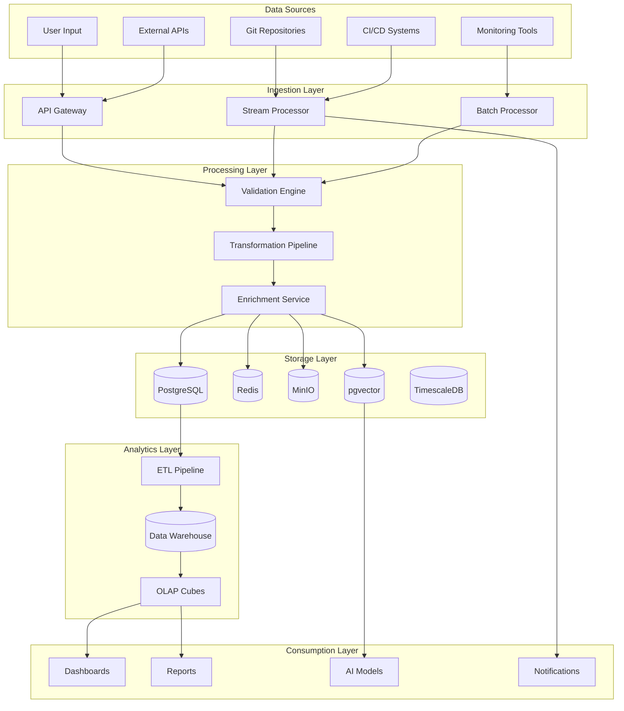

# Data Flow Architecture

**Version**: 1.0.0
**Date**: November 13, 2025
**Author**: Data Architecture Team
**Status**: APPROVED
**Review Cycle**: Quarterly

## Executive Summary

This document defines the data flow architecture for the SDLC Orchestrator platform, detailing how data moves through the system, transformation pipelines, data governance, and real-time streaming patterns. Our architecture ensures data integrity, traceability, and performance at scale.

## Data Flow Overview

### High-Level Data Flow


## Data Ingestion Patterns

### Real-Time Ingestion
```typescript
// Real-Time Data Ingestion Pipeline
export class RealTimeIngestionPipeline {
  private kafkaConsumer: KafkaConsumer;
  private validator: DataValidator;
  private transformer: DataTransformer;

  async processStream(): Promise<void> {
    const stream = this.kafkaConsumer.subscribe([
      'project-events',
      'gate-evaluations',
      'evidence-uploads',
      'system-metrics'
    ]);

    for await (const message of stream) {
      try {
        // Validate incoming data
        const validated = await this.validator.validate(message);

        // Transform data
        const transformed = await this.transformer.transform(validated);

        // Route to appropriate handler
        await this.routeData(transformed);

        // Acknowledge message
        await this.kafkaConsumer.commit(message);
      } catch (error) {
        await this.handleError(message, error);
      }
    }
  }

  private async routeData(data: TransformedData): Promise<void> {
    const router = new DataRouter();

    switch (data.type) {
      case 'PROJECT_EVENT':
        await router.routeToProjectService(data);
        break;
      case 'GATE_EVALUATION':
        await router.routeToGateService(data);
        break;
      case 'EVIDENCE_UPLOAD':
        await router.routeToEvidenceService(data);
        break;
      case 'SYSTEM_METRIC':
        await router.routeToMonitoring(data);
        break;
    }
  }
}
```

### Batch Ingestion
```python
# Batch Data Ingestion
class BatchIngestionPipeline:
    def __init__(self):
        self.scheduler = AirflowScheduler()
        self.storage = MinIOStorage()
        self.processor = BatchProcessor()

    def create_dag(self) -> DAG:
        """Create Airflow DAG for batch processing"""
        dag = DAG(
            'sdlc_batch_ingestion',
            default_args={
                'owner': 'data-team',
                'retries': 3,
                'retry_delay': timedelta(minutes=5)
            },
            schedule_interval='@hourly',
            catchup=False
        )

        # Task 1: Extract data from sources
        extract = PythonOperator(
            task_id='extract_data',
            python_callable=self.extract_data,
            dag=dag
        )

        # Task 2: Validate and clean data
        validate = PythonOperator(
            task_id='validate_data',
            python_callable=self.validate_data,
            dag=dag
        )

        # Task 3: Transform data
        transform = PythonOperator(
            task_id='transform_data',
            python_callable=self.transform_data,
            dag=dag
        )

        # Task 4: Load into warehouse
        load = PythonOperator(
            task_id='load_data',
            python_callable=self.load_data,
            dag=dag
        )

        extract >> validate >> transform >> load
        return dag

    async def extract_data(self, **context):
        """Extract data from various sources"""
        sources = [
            self.extract_from_git(),
            self.extract_from_jira(),
            self.extract_from_sonarqube(),
            self.extract_from_jenkins()
        ]

        data = await asyncio.gather(*sources)

        # Store in staging area
        for dataset in data:
            await self.storage.upload(
                f"staging/{context['ds']}/{dataset.source}.parquet",
                dataset.to_parquet()
            )
```

## Data Transformation Pipelines

### ETL Pipeline Architecture
```python
# ETL Pipeline Implementation
class ETLPipeline:
    def __init__(self):
        self.spark = SparkSession.builder \
            .appName("SDLC_ETL") \
            .config("spark.sql.adaptive.enabled", "true") \
            .config("spark.sql.adaptive.coalescePartitions.enabled", "true") \
            .getOrCreate()

    def process_project_data(self, date: str):
        """Process project data through ETL pipeline"""

        # Extract
        raw_data = self.spark.read.parquet(f"s3://sdlc-data/raw/projects/{date}")

        # Transform - Clean and standardize
        cleaned_data = raw_data \
            .filter(col("project_id").isNotNull()) \
            .withColumn("processed_timestamp", current_timestamp()) \
            .withColumn("stage_duration",
                       datediff(col("stage_end"), col("stage_start")))

        # Transform - Aggregate metrics
        project_metrics = cleaned_data.groupBy("project_id", "stage") \
            .agg(
                avg("stage_duration").alias("avg_duration"),
                count("gate_id").alias("gate_count"),
                sum("evidence_count").alias("total_evidence"),
                max("compliance_score").alias("max_compliance")
            )

        # Transform - Join with dimensions
        enriched_data = project_metrics \
            .join(self.get_team_dimension(), "project_id") \
            .join(self.get_policy_dimension(), "project_id")

        # Load to warehouse
        enriched_data.write \
            .mode("overwrite") \
            .partitionBy("stage") \
            .parquet(f"s3://sdlc-warehouse/projects/{date}")

        # Update materialized views
        self.update_materialized_views(enriched_data)
```

### Data Transformation Rules
```typescript
// Transformation Engine
export class DataTransformationEngine {
  private rules: Map<string, TransformationRule[]>;

  constructor() {
    this.initializeRules();
  }

  private initializeRules(): void {
    this.rules = new Map([
      ['project_data', [
        new NormalizeProjectNames(),
        new StandardizeStageNames(),
        new CalculateDerivedMetrics(),
        new EnrichWithHistoricalData()
      ]],
      ['evidence_data', [
        new ExtractMetadata(),
        new GenerateChecksum(),
        new ClassifyContent(),
        new DetectPII()
      ]],
      ['gate_data', [
        new CalculateScores(),
        new DeterminePassFail(),
        new IdentifyBlockers(),
        new GenerateRecommendations()
      ]]
    ]);
  }

  async transform(data: RawData): Promise<TransformedData> {
    const pipeline = this.rules.get(data.type) || [];

    let transformed = data;
    for (const rule of pipeline) {
      transformed = await rule.apply(transformed);

      // Audit trail
      await this.auditTransformation({
        rule: rule.name,
        input: data.id,
        output: transformed.id,
        timestamp: new Date()
      });
    }

    return transformed;
  }
}

// Specific Transformation Rules
class CalculateDerivedMetrics implements TransformationRule {
  async apply(data: any): Promise<any> {
    return {
      ...data,
      metrics: {
        velocity: this.calculateVelocity(data),
        efficiency: this.calculateEfficiency(data),
        quality: this.calculateQuality(data),
        riskScore: this.calculateRiskScore(data)
      }
    };
  }

  private calculateVelocity(data: any): number {
    const stagesCompleted = data.stages.filter(s => s.completed).length;
    const daysSinceStart = this.daysBetween(data.startDate, new Date());
    return stagesCompleted / Math.max(daysSinceStart, 1);
  }

  private calculateEfficiency(data: any): number {
    const plannedDuration = data.plannedEndDate - data.startDate;
    const actualDuration = new Date() - data.startDate;
    return Math.min(plannedDuration / actualDuration, 1);
  }
}
```

## Data Streaming Architecture

### Event Streaming
```yaml
# Kafka Topics Configuration
topics:
  project-events:
    partitions: 10
    replication: 3
    retention: 7d
    schema: avro

  gate-evaluations:
    partitions: 5
    replication: 3
    retention: 30d
    schema: avro

  evidence-uploads:
    partitions: 8
    replication: 3
    retention: 90d
    schema: avro

  audit-logs:
    partitions: 20
    replication: 3
    retention: 365d
    compression: lz4
    schema: json

  metrics-stream:
    partitions: 15
    replication: 2
    retention: 1d
    schema: protobuf
```

### Stream Processing
```typescript
// Kafka Streams Processing
export class StreamProcessor {
  private streams: KafkaStreams;

  async processProjectStream(): Promise<void> {
    const topology = new StreamsBuilder();

    // Project events stream
    const projectStream = topology
      .stream('project-events')
      .filter((key, value) => value.eventType !== 'INTERNAL')
      .mapValues(value => this.enrichProjectEvent(value));

    // Gate evaluations stream
    const gateStream = topology
      .stream('gate-evaluations')
      .mapValues(value => this.enrichGateEvaluation(value));

    // Join streams
    const joinedStream = projectStream
      .join(
        gateStream,
        (project, gate) => this.correlateProjectGate(project, gate),
        JoinWindows.of(Duration.ofMinutes(5))
      );

    // Aggregate metrics
    const metrics = joinedStream
      .groupByKey()
      .windowedBy(TimeWindows.of(Duration.ofMinutes(1)))
      .aggregate(
        () => new MetricAggregator(),
        (key, value, agg) => agg.add(value)
      );

    // Output to topics
    metrics.toStream().to('project-metrics');

    // Start processing
    this.streams = new KafkaStreams(topology.build(), this.config);
    await this.streams.start();
  }

  private enrichProjectEvent(event: ProjectEvent): EnrichedProjectEvent {
    return {
      ...event,
      enrichedAt: new Date(),
      metadata: {
        source: 'stream-processor',
        version: '1.0.0',
        processingTime: Date.now() - event.timestamp
      }
    };
  }
}
```

## Data Storage Patterns

### Multi-Model Storage Strategy
```typescript
// Storage Strategy Implementation
export class DataStorageStrategy {
  // OLTP Storage (PostgreSQL)
  class OLTPStorage {
    async storeTransactional(data: TransactionalData): Promise<void> {
      await this.db.transaction(async (trx) => {
        // Store main entity
        const entityId = await trx('entities').insert({
          id: data.id,
          type: data.type,
          data: JSON.stringify(data.attributes),
          created_at: new Date()
        }).returning('id');

        // Store relationships
        for (const relation of data.relationships) {
          await trx('relationships').insert({
            source_id: entityId,
            target_id: relation.targetId,
            type: relation.type
          });
        }

        // Update aggregates
        await this.updateAggregates(trx, data);
      });
    }
  }

  // Document Storage (MinIO)
  class DocumentStorage {
    async storeDocument(document: Document): Promise<string> {
      const key = this.generateKey(document);

      // Compress if needed
      const compressed = document.size > COMPRESSION_THRESHOLD
        ? await this.compress(document.content)
        : document.content;

      // Encrypt sensitive documents
      const encrypted = document.classification === 'SENSITIVE'
        ? await this.encrypt(compressed)
        : compressed;

      // Store with metadata
      await this.minio.putObject({
        bucket: 'sdlc-documents',
        key: key,
        body: encrypted,
        metadata: {
          contentType: document.mimeType,
          originalSize: document.size.toString(),
          compressed: (document.size > COMPRESSION_THRESHOLD).toString(),
          encrypted: (document.classification === 'SENSITIVE').toString(),
          checksum: await this.calculateChecksum(document.content)
        }
      });

      return key;
    }
  }

  // Vector Storage (pgvector)
  class VectorStorage {
    async storeEmbedding(text: string, metadata: any): Promise<void> {
      // Generate embedding
      const embedding = await this.aiService.generateEmbedding(text);

      // Store in pgvector
      await this.db('embeddings').insert({
        id: generateId(),
        content: text,
        embedding: pgvector.toSql(embedding),
        metadata: JSON.stringify(metadata),
        created_at: new Date()
      });

      // Create index for similarity search
      await this.createIndex();
    }

    async similaritySearch(query: string, limit: number = 10): Promise<SearchResult[]> {
      const queryEmbedding = await this.aiService.generateEmbedding(query);

      return this.db('embeddings')
        .select('*')
        .orderByRaw('embedding <-> ?', [pgvector.toSql(queryEmbedding)])
        .limit(limit);
    }
  }

  // Time-Series Storage (TimescaleDB)
  class TimeSeriesStorage {
    async storeMetrics(metrics: Metric[]): Promise<void> {
      const data = metrics.map(m => ({
        time: m.timestamp,
        metric_name: m.name,
        value: m.value,
        tags: JSON.stringify(m.tags)
      }));

      await this.db('metrics').insert(data);

      // Create continuous aggregates
      await this.createContinuousAggregates();
    }

    private async createContinuousAggregates(): Promise<void> {
      await this.db.raw(`
        CREATE MATERIALIZED VIEW IF NOT EXISTS metrics_1min
        WITH (timescaledb.continuous) AS
        SELECT
          time_bucket('1 minute', time) AS bucket,
          metric_name,
          avg(value) as avg_value,
          max(value) as max_value,
          min(value) as min_value,
          count(*) as count
        FROM metrics
        GROUP BY bucket, metric_name
      `);
    }
  }
}
```

## Data Quality & Governance

### Data Quality Framework
```typescript
// Data Quality Management
export class DataQualityFramework {
  // Quality Rules Engine
  class QualityRulesEngine {
    private rules: Map<string, QualityRule[]>;

    async validateData(data: any, context: string): Promise<QualityReport> {
      const rules = this.rules.get(context) || [];
      const results: QualityCheckResult[] = [];

      for (const rule of rules) {
        const result = await rule.check(data);
        results.push(result);

        if (result.severity === 'CRITICAL' && !result.passed) {
          throw new DataQualityError(result);
        }
      }

      return {
        overallScore: this.calculateScore(results),
        passed: results.every(r => r.passed || r.severity !== 'CRITICAL'),
        results,
        timestamp: new Date()
      };
    }
  }

  // Quality Rules
  class CompletenessRule implements QualityRule {
    async check(data: any): Promise<QualityCheckResult> {
      const requiredFields = ['id', 'type', 'timestamp', 'source'];
      const missingFields = requiredFields.filter(f => !data[f]);

      return {
        rule: 'completeness',
        passed: missingFields.length === 0,
        score: (requiredFields.length - missingFields.length) / requiredFields.length,
        severity: 'CRITICAL',
        details: { missingFields }
      };
    }
  }

  class ConsistencyRule implements QualityRule {
    async check(data: any): Promise<QualityCheckResult> {
      const inconsistencies = [];

      // Check date consistency
      if (data.endDate && data.startDate && data.endDate < data.startDate) {
        inconsistencies.push('End date before start date');
      }

      // Check status transitions
      if (!this.isValidStatusTransition(data.previousStatus, data.currentStatus)) {
        inconsistencies.push('Invalid status transition');
      }

      return {
        rule: 'consistency',
        passed: inconsistencies.length === 0,
        score: 1 - (inconsistencies.length * 0.2),
        severity: 'HIGH',
        details: { inconsistencies }
      };
    }
  }
}
```

### Data Lineage Tracking
```python
# Data Lineage Implementation
class DataLineageTracker:
    def __init__(self):
        self.neo4j = Neo4jConnection()
        self.metadata_store = MetadataStore()

    def track_transformation(self, transformation: Transformation):
        """Track data transformation in lineage graph"""
        query = """
        MATCH (source:Dataset {id: $source_id})
        CREATE (target:Dataset {
            id: $target_id,
            name: $target_name,
            created_at: datetime()
        })
        CREATE (transform:Transformation {
            id: $transform_id,
            type: $transform_type,
            query: $query,
            executed_at: datetime()
        })
        CREATE (source)-[:INPUT_TO]->(transform)
        CREATE (transform)-[:OUTPUT_TO]->(target)
        """

        self.neo4j.execute(query, {
            'source_id': transformation.source_id,
            'target_id': transformation.target_id,
            'target_name': transformation.target_name,
            'transform_id': transformation.id,
            'transform_type': transformation.type,
            'query': transformation.query
        })

    def get_lineage(self, dataset_id: str, depth: int = 5):
        """Get data lineage for a dataset"""
        query = """
        MATCH path = (d:Dataset {id: $dataset_id})-[:INPUT_TO|OUTPUT_TO*1..$depth]-()
        RETURN path
        """

        paths = self.neo4j.execute(query, {
            'dataset_id': dataset_id,
            'depth': depth * 2  # Account for transformation nodes
        })

        return self.build_lineage_graph(paths)

    def impact_analysis(self, dataset_id: str):
        """Analyze downstream impact of dataset changes"""
        query = """
        MATCH (d:Dataset {id: $dataset_id})-[:INPUT_TO]->(t:Transformation)-[:OUTPUT_TO]->(downstream:Dataset)
        MATCH (downstream)-[:USED_BY]->(consumer:Consumer)
        RETURN downstream, consumer
        """

        results = self.neo4j.execute(query, {'dataset_id': dataset_id})

        return {
            'affected_datasets': [r['downstream'] for r in results],
            'affected_consumers': [r['consumer'] for r in results],
            'impact_score': self.calculate_impact_score(results)
        }
```

## Data Access Patterns

### Query Optimization
```typescript
// Query Optimization Layer
export class QueryOptimizer {
  private queryCache: LRUCache<string, QueryResult>;
  private queryPlanner: QueryPlanner;

  async executeQuery(query: Query): Promise<QueryResult> {
    // Check cache first
    const cacheKey = this.generateCacheKey(query);
    const cached = this.queryCache.get(cacheKey);

    if (cached && !query.noCache) {
      return cached;
    }

    // Optimize query
    const optimized = await this.optimizeQuery(query);

    // Execute with appropriate strategy
    const result = await this.executeWithStrategy(optimized);

    // Cache result
    this.queryCache.set(cacheKey, result, this.determineTTL(query));

    return result;
  }

  private async optimizeQuery(query: Query): Promise<OptimizedQuery> {
    const plan = await this.queryPlanner.createPlan(query);

    // Apply optimizations
    const optimizations = [
      this.predicatePushdown,
      this.projectionPruning,
      this.joinReordering,
      this.indexSelection
    ];

    let optimized = plan;
    for (const optimization of optimizations) {
      optimized = await optimization(optimized);
    }

    return optimized;
  }

  private async executeWithStrategy(query: OptimizedQuery): Promise<QueryResult> {
    // Choose execution strategy based on query characteristics
    if (query.isAggregation && query.timeRange) {
      return this.executeTimeSeriesQuery(query);
    } else if (query.requiresJoin && query.tables.length > 3) {
      return this.executeDistributedQuery(query);
    } else if (query.isFullTextSearch) {
      return this.executeVectorSearch(query);
    } else {
      return this.executeStandardQuery(query);
    }
  }
}
```

### Data Access Layer
```typescript
// Unified Data Access Layer
export class DataAccessLayer {
  private repositories: Map<string, Repository>;
  private queryBuilder: QueryBuilder;

  // Repository Pattern Implementation
  class ProjectRepository implements Repository<Project> {
    async findById(id: string): Promise<Project | null> {
      const cacheKey = `project:${id}`;

      // Try cache first
      const cached = await this.cache.get(cacheKey);
      if (cached) return cached;

      // Query database
      const result = await this.db('projects')
        .leftJoin('teams', 'projects.team_id', 'teams.id')
        .leftJoin('policies', 'projects.policy_pack_id', 'policies.id')
        .where('projects.id', id)
        .first();

      if (!result) return null;

      const project = this.mapToEntity(result);

      // Cache result
      await this.cache.set(cacheKey, project, TTL.MEDIUM);

      return project;
    }

    async findByFilters(filters: ProjectFilters): Promise<Project[]> {
      const query = this.db('projects');

      // Apply filters dynamically
      if (filters.stage) {
        query.where('current_stage', filters.stage);
      }
      if (filters.status) {
        query.where('status', filters.status);
      }
      if (filters.teamId) {
        query.where('team_id', filters.teamId);
      }
      if (filters.dateRange) {
        query.whereBetween('created_at', [filters.dateRange.start, filters.dateRange.end]);
      }

      // Apply pagination
      if (filters.pagination) {
        query.limit(filters.pagination.limit)
             .offset(filters.pagination.offset);
      }

      const results = await query;
      return results.map(this.mapToEntity);
    }

    async save(project: Project): Promise<void> {
      await this.db.transaction(async (trx) => {
        // Upsert main entity
        await trx('projects')
          .insert(this.mapToDatabase(project))
          .onConflict('id')
          .merge();

        // Update related entities
        await this.updateRelations(trx, project);

        // Invalidate cache
        await this.cache.delete(`project:${project.id}`);

        // Publish domain event
        await this.eventBus.publish(new ProjectUpdatedEvent(project));
      });
    }
  }
}
```

## Data Synchronization

### Multi-System Synchronization
```typescript
// Data Synchronization Engine
export class DataSynchronizationEngine {
  private syncJobs: Map<string, SyncJob>;

  async configureSyncJob(config: SyncConfig): Promise<void> {
    const job = new SyncJob({
      source: this.createConnector(config.source),
      target: this.createConnector(config.target),
      mapping: config.mapping,
      schedule: config.schedule,
      conflictResolution: config.conflictResolution
    });

    this.syncJobs.set(config.id, job);

    // Schedule job
    await this.scheduler.schedule(job);
  }

  // Bidirectional Sync Implementation
  class BidirectionalSync {
    async sync(source: DataSource, target: DataSource): Promise<SyncResult> {
      const result: SyncResult = {
        synced: 0,
        conflicts: 0,
        errors: 0
      };

      // Get changes from both sides
      const sourceChanges = await source.getChanges(this.lastSyncTimestamp);
      const targetChanges = await target.getChanges(this.lastSyncTimestamp);

      // Detect conflicts
      const conflicts = this.detectConflicts(sourceChanges, targetChanges);

      // Resolve conflicts
      for (const conflict of conflicts) {
        const resolution = await this.resolveConflict(conflict);
        await this.applyResolution(resolution);
        result.conflicts++;
      }

      // Apply non-conflicting changes
      await this.applyChanges(sourceChanges, target);
      await this.applyChanges(targetChanges, source);

      result.synced = sourceChanges.length + targetChanges.length - conflicts.length;

      // Update sync timestamp
      this.lastSyncTimestamp = new Date();

      return result;
    }

    private async resolveConflict(conflict: Conflict): Promise<Resolution> {
      switch (this.conflictStrategy) {
        case 'LAST_WRITE_WINS':
          return conflict.sourceTimestamp > conflict.targetTimestamp
            ? { use: 'source', data: conflict.sourceData }
            : { use: 'target', data: conflict.targetData };

        case 'MERGE':
          return { use: 'merged', data: await this.mergeData(conflict) };

        case 'MANUAL':
          return await this.requestManualResolution(conflict);

        default:
          throw new Error(`Unknown conflict strategy: ${this.conflictStrategy}`);
      }
    }
  }
}
```

## Data Security

### Encryption at Rest and in Transit
```typescript
// Data Encryption Layer
export class DataEncryptionLayer {
  private keyManager: KeyManager;

  // Field-Level Encryption
  class FieldLevelEncryption {
    async encryptSensitiveFields(data: any): Promise<any> {
      const encrypted = { ...data };
      const sensitiveFields = this.identifySensitiveFields(data);

      for (const field of sensitiveFields) {
        const value = this.getNestedValue(data, field);
        if (value) {
          const encryptedValue = await this.encrypt(value, field);
          this.setNestedValue(encrypted, field, encryptedValue);
        }
      }

      return encrypted;
    }

    private identifySensitiveFields(data: any): string[] {
      const patterns = [
        /password/i,
        /secret/i,
        /token/i,
        /key/i,
        /ssn/i,
        /credit_card/i
      ];

      const fields: string[] = [];

      const traverse = (obj: any, path: string = '') => {
        for (const key in obj) {
          const fullPath = path ? `${path}.${key}` : key;

          if (patterns.some(p => p.test(key))) {
            fields.push(fullPath);
          }

          if (typeof obj[key] === 'object' && obj[key] !== null) {
            traverse(obj[key], fullPath);
          }
        }
      };

      traverse(data);
      return fields;
    }
  }

  // Tokenization Service
  class TokenizationService {
    async tokenize(value: string, domain: string): Promise<string> {
      // Generate unique token
      const token = this.generateToken();

      // Store mapping securely
      await this.vaultStore.set(`${domain}:${token}`, value, {
        encrypted: true,
        ttl: this.getTokenTTL(domain)
      });

      return token;
    }

    async detokenize(token: string, domain: string): Promise<string> {
      const value = await this.vaultStore.get(`${domain}:${token}`);

      if (!value) {
        throw new TokenNotFoundError(token);
      }

      // Audit access
      await this.auditLog.record({
        action: 'DETOKENIZE',
        token,
        domain,
        timestamp: new Date()
      });

      return value;
    }
  }
}
```

## Performance Optimization

### Data Caching Strategy
```typescript
// Multi-Layer Caching
export class DataCachingStrategy {
  private l1Cache: MemoryCache;  // Application memory
  private l2Cache: RedisCache;   // Redis
  private l3Cache: CDNCache;     // CDN for static data

  async get(key: string): Promise<any> {
    // Check L1 cache
    let value = this.l1Cache.get(key);
    if (value) return value;

    // Check L2 cache
    value = await this.l2Cache.get(key);
    if (value) {
      // Promote to L1
      this.l1Cache.set(key, value, TTL.SHORT);
      return value;
    }

    // Check L3 cache
    value = await this.l3Cache.get(key);
    if (value) {
      // Promote to L1 and L2
      await this.l2Cache.set(key, value, TTL.MEDIUM);
      this.l1Cache.set(key, value, TTL.SHORT);
      return value;
    }

    return null;
  }

  async set(key: string, value: any, options: CacheOptions): Promise<void> {
    // Determine cache levels based on data characteristics
    const levels = this.determineCacheLevels(value, options);

    // Set in appropriate cache levels
    if (levels.includes('L1')) {
      this.l1Cache.set(key, value, options.ttl || TTL.SHORT);
    }
    if (levels.includes('L2')) {
      await this.l2Cache.set(key, value, options.ttl || TTL.MEDIUM);
    }
    if (levels.includes('L3')) {
      await this.l3Cache.set(key, value, options.ttl || TTL.LONG);
    }
  }

  private determineCacheLevels(value: any, options: CacheOptions): string[] {
    const size = JSON.stringify(value).length;
    const levels: string[] = [];

    // Small, frequently accessed data -> L1
    if (size < 1024 && options.frequency === 'high') {
      levels.push('L1');
    }

    // Medium-sized, moderate access -> L2
    if (size < 1024 * 100) {
      levels.push('L2');
    }

    // Large, static data -> L3
    if (options.static) {
      levels.push('L3');
    }

    return levels;
  }
}
```

## Monitoring and Observability

### Data Pipeline Monitoring
```python
# Pipeline Monitoring
class DataPipelineMonitor:
    def __init__(self):
        self.prometheus = PrometheusClient()
        self.grafana = GrafanaClient()
        self.alertmanager = AlertManager()

    def setup_metrics(self):
        """Setup pipeline metrics"""
        # Throughput metrics
        self.records_processed = Counter(
            'pipeline_records_processed_total',
            'Total records processed',
            ['pipeline', 'stage']
        )

        # Latency metrics
        self.processing_duration = Histogram(
            'pipeline_processing_duration_seconds',
            'Processing duration in seconds',
            ['pipeline', 'stage']
        )

        # Error metrics
        self.errors = Counter(
            'pipeline_errors_total',
            'Total pipeline errors',
            ['pipeline', 'stage', 'error_type']
        )

        # Data quality metrics
        self.quality_score = Gauge(
            'data_quality_score',
            'Data quality score (0-1)',
            ['dataset']
        )

    def monitor_pipeline_execution(self, pipeline_id: str):
        """Monitor pipeline execution"""
        @contextmanager
        def stage_monitor(stage_name: str):
            start_time = time.time()
            try:
                yield
                self.records_processed.labels(
                    pipeline=pipeline_id,
                    stage=stage_name
                ).inc()
            except Exception as e:
                self.errors.labels(
                    pipeline=pipeline_id,
                    stage=stage_name,
                    error_type=type(e).__name__
                ).inc()
                raise
            finally:
                duration = time.time() - start_time
                self.processing_duration.labels(
                    pipeline=pipeline_id,
                    stage=stage_name
                ).observe(duration)

        return stage_monitor

    def create_alerts(self):
        """Create alerting rules"""
        alerts = [
            {
                'name': 'HighPipelineErrorRate',
                'expr': 'rate(pipeline_errors_total[5m]) > 0.01',
                'severity': 'critical',
                'annotations': {
                    'summary': 'High error rate in data pipeline',
                    'description': 'Pipeline {{ $labels.pipeline }} has error rate > 1%'
                }
            },
            {
                'name': 'SlowPipelineProcessing',
                'expr': 'histogram_quantile(0.95, pipeline_processing_duration_seconds) > 300',
                'severity': 'warning',
                'annotations': {
                    'summary': 'Slow pipeline processing',
                    'description': 'P95 latency > 5 minutes for pipeline {{ $labels.pipeline }}'
                }
            },
            {
                'name': 'LowDataQuality',
                'expr': 'data_quality_score < 0.8',
                'severity': 'warning',
                'annotations': {
                    'summary': 'Data quality below threshold',
                    'description': 'Dataset {{ $labels.dataset }} quality score < 80%'
                }
            }
        ]

        for alert in alerts:
            self.alertmanager.create_rule(alert)
```

## Disaster Recovery

### Data Backup and Recovery
```typescript
// Backup and Recovery Strategy
export class DataBackupStrategy {
  // Incremental Backup
  class IncrementalBackup {
    async performBackup(): Promise<BackupResult> {
      const lastBackup = await this.getLastBackupTimestamp();
      const changes = await this.getChangesSince(lastBackup);

      // Create backup manifest
      const manifest = {
        id: generateId(),
        type: 'incremental',
        timestamp: new Date(),
        previousBackup: lastBackup,
        statistics: {
          tables: changes.tables.length,
          records: changes.totalRecords,
          size: changes.totalSize
        }
      };

      // Backup changed data
      for (const table of changes.tables) {
        await this.backupTable(table, manifest.id);
      }

      // Backup transaction logs
      await this.backupTransactionLogs(lastBackup, manifest.id);

      // Store manifest
      await this.storeManifest(manifest);

      return {
        backupId: manifest.id,
        success: true,
        duration: Date.now() - manifest.timestamp.getTime(),
        size: manifest.statistics.size
      };
    }
  }

  // Point-in-Time Recovery
  class PointInTimeRecovery {
    async recoverToPoint(targetTime: Date): Promise<RecoveryResult> {
      // Find applicable backups
      const backups = await this.findBackupsBeforeTime(targetTime);

      if (backups.length === 0) {
        throw new NoBackupAvailableError(targetTime);
      }

      // Restore base backup
      const baseBackup = backups[backups.length - 1];
      await this.restoreBackup(baseBackup);

      // Apply transaction logs
      const logs = await this.getTransactionLogs(baseBackup.timestamp, targetTime);

      for (const log of logs) {
        await this.applyTransactionLog(log);

        if (log.timestamp >= targetTime) {
          break;
        }
      }

      // Verify recovery
      const verification = await this.verifyRecovery(targetTime);

      return {
        success: verification.passed,
        recoveredTo: targetTime,
        dataLoss: verification.dataLoss,
        duration: Date.now() - startTime
      };
    }
  }
}
```

## Conclusion

This Data Flow Architecture provides a comprehensive framework for managing data throughout its lifecycle in the SDLC Orchestrator platform. The architecture ensures data integrity, performance, and governance while supporting real-time and batch processing needs.

---

*Document Version: 1.0.0*
*Last Updated: November 13, 2025*
*Next Review: February 13, 2026*
*Owner: Data Architecture Team*