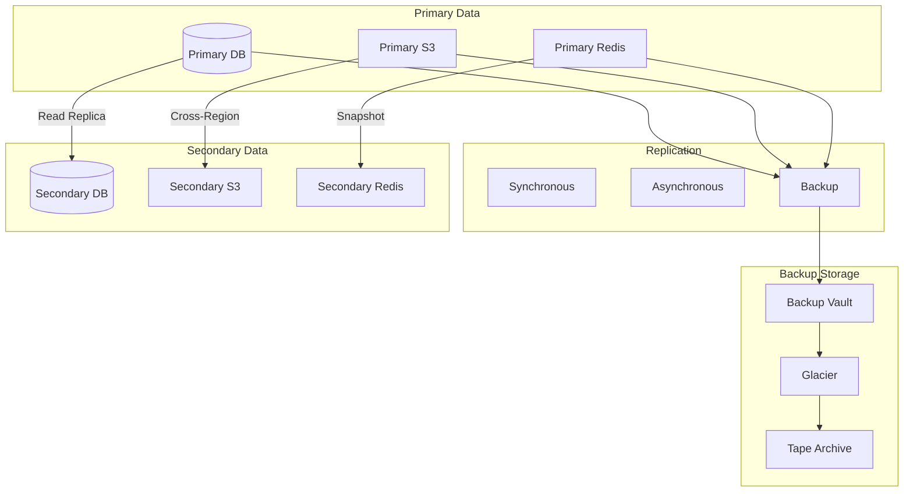

# Disaster Recovery Plan

**Version**: 1.0.0
**Date**: November 13, 2025
**Author**: Infrastructure & Security Team
**Status**: APPROVED
**Classification**: CONFIDENTIAL

## Executive Summary

This Disaster Recovery Plan (DRP) defines the strategies, procedures, and responsibilities for recovering the SDLC Orchestrator platform from disasters. Our objectives are:
- **RTO (Recovery Time Objective)**: 4 hours
- **RPO (Recovery Point Objective)**: 1 hour
- **MTTR (Mean Time To Recovery)**: < 30 minutes
- **Availability Target**: 99.9% (8.76 hours downtime/year)

## Disaster Classification

### Disaster Severity Levels
| Level | Description | RTO | RPO | Examples |
|-------|------------|-----|-----|----------|
| **P0 - Critical** | Complete system failure | 1 hour | 15 min | Data center failure, ransomware |
| **P1 - High** | Major service degradation | 4 hours | 1 hour | Database corruption, multi-AZ failure |
| **P2 - Medium** | Partial service impact | 8 hours | 2 hours | Single service failure, network issues |
| **P3 - Low** | Minor service impact | 24 hours | 4 hours | Non-critical component failure |

## Recovery Strategies

### Multi-Region Architecture
```yaml
Primary Region: us-east-1
  - Active/Active configuration
  - Full production capacity
  - Real-time replication

Secondary Region: us-west-2
  - Warm standby
  - 50% capacity (auto-scalable)
  - Async replication (< 5 min lag)

Tertiary Region: eu-west-1
  - Cold standby
  - Minimal infrastructure
  - Daily backups
```

### Data Recovery Strategy


## Backup Procedures

### Automated Backup Schedule
```yaml
Database Backups:
  frequency:
    - Full: Daily at 02:00 UTC
    - Incremental: Every 15 minutes
    - Transaction logs: Continuous
  retention:
    - Daily: 30 days
    - Weekly: 12 weeks
    - Monthly: 12 months
    - Yearly: 7 years

Application Data:
  frequency:
    - Evidence files: Real-time to S3
    - Configuration: Every change
    - Secrets: Daily to Vault
  retention:
    - Evidence: 90 days active, then archive
    - Configuration: Versioned indefinitely
    - Secrets: 30 versions

System State:
  frequency:
    - VM snapshots: Daily
    - Container images: On build
    - Infrastructure state: On change
  retention:
    - Snapshots: 7 days
    - Images: Last 10 versions
    - Terraform state: All versions
```

### Backup Verification
```typescript
// Automated Backup Verification
export class BackupVerification {
  async verifyBackups(): Promise<VerificationReport> {
    const results = await Promise.all([
      this.verifyDatabaseBackup(),
      this.verifyFileBackup(),
      this.verifyConfigBackup()
    ]);

    return {
      timestamp: new Date(),
      results,
      overallStatus: results.every(r => r.success) ? 'PASSED' : 'FAILED'
    };
  }

  private async verifyDatabaseBackup(): Promise<BackupResult> {
    // Restore to test instance
    const testDb = await this.restoreToTest('latest-backup.sql');

    // Run integrity checks
    const checks = [
      this.checkTableCount(testDb),
      this.checkRecordCount(testDb),
      this.checkDataIntegrity(testDb),
      this.checkRelationships(testDb)
    ];

    const results = await Promise.all(checks);

    // Cleanup test instance
    await this.cleanupTestInstance(testDb);

    return {
      type: 'database',
      success: results.every(r => r.passed),
      details: results
    };
  }
}
```

## Recovery Procedures

### Database Recovery
```bash
#!/bin/bash
# Database Recovery Script

# 1. Stop application services
kubectl scale deployment --all --replicas=0 -n sdlc-orchestrator

# 2. Identify recovery point
RECOVERY_TIME="${1:-$(date -d '1 hour ago' --iso-8601)}"
echo "Recovering to: $RECOVERY_TIME"

# 3. Restore from backup
pg_restore \
  --host=$DB_HOST \
  --port=5432 \
  --username=$DB_USER \
  --dbname=sdlc_orchestrator \
  --clean \
  --if-exists \
  --verbose \
  --jobs=8 \
  "s3://backups/postgres/${RECOVERY_TIME}.dump"

# 4. Apply transaction logs
pg_wal_replay \
  --start-time="$RECOVERY_TIME" \
  --target-time="$(date --iso-8601)" \
  --recovery-target-action=promote

# 5. Verify database integrity
psql -h $DB_HOST -U $DB_USER -d sdlc_orchestrator -c "
  SELECT
    schemaname,
    tablename,
    pg_size_pretty(pg_total_relation_size(schemaname||'.'||tablename)) AS size
  FROM pg_tables
  WHERE schemaname NOT IN ('pg_catalog', 'information_schema')
  ORDER BY pg_total_relation_size(schemaname||'.'||tablename) DESC;"

# 6. Update connection strings
kubectl set env deployment/api-gateway DB_HOST=$NEW_DB_HOST -n sdlc-orchestrator

# 7. Restart services
kubectl scale deployment --all --replicas=3 -n sdlc-orchestrator

# 8. Health check
./health-check.sh
```

### Application Recovery
```typescript
// Automated Application Recovery
export class ApplicationRecovery {
  async executeRecovery(disaster: DisasterEvent): Promise<RecoveryResult> {
    const plan = this.selectRecoveryPlan(disaster);

    try {
      // Phase 1: Assessment
      const assessment = await this.assessDamage(disaster);

      // Phase 2: Isolation
      await this.isolateAffectedComponents(assessment);

      // Phase 3: Recovery
      const recoverySteps = [
        this.recoverDatabase(plan),
        this.recoverApplicationServices(plan),
        this.recoverMessageQueues(plan),
        this.recoverCache(plan)
      ];

      const results = await this.executeInOrder(recoverySteps);

      // Phase 4: Validation
      await this.validateRecovery(results);

      // Phase 5: Restoration
      await this.restoreTraffic(plan);

      return {
        success: true,
        duration: Date.now() - disaster.detectedAt,
        stepsExecuted: results,
        validation: await this.runSmokeTests()
      };
    } catch (error) {
      await this.escalateToManual(error, disaster);
      throw error;
    }
  }

  private async recoverApplicationServices(plan: RecoveryPlan): Promise<void> {
    // Deploy from last known good configuration
    const config = await this.getLastGoodConfig();

    // Blue-green deployment
    await this.deployBlueEnvironment(config);
    await this.runHealthChecks('blue');
    await this.switchTraffic('blue');
    await this.terminateGreenEnvironment();
  }
}
```

## Failover Procedures

### Automated Failover
```yaml
# Failover Configuration
failover:
  triggers:
    - type: health_check_failure
      threshold: 3
      window: 60s
    - type: response_time
      threshold: 5000ms
      window: 300s
    - type: error_rate
      threshold: 10%
      window: 120s

  actions:
    database:
      - promote_read_replica
      - update_connection_strings
      - verify_replication_lag

    application:
      - scale_secondary_region
      - update_dns_records
      - drain_primary_connections

    cache:
      - failover_to_replica
      - warm_cache
      - verify_hit_rate

  validation:
    - health_check_all_services
    - verify_data_consistency
    - run_smoke_tests
    - check_monitoring_metrics
```

### Manual Failover Runbook
```markdown
## Manual Failover Procedure

### Pre-Failover Checklist
- [ ] Confirm primary region failure
- [ ] Notify stakeholders
- [ ] Verify secondary region readiness
- [ ] Check replication lag < 5 minutes
- [ ] Ensure backup team is available

### Failover Steps

1. **Update DNS (5 minutes)**
   ```bash
   aws route53 change-resource-record-sets \
     --hosted-zone-id Z123456789 \
     --change-batch file://failover-dns.json
   ```

2. **Promote Database Replica (10 minutes)**
   ```bash
   aws rds promote-read-replica \
     --db-instance-identifier sdlc-replica-west
   ```

3. **Scale Secondary Region (15 minutes)**
   ```bash
   kubectl scale deployment --all --replicas=6 \
     -n sdlc-orchestrator \
     --context=us-west-2
   ```

4. **Verify Services (10 minutes)**
   ```bash
   ./scripts/health-check-all.sh us-west-2
   ```

5. **Update Configuration (5 minutes)**
   ```bash
   kubectl set env deployment/api-gateway \
     REGION=us-west-2 \
     PRIMARY_DB=sdlc-west.rds.amazonaws.com
   ```

### Post-Failover Validation
- [ ] All services responding
- [ ] Database writes working
- [ ] No data loss confirmed
- [ ] Monitoring shows normal metrics
- [ ] User access verified
```

## Communication Plan

### Incident Communication Matrix
| Severity | Internal | External | Frequency | Channel |
|----------|----------|----------|-----------|---------|
| P0 | Immediate | 15 min | Every 30 min | Phone, Slack, Email |
| P1 | 15 min | 30 min | Every hour | Slack, Email, Status Page |
| P2 | 30 min | 1 hour | Every 2 hours | Email, Status Page |
| P3 | 1 hour | 4 hours | Daily | Status Page |

### Communication Templates
```typescript
// Automated Communication System
export class DisasterCommunication {
  async sendInitialNotification(incident: Incident): Promise<void> {
    const message = {
      subject: `[${incident.severity}] System Incident - ${incident.title}`,
      body: `
        We are currently experiencing a system incident.

        Incident Details:
        - Severity: ${incident.severity}
        - Started: ${incident.startedAt}
        - Impact: ${incident.impact}
        - Affected Services: ${incident.services.join(', ')}

        Current Status: INVESTIGATING

        We will provide updates every ${this.getUpdateFrequency(incident.severity)}.

        Status Page: https://status.sdlc-orchestrator.com
      `,
      recipients: this.getRecipients(incident.severity)
    };

    await this.sendMultiChannel(message);
  }

  async sendUpdateNotification(incident: Incident, update: Update): Promise<void> {
    const message = {
      subject: `[UPDATE] ${incident.title}`,
      body: `
        Incident Update #${update.number}

        Current Status: ${update.status}

        Progress:
        ${update.progress}

        Next Update: ${update.nextUpdate}

        ETA for Resolution: ${update.eta || 'Evaluating'}
      `,
      recipients: incident.subscribers
    };

    await this.sendMultiChannel(message);
  }

  async sendResolutionNotification(incident: Incident, resolution: Resolution): Promise<void> {
    const message = {
      subject: `[RESOLVED] ${incident.title}`,
      body: `
        The incident has been resolved.

        Resolution Summary:
        - Total Duration: ${resolution.duration}
        - Root Cause: ${resolution.rootCause}
        - Actions Taken: ${resolution.actions.join('\n- ')}
        - Data Loss: ${resolution.dataLoss || 'None'}

        Post-Incident Review: Scheduled for ${resolution.reviewDate}

        We apologize for any inconvenience caused.
      `,
      recipients: incident.allStakeholders
    };

    await this.sendMultiChannel(message);
  }
}
```

## Testing and Drills

### DR Testing Schedule
```yaml
Testing Schedule:
  Component Tests:
    - Backup restoration: Weekly
    - Failover mechanism: Monthly
    - Data replication: Daily (automated)

  Partial Tests:
    - Service failover: Monthly
    - Database failover: Quarterly
    - Regional failover: Quarterly

  Full DR Drills:
    - Tabletop exercise: Quarterly
    - Simulated failover: Semi-annually
    - Complete DR test: Annually

Test Scenarios:
  - Data center failure
  - Ransomware attack
  - Database corruption
  - Network partition
  - DDoS attack
  - Insider threat
  - Natural disaster
```

### DR Test Automation
```typescript
// Automated DR Testing
export class DRTestRunner {
  async runDRTest(scenario: DRScenario): Promise<TestResult> {
    const testEnvironment = await this.createTestEnvironment();

    try {
      // Prepare test data
      await this.seedTestData(testEnvironment);

      // Simulate disaster
      await this.simulateDisaster(scenario, testEnvironment);

      // Execute recovery
      const recoveryStart = Date.now();
      await this.executeRecoveryProcedure(scenario);
      const recoveryTime = Date.now() - recoveryStart;

      // Validate recovery
      const validation = await this.validateRecovery(testEnvironment);

      // Measure data loss
      const dataLoss = await this.measureDataLoss(testEnvironment);

      return {
        scenario: scenario.name,
        success: validation.passed,
        recoveryTime,
        dataLoss,
        meetsRTO: recoveryTime <= scenario.targetRTO,
        meetsRPO: dataLoss.minutes <= scenario.targetRPO,
        issues: validation.issues,
        recommendations: this.generateRecommendations(validation)
      };
    } finally {
      await this.cleanupTestEnvironment(testEnvironment);
    }
  }

  async runChaosTest(): Promise<ChaosTestResult> {
    const scenarios = [
      this.randomPodFailure(),
      this.networkLatency(),
      this.diskFailure(),
      this.cpuStress(),
      this.memoryLeak()
    ];

    const results = await Promise.all(
      scenarios.map(s => this.executeChaosScenario(s))
    );

    return {
      timestamp: new Date(),
      scenarios: results,
      overallResilience: this.calculateResilienceScore(results)
    };
  }
}
```

## Recovery Metrics

### Key Performance Indicators
```typescript
// DR Metrics Collection
export class DRMetrics {
  trackRecoveryMetrics(): DRMetricsReport {
    return {
      // Recovery Time Metrics
      rto: {
        target: '4 hours',
        actual: this.getActualRTO(),
        compliance: this.getRTOCompliance()
      },

      // Recovery Point Metrics
      rpo: {
        target: '1 hour',
        actual: this.getActualRPO(),
        compliance: this.getRPOCompliance()
      },

      // Backup Metrics
      backups: {
        successRate: this.getBackupSuccessRate(),
        avgDuration: this.getAvgBackupDuration(),
        avgSize: this.getAvgBackupSize(),
        restoreTests: this.getRestoreTestResults()
      },

      // Incident Metrics
      incidents: {
        mttr: this.getMTTR(),
        mttd: this.getMTTD(),
        totalIncidents: this.getIncidentCount(),
        severityBreakdown: this.getSeverityBreakdown()
      },

      // Test Metrics
      testing: {
        drillsCompleted: this.getDrillCount(),
        drillSuccessRate: this.getDrillSuccessRate(),
        lastFullTest: this.getLastFullTest(),
        nextScheduledTest: this.getNextTest()
      }
    };
  }
}
```

## Continuous Improvement

### Post-Incident Review Process
```markdown
## Post-Incident Review Template

### Incident Summary
- Incident ID:
- Date/Time:
- Duration:
- Severity:
- Services Affected:

### Timeline
- Detection:
- Response Initiated:
- Mitigation Started:
- Service Restored:
- Full Recovery:

### Root Cause Analysis
1. What happened?
2. Why did it happen?
3. How was it detected?
4. How was it resolved?

### Impact Assessment
- Users affected:
- Data loss:
- Financial impact:
- Reputation impact:

### What Went Well
-
-
-

### What Went Wrong
-
-
-

### Action Items
| Action | Owner | Due Date | Priority |
|--------|-------|----------|----------|
|        |       |          |          |

### Lessons Learned
-
-
-

### Process Improvements
-
-
-
```

## Appendices

### A. Contact Information
```yaml
Emergency Contacts:
  - CTO: +1-555-0100 (Primary)
  - VP Engineering: +1-555-0101 (Secondary)
  - DevOps Lead: +1-555-0102
  - Security Lead: +1-555-0103
  - Database Admin: +1-555-0104

Vendor Contacts:
  - AWS Support: +1-800-xxx-xxxx (Enterprise)
  - Database Vendor: +1-800-xxx-xxxx
  - Network Provider: +1-800-xxx-xxxx
  - Security Vendor: +1-800-xxx-xxxx

Escalation Path:
  1. On-call Engineer
  2. Team Lead
  3. DevOps Manager
  4. VP Engineering
  5. CTO
```

### B. Critical System Inventory
```yaml
Critical Systems:
  Databases:
    - Primary RDS: sdlc-prod.rds.amazonaws.com
    - Replica RDS: sdlc-replica.rds.amazonaws.com
    - Redis Cache: sdlc-cache.redis.amazonaws.com

  Services:
    - API Gateway: api.sdlc-orchestrator.com
    - Admin Portal: admin.sdlc-orchestrator.com
    - Status Page: status.sdlc-orchestrator.com

  Storage:
    - Evidence: s3://sdlc-evidence-prod
    - Backups: s3://sdlc-backups-prod
    - Archives: s3://sdlc-archives-prod

  Dependencies:
    - Ollama AI: https://api.nqh.vn
    - GitHub: https://api.github.com
    - Jenkins: https://jenkins.sdlc-orchestrator.com
```

## Conclusion

This Disaster Recovery Plan ensures the SDLC Orchestrator platform can recover from various disaster scenarios while meeting business continuity requirements. Regular testing and updates ensure the plan remains effective and aligned with evolving threats and business needs.

---

*Document Version: 1.0.0*
*Last Updated: November 13, 2025*
*Next Review: February 13, 2026*
*Owner: Infrastructure & Security Team*
*Classification: CONFIDENTIAL*