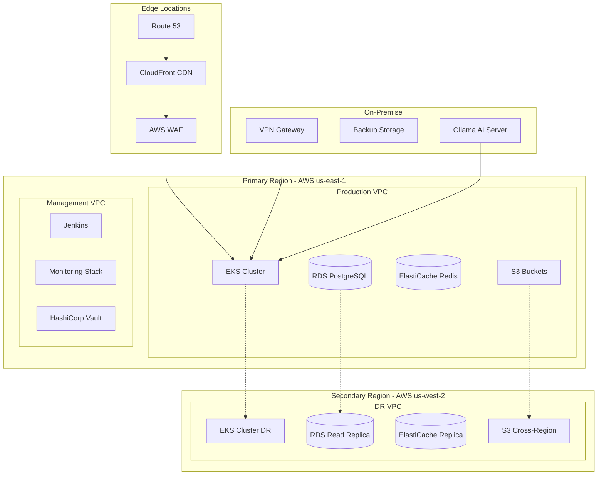

# Infrastructure Architecture Document

**Version**: 1.0.0
**Date**: November 13, 2025
**Author**: Infrastructure Architecture Team
**Status**: APPROVED
**Review Cycle**: Quarterly

## Executive Summary

This document defines the infrastructure architecture for the SDLC Orchestrator platform, covering cloud infrastructure, containerization, orchestration, networking, security, and infrastructure as code (IaC) practices. The architecture supports scalability, high availability, and disaster recovery requirements.

## Infrastructure Overview

### Multi-Cloud Architecture


## Kubernetes Architecture

### EKS Cluster Configuration
```yaml
# EKS Cluster Definition
apiVersion: eksctl.io/v1alpha5
kind: ClusterConfig

metadata:
  name: sdlc-orchestrator-prod
  region: us-east-1
  version: "1.28"

managedNodeGroups:
  - name: system-nodes
    instanceType: t3.large
    minSize: 3
    maxSize: 6
    desiredCapacity: 3
    volumeSize: 100
    volumeType: gp3
    labels:
      role: system
      environment: production
    taints:
      - key: dedicated
        value: system
        effect: NoSchedule

  - name: application-nodes
    instanceType: m5.xlarge
    minSize: 3
    maxSize: 20
    desiredCapacity: 6
    volumeSize: 200
    volumeType: gp3
    labels:
      role: application
      environment: production
    autoScaling: true

  - name: ai-nodes
    instanceType: g4dn.xlarge  # GPU instances for AI workloads
    minSize: 1
    maxSize: 5
    desiredCapacity: 2
    volumeSize: 500
    volumeType: gp3
    labels:
      role: ai-workload
      gpu: "true"
    taints:
      - key: nvidia.com/gpu
        value: "true"
        effect: NoSchedule

addons:
  - name: vpc-cni
    version: latest
  - name: coredns
    version: latest
  - name: kube-proxy
    version: latest
  - name: aws-ebs-csi-driver
    version: latest

iam:
  withOIDC: true
  serviceAccounts:
    - metadata:
        name: ebs-csi-controller
        namespace: kube-system
      wellKnownPolicies:
        ebsCSIController: true
    - metadata:
        name: cluster-autoscaler
        namespace: kube-system
      wellKnownPolicies:
        autoScaler: true
    - metadata:
        name: aws-load-balancer-controller
        namespace: kube-system
      wellKnownPolicies:
        awsLoadBalancerController: true

cloudWatch:
  clusterLogging:
    enableTypes:
      - api
      - audit
      - authenticator
      - controllerManager
      - scheduler
```

### Kubernetes Manifests

```yaml
# Namespace Configuration
apiVersion: v1
kind: Namespace
metadata:
  name: sdlc-orchestrator
  labels:
    name: sdlc-orchestrator
    environment: production

---
# Network Policy
apiVersion: networking.k8s.io/v1
kind: NetworkPolicy
metadata:
  name: sdlc-network-policy
  namespace: sdlc-orchestrator
spec:
  podSelector:
    matchLabels:
      app: sdlc-orchestrator
  policyTypes:
    - Ingress
    - Egress
  ingress:
    - from:
        - namespaceSelector:
            matchLabels:
              name: sdlc-orchestrator
        - podSelector:
            matchLabels:
              role: gateway
      ports:
        - protocol: TCP
          port: 8080
  egress:
    - to:
        - namespaceSelector:
            matchLabels:
              name: sdlc-orchestrator
    - to:
        - namespaceSelector:
            matchLabels:
              name: kube-system
      ports:
        - protocol: TCP
          port: 53  # DNS

---
# Service Mesh Configuration (Istio)
apiVersion: install.istio.io/v1alpha1
kind: IstioOperator
metadata:
  name: sdlc-istio-control-plane
spec:
  profile: production
  values:
    global:
      proxy:
        resources:
          requests:
            cpu: 100m
            memory: 128Mi
          limits:
            cpu: 2000m
            memory: 1024Mi
    pilot:
      autoscaleEnabled: true
      autoscaleMin: 2
      autoscaleMax: 5
    telemetry:
      v2:
        prometheus:
          enabled: true
        stackdriver:
          enabled: false

---
# Horizontal Pod Autoscaler
apiVersion: autoscaling/v2
kind: HorizontalPodAutoscaler
metadata:
  name: sdlc-api-hpa
  namespace: sdlc-orchestrator
spec:
  scaleTargetRef:
    apiVersion: apps/v1
    kind: Deployment
    name: sdlc-api
  minReplicas: 3
  maxReplicas: 20
  metrics:
    - type: Resource
      resource:
        name: cpu
        target:
          type: Utilization
          averageUtilization: 70
    - type: Resource
      resource:
        name: memory
        target:
          type: Utilization
          averageUtilization: 80
    - type: Pods
      pods:
        metric:
          name: http_requests_per_second
        target:
          type: AverageValue
          averageValue: "1000"
  behavior:
    scaleUp:
      stabilizationWindowSeconds: 60
      policies:
        - type: Percent
          value: 100
          periodSeconds: 60
        - type: Pods
          value: 4
          periodSeconds: 60
      selectPolicy: Max
    scaleDown:
      stabilizationWindowSeconds: 300
      policies:
        - type: Percent
          value: 50
          periodSeconds: 60
```

## Database Infrastructure

### PostgreSQL RDS Configuration
```terraform
# RDS PostgreSQL Multi-AZ Deployment
resource "aws_db_instance" "sdlc_primary" {
  identifier     = "sdlc-orchestrator-primary"
  engine         = "postgres"
  engine_version = "15.5"
  instance_class = "db.r6g.xlarge"

  allocated_storage     = 500
  max_allocated_storage = 2000
  storage_type          = "gp3"
  iops                  = 12000
  storage_encrypted     = true
  kms_key_id            = aws_kms_key.rds.arn

  database_name = "sdlc_orchestrator"
  port          = 5432

  username = "sdlc_admin"
  password = random_password.db_password.result

  vpc_security_group_ids = [aws_security_group.rds.id]
  db_subnet_group_name   = aws_db_subnet_group.private.name

  backup_retention_period = 30
  backup_window           = "03:00-04:00"
  maintenance_window      = "sun:04:00-sun:05:00"

  multi_az               = true
  publicly_accessible    = false
  deletion_protection    = true
  skip_final_snapshot    = false
  final_snapshot_identifier = "sdlc-orchestrator-final-${timestamp()}"

  performance_insights_enabled    = true
  performance_insights_retention_period = 7
  monitoring_interval            = 60
  monitoring_role_arn           = aws_iam_role.rds_monitoring.arn

  enabled_cloudwatch_logs_exports = [
    "postgresql"
  ]

  tags = {
    Name        = "sdlc-orchestrator-primary"
    Environment = "production"
    ManagedBy   = "terraform"
  }
}

# Read Replicas for Scaling
resource "aws_db_instance" "sdlc_read_replica" {
  count = 2

  identifier = "sdlc-orchestrator-replica-${count.index + 1}"

  replicate_source_db = aws_db_instance.sdlc_primary.identifier

  instance_class = "db.r6g.large"

  auto_minor_version_upgrade = false

  performance_insights_enabled = true
  monitoring_interval         = 60
  monitoring_role_arn        = aws_iam_role.rds_monitoring.arn

  tags = {
    Name        = "sdlc-orchestrator-replica-${count.index + 1}"
    Environment = "production"
    Role        = "read-replica"
  }
}

# Database Proxy for Connection Pooling
resource "aws_db_proxy" "sdlc_proxy" {
  name                   = "sdlc-orchestrator-proxy"
  engine_family         = "POSTGRESQL"
  auth {
    auth_scheme = "SECRETS"
    secret_arn  = aws_secretsmanager_secret.db_credentials.arn
  }

  role_arn               = aws_iam_role.proxy.arn
  vpc_subnet_ids         = aws_subnet.private[*].id

  max_connections_percent        = 100
  max_idle_connections_percent   = 50
  connection_borrow_timeout      = 120

  require_tls = true

  target {
    db_instance_identifier = aws_db_instance.sdlc_primary.identifier
  }

  tags = {
    Name        = "sdlc-orchestrator-proxy"
    Environment = "production"
  }
}
```

### Redis Cache Infrastructure
```terraform
# ElastiCache Redis Cluster
resource "aws_elasticache_replication_group" "sdlc_redis" {
  replication_group_id       = "sdlc-orchestrator-cache"
  replication_group_description = "Redis cluster for SDLC Orchestrator"

  engine               = "redis"
  engine_version       = "7.0"
  node_type            = "cache.r6g.large"
  port                 = 6379

  multi_az_enabled          = true
  automatic_failover_enabled = true
  num_cache_clusters        = 3

  parameter_group_name = aws_elasticache_parameter_group.redis.name
  subnet_group_name    = aws_elasticache_subnet_group.private.name
  security_group_ids   = [aws_security_group.redis.id]

  at_rest_encryption_enabled = true
  transit_encryption_enabled = true
  auth_token                 = random_password.redis_auth.result

  snapshot_retention_limit = 7
  snapshot_window          = "03:00-05:00"
  maintenance_window       = "sun:05:00-sun:07:00"

  notification_topic_arn = aws_sns_topic.cache_notifications.arn

  log_delivery_configuration {
    destination      = aws_cloudwatch_log_group.redis_slow_log.name
    destination_type = "cloudwatch-logs"
    log_format       = "json"
    log_type         = "slow-log"
  }

  tags = {
    Name        = "sdlc-orchestrator-cache"
    Environment = "production"
  }
}

# Redis Parameter Group
resource "aws_elasticache_parameter_group" "redis" {
  family = "redis7"
  name   = "sdlc-redis-params"

  parameter {
    name  = "maxmemory-policy"
    value = "allkeys-lru"
  }

  parameter {
    name  = "timeout"
    value = "300"
  }

  parameter {
    name  = "tcp-keepalive"
    value = "60"
  }

  parameter {
    name  = "tcp-backlog"
    value = "511"
  }

  parameter {
    name  = "databases"
    value = "16"
  }
}
```

## Container Registry

### ECR Configuration
```terraform
# ECR Repositories
resource "aws_ecr_repository" "sdlc_services" {
  for_each = toset([
    "api-gateway",
    "project-service",
    "gate-evaluator",
    "evidence-service",
    "ai-context-engine",
    "auth-service",
    "notification-service",
    "audit-service"
  ])

  name = "sdlc-orchestrator/${each.key}"

  image_tag_mutability = "MUTABLE"

  encryption_configuration {
    encryption_type = "KMS"
    kms_key         = aws_kms_key.ecr.arn
  }

  image_scanning_configuration {
    scan_on_push = true
  }

  lifecycle {
    prevent_destroy = true
  }

  tags = {
    Service     = each.key
    Environment = "production"
  }
}

# ECR Lifecycle Policy
resource "aws_ecr_lifecycle_policy" "cleanup" {
  for_each = aws_ecr_repository.sdlc_services

  repository = each.value.name

  policy = jsonencode({
    rules = [
      {
        rulePriority = 1
        description  = "Keep last 10 production images"
        selection = {
          tagStatus     = "tagged"
          tagPrefixList = ["v", "prod"]
          countType     = "imageCountMoreThan"
          countNumber   = 10
        }
        action = {
          type = "expire"
        }
      },
      {
        rulePriority = 2
        description  = "Remove untagged images after 7 days"
        selection = {
          tagStatus   = "untagged"
          countType   = "sinceImagePushed"
          countUnit   = "days"
          countNumber = 7
        }
        action = {
          type = "expire"
        }
      }
    ]
  })
}
```

## Storage Infrastructure

### S3 Storage Configuration
```terraform
# S3 Buckets
resource "aws_s3_bucket" "evidence_storage" {
  bucket = "sdlc-orchestrator-evidence-${data.aws_caller_identity.current.account_id}"

  tags = {
    Name        = "SDLC Evidence Storage"
    Environment = "production"
  }
}

resource "aws_s3_bucket_versioning" "evidence_versioning" {
  bucket = aws_s3_bucket.evidence_storage.id

  versioning_configuration {
    status = "Enabled"
  }
}

resource "aws_s3_bucket_encryption" "evidence_encryption" {
  bucket = aws_s3_bucket.evidence_storage.id

  rule {
    apply_server_side_encryption_by_default {
      sse_algorithm     = "aws:kms"
      kms_master_key_id = aws_kms_key.s3.arn
    }
  }
}

resource "aws_s3_bucket_lifecycle_configuration" "evidence_lifecycle" {
  bucket = aws_s3_bucket.evidence_storage.id

  rule {
    id     = "archive-old-evidence"
    status = "Enabled"

    transition {
      days          = 90
      storage_class = "STANDARD_IA"
    }

    transition {
      days          = 365
      storage_class = "GLACIER"
    }

    noncurrent_version_transition {
      noncurrent_days = 30
      storage_class   = "STANDARD_IA"
    }

    noncurrent_version_expiration {
      noncurrent_days = 90
    }
  }

  rule {
    id     = "delete-incomplete-uploads"
    status = "Enabled"

    abort_incomplete_multipart_upload {
      days_after_initiation = 7
    }
  }
}

# S3 Cross-Region Replication
resource "aws_s3_bucket_replication_configuration" "evidence_replication" {
  role   = aws_iam_role.s3_replication.arn
  bucket = aws_s3_bucket.evidence_storage.id

  rule {
    id     = "replicate-all-evidence"
    status = "Enabled"

    filter {}

    destination {
      bucket        = aws_s3_bucket.evidence_storage_dr.arn
      storage_class = "STANDARD_IA"

      encryption_configuration {
        replica_kms_key_id = aws_kms_key.s3_dr.arn
      }
    }

    delete_marker_replication {
      status = "Enabled"
    }
  }

  depends_on = [aws_s3_bucket_versioning.evidence_versioning]
}
```

## Network Infrastructure

### VPC Configuration
```terraform
# Production VPC
module "vpc" {
  source = "terraform-aws-modules/vpc/aws"
  version = "5.0.0"

  name = "sdlc-orchestrator-prod"
  cidr = "10.0.0.0/16"

  azs             = ["us-east-1a", "us-east-1b", "us-east-1c"]
  private_subnets = ["10.0.1.0/24", "10.0.2.0/24", "10.0.3.0/24"]
  public_subnets  = ["10.0.101.0/24", "10.0.102.0/24", "10.0.103.0/24"]
  database_subnets = ["10.0.201.0/24", "10.0.202.0/24", "10.0.203.0/24"]
  elasticache_subnets = ["10.0.211.0/24", "10.0.212.0/24", "10.0.213.0/24"]

  enable_nat_gateway = true
  single_nat_gateway = false
  enable_dns_hostnames = true
  enable_dns_support = true

  enable_flow_log                      = true
  create_flow_log_cloudwatch_iam_role  = true
  create_flow_log_cloudwatch_log_group = true

  public_subnet_tags = {
    "kubernetes.io/role/elb" = "1"
    "kubernetes.io/cluster/sdlc-orchestrator-prod" = "shared"
  }

  private_subnet_tags = {
    "kubernetes.io/role/internal-elb" = "1"
    "kubernetes.io/cluster/sdlc-orchestrator-prod" = "shared"
  }

  tags = {
    Environment = "production"
    ManagedBy   = "terraform"
  }
}

# VPC Endpoints for AWS Services
resource "aws_vpc_endpoint" "s3" {
  vpc_id       = module.vpc.vpc_id
  service_name = "com.amazonaws.us-east-1.s3"

  route_table_ids = module.vpc.private_route_table_ids

  tags = {
    Name = "sdlc-s3-endpoint"
  }
}

resource "aws_vpc_endpoint" "ecr_api" {
  vpc_id              = module.vpc.vpc_id
  service_name        = "com.amazonaws.us-east-1.ecr.api"
  vpc_endpoint_type   = "Interface"
  subnet_ids          = module.vpc.private_subnets
  security_group_ids  = [aws_security_group.vpc_endpoints.id]
  private_dns_enabled = true

  tags = {
    Name = "sdlc-ecr-api-endpoint"
  }
}
```

## Security Infrastructure

### AWS WAF Configuration
```terraform
# WAF Web ACL
resource "aws_wafv2_web_acl" "sdlc_waf" {
  name  = "sdlc-orchestrator-waf"
  scope = "REGIONAL"

  default_action {
    allow {}
  }

  # Rate Limiting Rule
  rule {
    name     = "RateLimitRule"
    priority = 1

    action {
      block {}
    }

    statement {
      rate_based_statement {
        limit              = 2000
        aggregate_key_type = "IP"
      }
    }

    visibility_config {
      cloudwatch_metrics_enabled = true
      metric_name                = "RateLimitRule"
      sampled_requests_enabled   = true
    }
  }

  # AWS Managed Rules - Core Rule Set
  rule {
    name     = "AWSManagedRulesCoreRuleSet"
    priority = 2

    override_action {
      none {}
    }

    statement {
      managed_rule_group_statement {
        name        = "AWSManagedRulesCommonRuleSet"
        vendor_name = "AWS"
      }
    }

    visibility_config {
      cloudwatch_metrics_enabled = true
      metric_name                = "AWSManagedRulesCoreRuleSet"
      sampled_requests_enabled   = true
    }
  }

  # SQL Injection Protection
  rule {
    name     = "SQLiProtection"
    priority = 3

    action {
      block {}
    }

    statement {
      sql_injection_match_statement {
        field_to_match {
          all_query_arguments {}
        }

        text_transformation {
          priority = 1
          type     = "URL_DECODE"
        }
        text_transformation {
          priority = 2
          type     = "HTML_ENTITY_DECODE"
        }
      }
    }

    visibility_config {
      cloudwatch_metrics_enabled = true
      metric_name                = "SQLiProtection"
      sampled_requests_enabled   = true
    }
  }

  # XSS Protection
  rule {
    name     = "XSSProtection"
    priority = 4

    action {
      block {}
    }

    statement {
      xss_match_statement {
        field_to_match {
          body {
            oversize_handling = "MATCH"
          }
        }

        text_transformation {
          priority = 1
          type     = "URL_DECODE"
        }
        text_transformation {
          priority = 2
          type     = "HTML_ENTITY_DECODE"
        }
      }
    }

    visibility_config {
      cloudwatch_metrics_enabled = true
      metric_name                = "XSSProtection"
      sampled_requests_enabled   = true
    }
  }

  visibility_config {
    cloudwatch_metrics_enabled = true
    metric_name                = "sdlc-orchestrator-waf"
    sampled_requests_enabled   = true
  }

  tags = {
    Name        = "sdlc-orchestrator-waf"
    Environment = "production"
  }
}
```

### Secrets Management
```yaml
# HashiCorp Vault Configuration
apiVersion: v1
kind: ConfigMap
metadata:
  name: vault-config
  namespace: vault
data:
  vault.hcl: |
    ui = true

    listener "tcp" {
      tls_disable = 0
      address = "[::]:8200"
      cluster_address = "[::]:8201"
      tls_cert_file = "/vault/userconfig/vault-tls/tls.crt"
      tls_key_file = "/vault/userconfig/vault-tls/tls.key"
    }

    storage "dynamodb" {
      ha_enabled = "true"
      region     = "us-east-1"
      table      = "vault-backend"
    }

    seal "awskms" {
      region     = "us-east-1"
      kms_key_id = "alias/vault-unseal"
    }

    telemetry {
      prometheus_retention_time = "30s"
      disable_hostname = true
    }

---
# Vault StatefulSet
apiVersion: apps/v1
kind: StatefulSet
metadata:
  name: vault
  namespace: vault
spec:
  serviceName: vault
  replicas: 3
  selector:
    matchLabels:
      app: vault
  template:
    metadata:
      labels:
        app: vault
    spec:
      serviceAccountName: vault
      containers:
        - name: vault
          image: hashicorp/vault:1.15.0
          ports:
            - containerPort: 8200
              name: vault
            - containerPort: 8201
              name: cluster
          env:
            - name: VAULT_ADDR
              value: "https://127.0.0.1:8200"
            - name: VAULT_API_ADDR
              value: "https://$(POD_IP):8200"
            - name: VAULT_CLUSTER_ADDR
              value: "https://$(POD_IP):8201"
          volumeMounts:
            - name: config
              mountPath: /vault/config
            - name: tls
              mountPath: /vault/userconfig/vault-tls
          resources:
            requests:
              memory: 256Mi
              cpu: 250m
            limits:
              memory: 512Mi
              cpu: 500m
          livenessProbe:
            httpGet:
              path: /v1/sys/health?standbyok=true
              port: 8200
              scheme: HTTPS
            initialDelaySeconds: 60
            periodSeconds: 10
          readinessProbe:
            httpGet:
              path: /v1/sys/health?standbyok=true
              port: 8200
              scheme: HTTPS
            initialDelaySeconds: 10
            periodSeconds: 5
      volumes:
        - name: config
          configMap:
            name: vault-config
        - name: tls
          secret:
            secretName: vault-tls
```

## Monitoring Infrastructure

### Prometheus Stack
```yaml
# Prometheus Configuration
apiVersion: v1
kind: ConfigMap
metadata:
  name: prometheus-config
  namespace: monitoring
data:
  prometheus.yml: |
    global:
      scrape_interval: 15s
      evaluation_interval: 15s

    alerting:
      alertmanagers:
        - static_configs:
            - targets:
                - alertmanager:9093

    rule_files:
      - '/etc/prometheus/alerts/*.yml'

    scrape_configs:
      - job_name: 'kubernetes-apiservers'
        kubernetes_sd_configs:
          - role: endpoints
        scheme: https
        tls_config:
          ca_file: /var/run/secrets/kubernetes.io/serviceaccount/ca.crt
        bearer_token_file: /var/run/secrets/kubernetes.io/serviceaccount/token
        relabel_configs:
          - source_labels: [__meta_kubernetes_namespace, __meta_kubernetes_service_name, __meta_kubernetes_endpoint_port_name]
            action: keep
            regex: default;kubernetes;https

      - job_name: 'kubernetes-nodes'
        kubernetes_sd_configs:
          - role: node
        scheme: https
        tls_config:
          ca_file: /var/run/secrets/kubernetes.io/serviceaccount/ca.crt
        bearer_token_file: /var/run/secrets/kubernetes.io/serviceaccount/token
        relabel_configs:
          - action: labelmap
            regex: __meta_kubernetes_node_label_(.+)

      - job_name: 'kubernetes-pods'
        kubernetes_sd_configs:
          - role: pod
        relabel_configs:
          - source_labels: [__meta_kubernetes_pod_annotation_prometheus_io_scrape]
            action: keep
            regex: true
          - source_labels: [__meta_kubernetes_pod_annotation_prometheus_io_path]
            action: replace
            target_label: __metrics_path__
            regex: (.+)

      - job_name: 'sdlc-orchestrator'
        static_configs:
          - targets:
              - 'api-gateway:9090'
              - 'project-service:9090'
              - 'gate-evaluator:9090'
              - 'evidence-service:9090'
              - 'ai-context-engine:9090'

---
# Grafana Dashboards
apiVersion: v1
kind: ConfigMap
metadata:
  name: grafana-dashboards
  namespace: monitoring
data:
  sdlc-overview.json: |
    {
      "dashboard": {
        "title": "SDLC Orchestrator Overview",
        "panels": [
          {
            "title": "Request Rate",
            "targets": [
              {
                "expr": "sum(rate(http_requests_total[5m])) by (service)"
              }
            ]
          },
          {
            "title": "Error Rate",
            "targets": [
              {
                "expr": "sum(rate(http_requests_total{status=~\"5..\"}[5m])) by (service)"
              }
            ]
          },
          {
            "title": "P95 Latency",
            "targets": [
              {
                "expr": "histogram_quantile(0.95, rate(http_request_duration_seconds_bucket[5m]))"
              }
            ]
          },
          {
            "title": "Gate Evaluations",
            "targets": [
              {
                "expr": "sum(rate(gate_evaluations_total[1h])) by (gate)"
              }
            ]
          }
        ]
      }
    }
```

## CI/CD Infrastructure

### GitOps with ArgoCD
```yaml
# ArgoCD Application
apiVersion: argoproj.io/v1alpha1
kind: Application
metadata:
  name: sdlc-orchestrator
  namespace: argocd
spec:
  project: default

  source:
    repoURL: https://github.com/sdlc-orchestrator/k8s-manifests
    targetRevision: HEAD
    path: overlays/production

  destination:
    server: https://kubernetes.default.svc
    namespace: sdlc-orchestrator

  syncPolicy:
    automated:
      prune: true
      selfHeal: true
    syncOptions:
      - CreateNamespace=true
    retry:
      limit: 5
      backoff:
        duration: 5s
        factor: 2
        maxDuration: 3m

---
# ArgoCD Repository Secret
apiVersion: v1
kind: Secret
metadata:
  name: github-repo
  namespace: argocd
  labels:
    argocd.argoproj.io/secret-type: repository
type: Opaque
stringData:
  type: git
  url: https://github.com/sdlc-orchestrator/k8s-manifests
  password: ${GITHUB_TOKEN}
  username: not-used
```

## Backup and Disaster Recovery

### Velero Backup Configuration
```yaml
# Velero Backup Schedule
apiVersion: velero.io/v1
kind: Schedule
metadata:
  name: daily-backup
  namespace: velero
spec:
  schedule: "0 2 * * *"  # Daily at 2 AM
  template:
    ttl: 720h0m0s  # 30 days retention
    includedNamespaces:
      - sdlc-orchestrator
      - vault
    includedResources:
      - persistentvolumeclaims
      - persistentvolumes
      - secrets
      - configmaps
      - deployments
      - services
      - ingresses
    excludedResources:
      - events
      - pods
      - replicasets
    storageLocation: aws-backup
    volumeSnapshotLocations:
      - aws-snapshots

---
# Disaster Recovery Plan
apiVersion: v1
kind: ConfigMap
metadata:
  name: dr-runbook
  namespace: sdlc-orchestrator
data:
  runbook.md: |
    # Disaster Recovery Runbook

    ## RTO: 4 hours
    ## RPO: 1 hour

    ### Failover Procedure
    1. Confirm primary region failure
    2. Update Route53 records to point to DR region
    3. Scale up DR EKS cluster
    4. Promote RDS read replica to primary
    5. Restore Redis from backup
    6. Verify all services are healthy
    7. Resume operations

    ### Failback Procedure
    1. Ensure primary region is recovered
    2. Sync data from DR to primary
    3. Switch traffic back to primary
    4. Verify operations
    5. Scale down DR resources
```

## Infrastructure as Code

### Terraform Module Structure
```hcl
# Main Terraform Configuration
terraform {
  required_version = ">= 1.5.0"

  required_providers {
    aws = {
      source  = "hashicorp/aws"
      version = "~> 5.0"
    }
    kubernetes = {
      source  = "hashicorp/kubernetes"
      version = "~> 2.23"
    }
    helm = {
      source  = "hashicorp/helm"
      version = "~> 2.11"
    }
  }

  backend "s3" {
    bucket         = "sdlc-terraform-state"
    key            = "production/terraform.tfstate"
    region         = "us-east-1"
    encrypt        = true
    dynamodb_table = "terraform-state-lock"
  }
}

# Module Usage
module "infrastructure" {
  source = "./modules/infrastructure"

  environment = "production"
  region      = "us-east-1"

  vpc_cidr = "10.0.0.0/16"

  eks_config = {
    cluster_version = "1.28"
    node_groups = {
      system = {
        instance_types = ["t3.large"]
        min_size       = 3
        max_size       = 6
      }
      application = {
        instance_types = ["m5.xlarge"]
        min_size       = 3
        max_size       = 20
      }
    }
  }

  rds_config = {
    engine_version = "15.5"
    instance_class = "db.r6g.xlarge"
    allocated_storage = 500
    multi_az = true
  }

  redis_config = {
    node_type = "cache.r6g.large"
    num_cache_clusters = 3
  }

  tags = {
    Project     = "SDLC-Orchestrator"
    Environment = "production"
    ManagedBy   = "terraform"
  }
}
```

## Cost Optimization

### AWS Cost Management
```yaml
# Spot Instance Configuration
apiVersion: karpenter.sh/v1alpha5
kind: Provisioner
metadata:
  name: spot-provisioner
spec:
  requirements:
    - key: karpenter.sh/capacity-type
      operator: In
      values: ["spot"]
    - key: node.kubernetes.io/instance-type
      operator: In
      values:
        - m5.large
        - m5.xlarge
        - m5a.large
        - m5a.xlarge
  limits:
    resources:
      cpu: 1000
      memory: 1000Gi
  provider:
    instanceStorePolicy: RAID0
    userData: |
      #!/bin/bash
      /etc/eks/bootstrap.sh sdlc-orchestrator-prod
  ttlSecondsAfterEmpty: 30
  consolidation:
    enabled: true

---
# Reserved Instances Planning
apiVersion: v1
kind: ConfigMap
metadata:
  name: cost-optimization
data:
  reserved_instances.yaml: |
    reserved_instances:
      rds:
        - type: db.r6g.xlarge
          term: 1_year
          payment: all_upfront
          count: 1
      elasticache:
        - type: cache.r6g.large
          term: 1_year
          payment: partial_upfront
          count: 3
      ec2:
        - type: m5.xlarge
          term: 3_year
          payment: no_upfront
          count: 6
```

## Compliance and Governance

### AWS Config Rules
```terraform
# Compliance Rules
resource "aws_config_config_rule" "encryption_at_rest" {
  name = "encryption-at-rest"

  source {
    owner             = "AWS"
    source_identifier = "ENCRYPTED_VOLUMES"
  }

  depends_on = [aws_config_configuration_recorder.main]
}

resource "aws_config_config_rule" "rds_encryption" {
  name = "rds-storage-encrypted"

  source {
    owner             = "AWS"
    source_identifier = "RDS_STORAGE_ENCRYPTED"
  }

  depends_on = [aws_config_configuration_recorder.main]
}

resource "aws_config_config_rule" "s3_bucket_encryption" {
  name = "s3-bucket-server-side-encryption-enabled"

  source {
    owner             = "AWS"
    source_identifier = "S3_BUCKET_SERVER_SIDE_ENCRYPTION_ENABLED"
  }

  depends_on = [aws_config_configuration_recorder.main]
}
```

## Conclusion

This Infrastructure Architecture provides a robust, scalable, and secure foundation for the SDLC Orchestrator platform. The architecture supports high availability, disaster recovery, and cost optimization while maintaining compliance with security standards.

---

*Document Version: 1.0.0*
*Last Updated: November 13, 2025*
*Next Review: February 13, 2026*
*Owner: Infrastructure Architecture Team*