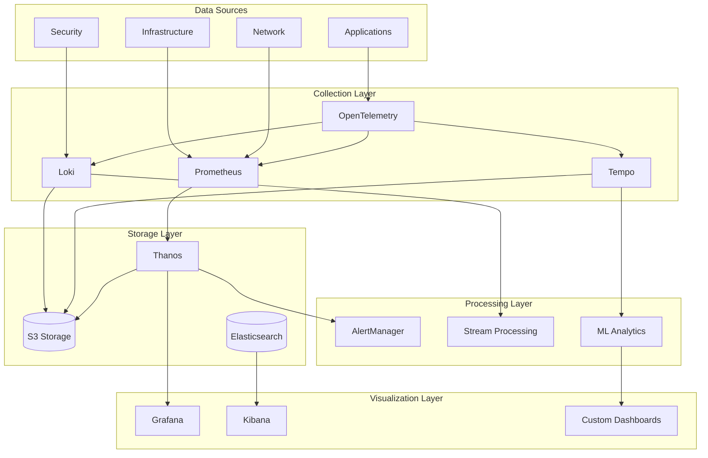

# Monitoring & Observability Architecture

**Version**: 1.0.0
**Date**: November 13, 2025
**Author**: DevOps Team
**Status**: APPROVED
**Review Cycle**: Quarterly

## Executive Summary

This document defines the monitoring and observability architecture for the SDLC Orchestrator platform, implementing the three pillars of observability: metrics, logs, and traces. Our architecture ensures 99.9% uptime SLA with <5 minute MTTD (Mean Time To Detect) and <30 minute MTTR (Mean Time To Recovery).

## Observability Stack Overview

### Architecture Components


## Metrics Architecture

### Prometheus Configuration
```yaml
# Prometheus Configuration
global:
  scrape_interval: 15s
  evaluation_interval: 15s
  external_labels:
    cluster: 'production'
    region: 'us-east-1'

# Alerting Configuration
alerting:
  alertmanagers:
    - static_configs:
        - targets:
            - alertmanager-0:9093
            - alertmanager-1:9093
            - alertmanager-2:9093

# Recording Rules
rule_files:
  - /etc/prometheus/rules/*.yml

# Service Discovery
scrape_configs:
  # Kubernetes Service Discovery
  - job_name: 'kubernetes-pods'
    kubernetes_sd_configs:
      - role: pod
    relabel_configs:
      - source_labels: [__meta_kubernetes_pod_annotation_prometheus_io_scrape]
        action: keep
        regex: true
      - source_labels: [__meta_kubernetes_pod_annotation_prometheus_io_path]
        action: replace
        target_label: __metrics_path__
        regex: (.+)
      - source_labels: [__address__, __meta_kubernetes_pod_annotation_prometheus_io_port]
        action: replace
        regex: ([^:]+)(?::\d+)?;(\d+)
        replacement: $1:$2
        target_label: __address__

  # Application Metrics
  - job_name: 'sdlc-orchestrator'
    static_configs:
      - targets:
          - 'api-gateway:9090'
          - 'project-service:9090'
          - 'gate-evaluator:9090'
          - 'evidence-service:9090'
          - 'ai-context-engine:9090'
    metrics_path: /metrics
    scrape_interval: 10s

  # Database Metrics
  - job_name: 'postgres'
    static_configs:
      - targets: ['postgres-exporter:9187']

  - job_name: 'redis'
    static_configs:
      - targets: ['redis-exporter:9121']

  # Infrastructure Metrics
  - job_name: 'node'
    static_configs:
      - targets:
          - 'node-exporter-1:9100'
          - 'node-exporter-2:9100'
          - 'node-exporter-3:9100'

# Remote Write to Thanos
remote_write:
  - url: http://thanos-receive:19291/api/v1/receive
    queue_config:
      capacity: 10000
      max_shards: 200
      min_shards: 1
      max_samples_per_send: 5000
      batch_send_deadline: 5s
      min_backoff: 30ms
      max_backoff: 100ms
```

### Custom Metrics Implementation
```typescript
// Application Metrics
import { Registry, Counter, Histogram, Gauge, Summary } from 'prom-client';

export class MetricsCollector {
  private registry: Registry;

  // Business Metrics
  private projectsCreated: Counter;
  private gateEvaluations: Counter;
  private evidenceUploads: Counter;
  private stageTransitions: Counter;

  // Performance Metrics
  private httpDuration: Histogram;
  private dbQueryDuration: Histogram;
  private aiProcessingDuration: Histogram;

  // System Metrics
  private activeConnections: Gauge;
  private queueSize: Gauge;
  private cacheHitRate: Gauge;

  constructor() {
    this.registry = new Registry();
    this.initializeMetrics();
  }

  private initializeMetrics(): void {
    // Business Metrics
    this.projectsCreated = new Counter({
      name: 'sdlc_projects_created_total',
      help: 'Total number of projects created',
      labelNames: ['template', 'team'],
      registers: [this.registry]
    });

    this.gateEvaluations = new Counter({
      name: 'sdlc_gate_evaluations_total',
      help: 'Total number of gate evaluations',
      labelNames: ['gate', 'result', 'project_stage'],
      registers: [this.registry]
    });

    this.evidenceUploads = new Counter({
      name: 'sdlc_evidence_uploads_total',
      help: 'Total number of evidence uploads',
      labelNames: ['type', 'gate', 'status'],
      registers: [this.registry]
    });

    // Performance Metrics
    this.httpDuration = new Histogram({
      name: 'http_request_duration_seconds',
      help: 'Duration of HTTP requests in seconds',
      labelNames: ['method', 'route', 'status'],
      buckets: [0.001, 0.005, 0.01, 0.05, 0.1, 0.5, 1, 5],
      registers: [this.registry]
    });

    this.dbQueryDuration = new Histogram({
      name: 'db_query_duration_seconds',
      help: 'Duration of database queries in seconds',
      labelNames: ['operation', 'table'],
      buckets: [0.001, 0.005, 0.01, 0.05, 0.1, 0.5, 1],
      registers: [this.registry]
    });

    // System Metrics
    this.activeConnections = new Gauge({
      name: 'active_connections',
      help: 'Number of active connections',
      labelNames: ['type'],
      registers: [this.registry]
    });

    this.queueSize = new Gauge({
      name: 'queue_size',
      help: 'Current queue size',
      labelNames: ['queue_name'],
      registers: [this.registry]
    });

    this.cacheHitRate = new Gauge({
      name: 'cache_hit_rate',
      help: 'Cache hit rate percentage',
      labelNames: ['cache_name'],
      registers: [this.registry]
    });
  }

  // Metric Collection Methods
  recordProjectCreation(template: string, team: string): void {
    this.projectsCreated.labels(template, team).inc();
  }

  recordGateEvaluation(gate: string, result: string, stage: string): void {
    this.gateEvaluations.labels(gate, result, stage).inc();
  }

  recordHttpRequest(method: string, route: string, status: number, duration: number): void {
    this.httpDuration.labels(method, route, status.toString()).observe(duration);
  }

  recordDbQuery(operation: string, table: string, duration: number): void {
    this.dbQueryDuration.labels(operation, table).observe(duration);
  }

  updateActiveConnections(type: string, count: number): void {
    this.activeConnections.labels(type).set(count);
  }

  updateQueueSize(queueName: string, size: number): void {
    this.queueSize.labels(queueName).set(size);
  }

  updateCacheHitRate(cacheName: string, rate: number): void {
    this.cacheHitRate.labels(cacheName).set(rate);
  }

  getMetrics(): string {
    return this.registry.metrics();
  }
}
```

## Logging Architecture

### Loki Configuration
```yaml
# Loki Configuration
auth_enabled: false

server:
  http_listen_port: 3100
  grpc_listen_port: 9096

common:
  path_prefix: /tmp/loki
  storage:
    filesystem:
      chunks_directory: /tmp/loki/chunks
      rules_directory: /tmp/loki/rules
  replication_factor: 1
  ring:
    instance_addr: 127.0.0.1
    kvstore:
      store: inmemory

schema_config:
  configs:
    - from: 2023-01-01
      store: boltdb-shipper
      object_store: s3
      schema: v11
      index:
        prefix: index_
        period: 24h

storage_config:
  aws:
    s3: s3://us-east-1/loki-logs
    region: us-east-1
  boltdb_shipper:
    active_index_directory: /tmp/loki/boltdb-shipper-active
    cache_location: /tmp/loki/boltdb-shipper-cache
    cache_ttl: 24h

limits_config:
  enforce_metric_name: false
  reject_old_samples: true
  reject_old_samples_max_age: 168h
  ingestion_rate_mb: 50
  ingestion_burst_size_mb: 100

chunk_store_config:
  max_look_back_period: 0s

table_manager:
  retention_deletes_enabled: true
  retention_period: 720h

ruler:
  storage:
    type: local
    local:
      directory: /tmp/loki/rules
  rule_path: /tmp/loki/rules-temp
  alertmanager_url: http://alertmanager:9093
  ring:
    kvstore:
      store: inmemory
  enable_api: true
```

### Structured Logging Implementation
```typescript
// Structured Logging with Winston
import winston from 'winston';
import { ElasticsearchTransport } from 'winston-elasticsearch';

export class Logger {
  private logger: winston.Logger;

  constructor(serviceName: string) {
    this.logger = winston.createLogger({
      level: process.env.LOG_LEVEL || 'info',
      format: winston.format.combine(
        winston.format.timestamp(),
        winston.format.errors({ stack: true }),
        winston.format.json()
      ),
      defaultMeta: {
        service: serviceName,
        environment: process.env.NODE_ENV,
        version: process.env.APP_VERSION,
        hostname: process.env.HOSTNAME
      },
      transports: [
        // Console Transport
        new winston.transports.Console({
          format: winston.format.combine(
            winston.format.colorize(),
            winston.format.simple()
          )
        }),

        // Loki Transport
        new LokiTransport({
          host: process.env.LOKI_URL || 'http://loki:3100',
          labels: {
            service: serviceName,
            environment: process.env.NODE_ENV
          },
          json: true,
          format: winston.format.json(),
          replaceTimestamp: true,
          onConnectionError: (err) => console.error('Loki connection error:', err)
        }),

        // Elasticsearch Transport for Analytics
        new ElasticsearchTransport({
          level: 'info',
          clientOpts: {
            node: process.env.ELASTICSEARCH_URL || 'http://elasticsearch:9200'
          },
          index: `logs-${serviceName}`,
          dataStream: true
        })
      ]
    });

    this.setupContextPropagation();
  }

  // Logging Methods with Context
  info(message: string, meta?: any): void {
    this.logger.info(message, this.enrichMetadata(meta));
  }

  error(message: string, error: Error, meta?: any): void {
    this.logger.error(message, {
      ...this.enrichMetadata(meta),
      error: {
        message: error.message,
        stack: error.stack,
        name: error.name
      }
    });
  }

  warn(message: string, meta?: any): void {
    this.logger.warn(message, this.enrichMetadata(meta));
  }

  debug(message: string, meta?: any): void {
    this.logger.debug(message, this.enrichMetadata(meta));
  }

  // Audit Logging
  audit(action: string, details: AuditDetails): void {
    this.logger.info('AUDIT', {
      type: 'audit',
      action,
      userId: details.userId,
      resourceType: details.resourceType,
      resourceId: details.resourceId,
      changes: details.changes,
      ip: details.ip,
      userAgent: details.userAgent,
      timestamp: new Date().toISOString()
    });
  }

  // Performance Logging
  performance(operation: string, duration: number, meta?: any): void {
    this.logger.info('PERFORMANCE', {
      type: 'performance',
      operation,
      duration,
      ...this.enrichMetadata(meta)
    });
  }

  private enrichMetadata(meta?: any): any {
    return {
      ...meta,
      correlationId: this.getCorrelationId(),
      traceId: this.getTraceId(),
      spanId: this.getSpanId(),
      timestamp: new Date().toISOString()
    };
  }

  private setupContextPropagation(): void {
    // Set up async local storage for request context
    const als = new AsyncLocalStorage();
    this.contextStorage = als;
  }
}
```

## Distributed Tracing

### OpenTelemetry Configuration
```typescript
// OpenTelemetry Setup
import { NodeSDK } from '@opentelemetry/sdk-node';
import { getNodeAutoInstrumentations } from '@opentelemetry/auto-instrumentations-node';
import { PeriodicExportingMetricReader } from '@opentelemetry/sdk-metrics';
import { Resource } from '@opentelemetry/resources';
import { SemanticResourceAttributes } from '@opentelemetry/semantic-conventions';
import { JaegerExporter } from '@opentelemetry/exporter-jaeger';
import { PrometheusExporter } from '@opentelemetry/exporter-prometheus';

export class TracingSetup {
  private sdk: NodeSDK;

  initialize(): void {
    const resource = Resource.default().merge(
      new Resource({
        [SemanticResourceAttributes.SERVICE_NAME]: 'sdlc-orchestrator',
        [SemanticResourceAttributes.SERVICE_VERSION]: process.env.APP_VERSION || '1.0.0',
        [SemanticResourceAttributes.DEPLOYMENT_ENVIRONMENT]: process.env.NODE_ENV || 'development'
      })
    );

    // Jaeger Exporter for Traces
    const jaegerExporter = new JaegerExporter({
      endpoint: process.env.JAEGER_ENDPOINT || 'http://jaeger:14268/api/traces'
    });

    // Prometheus Exporter for Metrics
    const prometheusExporter = new PrometheusExporter({
      port: 9464,
      endpoint: '/metrics'
    });

    // Initialize SDK
    this.sdk = new NodeSDK({
      resource,
      traceExporter: jaegerExporter,
      metricReader: new PeriodicExportingMetricReader({
        exporter: prometheusExporter,
        exportIntervalMillis: 10000
      }),
      instrumentations: [
        getNodeAutoInstrumentations({
          '@opentelemetry/instrumentation-fs': {
            enabled: false
          },
          '@opentelemetry/instrumentation-http': {
            requestHook: (span, request) => {
              span.setAttributes({
                'http.request.body': JSON.stringify(request.body),
                'http.request.user_id': request.user?.id
              });
            }
          },
          '@opentelemetry/instrumentation-express': {
            requestHook: (span, req) => {
              span.setAttributes({
                'express.route': req.route?.path,
                'express.params': JSON.stringify(req.params)
              });
            }
          }
        })
      ]
    });

    // Start SDK
    this.sdk.start();

    // Graceful shutdown
    process.on('SIGTERM', () => {
      this.sdk.shutdown()
        .then(() => console.log('Tracing terminated'))
        .catch((error) => console.log('Error terminating tracing', error))
        .finally(() => process.exit(0));
    });
  }
}

// Custom Span Creation
export class TraceManager {
  private tracer: Tracer;

  constructor() {
    this.tracer = trace.getTracer('sdlc-orchestrator');
  }

  async traceOperation<T>(
    operationName: string,
    fn: () => Promise<T>,
    attributes?: Record<string, any>
  ): Promise<T> {
    return this.tracer.startActiveSpan(operationName, async (span) => {
      try {
        // Set attributes
        if (attributes) {
          span.setAttributes(attributes);
        }

        // Execute operation
        const result = await fn();

        // Set success status
        span.setStatus({ code: SpanStatusCode.OK });

        return result;
      } catch (error) {
        // Record error
        span.recordException(error as Error);
        span.setStatus({
          code: SpanStatusCode.ERROR,
          message: (error as Error).message
        });
        throw error;
      } finally {
        span.end();
      }
    });
  }

  createChildSpan(name: string, parentSpan: Span): Span {
    const ctx = trace.setSpan(context.active(), parentSpan);
    return this.tracer.startSpan(name, undefined, ctx);
  }
}
```

## Alerting System

### AlertManager Configuration
```yaml
# AlertManager Configuration
global:
  resolve_timeout: 5m
  smtp_smarthost: 'smtp.gmail.com:587'
  smtp_from: 'alerts@sdlc-orchestrator.com'
  smtp_auth_username: 'alerts@sdlc-orchestrator.com'
  smtp_auth_password: '${SMTP_PASSWORD}'

route:
  group_by: ['alertname', 'cluster', 'service']
  group_wait: 10s
  group_interval: 5m
  repeat_interval: 12h
  receiver: 'default'

  routes:
    # Critical Alerts
    - match:
        severity: critical
      receiver: 'critical-receiver'
      continue: true
      group_wait: 0s

    # High Priority Alerts
    - match:
        severity: high
      receiver: 'high-priority-receiver'
      group_interval: 1m

    # Security Alerts
    - match_re:
        alertname: ^(Security|Intrusion|Breach).*
      receiver: 'security-receiver'
      group_wait: 0s

    # Business Alerts
    - match:
        category: business
      receiver: 'business-receiver'
      group_interval: 15m

receivers:
  - name: 'default'
    email_configs:
      - to: 'devops@sdlc-orchestrator.com'
        headers:
          Subject: '[SDLC] {{ .GroupLabels.alertname }} - {{ .GroupLabels.severity }}'

  - name: 'critical-receiver'
    pagerduty_configs:
      - service_key: '${PAGERDUTY_SERVICE_KEY}'
        severity: 'critical'
    slack_configs:
      - api_url: '${SLACK_WEBHOOK_CRITICAL}'
        channel: '#critical-alerts'
        title: '🚨 CRITICAL: {{ .GroupLabels.alertname }}'
        text: '{{ range .Alerts }}{{ .Annotations.description }}{{ end }}'

  - name: 'high-priority-receiver'
    slack_configs:
      - api_url: '${SLACK_WEBHOOK_HIGH}'
        channel: '#alerts'
        title: '⚠️ HIGH: {{ .GroupLabels.alertname }}'

  - name: 'security-receiver'
    email_configs:
      - to: 'security@sdlc-orchestrator.com'
        require_tls: true
    webhook_configs:
      - url: 'https://siem.sdlc-orchestrator.com/webhook'

  - name: 'business-receiver'
    email_configs:
      - to: 'business-ops@sdlc-orchestrator.com'

inhibit_rules:
  - source_match:
      severity: 'critical'
    target_match:
      severity: 'warning'
    equal: ['alertname', 'cluster', 'service']
```

### Alert Rules
```yaml
# Prometheus Alert Rules
groups:
  - name: application-alerts
    interval: 30s
    rules:
      # High Error Rate
      - alert: HighErrorRate
        expr: rate(http_requests_total{status=~"5.."}[5m]) > 0.05
        for: 2m
        labels:
          severity: high
          category: application
        annotations:
          summary: "High error rate on {{ $labels.service }}"
          description: "Error rate is {{ $value | humanizePercentage }} on {{ $labels.service }}"

      # Gate Evaluation Failures
      - alert: GateEvaluationFailureRate
        expr: rate(sdlc_gate_evaluations_total{result="failed"}[15m]) > 0.3
        for: 5m
        labels:
          severity: high
          category: business
        annotations:
          summary: "High gate failure rate for {{ $labels.gate }}"
          description: "{{ $labels.gate }} has {{ $value | humanizePercentage }} failure rate"

      # API Latency
      - alert: HighAPILatency
        expr: histogram_quantile(0.95, rate(http_request_duration_seconds_bucket[5m])) > 1
        for: 5m
        labels:
          severity: high
          category: performance
        annotations:
          summary: "High API latency on {{ $labels.route }}"
          description: "P95 latency is {{ $value }}s for {{ $labels.route }}"

  - name: infrastructure-alerts
    interval: 30s
    rules:
      # CPU Usage
      - alert: HighCPUUsage
        expr: (1 - avg(rate(node_cpu_seconds_total{mode="idle"}[5m])) by (instance)) > 0.8
        for: 10m
        labels:
          severity: high
          category: infrastructure
        annotations:
          summary: "High CPU usage on {{ $labels.instance }}"
          description: "CPU usage is {{ $value | humanizePercentage }}"

      # Memory Usage
      - alert: HighMemoryUsage
        expr: (1 - (node_memory_MemAvailable_bytes / node_memory_MemTotal_bytes)) > 0.9
        for: 5m
        labels:
          severity: high
          category: infrastructure
        annotations:
          summary: "High memory usage on {{ $labels.instance }}"
          description: "Memory usage is {{ $value | humanizePercentage }}"

      # Disk Space
      - alert: LowDiskSpace
        expr: (node_filesystem_avail_bytes{mountpoint="/"} / node_filesystem_size_bytes{mountpoint="/"}) < 0.1
        for: 5m
        labels:
          severity: critical
          category: infrastructure
        annotations:
          summary: "Low disk space on {{ $labels.instance }}"
          description: "Only {{ $value | humanizePercentage }} disk space remaining"

  - name: security-alerts
    interval: 30s
    rules:
      # Failed Authentication Attempts
      - alert: HighFailedAuthRate
        expr: rate(authentication_failures_total[5m]) > 10
        for: 2m
        labels:
          severity: critical
          category: security
        annotations:
          summary: "High authentication failure rate"
          description: "{{ $value }} failed authentication attempts per second"

      # Rate Limiting
      - alert: RateLimitExceeded
        expr: rate(rate_limit_exceeded_total[5m]) > 100
        for: 1m
        labels:
          severity: high
          category: security
        annotations:
          summary: "Rate limit exceeded for {{ $labels.endpoint }}"
          description: "{{ $value }} rate limit violations per second"
```

## Dashboards

### Grafana Dashboard Configuration
```json
{
  "dashboard": {
    "title": "SDLC Orchestrator - Main Dashboard",
    "panels": [
      {
        "title": "System Overview",
        "gridPos": { "h": 8, "w": 12, "x": 0, "y": 0 },
        "type": "stat",
        "targets": [
          {
            "expr": "up{job=\"sdlc-orchestrator\"}",
            "legendFormat": "Services Up"
          }
        ]
      },
      {
        "title": "Request Rate",
        "gridPos": { "h": 8, "w": 12, "x": 12, "y": 0 },
        "type": "graph",
        "targets": [
          {
            "expr": "sum(rate(http_requests_total[5m])) by (service)",
            "legendFormat": "{{ service }}"
          }
        ]
      },
      {
        "title": "Error Rate",
        "gridPos": { "h": 8, "w": 12, "x": 0, "y": 8 },
        "type": "graph",
        "targets": [
          {
            "expr": "sum(rate(http_requests_total{status=~\"5..\"}[5m])) by (service)",
            "legendFormat": "{{ service }}"
          }
        ]
      },
      {
        "title": "P95 Latency",
        "gridPos": { "h": 8, "w": 12, "x": 12, "y": 8 },
        "type": "graph",
        "targets": [
          {
            "expr": "histogram_quantile(0.95, sum(rate(http_request_duration_seconds_bucket[5m])) by (le, service))",
            "legendFormat": "{{ service }}"
          }
        ]
      },
      {
        "title": "Gate Evaluations",
        "gridPos": { "h": 8, "w": 24, "x": 0, "y": 16 },
        "type": "bargauge",
        "targets": [
          {
            "expr": "sum(rate(sdlc_gate_evaluations_total[1h])) by (gate, result)",
            "legendFormat": "{{ gate }} - {{ result }}"
          }
        ]
      }
    ]
  }
}
```

## SLI/SLO Monitoring

### SLI Definition and Tracking
```typescript
// SLI/SLO Implementation
export class SLITracker {
  private sliMetrics: Map<string, SLIMetric>;

  constructor() {
    this.initializeSLIs();
  }

  private initializeSLIs(): void {
    this.sliMetrics = new Map([
      ['availability', new SLIMetric({
        name: 'availability',
        target: 99.9,
        query: '(1 - sum(rate(http_requests_total{status=~"5.."}[5m])) / sum(rate(http_requests_total[5m]))) * 100',
        window: '30d'
      })],

      ['latency', new SLIMetric({
        name: 'latency',
        target: 95,
        query: 'histogram_quantile(0.95, rate(http_request_duration_seconds_bucket[5m])) < 0.1',
        window: '30d'
      })],

      ['gate_success_rate', new SLIMetric({
        name: 'gate_success_rate',
        target: 90,
        query: 'sum(rate(sdlc_gate_evaluations_total{result="passed"}[1h])) / sum(rate(sdlc_gate_evaluations_total[1h])) * 100',
        window: '7d'
      })],

      ['evidence_processing', new SLIMetric({
        name: 'evidence_processing',
        target: 99,
        query: 'sum(rate(evidence_processing_success_total[5m])) / sum(rate(evidence_processing_total[5m])) * 100',
        window: '30d'
      })]
    ]);
  }

  async calculateErrorBudget(sliName: string): Promise<ErrorBudget> {
    const sli = this.sliMetrics.get(sliName);
    if (!sli) throw new Error(`SLI ${sliName} not found`);

    const currentValue = await this.queryMetric(sli.query);
    const errorBudget = 100 - sli.target;
    const consumedBudget = Math.max(0, sli.target - currentValue);
    const remainingBudget = errorBudget - consumedBudget;

    return {
      sli: sliName,
      target: sli.target,
      current: currentValue,
      errorBudget,
      consumed: consumedBudget,
      remaining: remainingBudget,
      burnRate: consumedBudget / errorBudget
    };
  }

  generateSLOReport(): SLOReport {
    const reports = Array.from(this.sliMetrics.keys()).map(sli =>
      this.calculateErrorBudget(sli)
    );

    return {
      period: '30d',
      slos: reports,
      overallHealth: this.calculateOverallHealth(reports),
      recommendations: this.generateRecommendations(reports),
      generatedAt: new Date()
    };
  }
}
```

## Incident Management

### Incident Response Automation
```typescript
// Incident Response System
export class IncidentManager {
  private pagerDuty: PagerDutyClient;
  private slack: SlackClient;
  private jira: JiraClient;

  async handleAlert(alert: Alert): Promise<Incident> {
    // Create incident
    const incident = await this.createIncident(alert);

    // Notify responders
    await this.notifyResponders(incident);

    // Create runbook
    await this.attachRunbook(incident);

    // Start recording
    await this.startIncidentRecording(incident);

    // Create war room
    await this.createWarRoom(incident);

    return incident;
  }

  private async createIncident(alert: Alert): Promise<Incident> {
    const severity = this.calculateSeverity(alert);

    const incident = {
      id: generateId(),
      title: alert.labels.alertname,
      description: alert.annotations.description,
      severity,
      status: 'OPEN',
      startedAt: new Date(),
      affectedServices: this.identifyAffectedServices(alert),
      responders: this.selectResponders(severity),
      timeline: [],
      metrics: {
        detectionTime: this.calculateDetectionTime(alert),
        responseTime: null,
        resolutionTime: null
      }
    };

    // Create PagerDuty incident
    if (severity === 'CRITICAL' || severity === 'HIGH') {
      const pdIncident = await this.pagerDuty.createIncident({
        title: incident.title,
        urgency: severity === 'CRITICAL' ? 'high' : 'low',
        service: alert.labels.service,
        details: alert
      });

      incident.externalId = pdIncident.id;
    }

    // Create JIRA ticket
    const jiraIssue = await this.jira.createIssue({
      project: 'INCIDENT',
      issueType: 'Incident',
      summary: incident.title,
      description: this.formatIncidentDescription(incident),
      priority: this.mapSeverityToPriority(severity),
      labels: ['incident', alert.labels.service]
    });

    incident.jiraKey = jiraIssue.key;

    return incident;
  }

  private async createWarRoom(incident: Incident): Promise<void> {
    // Create Slack channel
    const channel = await this.slack.createChannel({
      name: `incident-${incident.id.slice(0, 8)}`,
      topic: incident.title,
      purpose: `War room for incident: ${incident.title}`
    });

    // Invite responders
    await this.slack.inviteUsers(channel.id, incident.responders);

    // Post initial summary
    await this.slack.postMessage(channel.id, {
      text: 'Incident Summary',
      attachments: [{
        color: this.getSeverityColor(incident.severity),
        fields: [
          { title: 'Severity', value: incident.severity, short: true },
          { title: 'Started', value: incident.startedAt.toISOString(), short: true },
          { title: 'Services', value: incident.affectedServices.join(', '), short: false },
          { title: 'Description', value: incident.description, short: false }
        ],
        actions: [
          {
            type: 'button',
            text: 'View Runbook',
            url: `https://runbook.sdlc-orchestrator.com/incidents/${incident.id}`
          },
          {
            type: 'button',
            text: 'View Metrics',
            url: `https://grafana.sdlc-orchestrator.com/d/incident/${incident.id}`
          }
        ]
      }]
    });
  }
}
```

## Conclusion

This Monitoring & Observability Architecture provides comprehensive visibility into the SDLC Orchestrator platform through metrics, logs, and traces. The architecture ensures rapid incident detection and response while maintaining high system reliability and performance.

---

*Document Version: 1.0.0*
*Last Updated: November 13, 2025*
*Next Review: February 13, 2026*
*Owner: DevOps Team*