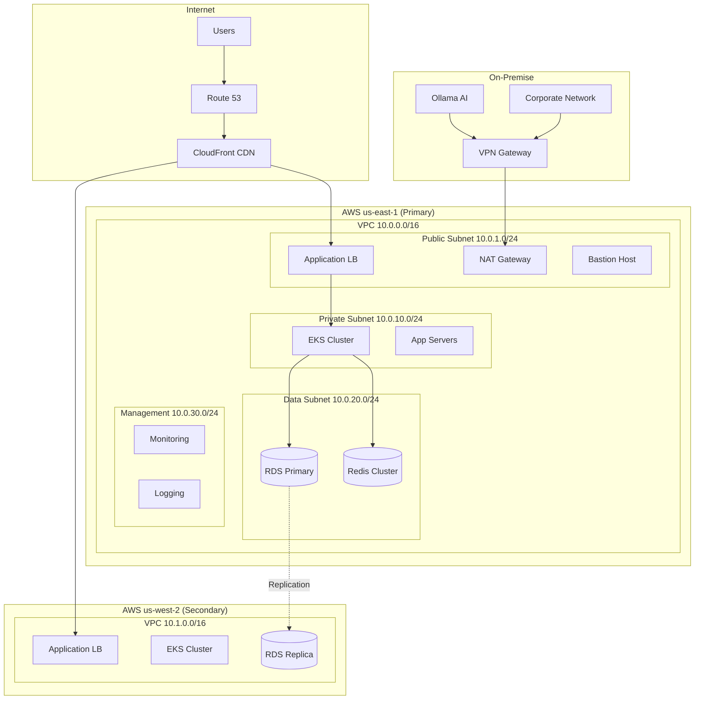

# Network Architecture Document

**Version**: 1.0.0
**Date**: November 13, 2025
**Author**: Network Architecture Team
**Status**: APPROVED
**Review Cycle**: Quarterly

## Executive Summary

This document defines the network architecture for the SDLC Orchestrator platform, covering network topology, segmentation, security zones, load balancing, and connectivity patterns. Our architecture ensures secure, scalable, and highly available network infrastructure.

## Network Topology Overview

### Multi-Region Network Design


## VPC Architecture

### VPC Design Specification
```yaml
# Primary VPC Configuration
primary_vpc:
  region: us-east-1
  cidr: 10.0.0.0/16
  availability_zones:
    - us-east-1a
    - us-east-1b
    - us-east-1c

  subnets:
    public:
      - cidr: 10.0.1.0/24
        az: us-east-1a
        name: public-1a
      - cidr: 10.0.2.0/24
        az: us-east-1b
        name: public-1b
      - cidr: 10.0.3.0/24
        az: us-east-1c
        name: public-1c

    private:
      - cidr: 10.0.10.0/24
        az: us-east-1a
        name: private-1a
      - cidr: 10.0.11.0/24
        az: us-east-1b
        name: private-1b
      - cidr: 10.0.12.0/24
        az: us-east-1c
        name: private-1c

    data:
      - cidr: 10.0.20.0/24
        az: us-east-1a
        name: data-1a
      - cidr: 10.0.21.0/24
        az: us-east-1b
        name: data-1b
      - cidr: 10.0.22.0/24
        az: us-east-1c
        name: data-1c

    management:
      - cidr: 10.0.30.0/24
        az: us-east-1a
        name: mgmt-1a

  route_tables:
    public:
      routes:
        - destination: 0.0.0.0/0
          target: igw-12345678

    private:
      routes:
        - destination: 0.0.0.0/0
          target: nat-gateway-1a
        - destination: 10.1.0.0/16
          target: vpc-peering-connection

    data:
      routes:
        - destination: 10.0.0.0/16
          target: local

# Secondary VPC Configuration
secondary_vpc:
  region: us-west-2
  cidr: 10.1.0.0/16
  # Similar structure...
```

### Network Segmentation
```typescript
// Network Segmentation Rules
export const NetworkSegmentation = {
  zones: {
    dmz: {
      cidr: '10.0.1.0/24',
      description: 'Public facing services',
      allowed_services: ['ALB', 'WAF', 'CloudFront'],
      ingress_rules: [
        { protocol: 'tcp', port: 443, source: '0.0.0.0/0' },
        { protocol: 'tcp', port: 80, source: '0.0.0.0/0' }
      ]
    },

    application: {
      cidr: '10.0.10.0/24',
      description: 'Application tier',
      allowed_services: ['EKS', 'EC2', 'Lambda'],
      ingress_rules: [
        { protocol: 'tcp', port: 8080, source: '10.0.1.0/24' },
        { protocol: 'tcp', port: 9090, source: '10.0.30.0/24' } // Monitoring
      ]
    },

    data: {
      cidr: '10.0.20.0/24',
      description: 'Database tier',
      allowed_services: ['RDS', 'ElastiCache', 'DynamoDB'],
      ingress_rules: [
        { protocol: 'tcp', port: 5432, source: '10.0.10.0/24' }, // PostgreSQL
        { protocol: 'tcp', port: 6379, source: '10.0.10.0/24' }  // Redis
      ]
    },

    management: {
      cidr: '10.0.30.0/24',
      description: 'Management and monitoring',
      allowed_services: ['Bastion', 'Monitoring', 'Logging'],
      ingress_rules: [
        { protocol: 'tcp', port: 22, source: 'CORPORATE_IP/32' },
        { protocol: 'tcp', port: 3000, source: '10.0.0.0/16' }  // Grafana
      ]
    }
  }
};
```

## Security Groups

### Security Group Configuration
```yaml
# Application Load Balancer Security Group
alb_security_group:
  name: sdlc-alb-sg
  description: Security group for Application Load Balancer
  ingress_rules:
    - protocol: tcp
      from_port: 443
      to_port: 443
      cidr_blocks:
        - 0.0.0.0/0
      description: HTTPS from Internet

    - protocol: tcp
      from_port: 80
      to_port: 80
      cidr_blocks:
        - 0.0.0.0/0
      description: HTTP from Internet (redirect to HTTPS)

  egress_rules:
    - protocol: tcp
      from_port: 8080
      to_port: 8080
      security_groups:
        - ref: eks_security_group
      description: To EKS nodes

# EKS Node Security Group
eks_security_group:
  name: sdlc-eks-node-sg
  description: Security group for EKS worker nodes
  ingress_rules:
    - protocol: tcp
      from_port: 8080
      to_port: 8080
      security_groups:
        - ref: alb_security_group
      description: From ALB

    - protocol: tcp
      from_port: 443
      to_port: 443
      security_groups:
        - ref: eks_control_plane_sg
      description: From EKS control plane

    - protocol: all
      from_port: 0
      to_port: 65535
      self: true
      description: Node to node communication

  egress_rules:
    - protocol: all
      from_port: 0
      to_port: 65535
      cidr_blocks:
        - 0.0.0.0/0
      description: All outbound traffic

# Database Security Group
database_security_group:
  name: sdlc-database-sg
  description: Security group for RDS instances
  ingress_rules:
    - protocol: tcp
      from_port: 5432
      to_port: 5432
      security_groups:
        - ref: eks_security_group
      description: PostgreSQL from EKS

    - protocol: tcp
      from_port: 5432
      to_port: 5432
      security_groups:
        - ref: bastion_security_group
      description: PostgreSQL from Bastion (admin)

# Redis Security Group
redis_security_group:
  name: sdlc-redis-sg
  description: Security group for ElastiCache Redis
  ingress_rules:
    - protocol: tcp
      from_port: 6379
      to_port: 6379
      security_groups:
        - ref: eks_security_group
      description: Redis from EKS
```

## Load Balancing

### Application Load Balancer Configuration
```typescript
// ALB Configuration
export const ALBConfiguration = {
  name: 'sdlc-orchestrator-alb',
  scheme: 'internet-facing',
  type: 'application',

  listeners: [
    {
      port: 443,
      protocol: 'HTTPS',
      certificates: [{
        arn: 'arn:aws:acm:us-east-1:xxx:certificate/xxx'
      }],
      defaultActions: [{
        type: 'forward',
        targetGroupArn: 'primary-target-group'
      }],
      rules: [
        {
          priority: 1,
          conditions: [{ field: 'host-header', values: ['api.sdlc-orchestrator.com'] }],
          actions: [{ type: 'forward', targetGroupArn: 'api-target-group' }]
        },
        {
          priority: 2,
          conditions: [{ field: 'path-pattern', values: ['/health'] }],
          actions: [{ type: 'fixed-response', statusCode: 200, content: 'OK' }]
        },
        {
          priority: 3,
          conditions: [{ field: 'source-ip', values: ['10.0.0.0/8'] }],
          actions: [{ type: 'forward', targetGroupArn: 'internal-target-group' }]
        }
      ]
    },
    {
      port: 80,
      protocol: 'HTTP',
      defaultActions: [{
        type: 'redirect',
        redirect: {
          protocol: 'HTTPS',
          port: '443',
          statusCode: 'HTTP_301'
        }
      }]
    }
  ],

  targetGroups: [
    {
      name: 'primary-target-group',
      port: 8080,
      protocol: 'HTTP',
      targetType: 'ip',
      healthCheck: {
        enabled: true,
        path: '/health',
        protocol: 'HTTP',
        healthyThreshold: 2,
        unhealthyThreshold: 3,
        timeout: 5,
        interval: 30,
        matcher: { httpCode: '200' }
      },
      stickiness: {
        enabled: true,
        type: 'lb_cookie',
        duration: 86400
      }
    }
  ]
};
```

### Network Load Balancer for Internal Services
```yaml
# NLB Configuration for Internal Services
nlb_configuration:
  name: sdlc-internal-nlb
  scheme: internal
  type: network

  listeners:
    - port: 5432
      protocol: TCP
      target_group: postgres-targets

    - port: 6379
      protocol: TCP
      target_group: redis-targets

    - port: 9090
      protocol: TCP
      target_group: metrics-targets

  target_groups:
    - name: postgres-targets
      port: 5432
      protocol: TCP
      targets:
        - id: i-1234567890abcdef0
          port: 5432
        - id: i-0987654321fedcba0
          port: 5432
      health_check:
        protocol: TCP
        port: 5432
        interval: 30
        healthy_threshold: 3
        unhealthy_threshold: 3

    - name: redis-targets
      port: 6379
      protocol: TCP
      targets:
        - type: ip
          id: 10.0.20.10
        - type: ip
          id: 10.0.21.10
```

## CDN Configuration

### CloudFront Distribution
```yaml
cloudfront_distribution:
  enabled: true
  is_ipv6_enabled: true
  http_version: http2and3
  price_class: PriceClass_All

  origins:
    - id: alb-origin
      domain_name: alb.sdlc-orchestrator.com
      custom_origin_config:
        http_port: 80
        https_port: 443
        origin_protocol_policy: https-only
        origin_ssl_protocols: [TLSv1.2]

    - id: s3-static
      domain_name: static.sdlc-orchestrator.s3.amazonaws.com
      s3_origin_config:
        origin_access_identity: E127EXAMPLE51Z

  default_cache_behavior:
    target_origin_id: alb-origin
    viewer_protocol_policy: redirect-to-https
    allowed_methods: [GET, HEAD, OPTIONS, PUT, POST, PATCH, DELETE]
    cached_methods: [GET, HEAD, OPTIONS]
    compress: true
    cache_policy_id: 658327ea-f89d-4fab-a63d-7e88639e58f6  # Managed-CachingOptimized
    origin_request_policy_id: 88a5eaf4-2fd4-4709-b370-b4c650ea3fcf  # Managed-CORS-S3Origin

  cache_behaviors:
    - path_pattern: "/api/*"
      target_origin_id: alb-origin
      viewer_protocol_policy: https-only
      cache_policy_id: 4135ea2d-6df8-44a3-9df3-4b5a84be39ad  # Managed-CachingDisabled
      origin_request_policy_id: b689b0a8-53d0-40ab-baf2-68738e2966ac  # Managed-AllViewer

    - path_pattern: "/static/*"
      target_origin_id: s3-static
      viewer_protocol_policy: https-only
      cache_policy_id: 658327ea-f89d-4fab-a63d-7e88639e58f6  # Managed-CachingOptimized
      compress: true

  custom_error_responses:
    - error_code: 404
      response_code: 404
      response_page_path: "/404.html"
      error_caching_min_ttl: 300

    - error_code: 503
      response_code: 503
      response_page_path: "/maintenance.html"
      error_caching_min_ttl: 0

  web_acl_id: arn:aws:wafv2:us-east-1:xxx:global/webacl/sdlc-waf
```

## VPN and Direct Connect

### Site-to-Site VPN Configuration
```yaml
vpn_connection:
  name: sdlc-on-premise-vpn
  type: ipsec.1

  customer_gateway:
    ip_address: 203.0.113.12  # Corporate public IP
    bgp_asn: 65000
    type: ipsec.1

  virtual_private_gateway:
    name: sdlc-vgw
    amazon_side_asn: 64512

  vpn_tunnels:
    - tunnel_1:
        pre_shared_key: ${VPN_PSK_1}
        inside_cidr: 169.254.100.0/30
        dpd_timeout_action: clear
        ike_versions: [ikev2]
        phase1_encryption: [AES256]
        phase1_integrity: [SHA256]
        phase1_dh_groups: [14]
        phase2_encryption: [AES256]
        phase2_integrity: [SHA256]
        phase2_dh_groups: [14]

    - tunnel_2:
        pre_shared_key: ${VPN_PSK_2}
        inside_cidr: 169.254.100.4/30
        # Similar configuration...

  routes:
    - destination: 192.168.0.0/16  # Corporate network
      target: vgw-12345678
```

### AWS Direct Connect (Future)
```yaml
direct_connect:
  connection:
    name: sdlc-dx-connection
    bandwidth: 1Gbps
    location: Equinix DC3

  virtual_interfaces:
    - name: sdlc-production-vif
      vlan: 100
      asn: 65000
      customer_address: 192.168.1.1/30
      amazon_address: 192.168.1.2/30
      bgp_auth_key: ${BGP_AUTH_KEY}
```

## Service Mesh

### Istio Service Mesh Configuration
```yaml
# Istio Configuration
apiVersion: install.istio.io/v1alpha1
kind: IstioOperator
metadata:
  name: sdlc-istio
spec:
  profile: production

  meshConfig:
    defaultConfig:
      proxyStatsMatcher:
        inclusionRegexps:
          - ".*outlier_detection.*"
          - ".*osconfig.*"
          - ".*circuit_breaker.*"
    accessLogFile: /dev/stdout

  values:
    global:
      proxy:
        resources:
          requests:
            cpu: 100m
            memory: 128Mi
          limits:
            cpu: 2000m
            memory: 1024Mi

    pilot:
      autoscaleEnabled: true
      autoscaleMin: 2
      autoscaleMax: 5

    telemetry:
      v2:
        prometheus:
          enabled: true
          configOverride:
            inboundSidecar:
              disable_host_header_fallback: true

---
# Virtual Service Configuration
apiVersion: networking.istio.io/v1beta1
kind: VirtualService
metadata:
  name: sdlc-api
spec:
  hosts:
    - api.sdlc-orchestrator.com
  gateways:
    - sdlc-gateway
  http:
    - match:
        - uri:
            prefix: /v1
      route:
        - destination:
            host: api-service
            port:
              number: 8080
          weight: 100
      timeout: 30s
      retries:
        attempts: 3
        perTryTimeout: 10s
        retryOn: 5xx,reset,connect-failure,refused-stream

---
# Circuit Breaker Configuration
apiVersion: networking.istio.io/v1beta1
kind: DestinationRule
metadata:
  name: api-circuit-breaker
spec:
  host: api-service
  trafficPolicy:
    connectionPool:
      tcp:
        maxConnections: 100
      http:
        http1MaxPendingRequests: 100
        http2MaxRequests: 1000
        maxRequestsPerConnection: 2
    outlierDetection:
      consecutiveErrors: 5
      interval: 30s
      baseEjectionTime: 30s
      maxEjectionPercent: 50
      minHealthPercent: 30
```

## DNS Configuration

### Route 53 Configuration
```yaml
route53_configuration:
  hosted_zones:
    - name: sdlc-orchestrator.com
      type: public
      records:
        - name: sdlc-orchestrator.com
          type: A
          alias:
            hosted_zone_id: Z2FDTNDATAQYW2  # CloudFront
            dns_name: d123456abcdef8.cloudfront.net

        - name: api.sdlc-orchestrator.com
          type: A
          alias:
            hosted_zone_id: Z35SXDOTRQ7X7K  # ALB
            dns_name: sdlc-alb-123456.us-east-1.elb.amazonaws.com

        - name: admin.sdlc-orchestrator.com
          type: CNAME
          ttl: 300
          records:
            - sdlc-orchestrator.com

    - name: sdlc-internal.local
      type: private
      vpc_associations:
        - vpc_id: vpc-12345678
          vpc_region: us-east-1
      records:
        - name: db.sdlc-internal.local
          type: A
          ttl: 60
          records:
            - 10.0.20.10
            - 10.0.21.10

  health_checks:
    - name: api-health
      type: HTTPS
      resource_path: /health
      fqdn: api.sdlc-orchestrator.com
      port: 443
      request_interval: 30
      failure_threshold: 3

  traffic_policies:
    - name: geo-routing
      type: A
      endpoints:
        - type: value
          value: 1.2.3.4
          weight: 70
          geo_location:
            continent_code: NA

        - type: value
          value: 5.6.7.8
          weight: 30
          geo_location:
            continent_code: EU
```

## Network Monitoring

### Network Flow Logs
```yaml
flow_logs_configuration:
  vpc_flow_logs:
    - name: sdlc-vpc-flow-logs
      resource_type: VPC
      resource_id: vpc-12345678
      traffic_type: ALL
      destination_type: s3
      destination: s3://sdlc-flow-logs/vpc/
      log_format: ${srcaddr} ${dstaddr} ${srcport} ${dstport} ${protocol} ${packets} ${bytes} ${action}

  additional_fields:
    - vpc-id
    - subnet-id
    - instance-id
    - interface-id
    - az-id
    - pkt-src-aws-service
    - pkt-dst-aws-service
    - flow-direction
    - traffic-path
```

### Network Performance Monitoring
```typescript
// Network Metrics Collection
export class NetworkMonitoring {
  private metrics: NetworkMetrics;

  async collectNetworkMetrics(): Promise<NetworkMetricsReport> {
    return {
      latency: await this.measureLatency(),
      throughput: await this.measureThroughput(),
      packetLoss: await this.measurePacketLoss(),
      jitter: await this.measureJitter(),
      connectivity: await this.testConnectivity()
    };
  }

  private async measureLatency(): Promise<LatencyMetrics> {
    const measurements = await Promise.all([
      this.pingEndpoint('api.sdlc-orchestrator.com'),
      this.pingEndpoint('db.sdlc-internal.local'),
      this.pingEndpoint('cache.sdlc-internal.local')
    ]);

    return {
      api: measurements[0],
      database: measurements[1],
      cache: measurements[2],
      crossRegion: await this.measureCrossRegionLatency()
    };
  }

  private async measureThroughput(): Promise<ThroughputMetrics> {
    return {
      ingress: await this.getIngressBandwidth(),
      egress: await this.getEgressBandwidth(),
      interZone: await this.getInterZoneThroughput(),
      vpn: await this.getVPNThroughput()
    };
  }

  async detectNetworkAnomalies(): Promise<NetworkAnomaly[]> {
    const anomalies: NetworkAnomaly[] = [];

    // Check for unusual traffic patterns
    const trafficPattern = await this.analyzeTrafficPattern();
    if (trafficPattern.deviation > 3) {
      anomalies.push({
        type: 'TRAFFIC_SPIKE',
        severity: 'HIGH',
        description: `Traffic ${trafficPattern.deviation}x normal`,
        recommendation: 'Investigate for DDoS or traffic surge'
      });
    }

    // Check for port scans
    const portScanActivity = await this.detectPortScans();
    if (portScanActivity.detected) {
      anomalies.push({
        type: 'PORT_SCAN',
        severity: 'CRITICAL',
        description: `Port scan detected from ${portScanActivity.source}`,
        recommendation: 'Block source IP and investigate'
      });
    }

    return anomalies;
  }
}
```

## Network Security

### Network ACLs
```yaml
network_acls:
  public_nacl:
    name: public-nacl
    rules:
      inbound:
        - rule_number: 100
          protocol: tcp
          rule_action: allow
          cidr_block: 0.0.0.0/0
          from_port: 443
          to_port: 443

        - rule_number: 110
          protocol: tcp
          rule_action: allow
          cidr_block: 0.0.0.0/0
          from_port: 80
          to_port: 80

        - rule_number: 120
          protocol: tcp
          rule_action: allow
          cidr_block: 10.0.0.0/16
          from_port: 1024
          to_port: 65535

      outbound:
        - rule_number: 100
          protocol: all
          rule_action: allow
          cidr_block: 0.0.0.0/0

  private_nacl:
    name: private-nacl
    rules:
      inbound:
        - rule_number: 100
          protocol: tcp
          rule_action: allow
          cidr_block: 10.0.0.0/16
          from_port: 0
          to_port: 65535

      outbound:
        - rule_number: 100
          protocol: all
          rule_action: allow
          cidr_block: 0.0.0.0/0

  data_nacl:
    name: data-nacl
    rules:
      inbound:
        - rule_number: 100
          protocol: tcp
          rule_action: allow
          cidr_block: 10.0.10.0/24
          from_port: 5432
          to_port: 5432

        - rule_number: 110
          protocol: tcp
          rule_action: allow
          cidr_block: 10.0.10.0/24
          from_port: 6379
          to_port: 6379

      outbound:
        - rule_number: 100
          protocol: tcp
          rule_action: allow
          cidr_block: 10.0.10.0/24
          from_port: 1024
          to_port: 65535
```

## Conclusion

This Network Architecture provides a secure, scalable, and highly available network infrastructure for the SDLC Orchestrator platform. The architecture ensures proper segmentation, traffic management, and connectivity while maintaining security best practices.

---

*Document Version: 1.0.0*
*Last Updated: November 13, 2025*
*Next Review: February 13, 2026*
*Owner: Network Architecture Team*