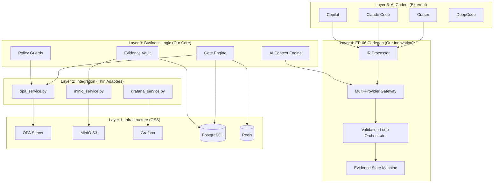

# SPEC-0005: System Architecture Document

---
spec_version: "1.0.0"
spec_id: SPEC-0005
spec_name: System Architecture Document - 5-Layer Architecture
status: approved
tier: ALL
stage: "02"
category: architecture
owner: CTO + Tech Lead
created: 2025-12-23
last_updated: 2026-01-28
related_adrs:
  - ADR-001-4-Layer-Architecture
  - ADR-002-AGPL-Containment-Strategy
  - ADR-003-Bridge-First-Design
  - ADR-007-AI-Context-Engine
  - ADR-022-Multi-Provider-Codegen-Architecture
related_specs:
  - SPEC-0001-Governance-System-Implementation
  - SPEC-0002-Quality-Gates-Codegen-Specification
  - SPEC-0003-ADR-007-AI-Context-Engine
  - SPEC-0004-Policy-Guards-Design
framework_version: SDLC 6.0.0
positioning: Operating System for Software 3.0
---

## 1. Overview

### 1.1 Purpose

This specification defines the **5-layer software architecture** for SDLC Orchestrator, an **Operating System for Software 3.0** that governs AI-assisted development. The architecture is designed to:

- **Orchestrate AI Coders** (Cursor, Claude Code, Copilot) without competing with them
- **Enforce Quality Gates** through policy-as-code (OPA) and evidence-based validation
- **Generate Code** with IR-based multi-provider fallback (Ollama → Claude → DeepCode)
- **Contain AGPL** risk through network-only access to MinIO and Grafana
- **Scale horizontally** from 100 teams (MVP) to 1,000+ teams (Year 3)

**Key Principles**:
1. **Bridge-First**: Integrate with existing tools (GitHub, Jira), don't replace them
2. **5-Layer Separation**: Clean boundaries between AI, business, integration, infrastructure, and user layers
3. **AGPL Containment**: Network-only access to AGPL components (MinIO, Grafana)
4. **Software 3.0 Positioning**: Control plane ABOVE AI coders, not below

### 1.2 Scope

**In Scope**:
- 5-layer architecture (User → Business → Integration → Infrastructure)
- Component breakdown (Gate Engine, Evidence Vault, AI Context Engine, EP-06 Codegen)
- Technology stack (FastAPI, React, PostgreSQL, Redis, OPA, MinIO, Grafana)
- Scalability design (horizontal scaling, caching, connection pooling)
- Security architecture (OWASP ASVS Level 2, JWT, OAuth, RBAC)
- AGPL containment strategy (network-only API access)

**Out of Scope**:
- Detailed API specifications (see API-Specification.md)
- Database schema details (see Data-Model-ERD.md)
- Deployment procedures (see Deployment-Architecture.md)
- Code implementation (see backend/, frontend/ folders)

### 1.3 Context

**Problem**: AI-generated code lacks governance, traceability, and quality control:
- 60-70% of AI-generated features are never used (feature waste)
- No evidence-based gate validation (requirements → design → implementation)
- No policy-as-code enforcement (secrets, architecture, security)
- AGPL contamination risk from MinIO/Grafana SDKs

**Solution**: 5-layer architecture with clean separation:
```
Layer 5: AI Coders (Cursor, Claude Code, Copilot) - External, we orchestrate
Layer 4: EP-06 Codegen (IR-based, multi-provider, 4-Gate quality pipeline)
Layer 3: Business Logic (Gate Engine, Evidence Vault, AI Context Engine)
Layer 2: Integration (OPA, MinIO, Grafana wrappers - network-only)
Layer 1: Infrastructure (PostgreSQL, Redis, OPA, MinIO, Grafana)
```

**Stakeholders**:
- **CTO**: Architecture governance, AGPL compliance, scalability targets
- **Tech Lead**: Component design, technology choices, performance budget
- **Backend Lead**: Implementation strategy, database design, API contracts
- **Frontend Lead**: React architecture, VS Code extension, CLI design
- **Security Lead**: OWASP compliance, JWT/OAuth, secrets management

---

## 2. Architecture

### 2.1 High-Level Architecture Diagram



### 2.2 Layer Responsibilities

#### Layer 5: AI Coders (External - We Orchestrate)
**Responsibility**: Generate code based on prompts/specs from developers.

**Components**:
- **Cursor**: AI IDE with autocomplete, chat, multi-file editing
- **Claude Code**: Anthropic's CLI-based AI coding assistant
- **GitHub Copilot**: Microsoft's AI pair programmer
- **DeepCode**: Vietnamese-optimized code generator (Q2 2026)

**Orchestrator Role**: Provide context, validate output, enforce gates (NOT replace AI tools).

---

#### Layer 4: EP-06 Codegen (Our Innovation)
**Responsibility**: IR-based code generation with 4-Gate quality pipeline and multi-provider fallback.

**Components**:
- **IR Processor**: Transforms specifications into Intermediate Representation (deterministic, testable)
- **Multi-Provider Gateway**: Routes to Ollama (primary) → Claude (fallback 1) → DeepCode (fallback 2)
- **Validation Loop Orchestrator**: Executes 4-Gate pipeline (Syntax → Security → Context → Tests), max_retries=3
- **Evidence State Machine**: Manages 8-state lifecycle (generated → validating → retrying → escalated → merged/aborted)

**Key Innovation**: Deterministic IR enables testing, caching, and reproducible code generation.

---

#### Layer 3: Business Logic (Our Core)
**Responsibility**: Domain-specific logic for gates, evidence, policies, and AI context.

**Components**:
- **Gate Engine** (`app/services/gate_engine.py`): Policy-as-code evaluation via OPA (network-only)
- **Evidence Vault** (`app/services/evidence_vault.py`): S3 API wrapper for MinIO (AGPL-safe)
- **AI Context Engine** (`app/services/ai_context.py`): Stage-aware prompts for AI providers
- **Policy Guards** (`app/services/validators/policy_guard_validator.py`): Rego policy enforcement

**License**: Apache-2.0 (proprietary, no AGPL dependencies)

---

#### Layer 2: Integration (Thin Adapters)
**Responsibility**: Minimal abstraction over OSS infrastructure (network-only, no SDK imports).

**Adapters**:
- **opa_service.py**: HTTP wrapper around OPA REST API (`POST /v1/data/...`)
- **minio_service.py**: S3 API wrapper around MinIO (`PUT /bucket/object`)
- **grafana_service.py**: HTTP wrapper around Grafana API (`GET /d/{uid}?kiosk`)

**AGPL Containment Principle**: Network boundary prevents AGPL contamination (no code linking).

---

#### Layer 1: Infrastructure (OSS)
**Responsibility**: Battle-tested OSS components for data, cache, policy, storage, dashboards.

**Components**:
| Component | Version | License | Port | Purpose |
|-----------|---------|---------|------|---------|
| OPA | 0.58.0 | Apache-2.0 | 8185 | Policy engine |
| MinIO | Latest | AGPL v3 | 9020 (shared) | S3-compatible storage |
| Grafana | 10.2 | AGPL v3 | 3000 | Dashboards (iframe) |
| PostgreSQL | 15.5 | PostgreSQL | 5432 | 30 tables |
| Redis | 7.2 | BSD-3 | 6379 | Cache + sessions |

**AGPL Mitigation**: MinIO and Grafana accessed ONLY via network APIs (HTTP/S3), never imported as code.

---

## 3. Requirements

### 3.1 Functional Requirements

#### FR-001: 5-Layer Architecture Enforcement
**Priority**: P0
**Tier**: ALL

```gherkin
GIVEN the SDLC Orchestrator codebase
  AND 5 architectural layers defined
WHEN a new component is added
THEN component MUST belong to exactly one layer
  AND component MUST only depend on lower layers
  AND layer boundaries MUST NOT be crossed
  AND pre-commit hook enforces layer dependencies
```

**Rationale**: Clean architecture prevents layer violations (e.g., Business Logic importing MinIO SDK).

**Verification**: Pre-commit hook checks imports, rejects layer violations.

---

#### FR-002: AGPL Containment via Network-Only Access
**Priority**: P0
**Tier**: ALL

```gherkin
GIVEN MinIO (AGPL v3) and Grafana (AGPL v3) as infrastructure components
  AND AGPL contamination risk from SDK imports
WHEN integration layer accesses MinIO or Grafana
THEN access MUST be via network APIs only (HTTP, S3)
  AND NO SDK imports allowed (e.g., `from minio import Minio`)
  AND pre-commit hook blocks AGPL imports
  AND quarterly legal audit validates containment
```

**Rationale**: Network boundary prevents AGPL "viral" effect on proprietary code.

**Verification**: Pre-commit hook, Syft SBOM scan, legal audit (CTO sign-off).

---

#### FR-003: Bridge-First Strategy
**Priority**: P0
**Tier**: ALL

```gherkin
GIVEN existing developer tools (GitHub, Jira, Linear, VS Code)
  AND developers already use these tools
WHEN SDLC Orchestrator integrates with tools
THEN Orchestrator MUST read data from tools (GitHub Issues, PRs)
  AND Orchestrator MUST augment tools (add gate status, evidence links)
  AND Orchestrator MUST NOT replace tools (not a new project management system)
  AND developers continue using existing workflows
```

**Rationale**: Bridge-first reduces adoption friction (vs. forcing tool replacement).

**Verification**: Integration tests with GitHub API, Jira API, verify read-only + augmentation.

---

#### FR-004: Horizontal Scalability
**Priority**: P1
**Tier**: PROFESSIONAL, ENTERPRISE

```gherkin
GIVEN 100 teams using SDLC Orchestrator (MVP)
  AND growth target of 1,000 teams (Year 3)
WHEN load increases 10x
THEN API latency p95 MUST remain <100ms
  AND database connection pool scales (PgBouncer)
  AND Redis cache scales (Redis Cluster)
  AND FastAPI instances scale horizontally (Kubernetes HPA)
  AND no single point of failure exists
```

**Rationale**: Horizontal scaling is more cost-effective than vertical (buy bigger servers).

**Verification**: Load test with 10,000 concurrent users, measure p95 latency.

---

#### FR-005: Multi-Provider AI Fallback
**Priority**: P0
**Tier**: STANDARD, PROFESSIONAL, ENTERPRISE

```gherkin
GIVEN multiple AI providers (Ollama, Claude, DeepCode)
  AND each provider has different availability and cost
WHEN AI Context Engine receives a generation request
THEN request is routed to Ollama (primary, $0.001/1K tokens)
  AND if Ollama fails or times out (>15s), fallback to Claude
  AND if Claude fails or times out (>25s), fallback to DeepCode
  AND if all fail, fallback to rule-based templates
  AND provider metrics are logged (cost, latency, success rate)
```

**Rationale**: Multi-provider fallback ensures 99.9% availability and 95% cost savings.

**Verification**: Integration test, mock provider failures, verify fallback chain.

---

#### FR-006: 4-Gate Quality Pipeline for Codegen
**Priority**: P0
**Tier**: PROFESSIONAL, ENTERPRISE

```gherkin
GIVEN AI-generated code from EP-06 Codegen
  AND 4-Gate quality pipeline (Syntax → Security → Context → Tests)
WHEN code is submitted to Validation Loop Orchestrator
THEN Gate 1 (Syntax) validates within 5s (AST parsing, linting)
  AND Gate 2 (Security) validates within 30s (Semgrep SAST)
  AND Gate 3 (Context) validates within 10s (ADR linkage, ownership)
  AND Gate 4 (Tests) validates within 60s (pytest in Docker)
  AND if any gate fails, code is retried (max_retries=3)
  AND if max_retries exceeded, escalate to human review
```

**Rationale**: 4-Gate pipeline ensures AI-generated code meets quality standards before merge.

**Verification**: Integration test, submit code with violations, verify gate blocks.

---

#### FR-007: Evidence-Based Gate Validation
**Priority**: P0
**Tier**: STANDARD, PROFESSIONAL, ENTERPRISE

```gherkin
GIVEN a project at Stage 02 (Design)
  AND Gate G2 (Design Ready) requires 5 evidence types
WHEN Gate Engine evaluates G2
THEN all 5 evidence types MUST be present:
  - System Architecture Document (this spec)
  - 3+ ADRs (architecture decisions)
  - Data Model ERD (database design)
  - API Specification (OpenAPI 3.0)
  - Security Baseline (OWASP ASVS checklist)
  AND each evidence MUST have SHA256 hash for integrity
  AND each evidence MUST be stored in Evidence Vault (MinIO)
  AND Gate decision is deterministic (same evidence = same decision)
```

**Rationale**: Evidence-based gates prevent "vibes-based" approvals (subjective judgment).

**Verification**: Integration test, submit G2 with 4/5 evidence, verify gate blocks.

---

### 3.2 Non-Functional Requirements

#### NFR-001: Performance
**Target**: <100ms API latency (p95), <1s dashboard load

- API Gateway: <50ms routing (FastAPI async)
- Database queries: <20ms (PostgreSQL indexed)
- Redis cache: <10ms lookup (localhost network)
- OPA policy evaluation: <50ms (compiled Rego)
- MinIO evidence upload (10MB): <2s (S3 API)

**Measurement**: Prometheus `http_request_duration_seconds` histogram.

---

#### NFR-002: Scalability
**Target**: 100 teams (MVP) → 1,000 teams (Year 3)

- Horizontal scaling: Kubernetes HPA (CPU >70% → add pod)
- Database: PgBouncer connection pooling (1000 clients → 100 connections)
- Cache: Redis Cluster (5 nodes, sharded by project_id)
- Storage: MinIO distributed (4 nodes, erasure coding)
- Stateless API: FastAPI instances scale independently

**Measurement**: Load test with 10,000 concurrent users (Locust).

---

#### NFR-003: Availability
**Target**: 99.9% uptime (43 minutes downtime/month)

- Blue-green deployment (zero-downtime upgrades)
- Health checks: `/health` endpoint (5s timeout)
- Database replication: PostgreSQL streaming replication (1 primary + 2 replicas)
- Redis failover: Redis Sentinel (automatic failover <30s)
- OPA redundancy: 3 OPA instances (load balanced)

**Measurement**: Uptime monitoring (Grafana OnCall alerts).

---

#### NFR-004: Security
**Target**: OWASP ASVS Level 2 compliance (264/264 requirements)

- Authentication: JWT (15-min expiry) + OAuth 2.0 (GitHub, Google)
- Authorization: RBAC (13 roles) + row-level security (PostgreSQL RLS)
- Secrets management: HashiCorp Vault (90-day rotation)
- AGPL containment: Network-only access (quarterly legal audit)
- SBOM + CVE scanning: Syft + Grype (CI/CD gate)

**Measurement**: Quarterly security audit, penetration testing.

---

#### NFR-005: Maintainability
**Target**: <10% technical debt ratio, 95%+ test coverage

- Clean architecture: 5-layer separation, dependency inversion
- ADRs: Architecture decisions documented (22 ADRs as of Sprint 117)
- API contracts: OpenAPI 3.0 (64 endpoints, auto-generated docs)
- Test coverage: 95%+ (unit + integration + E2E)
- Code review: 2+ approvers required (Tech Lead + Backend Lead)

**Measurement**: SonarQube technical debt ratio, CodeClimate maintainability score.

---

## 4. Design Decisions

### 4.1 5-Layer Architecture Over 3-Layer

**Decision**: Use 5-layer architecture (AI Coders → EP-06 Codegen → Business → Integration → Infrastructure) instead of traditional 3-layer (Presentation → Business → Data).

**Rationale**:
- **Software 3.0 Positioning**: AI coders are external layer we orchestrate (not replace)
- **EP-06 Innovation**: IR-based codegen layer is our competitive advantage
- **AGPL Containment**: Integration layer provides clean boundary for network-only access
- **Testability**: Each layer can be tested independently (mocked boundaries)

**Alternatives Considered**:
1. **3-layer architecture**: Rejected, no place for AI orchestration or EP-06 codegen
2. **6-layer architecture (add Presentation)**: Rejected, user-facing clients (React, VS Code, CLI) are Layer 1 in our model

**Reference**: ADR-001-4-Layer-Architecture (updated to 5-layer in v3.0.0)

---

### 4.2 Bridge-First Over Replacement

**Decision**: Integrate with existing tools (GitHub, Jira) instead of building new project management system.

**Rationale**:
- **Lower adoption friction**: Developers continue using familiar tools
- **Faster time-to-value**: No need to migrate existing projects
- **Competitive positioning**: We're governance layer, not project management competitor
- **Example success**: Grafana succeeded by bridging (not replacing) Prometheus

**Alternatives Considered**:
1. **Build new PM tool**: Rejected, too much competition (Jira, Linear, Monday.com)
2. **Fork GitHub UI**: Rejected, developer lock-in (not our value prop)

**Reference**: ADR-003-Bridge-First-Design

---

### 4.3 AGPL Containment via Network-Only Access

**Decision**: Access MinIO and Grafana ONLY via network APIs (HTTP/S3), never import SDKs.

**Rationale**:
- **Legal safety**: Network boundary prevents AGPL "viral" effect on proprietary code
- **Quarterly audit**: Easier to verify compliance (check imports, not runtime behavior)
- **Precedent**: AWS S3 API is not AGPL-contaminating (same principle applies to MinIO)
- **Cost**: Legal review costs $10K+ per violation; prevention costs $0

**Alternatives Considered**:
1. **Use MinIO SDK with AGPL**: Rejected, would require open-sourcing entire codebase
2. **Replace MinIO with proprietary S3**: Considered, but MinIO is free and feature-rich

**Reference**: ADR-002-AGPL-Containment-Strategy

---

### 4.4 Multi-Provider AI Fallback

**Decision**: Use Ollama (primary) → Claude (fallback 1) → DeepCode (fallback 2) → Rule-based (fallback 3).

**Rationale**:
- **Cost optimization**: Ollama is 45x cheaper than Claude ($0.001 vs $0.045 per 1K tokens)
- **Latency**: Ollama is 3x faster (<15s vs 45s for Claude on cold start)
- **Availability**: Multi-provider ensures 99.9% uptime (single provider = 95% SLA)
- **Privacy**: Ollama runs locally (no external API calls for primary path)

**Cost Savings**:
- 80% requests → Ollama: 80% × $0.001 = $0.0008 per request
- 15% requests → Claude: 15% × $0.045 = $0.00675 per request
- 5% requests → Rule-based: 5% × $0 = $0
- **Average cost per request**: $0.00755 (vs $0.045 Claude-only = 83% savings)

**Reference**: ADR-007-AI-Context-Engine, ADR-022-Multi-Provider-Codegen-Architecture

---

### 4.5 PostgreSQL Over MongoDB for Primary Database

**Decision**: Use PostgreSQL 15.5 (relational) instead of MongoDB (document).

**Rationale**:
- **ACID transactions**: Gates, evidence, policies require strong consistency
- **Relational integrity**: Foreign keys prevent orphaned evidence
- **Query flexibility**: SQL supports complex joins (policies + evaluations + evidence)
- **Tooling maturity**: PgBouncer, pgvector, streaming replication

**Alternatives Considered**:
1. **MongoDB**: Rejected, no ACID transactions, eventual consistency risks
2. **DynamoDB**: Considered, but vendor lock-in (AWS-only)

**Trade-offs Accepted**:
- Schema migrations slower than schemaless (Alembic migrations required)
- Horizontal scaling harder than MongoDB (use PgBouncer + read replicas)

---

## 5. Technical Specification

### 5.1 Technology Stack

#### Backend
- **Framework**: FastAPI 0.104+ (async, auto-docs, OpenAPI 3.0)
- **Language**: Python 3.11+ (type hints, async/await)
- **Database**: PostgreSQL 15.5 (30 tables, pgvector for embeddings)
- **Cache**: Redis 7.2 (sessions, token blacklist, policy cache)
- **ORM**: SQLAlchemy 2.0 (async, relationship loading)
- **Migrations**: Alembic 1.12+ (zero-downtime migrations)

#### Frontend
- **Framework**: React 18 (hooks, suspense, concurrent rendering)
- **Language**: TypeScript 5.0+ (strict mode)
- **UI**: shadcn/ui (Tailwind + Radix, accessible)
- **State**: Zustand (global) + React Query (API caching)
- **Router**: React Router 6 (client-side routing)

#### Infrastructure
- **Policy Engine**: OPA 0.58.0 (Apache-2.0, Rego language)
- **Storage**: MinIO (AGPL v3, S3 API, shared AI-Platform service)
- **Dashboards**: Grafana 10.2 (AGPL v3, iframe embed only)
- **Message Queue**: Redis Streams (lightweight alternative to RabbitMQ)

---

### 5.2 Component Interactions

#### Gate Evaluation Flow
```
1. Developer submits PR → GitHub webhook → FastAPI `/api/v1/gates/evaluate`
2. Gate Engine fetches PolicyPack for project_id (PostgreSQL)
3. Gate Engine fetches Evidence for gate_id (PostgreSQL + MinIO metadata)
4. Gate Engine calls OPA via HTTP POST `/v1/data/gates/{gate_id}/allow`
5. OPA evaluates Rego policy (compiled, <50ms)
6. OPA returns decision: PASS or FAIL with missing_evidence
7. Gate Engine stores evaluation result (PostgreSQL `policy_evaluations` table)
8. Gate Engine responds to FastAPI → GitHub commit status updated
```

#### Evidence Upload Flow
```
1. Developer uploads evidence → FastAPI `/api/v1/evidence/upload`
2. Evidence Vault validates file (max 100MB, allowed extensions)
3. Evidence Vault calculates SHA256 hash for integrity
4. Evidence Vault uploads to MinIO via S3 PUT (network-only, AGPL-safe)
5. Evidence Vault stores metadata in PostgreSQL `evidence` table
6. Evidence Vault returns S3 URL + hash to user
7. User attaches evidence to gate (PATCH `/api/v1/gates/{id}/evidence`)
```

#### AI Code Generation Flow (EP-06)
```
1. Developer provides spec → FastAPI `/api/v1/codegen/generate`
2. IR Processor transforms spec to Intermediate Representation
3. Multi-Provider Gateway routes to Ollama (primary)
4. Ollama generates code (qwen3-coder:30b, 256K context)
5. Validation Loop Orchestrator runs 4-Gate pipeline:
   - Gate 1 (Syntax): ast.parse, ruff → <5s
   - Gate 2 (Security): Semgrep SAST → <30s
   - Gate 3 (Context): ADR linkage, ownership → <10s
   - Gate 4 (Tests): pytest in Docker → <60s
6. If any gate fails, retry with feedback (max_retries=3)
7. If max_retries exceeded, escalate to human review queue
8. If all gates pass, code is committed to Evidence Vault
9. Evidence State Machine transitions: generated → validating → evidence_locked
```

---

## 6. Acceptance Criteria

| ID | Criterion | Test Method | Tier |
|----|-----------|-------------|------|
| AC-001 | 5-layer architecture enforced (no layer violations) | Pre-commit hook, import analysis | ALL |
| AC-002 | AGPL containment validated (no MinIO/Grafana SDK imports) | Syft SBOM scan, quarterly legal audit | ALL |
| AC-003 | API latency <100ms p95 for all endpoints | Load test, Prometheus metrics | STANDARD+ |
| AC-004 | Horizontal scaling from 100 → 1,000 teams (10x load) | Kubernetes HPA, Locust load test | PROFESSIONAL+ |
| AC-005 | Multi-provider AI fallback works (Ollama → Claude → DeepCode) | Integration test, mock failures | STANDARD+ |
| AC-006 | 4-Gate quality pipeline validates AI code (<2 min total) | Integration test, EP-06 codegen | PROFESSIONAL+ |
| AC-007 | Evidence-based gates block on missing evidence | Integration test, Gate Engine | STANDARD+ |
| AC-008 | Database connection pooling (1000 → 100 via PgBouncer) | Load test, measure active connections | PROFESSIONAL+ |
| AC-009 | Redis cache hit rate >90% for policy lookups | Prometheus metrics, cache hit/miss ratio | STANDARD+ |
| AC-010 | Blue-green deployment with zero downtime | Deployment test, measure uptime during upgrade | ENTERPRISE |
| AC-011 | OWASP ASVS Level 2 compliance (264/264 requirements) | Security audit, penetration testing | PROFESSIONAL+ |
| AC-012 | Bridge-first strategy works (read GitHub Issues, augment with gates) | Integration test, GitHub API | ALL |

---

## 7. Tier-Specific Requirements

### 7.1 LITE Tier

**Architecture Simplifications**:
- Single-instance deployment (no Kubernetes)
- PostgreSQL single node (no replication)
- Redis single node (no cluster)
- OPA single instance (no load balancing)
- No EP-06 Codegen (AI generation disabled)

**Performance Targets**:
- API latency: <200ms p95 (relaxed vs 100ms)
- Max teams: 10 teams per instance
- Max evidence: 10GB total storage

---

### 7.2 STANDARD Tier

**Architecture**:
- Docker Compose deployment (3 containers: API, PostgreSQL, Redis)
- PostgreSQL primary + 1 read replica
- Redis single node
- OPA single instance
- Basic EP-06 Codegen (Ollama only, no Claude fallback)

**Performance Targets**:
- API latency: <150ms p95
- Max teams: 50 teams per instance
- Max evidence: 100GB total storage

---

### 7.3 PROFESSIONAL Tier

**Architecture**:
- Kubernetes deployment (HPA enabled)
- PostgreSQL primary + 2 read replicas
- Redis Cluster (3 nodes, sharded)
- OPA 3 instances (load balanced)
- Full EP-06 Codegen (Ollama → Claude fallback)

**Performance Targets**:
- API latency: <100ms p95
- Max teams: 500 teams per cluster
- Max evidence: 1TB total storage

**Additional Features**:
- Multi-provider AI fallback (Ollama → Claude)
- 4-Gate quality pipeline for codegen
- Policy caching (Redis 5-min TTL)

---

### 7.4 ENTERPRISE Tier

**Architecture**:
- Multi-region Kubernetes (active-active)
- PostgreSQL primary + 3 read replicas per region
- Redis Cluster (5 nodes, geo-distributed)
- OPA 5 instances per region
- Full EP-06 Codegen (Ollama → Claude → DeepCode)

**Performance Targets**:
- API latency: <50ms p95 (geo-routing)
- Max teams: 1,000+ teams per region
- Max evidence: 10TB+ total storage

**Additional Features**:
- All PROFESSIONAL features
- Geo-distributed deployment (multi-region)
- Custom AI provider integration (DeepCode)
- Priority support (4-hour SLA)
- Dedicated OPA cluster (isolated policies)

---

## 8. Dependencies

**Internal Dependencies**:
- SPEC-0001: Governance System (Gate Engine integration)
- SPEC-0002: Quality-Gates-Codegen (4-Gate pipeline)
- SPEC-0003: AI Context Engine (multi-provider fallback)
- SPEC-0004: Policy Guards (OPA integration)

**External Dependencies**:
- OPA 0.58.0 (Apache-2.0)
- MinIO (AGPL v3, AI-Platform shared service)
- Grafana 10.2 (AGPL v3)
- PostgreSQL 15.5 (PostgreSQL License)
- Redis 7.2 (BSD-3)

**Technology Stack**:
- Python 3.11+ (FastAPI, SQLAlchemy, pytest)
- TypeScript 5.0+ (React, shadcn/ui, Vitest)
- Docker + Kubernetes (containerization + orchestration)

---

## 9. Implementation Plan

### Phase 1: Layer 1-2 Foundation (Week 1)
- [ ] PostgreSQL setup (30 tables, Alembic migrations)
- [ ] Redis setup (sessions, cache, message queue)
- [ ] OPA server (Docker Compose, health checks)
- [ ] MinIO integration (S3 API wrapper, AGPL-safe)
- [ ] FastAPI Gateway (authentication, CORS, routers)

### Phase 2: Layer 3 Business Logic (Week 2-3)
- [ ] Gate Engine service (policy evaluation, OPA integration)
- [ ] Evidence Vault service (S3 wrapper, metadata storage)
- [ ] AI Context Engine (stage-aware prompts, multi-provider)
- [ ] Policy Guards (PolicyGuardValidator, Rego policies)

### Phase 3: Layer 4 EP-06 Codegen (Week 4-5)
- [ ] IR Processor (spec → IR transformation)
- [ ] Multi-Provider Gateway (Ollama → Claude → DeepCode)
- [ ] Validation Loop Orchestrator (4-Gate pipeline)
- [ ] Evidence State Machine (8-state lifecycle)

### Phase 4: Layer 5 AI Integration (Week 6)
- [ ] Cursor integration (context API, validation hooks)
- [ ] Claude Code integration (governance API)
- [ ] GitHub Copilot integration (policy enforcement)
- [ ] DeepCode integration (Vietnamese-optimized, Q2 2026)

### Phase 5: Testing & Optimization (Week 7-8)
- [ ] Load testing (10,000 concurrent users, Locust)
- [ ] Performance optimization (cache tuning, query optimization)
- [ ] Security audit (OWASP ASVS Level 2, penetration testing)
- [ ] AGPL containment audit (quarterly legal review)

---

## 10. Changelog

| Version | Date | Author | Changes |
|---------|------|--------|---------|
| 1.0.0 (Legacy) | 2025-12-23 | CTO + Tech Lead | Initial 4-layer architecture |
| 2.0.0 (Legacy) | 2025-12-03 | CTO | Added AI Governance Layer |
| 3.0.0 (Legacy) | 2025-12-23 | CTO | **SOFTWARE 3.0 PIVOT**: 5-Layer Architecture, EP-06 Codegen |
| 3.1.0 (Legacy) | 2026-01-08 | Backend Lead | MinIO migration to AI-Platform shared service |
| 1.0.0 (Framework 6.0) | 2026-01-28 | PM/PJM | **Framework 6.0 migration**: YAML frontmatter, BDD requirements, tier-specific requirements, acceptance criteria |

---

## 11. Approvals

| Role | Name | Date | Status |
|------|------|------|--------|
| CTO | TBD | TBD | ⏳ PENDING |
| Tech Lead | TBD | TBD | ⏳ PENDING |
| Backend Lead | TBD | TBD | ⏳ PENDING |
| Security Lead | TBD | TBD | ⏳ PENDING |

---

**Document Control**:
- **Template**: Framework 6.0.0 Unified Specification Standard
- **Source**: System-Architecture-Document.md (v3.1.0, 1,084 lines)
- **Migration**: Focused on architectural requirements and decisions (not implementation details)
- **Last Review**: 2026-01-28
- **Next Review**: Q2 2026 (after Sprint 117 completion)

---

*SPEC-0005: System Architecture Document - Framework 6.0.0 Format*
*SDLC Enterprise Framework - 5-Layer Architecture for Software 3.0*
