# User Onboarding Flow Architecture

**Version**: v1.0
**Date**: November 13, 2025
**Owner**: CPO, PM, UX Lead
**Stage**: Stage 02 (HOW - Design & Architecture)
**Framework**: SDLC 4.9
**Status**: ✅ APPROVED

---

## 1. Overview

This document defines the **user onboarding architecture** for SDLC Orchestrator, implementing the **MTEP <30 minute pattern** to achieve:

- **TTFGE** (Time to First Gate Evaluation) **<30 minutes**
- **70%+ activation rate** (vs industry 30%)
- **Progressive disclosure** (hide complexity until needed)
- **Smart defaults** (AI-powered recommendations)

**Heritage**: MTEP Platform success pattern - wizard-based onboarding with <30 min setup achieved 90%+ completion rate.

---

## 2. Onboarding Metrics (North Star)

```yaml
Primary Metrics:
  TTFGE (Time to First Gate Evaluation):
    Definition: Time from signup to first gate status (PASS/FAIL)
    Target: <30 minutes
    Current: Unknown (need instrumentation)
    Measurement: product_time_to_first_gate_seconds

  Activation Rate:
    Definition: % users who complete onboarding
    Target: >70%
    Current: Unknown (need baseline)
    Measurement: product_activation_rate

  Drop-off Points:
    Definition: Where users abandon onboarding
    Target: <10% per step
    Current: Unknown (need funnel analysis)
    Measurement: product_onboarding_step_completion

Secondary Metrics:
  Time per Step: <3 minutes average
  Error Rate: <5% per step
  Help Usage: <20% need documentation
  Retry Rate: <10% go back to previous step
```

---

## 3. User Journey: First 30 Minutes

### 3.1 The Magic Flow

```mermaid
graph LR
    START[Landing Page] --> AUTH[1. OAuth Login<br/>30 seconds]
    AUTH --> CONNECT[2. Connect GitHub<br/>1 minute]
    CONNECT --> AI[3. AI Analysis<br/>2 minutes]
    AI --> RECOMMEND[4. Policy Pack<br/>30 seconds]
    RECOMMEND --> MAP[5. Map Stages<br/>3 minutes]
    MAP --> EVAL[6. First Gate<br/>1 minute]
    EVAL --> SUCCESS[🎉 Success!<br/>Dashboard]

    style START fill:#f9f9f9
    style AUTH fill:#e3f2fd
    style CONNECT fill:#e8f5e9
    style AI fill:#fff3e0
    style RECOMMEND fill:#f3e5f5
    style MAP fill:#fce4ec
    style EVAL fill:#e0f2f1
    style SUCCESS fill:#c8e6c9
```



**Total Time**: 8 minutes active + 2 minutes AI processing = **10 minutes** ✅

---

### 3.2 Step-by-Step Flow

#### Step 1: OAuth Login (30 seconds)

```yaml
UI Component: OAuth Selection Screen
Duration: 30 seconds
Drop-off Risk: 5%

Actions:
  1. Show 3 OAuth options (GitHub, Google, Microsoft)
  2. User clicks preferred provider
  3. OAuth redirect and return
  4. Account created/linked automatically

Success Factors:
  - Single click (no forms to fill)
  - Trusted providers (reduce friction)
  - Auto-detect organization from email domain

Code Example:
```

```typescript
// components/onboarding/OAuthLogin.tsx
export const OAuthLogin: React.FC = () => {
  const [loading, setLoading] = useState<string | null>(null);

  const handleOAuth = async (provider: 'github' | 'google' | 'microsoft') => {
    setLoading(provider);

    // Track funnel event
    analytics.track('onboarding_step_started', {
      step: 1,
      step_name: 'oauth_login',
      provider
    });

    // Redirect to OAuth
    window.location.href = `/api/auth/oauth/${provider}`;
  };

  return (
    <OnboardingLayout
      step={1}
      title="Welcome to SDLC Orchestrator"
      subtitle="Sign in to enforce quality gates and reduce feature waste by 60%"
    >
      <div className="space-y-4">
        <Button
          size="large"
          icon={<GithubOutlined />}
          loading={loading === 'github'}
          onClick={() => handleOAuth('github')}
          className="w-full"
        >
          Continue with GitHub (Recommended)
        </Button>

        <Button
          size="large"
          icon={<GoogleOutlined />}
          loading={loading === 'google'}
          onClick={() => handleOAuth('google')}
          className="w-full"
        >
          Continue with Google
        </Button>

        <Button
          size="large"
          icon={<WindowsOutlined />}
          loading={loading === 'microsoft'}
          onClick={() => handleOAuth('microsoft')}
          className="w-full"
        >
          Continue with Microsoft
        </Button>
      </div>

      <OnboardingProgress current={1} total={6} />
    </OnboardingLayout>
  );
};
```

---

#### Step 2: Connect GitHub Repository (1 minute)

```yaml
UI Component: Repository Selector
Duration: 1 minute
Drop-off Risk: 15% (CRITICAL - highest drop-off)

Actions:
  1. Auto-fetch user's repositories via GitHub API
  2. Show searchable list with smart sorting
  3. User selects primary repository
  4. Request minimal permissions (read-only)

Success Factors:
  - Smart sorting (most recent, most active first)
  - Search as you type
  - Show repository stats (stars, last commit)
  - Explain why we need access (trust building)

Optimization:
  - Pre-select if only 1 repo
  - Group by organization
  - Show "popular with teams like yours"
```

```typescript
// components/onboarding/RepositoryConnect.tsx
export const RepositoryConnect: React.FC = () => {
  const [repos, setRepos] = useState<Repository[]>([]);
  const [search, setSearch] = useState('');
  const [selected, setSelected] = useState<string | null>(null);
  const [loading, setLoading] = useState(true);

  useEffect(() => {
    fetchRepositories();
  }, []);

  const fetchRepositories = async () => {
    try {
      const response = await api.get('/github/repositories');
      const sorted = response.data.sort((a, b) => {
        // Smart sorting: active + recent first
        const scoreA = a.stars * 10 + a.commits_last_30_days;
        const scoreB = b.stars * 10 + b.commits_last_30_days;
        return scoreB - scoreA;
      });
      setRepos(sorted);

      // Auto-select if only one repo
      if (sorted.length === 1) {
        setSelected(sorted[0].id);
      }
    } finally {
      setLoading(false);
    }
  };

  const handleContinue = async () => {
    if (!selected) return;

    analytics.track('onboarding_step_completed', {
      step: 2,
      step_name: 'connect_repository',
      repository_id: selected
    });

    await api.post('/projects', {
      github_repo_id: selected,
      auto_setup: true  // AI will analyze and recommend
    });

    router.push('/onboarding/analyzing');
  };

  const filteredRepos = repos.filter(repo =>
    repo.name.toLowerCase().includes(search.toLowerCase()) ||
    repo.full_name.toLowerCase().includes(search.toLowerCase())
  );

  return (
    <OnboardingLayout
      step={2}
      title="Connect Your Repository"
      subtitle="We'll analyze your project to recommend the right governance policies"
    >
      <Alert
        type="info"
        message="We only need read access to analyze your project structure"
        className="mb-4"
      />

      <Input
        size="large"
        prefix={<SearchOutlined />}
        placeholder="Search repositories..."
        value={search}
        onChange={e => setSearch(e.target.value)}
        className="mb-4"
      />

      <div className="repo-list">
        {filteredRepos.map(repo => (
          <RepoCard
            key={repo.id}
            repo={repo}
            selected={selected === repo.id}
            onSelect={() => setSelected(repo.id)}
          />
        ))}
      </div>

      <Button
        type="primary"
        size="large"
        disabled={!selected}
        onClick={handleContinue}
        className="w-full mt-4"
      >
        Continue with Selected Repository
      </Button>

      <OnboardingProgress current={2} total={6} />
    </OnboardingLayout>
  );
};
```

---

#### Step 3: AI Analysis (2 minutes - automated)

```yaml
UI Component: Analysis Progress Screen
Duration: 2 minutes (background processing)
Drop-off Risk: 10%

Actions (Automated):
  1. Analyze repository structure
  2. Detect team size from contributors
  3. Identify project type (web app, API, library)
  4. Check for compliance markers (security.md, LICENSE)
  5. Generate recommendations

Success Factors:
  - Show real-time progress
  - Educational content while waiting
  - Allow skip (use defaults)
  - Entertaining loading animation

AI Analysis Logic:
```

```python
# services/ai_onboarding_analyzer.py
class OnboardingAnalyzer:
    """AI-powered project analysis for onboarding"""

    def __init__(self):
        self.github_client = GitHubClient()
        self.ai_gateway = AIGateway()

    async def analyze_repository(self, repo_id: str) -> Dict[str, Any]:
        """Comprehensive repository analysis"""

        # Fetch repository data
        repo_data = await self.github_client.get_repository(repo_id)

        # 1. Detect team size
        contributors = await self.github_client.get_contributors(repo_id)
        team_size = len([c for c in contributors if c.commits > 5])

        # 2. Identify project type
        files = await self.github_client.get_file_tree(repo_id)
        project_type = self._detect_project_type(files)

        # 3. Check compliance markers
        compliance = self._detect_compliance_requirements(files)

        # 4. AI recommendation
        prompt = f"""
        Analyze this project and recommend SDLC 4.9 policy pack:

        Team Size: {team_size} active contributors
        Project Type: {project_type}
        Languages: {', '.join(repo_data['languages'])}
        Has CI/CD: {'Yes' if '.github/workflows' in files else 'No'}
        Has Tests: {'Yes' if any('test' in f for f in files) else 'No'}
        Compliance Files: {', '.join(compliance)}

        Recommend:
        1. Policy Pack Tier (Lite/Standard/Enterprise)
        2. Which gates to enforce (G0.1-G9)
        3. Initial stage mapping
        4. Rationale for recommendations
        """

        ai_response = await self.ai_gateway.complete(
            prompt=prompt,
            context={"stage": "onboarding", "use_cache": False}
        )

        recommendations = self._parse_ai_recommendations(ai_response)

        return {
            "team_size": team_size,
            "project_type": project_type,
            "languages": repo_data['languages'],
            "compliance_requirements": compliance,
            "recommendations": recommendations,
            "confidence_score": 0.85  # Track recommendation confidence
        }

    def _detect_project_type(self, files: List[str]) -> str:
        """Detect project type from file structure"""

        if 'package.json' in files:
            if 'next.config.js' in files:
                return "nextjs_app"
            elif 'react' in open('package.json').read():
                return "react_app"
            else:
                return "node_app"
        elif 'requirements.txt' in files or 'pyproject.toml' in files:
            if 'django' in files or 'flask' in files:
                return "python_web"
            else:
                return "python_library"
        elif 'go.mod' in files:
            return "go_service"
        elif 'Cargo.toml' in files:
            return "rust_app"
        else:
            return "generic"

    def _detect_compliance_requirements(self, files: List[str]) -> List[str]:
        """Detect compliance needs from repository"""

        compliance = []

        if 'SECURITY.md' in files:
            compliance.append('security_critical')
        if 'HIPAA' in ' '.join(files) or 'health' in ' '.join(files).lower():
            compliance.append('hipaa')
        if 'LICENSE' in files:
            license_content = open('LICENSE').read()
            if 'AGPL' in license_content:
                compliance.append('agpl_present')
        if '.github/workflows' in files:
            compliance.append('ci_cd_enabled')

        return compliance
```

---

#### Step 4: AI-Powered Policy Pack Recommendation (30 seconds)

```yaml
UI Component: Policy Pack Selector with AI Recommendation
Duration: 30 seconds
Drop-off Risk: 30% (HIGHEST - complexity kills)

Actions:
  1. Show AI recommendation prominently
  2. Explain why this pack was recommended
  3. Allow manual override with warning
  4. Preview what gates will be enforced

Success Factors:
  - Default to AI recommendation (80% accept)
  - Simple comparison table
  - "Recommended for teams like yours" badge
  - Progressive disclosure (details on demand)

Solution to Drop-off:
  - AI pre-selection reduces decision paralysis
  - Trust signals ("Used by 500+ teams")
  - Quick preview of benefits
```

```typescript
// components/onboarding/PolicyPackSelector.tsx
export const PolicyPackSelector: React.FC = () => {
  const [analysis, setAnalysis] = useState<AnalysisResult | null>(null);
  const [selected, setSelected] = useState<PolicyPack>('standard');
  const [showDetails, setShowDetails] = useState(false);

  useEffect(() => {
    // Get AI analysis results
    const stored = sessionStorage.getItem('onboarding_analysis');
    if (stored) {
      const data = JSON.parse(stored);
      setAnalysis(data);
      setSelected(data.recommendations.policy_pack);
    }
  }, []);

  const policyPacks = {
    lite: {
      name: 'Lite',
      gates: ['G0.1', 'G1', 'G3', 'G5'],
      price: '$99/month',
      description: 'Essential gates for small teams',
      ideal_for: 'Teams under 10 engineers'
    },
    standard: {
      name: 'Standard',
      gates: ['G0.1', 'G0.2', 'G1', 'G2', 'G3', 'G4', 'G5', 'G6'],
      price: '$499/month',
      description: 'Comprehensive governance for growing teams',
      ideal_for: 'Teams of 10-50 engineers'
    },
    enterprise: {
      name: 'Enterprise',
      gates: ['G0.1', 'G0.2', 'G1', 'G2', 'G3', 'G4', 'G5', 'G6', 'G7', 'G8', 'G9'],
      price: '$2499/month',
      description: 'Full SDLC 4.9 compliance for large organizations',
      ideal_for: 'Teams over 50 engineers'
    }
  };

  const recommended = analysis?.recommendations.policy_pack || 'standard';

  return (
    <OnboardingLayout
      step={4}
      title="Choose Your Policy Pack"
      subtitle="Based on your project analysis, we recommend the right governance level"
    >
      {analysis && (
        <Alert
          type="success"
          icon={<RobotOutlined />}
          message={
            <div>
              <strong>AI Recommendation: {policyPacks[recommended].name}</strong>
              <p className="mt-2 text-gray-600">
                Based on your team of {analysis.team_size} engineers and {analysis.project_type} project type,
                we recommend the {policyPacks[recommended].name} pack for optimal governance without friction.
              </p>
            </div>
          }
          className="mb-6"
        />
      )}

      <Radio.Group
        value={selected}
        onChange={e => setSelected(e.target.value)}
        className="w-full"
      >
        <div className="grid grid-cols-1 gap-4">
          {Object.entries(policyPacks).map(([key, pack]) => (
            <Radio.Button
              key={key}
              value={key}
              className="policy-pack-card"
            >
              <div className="flex justify-between items-start p-4">
                <div>
                  <div className="flex items-center gap-2">
                    <h3 className="text-lg font-semibold">{pack.name}</h3>
                    {key === recommended && (
                      <Badge color="green">AI Recommended</Badge>
                    )}
                  </div>
                  <p className="text-gray-600 mt-1">{pack.description}</p>
                  <p className="text-sm text-gray-500 mt-2">
                    {pack.gates.length} gates • {pack.ideal_for}
                  </p>
                </div>
                <div className="text-right">
                  <div className="text-xl font-bold">{pack.price}</div>
                  <Button
                    type="link"
                    size="small"
                    onClick={e => {
                      e.stopPropagation();
                      setShowDetails(true);
                    }}
                  >
                    View Gates
                  </Button>
                </div>
              </div>
            </Radio.Button>
          ))}
        </div>
      </Radio.Group>

      {selected !== recommended && (
        <Alert
          type="warning"
          message="You're overriding the AI recommendation. Make sure this pack fits your needs."
          className="mt-4"
        />
      )}

      <Button
        type="primary"
        size="large"
        onClick={handleContinue}
        className="w-full mt-6"
      >
        Continue with {policyPacks[selected].name} Pack
      </Button>

      <OnboardingProgress current={4} total={6} />
    </OnboardingLayout>
  );
};
```

---

#### Step 5: Automatic Stage Mapping (3 minutes)

```yaml
UI Component: Stage Mapping Wizard
Duration: 3 minutes
Drop-off Risk: 10%

Actions:
  1. AI auto-maps repository structure to SDLC stages
  2. Show visual mapping with drag-drop adjustment
  3. User confirms or adjusts mappings
  4. Create initial project structure

Success Factors:
  - 80% accurate auto-mapping
  - Visual representation (not just text)
  - Quick edit capability
  - Skip option (use defaults)

Mapping Logic:
  /docs → Stage 00 (WHY)
  /requirements → Stage 01 (WHAT)
  /src → Stage 04 (BUILD)
  /tests → Stage 05 (TEST)
  /.github/workflows → Stage 05 (SHIP)
```

```typescript
// components/onboarding/StageMapping.tsx
export const StageMapping: React.FC = () => {
  const [mappings, setMappings] = useState<StageMapping[]>([]);
  const [autoDetected, setAutoDetected] = useState(true);

  useEffect(() => {
    autoDetectMappings();
  }, []);

  const autoDetectMappings = async () => {
    const response = await api.post('/projects/auto-map-stages', {
      project_id: currentProject.id
    });

    setMappings(response.data.mappings);
  };

  const stages = [
    { id: 'stage_00', name: 'WHY', description: 'Problem Definition' },
    { id: 'stage_01', name: 'WHAT', description: 'Requirements' },
    { id: 'stage_02', name: 'HOW', description: 'Architecture' },
    { id: 'stage_03', name: 'BUILD', description: 'Implementation' },
    { id: 'stage_04', name: 'TEST', description: 'Quality Assurance' },
    { id: 'stage_05', name: 'SHIP', description: 'Deployment' },
    // ... other stages
  ];

  return (
    <OnboardingLayout
      step={5}
      title="Map Your Project Structure"
      subtitle="We've auto-detected your stages. Adjust if needed."
    >
      <Alert
        type="info"
        message="We mapped your folders to SDLC stages. You can adjust anytime."
        className="mb-4"
      />

      <div className="stage-mapping-grid">
        {mappings.map((mapping, index) => (
          <div key={index} className="mapping-row">
            <div className="folder-path">
              <FolderOutlined /> {mapping.path}
            </div>
            <ArrowRightOutlined />
            <Select
              value={mapping.stage}
              onChange={value => updateMapping(index, value)}
              className="stage-select"
            >
              {stages.map(stage => (
                <Option key={stage.id} value={stage.id}>
                  {stage.name} - {stage.description}
                </Option>
              ))}
            </Select>
          </div>
        ))}
      </div>

      <div className="flex justify-between mt-6">
        <Button onClick={skipMapping}>
          Skip (Use Defaults)
        </Button>
        <Button type="primary" onClick={confirmMapping}>
          Confirm Mapping
        </Button>
      </div>

      <OnboardingProgress current={5} total={6} />
    </OnboardingLayout>
  );
};
```

---

#### Step 6: First Gate Evaluation (1 minute)

```yaml
UI Component: Gate Evaluation Trigger
Duration: 1 minute
Drop-off Risk: 5%

Actions:
  1. Run first gate check (usually G0.1)
  2. Show real-time evaluation progress
  3. Display results (PASS/FAIL/PENDING)
  4. Celebrate success or guide remediation

Success Factors:
  - Quick evaluation (<30 seconds)
  - Clear success/failure messaging
  - Actionable next steps
  - Celebration animation for PASS

Gate G0.1 Check (Problem Definition):
  - README.md exists?
  - Problem statement documented?
  - User stories present?
```

```typescript
// components/onboarding/FirstGateEvaluation.tsx
export const FirstGateEvaluation: React.FC = () => {
  const [evaluating, setEvaluating] = useState(false);
  const [result, setResult] = useState<GateResult | null>(null);

  const runFirstEvaluation = async () => {
    setEvaluating(true);

    analytics.track('onboarding_first_gate_started', {
      gate_id: 'G0.1',
      project_id: currentProject.id
    });

    try {
      const response = await api.post('/gates/evaluate', {
        project_id: currentProject.id,
        gate_id: 'G0.1'
      });

      setResult(response.data);

      // Track TTFGE
      const startTime = sessionStorage.getItem('onboarding_start_time');
      const ttfge = Date.now() - parseInt(startTime);

      analytics.track('onboarding_completed', {
        ttfge_seconds: ttfge / 1000,
        gate_result: response.data.status,
        project_id: currentProject.id
      });

      // Celebrate if passed
      if (response.data.status === 'PASS') {
        confetti({
          particleCount: 100,
          spread: 70,
          origin: { y: 0.6 }
        });
      }
    } finally {
      setEvaluating(false);
    }
  };

  return (
    <OnboardingLayout
      step={6}
      title="Your First Gate Evaluation"
      subtitle="Let's see how your project measures up to Gate G0.1 (Problem Definition)"
    >
      {!result && !evaluating && (
        <div className="text-center py-12">
          <SafetyOutlined className="text-6xl text-blue-500 mb-4" />
          <h3 className="text-xl mb-4">
            Ready to run your first quality gate?
          </h3>
          <p className="text-gray-600 mb-8">
            Gate G0.1 checks if your project has a clear problem definition and user validation.
          </p>
          <Button
            type="primary"
            size="large"
            onClick={runFirstEvaluation}
            icon={<PlayCircleOutlined />}
          >
            Run Gate Evaluation
          </Button>
        </div>
      )}

      {evaluating && (
        <div className="text-center py-12">
          <Spin size="large" />
          <h3 className="text-xl mt-4">Evaluating Gate G0.1...</h3>
          <Progress percent={60} status="active" className="mt-4" />
        </div>
      )}

      {result && (
        <GateResultDisplay
          result={result}
          onContinue={() => router.push('/dashboard')}
        />
      )}

      <OnboardingProgress current={6} total={6} />
    </OnboardingLayout>
  );
};
```

---

## 4. Progressive Disclosure Strategy

### 4.1 Information Architecture

```yaml
Principle: Show only what's needed, when it's needed

Level 1 (Onboarding - First 30 min):
  Visible:
    - OAuth login
    - Repository selection
    - Policy pack (3 options)
    - First gate evaluation

  Hidden:
    - Advanced settings
    - Custom policies
    - Team management
    - Integrations
    - Billing details

Level 2 (First Week):
  Gradually Reveal:
    - Gate customization
    - Evidence upload
    - Team invites
    - Basic reports

Level 3 (Power User - Month 1+):
  Full Access:
    - Custom policies (OPA Rego)
    - API access
    - Advanced analytics
    - Audit logs
    - Admin settings
```

---

### 4.2 Smart Defaults

```yaml
Repository Detection:
  - Language → Suggested gates
  - Team size → Policy pack tier
  - CI/CD presence → Ship gates enabled
  - Test coverage → Test gates strictness

Policy Defaults:
  Small Team (<10):
    - Lite pack
    - 4 essential gates
    - Relaxed timing

  Medium Team (10-50):
    - Standard pack
    - 8 comprehensive gates
    - Balanced strictness

  Large Team (50+):
    - Enterprise pack
    - All 11 gates
    - Strict compliance

Evidence Defaults:
  - Auto-link README to G0.1
  - Auto-link tests to G4
  - Auto-link CI/CD to G5
```

---

## 5. Error Recovery & Help

### 5.1 Common Failure Points

```yaml
Repository Access Denied:
  Problem: Insufficient GitHub permissions
  Solution:
    - Clear error message
    - Direct link to GitHub settings
    - Alternative: Manual setup option
    - Help article with screenshots

No Repositories Found:
  Problem: User has no repos or wrong org
  Solution:
    - Check organization switcher
    - Create sample project option
    - Import from template

AI Analysis Timeout:
  Problem: Large repo or API issues
  Solution:
    - Allow skip with defaults
    - Retry button
    - Manual configuration fallback

Gate Evaluation Fails:
  Problem: Missing required evidence
  Solution:
    - Clear requirements checklist
    - Quick-fix suggestions
    - "Setup later" option
```

---

### 5.2 Contextual Help System

```typescript
// components/onboarding/ContextualHelp.tsx
export const ContextualHelp: React.FC<{step: number}> = ({step}) => {
  const helpContent = {
    1: {
      title: "Why OAuth?",
      content: "We use OAuth for secure, password-free authentication.",
      video: "/help/oauth-login.mp4",
      article: "/docs/authentication"
    },
    2: {
      title: "Repository Permissions",
      content: "We only need read access to analyze your project.",
      video: "/help/github-permissions.mp4",
      article: "/docs/github-integration"
    },
    // ... other steps
  };

  return (
    <Drawer
      title={helpContent[step].title}
      placement="right"
      width={400}
    >
      <div className="help-content">
        <p>{helpContent[step].content}</p>

        <video
          src={helpContent[step].video}
          controls
          className="w-full mt-4"
        />

        <Button
          type="link"
          href={helpContent[step].article}
          target="_blank"
        >
          Read Full Documentation
        </Button>
      </div>
    </Drawer>
  );
};
```

---

## 6. A/B Testing Strategy

### 6.1 Experiments to Run

```yaml
Experiment 1: AI Recommendation Prominence
  Control: Show 3 policy packs equally
  Variant A: Highlight AI recommendation
  Variant B: Pre-select AI recommendation
  Metric: Policy pack selection time
  Hypothesis: Pre-selection reduces decision time by 50%

Experiment 2: Stage Mapping Approach
  Control: Manual mapping
  Variant A: Auto-detect with confirmation
  Variant B: Skip mapping entirely (use defaults)
  Metric: Completion rate
  Hypothesis: Skip option increases completion by 20%

Experiment 3: First Gate Timing
  Control: Run after setup
  Variant A: Run in background during setup
  Variant B: Defer to post-onboarding
  Metric: TTFGE
  Hypothesis: Background reduces TTFGE by 2 minutes
```

---

## 7. Technical Implementation

### 7.1 Frontend State Management

```typescript
// stores/onboardingStore.ts
interface OnboardingState {
  currentStep: number;
  startTime: number;
  completedSteps: number[];

  // Step data
  authProvider: 'github' | 'google' | 'microsoft' | null;
  repository: Repository | null;
  analysis: AnalysisResult | null;
  policyPack: PolicyPack | null;
  stageMappings: StageMapping[];
  firstGateResult: GateResult | null;

  // Metrics
  stepDurations: Record<number, number>;
  errors: Record<number, string>;
  helpViewed: number[];
}

const useOnboardingStore = create<OnboardingState>((set, get) => ({
  currentStep: 1,
  startTime: Date.now(),
  completedSteps: [],

  // Actions
  nextStep: () => {
    const current = get().currentStep;

    // Track step duration
    analytics.track('onboarding_step_completed', {
      step: current,
      duration_seconds: (Date.now() - get().startTime) / 1000
    });

    set({
      currentStep: current + 1,
      completedSteps: [...get().completedSteps, current]
    });
  },

  skipToEnd: () => {
    // Allow power users to skip
    analytics.track('onboarding_skipped', {
      at_step: get().currentStep
    });

    router.push('/dashboard');
  }
}));
```

---

### 7.2 Backend Orchestration

```python
# services/onboarding_service.py
class OnboardingService:
    """Orchestrate user onboarding flow"""

    def __init__(self):
        self.analyzer = OnboardingAnalyzer()
        self.project_service = ProjectService()
        self.gate_service = GateService()

    async def complete_onboarding(
        self,
        user_id: str,
        repository_id: str,
        policy_pack: str
    ) -> Dict[str, Any]:
        """One-click onboarding completion"""

        # 1. Create project
        project = await self.project_service.create_from_github(
            user_id=user_id,
            github_repo_id=repository_id
        )

        # 2. Run AI analysis
        analysis = await self.analyzer.analyze_repository(repository_id)

        # 3. Apply policy pack
        await self.apply_policy_pack(project.id, policy_pack)

        # 4. Auto-map stages
        mappings = await self.auto_map_stages(project.id, analysis)

        # 5. Create initial gates
        gates = await self.create_initial_gates(project.id, policy_pack)

        # 6. Run first evaluation
        first_gate_result = await self.gate_service.evaluate(
            project_id=project.id,
            gate_id='G0.1'
        )

        # 7. Track metrics
        await self.track_onboarding_completion(
            user_id=user_id,
            project_id=project.id,
            duration_seconds=(time.time() - start_time),
            first_gate_result=first_gate_result.status
        )

        return {
            "project": project,
            "analysis": analysis,
            "first_gate": first_gate_result,
            "ttfge_seconds": time.time() - start_time
        }

    async def apply_policy_pack(
        self,
        project_id: str,
        pack_name: str
    ) -> None:
        """Apply pre-built policy pack to project"""

        packs = {
            "lite": ["G0.1", "G1", "G3", "G5"],
            "standard": ["G0.1", "G0.2", "G1", "G2", "G3", "G4", "G5", "G6"],
            "enterprise": ["G0.1", "G0.2", "G1", "G2", "G3", "G4", "G5", "G6", "G7", "G8", "G9"]
        }

        gates = packs.get(pack_name, packs["standard"])

        for gate_id in gates:
            await self.gate_service.create_gate(
                project_id=project_id,
                gate_id=gate_id,
                enabled=True,
                auto_configured=True
            )
```

---

## 8. Success Metrics & Monitoring

### 8.1 Funnel Analysis

```sql
-- Onboarding funnel query
WITH funnel AS (
  SELECT
    user_id,
    MAX(CASE WHEN step = 1 THEN 1 ELSE 0 END) as step_1_login,
    MAX(CASE WHEN step = 2 THEN 1 ELSE 0 END) as step_2_repo,
    MAX(CASE WHEN step = 3 THEN 1 ELSE 0 END) as step_3_analysis,
    MAX(CASE WHEN step = 4 THEN 1 ELSE 0 END) as step_4_policy,
    MAX(CASE WHEN step = 5 THEN 1 ELSE 0 END) as step_5_mapping,
    MAX(CASE WHEN step = 6 THEN 1 ELSE 0 END) as step_6_gate,
    MIN(started_at) as started_at,
    MAX(completed_at) as completed_at
  FROM onboarding_events
  WHERE started_at >= NOW() - INTERVAL '30 days'
  GROUP BY user_id
)
SELECT
  COUNT(*) as total_users,
  SUM(step_1_login) as completed_login,
  SUM(step_2_repo) as completed_repo,
  SUM(step_3_analysis) as completed_analysis,
  SUM(step_4_policy) as completed_policy,
  SUM(step_5_mapping) as completed_mapping,
  SUM(step_6_gate) as completed_gate,

  -- Conversion rates
  ROUND(100.0 * SUM(step_2_repo) / NULLIF(SUM(step_1_login), 0), 2) as login_to_repo_pct,
  ROUND(100.0 * SUM(step_6_gate) / NULLIF(SUM(step_1_login), 0), 2) as overall_completion_pct,

  -- TTFGE
  PERCENTILE_CONT(0.5) WITHIN GROUP (
    ORDER BY EXTRACT(EPOCH FROM (completed_at - started_at))
  ) as median_ttfge_seconds

FROM funnel;
```

---

### 8.2 Dashboard Metrics

```yaml
Real-Time Metrics:
  - Current users in onboarding
  - Step completion rates (last hour)
  - Error rate by step
  - Average time per step

Daily Metrics:
  - New signups
  - Activation rate (completed onboarding)
  - TTFGE distribution
  - Drop-off analysis

Weekly Metrics:
  - Cohort retention (7-day)
  - Policy pack distribution
  - AI recommendation acceptance rate
  - Support ticket volume
```

---

## 9. References

- MTEP Platform onboarding success (<30 min pattern)
- [Growth Design Case Studies](https://growth.design/case-studies)
- [User Onboarding Best Practices](https://www.useronboard.com)
- [Progressive Disclosure Pattern](https://www.nngroup.com/articles/progressive-disclosure/)

---

## 10. Approval

| Role | Name | Approval | Date |
|------|------|----------|------|
| **CPO** | [CPO Name] | ✅ APPROVED | Nov 13, 2025 |
| **PM** | [PM Name] | ✅ APPROVED | Nov 13, 2025 |
| **UX Lead** | [UX Name] | ✅ APPROVED | Nov 13, 2025 |

---

**Last Updated**: November 13, 2025
**Status**: ✅ ACCEPTED - Critical for user activation
**Priority**: **IMPORTANT** - 70% of SaaS failure is poor onboarding
**Success Metric**: TTFGE <30 minutes, Activation rate >70%

---

*"First 30 minutes determine product success. Make them magical."* ✨