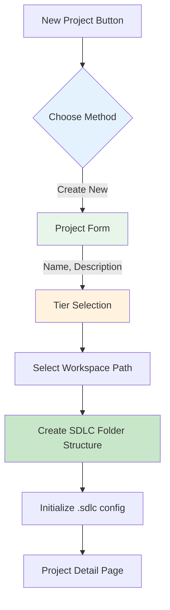
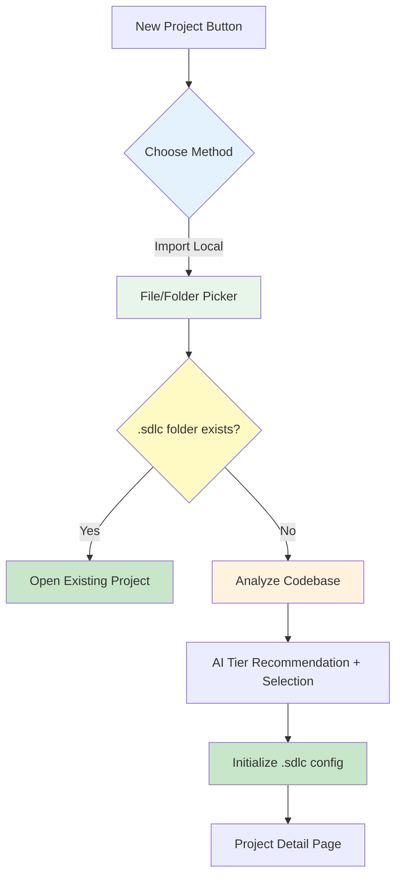
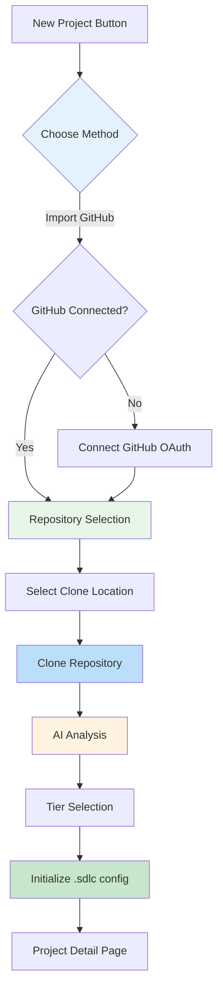
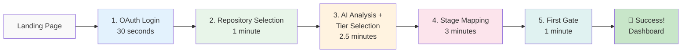

# User Onboarding Flow Architecture

**Version**: v2.3
**Date**: December 23, 2025
**Owner**: CPO, PM, UX Lead
**Stage**: Stage 02 (HOW - Design & Architecture)
**Framework**: SDLC 5.1.1 (4-Tier Classification)
**Status**: ✅ APPROVED

---

## Changelog

| Version | Date | Author | Changes |
|---------|------|--------|---------|
| v2.3 | Dec 23, 2025 | CPO | - Added VSCode Extension as primary platform for local operations<br>- Updated CLI/Extension onboarding flow documentation<br>- Added `sdlcctl init` integration details |
| v2.2 | Dec 23, 2025 | CPO | - Refined 3 Project Creation Scenarios: New (from scratch), Import Local, Import GitHub<br>- Added folder structure creation capability<br>- Added auto-detect for existing SDLC projects |
| v2.1 | Dec 23, 2025 | CPO | - Added Project Creation Scenarios for existing users<br>- Unified "Import from GitHub" flow with onboarding flow<br>- Added manual project creation option |
| v2.0 | Dec 23, 2025 | CPO | - Updated to SDLC 5.1.1 4-Tier Classification (LITE/STANDARD/PROFESSIONAL/ENTERPRISE)<br>- Merged AI Analysis + Policy Pack Selection into single step (5 steps total)<br>- Added Governance Appetite concept (user choice over AI recommendation)<br>- Added Codebase Metrics to recommendation algorithm (LOC, files, languages) |
| v1.0 | Nov 13, 2025 | CPO | Initial version with 6-step onboarding flow |

---

## 1. Overview

This document defines the **user onboarding architecture** for SDLC Orchestrator, implementing the **MTEP <30 minute pattern** to achieve:

- **TTFGE** (Time to First Gate Evaluation) **<30 minutes**
- **70%+ activation rate** (vs industry 30%)
- **Progressive disclosure** (hide complexity until needed)
- **Smart defaults** (AI-powered recommendations)

**Heritage**: MTEP Platform success pattern - wizard-based onboarding with <30 min setup achieved 90%+ completion rate.

---

## 2. Onboarding Metrics (North Star)

```yaml
Primary Metrics:
  TTFGE (Time to First Gate Evaluation):
    Definition: Time from signup to first gate status (PASS/FAIL)
    Target: <30 minutes
    Current: Unknown (need instrumentation)
    Measurement: product_time_to_first_gate_seconds

  Activation Rate:
    Definition: % users who complete onboarding
    Target: >70%
    Current: Unknown (need baseline)
    Measurement: product_activation_rate

  Drop-off Points:
    Definition: Where users abandon onboarding
    Target: <10% per step
    Current: Unknown (need funnel analysis)
    Measurement: product_onboarding_step_completion

Secondary Metrics:
  Time per Step: <3 minutes average
  Error Rate: <5% per step
  Help Usage: <20% need documentation
  Retry Rate: <10% go back to previous step
```

---

## 3. Project Creation Scenarios (v2.2)

> **v2.2 Update**: Refined 3 core scenarios for project creation with focus on local folder management and auto-detection of existing SDLC projects.

### 3.0 Scenario Overview

```yaml
Scenario Matrix:
  Scenario A - New Project (From Scratch):
    Trigger: User clicks "New Project" → "Create New"
    Flow: Name + Description + Tier Selection → Orchestrator creates folder structure
    Entry Point: /projects/new/create
    Output: New folder with SDLC 5.1.1 structure created
    Use Case: Starting a brand new project

  Scenario B - Import from Local (Git repo or folder):
    Trigger: User clicks "New Project" → "Import Local"
    Flow: Select folder → Auto-detect (.sdlc folder) → If exists: Open | If not: Analyze → Tier Selection → Initialize SDLC
    Entry Point: /projects/new/local
    Output: Existing folder linked to Orchestrator with SDLC config
    Use Case: Existing project without SDLC governance

  Scenario C - Import from GitHub (Clone + Setup):
    Trigger: User clicks "New Project" → "Import from GitHub"
    Prerequisite: GitHub account connected
    Flow: Repository Selection → Select local path → Clone repo → AI Analysis → Tier Selection → Initialize SDLC
    Entry Point: /projects/new/github
    Output: Cloned repository with SDLC config
    Use Case: Importing GitHub project for governance

  Scenario D - New User Onboarding (First-time):
    Trigger: First-time user signs up via GitHub OAuth
    Flow: OAuth → Repository Selection → Clone → AI Analysis → Tier Selection → Stage Mapping → First Gate
    Entry Point: /onboarding/login
    Output: User account + First project with full SDLC setup
    Use Case: Optimized first-time experience (TTFGE <30 min)
```

### 3.0.1 Scenario A - New Project (From Scratch)



**Key Points:**
- User provides project name, description, and selects governance tier
- Orchestrator creates new folder with SDLC 5.1.1 structure:
  ```
  project-name/
  ├── .sdlc/                    # SDLC config (managed by Orchestrator)
  │   ├── config.yaml           # Project configuration
  │   ├── gates/                # Gate definitions
  │   └── evidence/             # Local evidence cache
  ├── docs/                     # SDLC documentation structure
  │   ├── 00-discover/
  │   ├── 01-planning/
  │   ├── 02-design/
  │   └── ...
  ├── README.md                 # Auto-generated README
  └── CLAUDE.md                 # AI assistant context (if tier >= STANDARD)
  ```
- Git repo initialized automatically
- Can connect to GitHub later

### 3.0.2 Scenario B - Import from Local (Git repo or folder)



**Key Points:**
- User selects existing folder on local machine
- Auto-detection logic:
  - If `.sdlc/config.yaml` exists → Project already managed → Open it
  - If `.git` exists but no `.sdlc` → Git project without governance → Analyze and setup
  - If no `.git` → Plain folder → Initialize git + SDLC
- AI analysis (if not already managed):
  - Scan codebase for languages, file count, structure
  - Estimate team size from git history (if available)
  - Recommend appropriate tier
- User confirms/overrides tier selection
- Create `.sdlc` folder with config

### 3.0.3 Scenario C - Import from GitHub (Clone + Setup)



**Key Points:**
- Requires GitHub account connection
- User selects repository from their GitHub account
- User specifies local clone location
- Repository is cloned via `git clone`
- AI analysis performed on cloned code
- SDLC config initialized in cloned repo
- Link established between local folder and GitHub repo

### 3.0.4 Auto-Detection Logic

```yaml
Detection Algorithm:
  Step 1 - Check .sdlc folder:
    If .sdlc/config.yaml exists:
      Action: OPEN existing project
      UI Message: "This project is already managed by SDLC Orchestrator"

  Step 2 - Check .git folder:
    If .git exists:
      Action: Analyze as git project
      Extract: Team size from git log, languages from files
      UI Message: "Git repository detected. Analyzing codebase..."

  Step 3 - Check for common project markers:
    Files to detect:
      - package.json → Node.js project
      - requirements.txt / pyproject.toml → Python project
      - go.mod → Go project
      - Cargo.toml → Rust project
      - pom.xml / build.gradle → Java project
    Action: Initialize git + SDLC

  Step 4 - Plain folder:
    Action: Ask user to confirm initialization
    UI Message: "This folder is not a git repository. Initialize git?"

.sdlc/config.yaml Structure:
  version: "5.1.1"
  project:
    id: "uuid"
    name: "Project Name"
    slug: "project-name"
    tier: "standard"  # lite|standard|professional|enterprise
  github:
    repo_id: 123456789  # Optional
    full_name: "owner/repo"  # Optional
  gates:
    enabled: ["G0.1", "G0.2", "G1", "G2", "G3", "G4", "G5", "G6"]
  created_at: "2025-12-23T00:00:00Z"
  updated_at: "2025-12-23T00:00:00Z"
```

### 3.0.5 UI Components Mapping (v2.2)

```yaml
Shared Components:
  - TierSelectionCard.tsx: Tier selection UI with 4 tiers
  - AIAnalysisResults.tsx: Show analysis results (languages, team size, etc.)
  - RepositoryConnect.tsx: GitHub repository selection (for Scenario C)

New Components (v2.2):
  - CreateProjectDialog.tsx: UPDATED - 3 creation methods
  - FolderPicker.tsx: NEW - Local folder selection (Electron/Desktop only)
  - CloneLocationPicker.tsx: NEW - Select where to clone GitHub repo
  - ProjectDetectionBanner.tsx: NEW - Show detection status

Local Filesystem Access:
  Platforms that support local folder operations:
    VSCode Extension (Current):
      - SDLC Orchestrator has a VSCode Extension
      - VSCode API provides native file system access
      - Supports: Scenarios A, B, C (all local operations)
      - Priority: Implement local operations in VSCode Extension first

    Desktop App (Future - Later Sprints):
      - Electron-based standalone application
      - For users who prefer IDE-independent workflow
      - Supports: All scenarios (A, B, C, D)
      - Timeline: Post-MVP, later sprints

  Web App (Browser):
    - Can only handle: Scenario C (GitHub import) + project metadata management
    - File operations delegated to VSCode Extension or Desktop app
    - API integration with Orchestrator backend

Route Structure:
  /projects/new: Project creation choice dialog
  /projects/new/create: New project from scratch (Scenario A)
  /projects/new/local: Import from local (Scenario B) - Desktop only
  /projects/new/github: Import from GitHub (Scenario C)
  /onboarding/*: New user onboarding (Scenario D)
```

### 3.0.6 Backend API Requirements (v2.2)

```yaml
New API Endpoints:
  POST /api/projects/create-folder:
    Description: Create new project folder with SDLC structure
    Input:
      name: string
      path: string (workspace location)
      tier: string
      description?: string
    Output:
      project_id: uuid
      folder_path: string
      config_path: string

  POST /api/projects/import-local:
    Description: Import existing local folder
    Input:
      path: string
      tier: string
    Output:
      project_id: uuid
      detected_info: object (languages, team_size, etc.)
      already_managed: boolean

  POST /api/projects/clone-github:
    Description: Clone GitHub repo and initialize SDLC
    Input:
      github_repo_id: number
      github_repo_full_name: string
      clone_path: string
      tier: string
    Output:
      project_id: uuid
      folder_path: string
      clone_status: string

  GET /api/projects/detect:
    Description: Auto-detect project status from folder
    Input:
      path: string
    Output:
      is_sdlc_project: boolean
      config?: object
      is_git_repo: boolean
      detected_languages?: object
```

### 3.0.7 CLI/VSCode Extension Onboarding (v2.3)

> **v2.3 Update**: The `sdlcctl init` command and VSCode Extension implement the same onboarding scenarios as the web app.

```yaml
sdlcctl init Command:
  Purpose: Initialize SDLC 5.1.1 project structure from command line
  Location: backend/sdlcctl/commands/init.py

  Usage Examples:
    # Interactive mode (prompts for tier)
    sdlcctl init

    # Specify tier directly
    sdlcctl init --tier professional

    # Auto-detect tier from team size
    sdlcctl init --team-size 25

    # Non-interactive with defaults
    sdlcctl init --no-interactive --tier standard

  Parameters:
    --path, -p: Project root path (default: current directory)
    --docs, -d: Documentation folder name (default: "docs")
    --tier, -t: Governance tier (lite, standard, professional, enterprise)
    --team-size: Team size for auto-detection
    --scaffold/--no-scaffold: Create full folder structure with READMEs
    --force, -f: Overwrite existing docs folder
    --interactive/-i, --no-interactive: Toggle prompts

VSCode Extension Commands:
  SDLC: Init Project:
    - Opens command palette (Cmd/Ctrl + Shift + P)
    - Invokes sdlcctl init for current workspace
    - Shows tier selection UI in VSCode

  SDLC: Import Project:
    - Select existing folder
    - Auto-detect if .sdlc/config.yaml exists
    - If not managed: analyze and initialize

  SDLC: Connect to Orchestrator:
    - Authenticate with SDLC Orchestrator backend
    - Register local project with cloud backend
    - Sync project metadata and tier configuration

Extension + Backend Integration:
  1. Local Operations (Extension):
     - Create folder structure
     - Initialize .sdlc/config.yaml
     - Run sdlcctl commands locally

  2. Cloud Sync (Backend API):
     - POST /projects - Register project in backend
     - POST /projects/{id}/sync - Sync local config to cloud
     - GET /projects/{id}/config - Fetch latest config

CLI/Extension Onboarding Flow:
  Step 1: User opens project folder in VSCode
  Step 2: User runs "SDLC: Init Project" command
  Step 3: Extension prompts for tier selection (or auto-detects)
  Step 4: Extension creates SDLC folder structure locally
  Step 5: Extension prompts to connect to Orchestrator (optional)
  Step 6: If connected, project registered in cloud backend
```

---

## 4. User Journey: First 30 Minutes (New User Onboarding)

### 4.1 The Magic Flow (v2.0 - 5 Steps)



**Total Time**: 8 minutes active + 2 minutes AI processing = **10 minutes** ✅

**Key Change (v2.0)**: Merged AI Analysis + Policy Pack Selection into single step. User sees AI recommendation but CHOOSES their governance tier based on their "governance appetite" (khẩu vị quản trị).

---

### 3.2 Step-by-Step Flow

#### Step 1: OAuth Login (30 seconds)

```yaml
UI Component: OAuth Selection Screen
Duration: 30 seconds
Drop-off Risk: 5%

Actions:
  1. Show 3 OAuth options (GitHub, Google, Microsoft)
  2. User clicks preferred provider
  3. OAuth redirect and return
  4. Account created/linked automatically

Success Factors:
  - Single click (no forms to fill)
  - Trusted providers (reduce friction)
  - Auto-detect organization from email domain

Code Example:
```

```typescript
// components/onboarding/OAuthLogin.tsx
export const OAuthLogin: React.FC = () => {
  const [loading, setLoading] = useState<string | null>(null);

  const handleOAuth = async (provider: 'github' | 'google' | 'microsoft') => {
    setLoading(provider);

    // Track funnel event
    analytics.track('onboarding_step_started', {
      step: 1,
      step_name: 'oauth_login',
      provider
    });

    // Redirect to OAuth
    window.location.href = `/api/auth/oauth/${provider}`;
  };

  return (
    <OnboardingLayout
      step={1}
      title="Welcome to SDLC Orchestrator"
      subtitle="Sign in to enforce quality gates and reduce feature waste by 60%"
    >
      <div className="space-y-4">
        <Button
          size="large"
          icon={<GithubOutlined />}
          loading={loading === 'github'}
          onClick={() => handleOAuth('github')}
          className="w-full"
        >
          Continue with GitHub (Recommended)
        </Button>

        <Button
          size="large"
          icon={<GoogleOutlined />}
          loading={loading === 'google'}
          onClick={() => handleOAuth('google')}
          className="w-full"
        >
          Continue with Google
        </Button>

        <Button
          size="large"
          icon={<WindowsOutlined />}
          loading={loading === 'microsoft'}
          onClick={() => handleOAuth('microsoft')}
          className="w-full"
        >
          Continue with Microsoft
        </Button>
      </div>

      <OnboardingProgress current={1} total={6} />
    </OnboardingLayout>
  );
};
```

---

#### Step 2: Connect GitHub Repository (1 minute)

```yaml
UI Component: Repository Selector
Duration: 1 minute
Drop-off Risk: 15% (CRITICAL - highest drop-off)

Actions:
  1. Auto-fetch user's repositories via GitHub API
  2. Show searchable list with smart sorting
  3. User selects primary repository
  4. Request minimal permissions (read-only)

Success Factors:
  - Smart sorting (most recent, most active first)
  - Search as you type
  - Show repository stats (stars, last commit)
  - Explain why we need access (trust building)

Optimization:
  - Pre-select if only 1 repo
  - Group by organization
  - Show "popular with teams like yours"
```

```typescript
// components/onboarding/RepositoryConnect.tsx
export const RepositoryConnect: React.FC = () => {
  const [repos, setRepos] = useState<Repository[]>([]);
  const [search, setSearch] = useState('');
  const [selected, setSelected] = useState<string | null>(null);
  const [loading, setLoading] = useState(true);

  useEffect(() => {
    fetchRepositories();
  }, []);

  const fetchRepositories = async () => {
    try {
      const response = await api.get('/github/repositories');
      const sorted = response.data.sort((a, b) => {
        // Smart sorting: active + recent first
        const scoreA = a.stars * 10 + a.commits_last_30_days;
        const scoreB = b.stars * 10 + b.commits_last_30_days;
        return scoreB - scoreA;
      });
      setRepos(sorted);

      // Auto-select if only one repo
      if (sorted.length === 1) {
        setSelected(sorted[0].id);
      }
    } finally {
      setLoading(false);
    }
  };

  const handleContinue = async () => {
    if (!selected) return;

    analytics.track('onboarding_step_completed', {
      step: 2,
      step_name: 'connect_repository',
      repository_id: selected
    });

    await api.post('/projects', {
      github_repo_id: selected,
      auto_setup: true  // AI will analyze and recommend
    });

    router.push('/onboarding/analyzing');
  };

  const filteredRepos = repos.filter(repo =>
    repo.name.toLowerCase().includes(search.toLowerCase()) ||
    repo.full_name.toLowerCase().includes(search.toLowerCase())
  );

  return (
    <OnboardingLayout
      step={2}
      title="Connect Your Repository"
      subtitle="We'll analyze your project to recommend the right governance policies"
    >
      <Alert
        type="info"
        message="We only need read access to analyze your project structure"
        className="mb-4"
      />

      <Input
        size="large"
        prefix={<SearchOutlined />}
        placeholder="Search repositories..."
        value={search}
        onChange={e => setSearch(e.target.value)}
        className="mb-4"
      />

      <div className="repo-list">
        {filteredRepos.map(repo => (
          <RepoCard
            key={repo.id}
            repo={repo}
            selected={selected === repo.id}
            onSelect={() => setSelected(repo.id)}
          />
        ))}
      </div>

      <Button
        type="primary"
        size="large"
        disabled={!selected}
        onClick={handleContinue}
        className="w-full mt-4"
      >
        Continue with Selected Repository
      </Button>

      <OnboardingProgress current={2} total={6} />
    </OnboardingLayout>
  );
};
```

---

#### Step 3: AI Analysis + Tier Selection (2.5 minutes)

> **v2.0 Change**: This step now combines AI Analysis and Tier Selection. User sees AI recommendation based on codebase metrics but **chooses** their governance tier based on their "governance appetite".

```yaml
UI Component: AI Analysis + Tier Selection Screen
Duration: 2.5 minutes (2 min analysis + 30 sec selection)
Drop-off Risk: 10%

Actions:
  1. Analyze repository structure (automated)
  2. Show codebase metrics (LOC, files, languages)
  3. AI recommends tier based on metrics
  4. User SELECTS tier (can override recommendation)
  5. Store selection for next step

Key Concept - Governance Appetite:
  Tier selection depends on owner/PM's governance style, NOT just technical metrics.
  A 2-person team building enterprise software may choose PROFESSIONAL tier.
  A 50-person team in rapid prototyping may choose LITE tier.
  The AI recommends, but the human decides.

4-Tier Classification (SDLC 5.1.1):
  LITE: Solo devs, MVPs, hackathons (1-2 people mindset)
    - Gates: G0.1, G1, G3, G5
    - Requirements: README + basic docs
    - Philosophy: "Trust the team, move fast"

  STANDARD: Small teams, growing startups (3-10 people mindset)
    - Gates: G0.1-G6
    - Requirements: CI/CD, security scanning, CLAUDE.md
    - Philosophy: "Quality with agility"

  PROFESSIONAL: Growing orgs, regulated industries (10-50 people mindset)
    - Gates: G0.1-G8
    - Requirements: 80%+ coverage, SBOM, SAST, OWASP L1
    - Philosophy: "Enterprise-grade quality"

  ENTERPRISE: Large orgs, finance, healthcare (50+ people mindset)
    - Gates: All gates (G0.1-G10)
    - Requirements: 95%+ coverage, OWASP L2+, quarterly audits
    - Philosophy: "Audit-ready compliance"

Tier Recommendation Algorithm (v2.0):
  Weighted scoring (not just team size):
    - Codebase size (estimated LOC): 40%
    - Team size (contributors): 30%
    - File count: 20%
    - Language diversity: 10%

  Score Thresholds:
    - Score < 30: LITE
    - Score 30-55: STANDARD
    - Score 55-75: PROFESSIONAL
    - Score > 75: ENTERPRISE

Success Factors:
  - Show codebase metrics transparently
  - Explain why AI recommends specific tier
  - Allow easy override (no friction)
  - Use governance-focused language (not just technical)
```

```python
# services/project_sync_service.py - Tier Recommendation Algorithm v2.0
POLICY_PACKS = {
    "lite": {
        "name": "Lite",
        "gates": ["G0.1", "G1", "G3", "G5"],
        "description": "Minimal governance - trust the team, move fast",
        "team_size_range": (1, 2),
        "features": ["Basic gates (G0.1, G1, G3, G5)", "README + basic docs only"],
        "best_for": "Solo devs, MVPs, hackathons",
    },
    "standard": {
        "name": "Standard",
        "gates": ["G0.1", "G0.2", "G1", "G2", "G3", "G4", "G5", "G6"],
        "description": "Balanced governance - quality with agility",
        "team_size_range": (3, 10),
        "features": ["Core gates (G0.1-G6)", "CI/CD + security scanning"],
        "best_for": "Small teams (3-10), growing startups",
    },
    "professional": {
        "name": "Professional",
        "gates": ["G0.1", "G0.2", "G1", "G2", "G3", "G4", "G5", "G6", "G7", "G8"],
        "description": "Strong governance - enterprise-grade quality",
        "team_size_range": (10, 50),
        "features": ["Full gates + 80% test coverage", "SBOM, SAST, OWASP L1"],
        "best_for": "Medium teams, regulated industries",
    },
    "enterprise": {
        "name": "Enterprise",
        "gates": ["G0.1", "G0.2", "G1", "G2", "G3", "G4", "G5", "G6", "G7", "G8", "G9", "G10"],
        "description": "Maximum governance - audit-ready compliance",
        "team_size_range": (50, 10000),
        "features": ["All gates + quarterly audits", "OWASP L2+, 95% coverage"],
        "best_for": "Large orgs, finance, healthcare",
    },
}

def _recommend_policy_pack(
    self,
    team_size: int,
    compliance_requirements: List[str],
    languages: Dict[str, int] = None,
    file_count: int = 0
) -> str:
    """
    Recommend policy pack using weighted scoring algorithm.

    Weights:
    - Codebase size (estimated LOC): 40%
    - Team size: 30%
    - File count: 20%
    - Language diversity: 10%

    Returns: 'lite', 'standard', 'professional', or 'enterprise'
    """
    # Calculate codebase size score (0-100)
    estimated_loc = sum(languages.values()) if languages else 0
    if estimated_loc < 5000:
        codebase_score = 10
    elif estimated_loc < 20000:
        codebase_score = 30
    elif estimated_loc < 100000:
        codebase_score = 60
    else:
        codebase_score = 90

    # Calculate team size score (0-100)
    if team_size <= 2:
        team_score = 10
    elif team_size <= 10:
        team_score = 40
    elif team_size <= 50:
        team_score = 70
    else:
        team_score = 100

    # Calculate file count score (0-100)
    if file_count < 50:
        file_score = 10
    elif file_count < 200:
        file_score = 30
    elif file_count < 500:
        file_score = 60
    else:
        file_score = 90

    # Calculate language diversity score (0-100)
    lang_count = len(languages) if languages else 1
    lang_score = min(lang_count * 20, 100)

    # Weighted total
    total_score = (
        codebase_score * 0.4 +
        team_score * 0.3 +
        file_score * 0.2 +
        lang_score * 0.1
    )

    # Map score to tier
    if total_score < 30:
        return "lite"
    elif total_score < 55:
        return "standard"
    elif total_score < 75:
        return "professional"
    else:
        return "enterprise"
```

```typescript
// components/onboarding/AIAnalysis.tsx - Tier Selection UI v2.0
type PolicyPack = 'lite' | 'standard' | 'professional' | 'enterprise'

interface PolicyPackInfo {
  name: PolicyPack
  title: string
  description: string
  features: string[]
}

const POLICY_PACKS: PolicyPackInfo[] = [
  {
    name: 'lite',
    title: 'Lite',
    description: 'Minimal governance - trust the team, move fast',
    features: [
      'Basic gates (G0.1, G1, G3, G5)',
      'README + basic docs only',
      'Best for: Solo devs, MVPs, hackathons',
    ],
  },
  {
    name: 'standard',
    title: 'Standard',
    description: 'Balanced governance - quality with agility',
    features: [
      'Core gates (G0.1-G6)',
      'CI/CD + security scanning',
      'Best for: Small teams (3-10), growing startups',
    ],
  },
  {
    name: 'professional',
    title: 'Professional',
    description: 'Strong governance - enterprise-grade quality',
    features: [
      'Full gates + 80% test coverage',
      'SBOM, SAST, OWASP L1',
      'Best for: Medium teams, regulated industries',
    ],
  },
  {
    name: 'enterprise',
    title: 'Enterprise',
    description: 'Maximum governance - audit-ready compliance',
    features: [
      'All gates + quarterly audits',
      'OWASP L2+, 95% coverage',
      'Best for: Large orgs, finance, healthcare',
    ],
  },
]

// UI shows:
// 1. Codebase metrics (LOC, files, languages)
// 2. AI recommendation with explanation
// 3. 4 tier options - user SELECTS (not just accepts)
// 4. Governance-focused descriptions

<h3>Choose Your Governance Level</h3>
<p>
  Select based on your team's governance appetite and compliance needs.
  Higher tiers = more control but more effort.
</p>
{recommendedTier && (
  <div className="recommendation-banner">
    💡 Based on codebase analysis, we suggest <strong>{recommendedTier}</strong>.
    But you know your team best - choose what fits your governance style.
  </div>
)}
```

---

#### Step 4: Automatic Stage Mapping (3 minutes)

> **v2.0 Change**: This was previously Step 5. Now Step 4 after merging AI Analysis + Tier Selection.

```yaml
UI Component: Stage Mapping Wizard
Duration: 3 minutes
Drop-off Risk: 10%

Actions:
  1. AI auto-maps repository structure to SDLC stages
  2. Show visual mapping with drag-drop adjustment
  3. User confirms or adjusts mappings
  4. Create initial project structure

Success Factors:
  - 80% accurate auto-mapping
  - Visual representation (not just text)
  - Quick edit capability
  - Skip option (use defaults)

Mapping Logic (SDLC 5.1.1):
  /docs/00-foundation → Stage 00 (FOUNDATION - WHY?)
  /docs/01-planning → Stage 01 (PLANNING - WHAT?)
  /docs/02-design → Stage 02 (DESIGN - HOW?)
  /docs/03-integrate → Stage 03 (INTEGRATE)
  /src → Stage 04 (BUILD)
  /tests → Stage 05 (TEST)
  /.github/workflows, /deploy → Stage 06 (DEPLOY)
  /docs/07-operate → Stage 07 (OPERATE)
  /docs/08-collaborate → Stage 08 (COLLABORATE)
  /docs/09-govern → Stage 09 (GOVERN)
  /docs/10-archive → Stage 10 (ARCHIVE - optional)
```

```typescript
// components/onboarding/StageMapping.tsx
// Reference: SDLC-Enterprise-Framework/README.md (v5.1.1)
export const StageMapping: React.FC = () => {
  const [mappings, setMappings] = useState<StageMapping[]>([]);
  const [autoDetected, setAutoDetected] = useState(true);

  useEffect(() => {
    autoDetectMappings();
  }, []);

  const autoDetectMappings = async () => {
    const response = await api.post('/projects/auto-map-stages', {
      project_id: currentProject.id
    });

    setMappings(response.data.mappings);
  };

  // SDLC 5.1.1 Stage Definitions (10 Stages: 00-09 + Archive folder)
  const stages = [
    { id: 'stage_00', name: 'FOUNDATION', description: 'Strategic Discovery & Validation', question: 'WHY?' },
    { id: 'stage_01', name: 'PLANNING', description: 'Requirements & User Stories', question: 'WHAT?' },
    { id: 'stage_02', name: 'DESIGN', description: 'Architecture & Technical Design', question: 'HOW?' },
    { id: 'stage_03', name: 'INTEGRATE', description: 'API Contracts & Third-party Setup', question: 'How connect?' },
    { id: 'stage_04', name: 'BUILD', description: 'Development & Implementation', question: 'Building right?' },
    { id: 'stage_05', name: 'TEST', description: 'Quality Assurance & Validation', question: 'Works correctly?' },
    { id: 'stage_06', name: 'DEPLOY', description: 'Release & Deployment', question: 'Ship safely?' },
    { id: 'stage_07', name: 'OPERATE', description: 'Production Operations & Monitoring', question: 'Running reliably?' },
    { id: 'stage_08', name: 'COLLABORATE', description: 'Team Coordination & Knowledge', question: 'Team effective?' },
    { id: 'stage_09', name: 'GOVERN', description: 'Compliance & Strategic Oversight', question: 'Compliant?' },
    { id: 'stage_10', name: 'ARCHIVE', description: 'Project Archive (Legacy Docs)', question: 'Archived?' },
  ];

  return (
    <OnboardingLayout
      step={5}
      title="Map Your Project Structure"
      subtitle="We've auto-detected your stages. Adjust if needed."
    >
      <Alert
        type="info"
        message="We mapped your folders to SDLC stages. You can adjust anytime."
        className="mb-4"
      />

      <div className="stage-mapping-grid">
        {mappings.map((mapping, index) => (
          <div key={index} className="mapping-row">
            <div className="folder-path">
              <FolderOutlined /> {mapping.path}
            </div>
            <ArrowRightOutlined />
            <Select
              value={mapping.stage}
              onChange={value => updateMapping(index, value)}
              className="stage-select"
            >
              {stages.map(stage => (
                <Option key={stage.id} value={stage.id}>
                  {stage.name} - {stage.description}
                </Option>
              ))}
            </Select>
          </div>
        ))}
      </div>

      <div className="flex justify-between mt-6">
        <Button onClick={skipMapping}>
          Skip (Use Defaults)
        </Button>
        <Button type="primary" onClick={confirmMapping}>
          Confirm Mapping
        </Button>
      </div>

      <OnboardingProgress current={4} total={5} />
    </OnboardingLayout>
  );
};
```

---

#### Step 5: First Gate Evaluation (1 minute)

> **v2.0 Change**: This was previously Step 6. Now Step 5 (final step).

```yaml
UI Component: Gate Evaluation Trigger
Duration: 1 minute
Drop-off Risk: 5%

Actions:
  1. Run first gate check (usually G0.1)
  2. Show real-time evaluation progress
  3. Display results (PASS/FAIL/PENDING)
  4. Celebrate success or guide remediation

Success Factors:
  - Quick evaluation (<30 seconds)
  - Clear success/failure messaging
  - Actionable next steps
  - Celebration animation for PASS

Gate G0.1 Check (Problem Definition):
  - README.md exists?
  - Problem statement documented?
  - User stories present?
```

```typescript
// components/onboarding/FirstGateEvaluation.tsx
export const FirstGateEvaluation: React.FC = () => {
  const [evaluating, setEvaluating] = useState(false);
  const [result, setResult] = useState<GateResult | null>(null);

  const runFirstEvaluation = async () => {
    setEvaluating(true);

    analytics.track('onboarding_first_gate_started', {
      gate_id: 'G0.1',
      project_id: currentProject.id
    });

    try {
      const response = await api.post('/gates/evaluate', {
        project_id: currentProject.id,
        gate_id: 'G0.1'
      });

      setResult(response.data);

      // Track TTFGE
      const startTime = sessionStorage.getItem('onboarding_start_time');
      const ttfge = Date.now() - parseInt(startTime);

      analytics.track('onboarding_completed', {
        ttfge_seconds: ttfge / 1000,
        gate_result: response.data.status,
        project_id: currentProject.id
      });

      // Celebrate if passed
      if (response.data.status === 'PASS') {
        confetti({
          particleCount: 100,
          spread: 70,
          origin: { y: 0.6 }
        });
      }
    } finally {
      setEvaluating(false);
    }
  };

  return (
    <OnboardingLayout
      step={6}
      title="Your First Gate Evaluation"
      subtitle="Let's see how your project measures up to Gate G0.1 (Problem Definition)"
    >
      {!result && !evaluating && (
        <div className="text-center py-12">
          <SafetyOutlined className="text-6xl text-blue-500 mb-4" />
          <h3 className="text-xl mb-4">
            Ready to run your first quality gate?
          </h3>
          <p className="text-gray-600 mb-8">
            Gate G0.1 checks if your project has a clear problem definition and user validation.
          </p>
          <Button
            type="primary"
            size="large"
            onClick={runFirstEvaluation}
            icon={<PlayCircleOutlined />}
          >
            Run Gate Evaluation
          </Button>
        </div>
      )}

      {evaluating && (
        <div className="text-center py-12">
          <Spin size="large" />
          <h3 className="text-xl mt-4">Evaluating Gate G0.1...</h3>
          <Progress percent={60} status="active" className="mt-4" />
        </div>
      )}

      {result && (
        <GateResultDisplay
          result={result}
          onContinue={() => router.push('/dashboard')}
        />
      )}

      <OnboardingProgress current={5} total={5} />
    </OnboardingLayout>
  );
};
```

---

## 5. Progressive Disclosure Strategy

### 5.1 Information Architecture

```yaml
Principle: Show only what's needed, when it's needed

Level 1 (Onboarding - First 30 min):
  Visible:
    - OAuth login
    - Repository selection
    - Policy pack (3 options)
    - First gate evaluation

  Hidden:
    - Advanced settings
    - Custom policies
    - Team management
    - Integrations
    - Billing details

Level 2 (First Week):
  Gradually Reveal:
    - Gate customization
    - Evidence upload
    - Team invites
    - Basic reports

Level 3 (Power User - Month 1+):
  Full Access:
    - Custom policies (OPA Rego)
    - API access
    - Advanced analytics
    - Audit logs
    - Admin settings
```

---

### 5.2 Smart Defaults (v2.0 - SDLC 5.1.1)

```yaml
Repository Analysis (Codebase Metrics):
  - Estimated LOC (from language bytes) → Codebase complexity
  - File count → Project scale
  - Language diversity → Technical complexity
  - Team size (contributors) → Collaboration level
  - CI/CD presence → Ship gates enabled
  - Test coverage → Test gates strictness

Tier Recommendation Algorithm (Weighted Scoring):
  Codebase size (40%):
    - <5K LOC: 10 points (LITE)
    - 5K-20K LOC: 30 points (STANDARD)
    - 20K-100K LOC: 60 points (PROFESSIONAL)
    - >100K LOC: 90 points (ENTERPRISE)

  Team size (30%):
    - 1-2 people: 10 points (LITE mindset)
    - 3-10 people: 40 points (STANDARD mindset)
    - 10-50 people: 70 points (PROFESSIONAL mindset)
    - 50+ people: 100 points (ENTERPRISE mindset)

  File count (20%):
    - <50 files: 10 points
    - 50-200 files: 30 points
    - 200-500 files: 60 points
    - >500 files: 90 points

  Language diversity (10%):
    - Each language: +20 points (max 100)

  Final Score → Tier:
    - <30: LITE
    - 30-55: STANDARD
    - 55-75: PROFESSIONAL
    - >75: ENTERPRISE

4-Tier Policy Defaults (SDLC 5.1.1):
  LITE (Governance Appetite: Low):
    - Gates: G0.1, G1, G3, G5 (4 essential gates)
    - Timing: Relaxed (async validation)
    - Evidence: README + basic docs
    - Best for: Solo devs, MVPs, hackathons

  STANDARD (Governance Appetite: Medium):
    - Gates: G0.1-G6 (8 comprehensive gates)
    - Timing: Balanced (CI/CD integrated)
    - Evidence: Full docs structure, security scanning
    - Best for: Small teams (3-10), growing startups

  PROFESSIONAL (Governance Appetite: High):
    - Gates: G0.1-G8 (10 gates)
    - Timing: Strict (blocking gates)
    - Evidence: 80%+ coverage, SBOM, SAST, OWASP L1
    - Best for: Medium teams, regulated industries

  ENTERPRISE (Governance Appetite: Maximum):
    - Gates: All gates (G0.1-G10)
    - Timing: Strict + audits
    - Evidence: 95%+ coverage, OWASP L2+, quarterly audits
    - Best for: Large orgs, finance, healthcare

Key Insight (v2.0):
  Tier selection is NOT just about technical metrics.
  It depends on the owner/PM's "governance appetite" (khẩu vị quản trị).
  AI recommends based on metrics, but USER CHOOSES based on governance style.

Evidence Defaults:
  - Auto-link README to G0.1
  - Auto-link tests to G4
  - Auto-link CI/CD to G5
```

---

## 6. Error Recovery & Help

### 6.1 Common Failure Points

```yaml
Repository Access Denied:
  Problem: Insufficient GitHub permissions
  Solution:
    - Clear error message
    - Direct link to GitHub settings
    - Alternative: Manual setup option
    - Help article with screenshots

No Repositories Found:
  Problem: User has no repos or wrong org
  Solution:
    - Check organization switcher
    - Create sample project option
    - Import from template

AI Analysis Timeout:
  Problem: Large repo or API issues
  Solution:
    - Allow skip with defaults
    - Retry button
    - Manual configuration fallback

Gate Evaluation Fails:
  Problem: Missing required evidence
  Solution:
    - Clear requirements checklist
    - Quick-fix suggestions
    - "Setup later" option
```

---

### 6.2 Contextual Help System

```typescript
// components/onboarding/ContextualHelp.tsx
export const ContextualHelp: React.FC<{step: number}> = ({step}) => {
  const helpContent = {
    1: {
      title: "Why OAuth?",
      content: "We use OAuth for secure, password-free authentication.",
      video: "/help/oauth-login.mp4",
      article: "/docs/authentication"
    },
    2: {
      title: "Repository Permissions",
      content: "We only need read access to analyze your project.",
      video: "/help/github-permissions.mp4",
      article: "/docs/github-integration"
    },
    // ... other steps
  };

  return (
    <Drawer
      title={helpContent[step].title}
      placement="right"
      width={400}
    >
      <div className="help-content">
        <p>{helpContent[step].content}</p>

        <video
          src={helpContent[step].video}
          controls
          className="w-full mt-4"
        />

        <Button
          type="link"
          href={helpContent[step].article}
          target="_blank"
        >
          Read Full Documentation
        </Button>
      </div>
    </Drawer>
  );
};
```

---

## 7. A/B Testing Strategy

### 7.1 Experiments to Run

```yaml
Experiment 1: AI Recommendation Prominence
  Control: Show 3 policy packs equally
  Variant A: Highlight AI recommendation
  Variant B: Pre-select AI recommendation
  Metric: Policy pack selection time
  Hypothesis: Pre-selection reduces decision time by 50%

Experiment 2: Stage Mapping Approach
  Control: Manual mapping
  Variant A: Auto-detect with confirmation
  Variant B: Skip mapping entirely (use defaults)
  Metric: Completion rate
  Hypothesis: Skip option increases completion by 20%

Experiment 3: First Gate Timing
  Control: Run after setup
  Variant A: Run in background during setup
  Variant B: Defer to post-onboarding
  Metric: TTFGE
  Hypothesis: Background reduces TTFGE by 2 minutes
```

---

## 8. Technical Implementation

### 8.1 Frontend State Management

```typescript
// stores/onboardingStore.ts
interface OnboardingState {
  currentStep: number;
  startTime: number;
  completedSteps: number[];

  // Step data
  authProvider: 'github' | 'google' | 'microsoft' | null;
  repository: Repository | null;
  analysis: AnalysisResult | null;
  policyPack: PolicyPack | null;
  stageMappings: StageMapping[];
  firstGateResult: GateResult | null;

  // Metrics
  stepDurations: Record<number, number>;
  errors: Record<number, string>;
  helpViewed: number[];
}

const useOnboardingStore = create<OnboardingState>((set, get) => ({
  currentStep: 1,
  startTime: Date.now(),
  completedSteps: [],

  // Actions
  nextStep: () => {
    const current = get().currentStep;

    // Track step duration
    analytics.track('onboarding_step_completed', {
      step: current,
      duration_seconds: (Date.now() - get().startTime) / 1000
    });

    set({
      currentStep: current + 1,
      completedSteps: [...get().completedSteps, current]
    });
  },

  skipToEnd: () => {
    // Allow power users to skip
    analytics.track('onboarding_skipped', {
      at_step: get().currentStep
    });

    router.push('/dashboard');
  }
}));
```

---

### 8.2 Backend Orchestration

```python
# services/onboarding_service.py
class OnboardingService:
    """Orchestrate user onboarding flow"""

    def __init__(self):
        self.analyzer = OnboardingAnalyzer()
        self.project_service = ProjectService()
        self.gate_service = GateService()

    async def complete_onboarding(
        self,
        user_id: str,
        repository_id: str,
        policy_pack: str
    ) -> Dict[str, Any]:
        """One-click onboarding completion"""

        # 1. Create project
        project = await self.project_service.create_from_github(
            user_id=user_id,
            github_repo_id=repository_id
        )

        # 2. Run AI analysis
        analysis = await self.analyzer.analyze_repository(repository_id)

        # 3. Apply policy pack
        await self.apply_policy_pack(project.id, policy_pack)

        # 4. Auto-map stages
        mappings = await self.auto_map_stages(project.id, analysis)

        # 5. Create initial gates
        gates = await self.create_initial_gates(project.id, policy_pack)

        # 6. Run first evaluation
        first_gate_result = await self.gate_service.evaluate(
            project_id=project.id,
            gate_id='G0.1'
        )

        # 7. Track metrics
        await self.track_onboarding_completion(
            user_id=user_id,
            project_id=project.id,
            duration_seconds=(time.time() - start_time),
            first_gate_result=first_gate_result.status
        )

        return {
            "project": project,
            "analysis": analysis,
            "first_gate": first_gate_result,
            "ttfge_seconds": time.time() - start_time
        }

    async def apply_policy_pack(
        self,
        project_id: str,
        pack_name: str
    ) -> None:
        """Apply pre-built policy pack to project"""

        packs = {
            "lite": ["G0.1", "G1", "G3", "G5"],
            "standard": ["G0.1", "G0.2", "G1", "G2", "G3", "G4", "G5", "G6"],
            "enterprise": ["G0.1", "G0.2", "G1", "G2", "G3", "G4", "G5", "G6", "G7", "G8", "G9"]
        }

        gates = packs.get(pack_name, packs["standard"])

        for gate_id in gates:
            await self.gate_service.create_gate(
                project_id=project_id,
                gate_id=gate_id,
                enabled=True,
                auto_configured=True
            )
```

---

## 9. Success Metrics & Monitoring

### 9.1 Funnel Analysis

```sql
-- Onboarding funnel query
WITH funnel AS (
  SELECT
    user_id,
    MAX(CASE WHEN step = 1 THEN 1 ELSE 0 END) as step_1_login,
    MAX(CASE WHEN step = 2 THEN 1 ELSE 0 END) as step_2_repo,
    MAX(CASE WHEN step = 3 THEN 1 ELSE 0 END) as step_3_analysis,
    MAX(CASE WHEN step = 4 THEN 1 ELSE 0 END) as step_4_policy,
    MAX(CASE WHEN step = 5 THEN 1 ELSE 0 END) as step_5_mapping,
    MAX(CASE WHEN step = 6 THEN 1 ELSE 0 END) as step_6_gate,
    MIN(started_at) as started_at,
    MAX(completed_at) as completed_at
  FROM onboarding_events
  WHERE started_at >= NOW() - INTERVAL '30 days'
  GROUP BY user_id
)
SELECT
  COUNT(*) as total_users,
  SUM(step_1_login) as completed_login,
  SUM(step_2_repo) as completed_repo,
  SUM(step_3_analysis) as completed_analysis,
  SUM(step_4_policy) as completed_policy,
  SUM(step_5_mapping) as completed_mapping,
  SUM(step_6_gate) as completed_gate,

  -- Conversion rates
  ROUND(100.0 * SUM(step_2_repo) / NULLIF(SUM(step_1_login), 0), 2) as login_to_repo_pct,
  ROUND(100.0 * SUM(step_6_gate) / NULLIF(SUM(step_1_login), 0), 2) as overall_completion_pct,

  -- TTFGE
  PERCENTILE_CONT(0.5) WITHIN GROUP (
    ORDER BY EXTRACT(EPOCH FROM (completed_at - started_at))
  ) as median_ttfge_seconds

FROM funnel;
```

---

### 9.2 Dashboard Metrics

```yaml
Real-Time Metrics:
  - Current users in onboarding
  - Step completion rates (last hour)
  - Error rate by step
  - Average time per step

Daily Metrics:
  - New signups
  - Activation rate (completed onboarding)
  - TTFGE distribution
  - Drop-off analysis

Weekly Metrics:
  - Cohort retention (7-day)
  - Policy pack distribution
  - AI recommendation acceptance rate
  - Support ticket volume
```

---

## 10. References

- MTEP Platform onboarding success (<30 min pattern)
- [Growth Design Case Studies](https://growth.design/case-studies)
- [User Onboarding Best Practices](https://www.useronboard.com)
- [Progressive Disclosure Pattern](https://www.nngroup.com/articles/progressive-disclosure/)

---

## 11. Approval

| Role | Name | Approval | Date |
|------|------|----------|------|
| **CPO** | [CPO Name] | ✅ APPROVED | Nov 13, 2025 |
| **PM** | [PM Name] | ✅ APPROVED | Nov 13, 2025 |
| **UX Lead** | [UX Name] | ✅ APPROVED | Nov 13, 2025 |

---

**Last Updated**: December 23, 2025
**Status**: ✅ ACCEPTED - Critical for user activation
**Priority**: **IMPORTANT** - 70% of SaaS failure is poor onboarding
**Success Metric**: TTFGE <30 minutes, Activation rate >70%
**Framework**: SDLC 5.1.1 (4-Tier Classification)

---

*"First 30 minutes determine product success. Make them magical."* ✨

*"The AI recommends, but YOU choose your governance level."* - v2.0 Philosophy