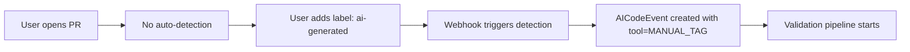

# AI Detection Service - Interface Design
## Technical Specification - AI Safety Layer Component

**Version**: 1.0.0
**Date**: January 6, 2026
**Status**: ✅ **APPROVED** for Sprint 41-42 Implementation
**Author**: Backend Team
**Framework**: SDLC 5.1.1 Complete Lifecycle
**Epic**: EP-02 AI Safety Layer v1
**Sprint**: Sprint 41-42

---

## 1. Overview

### 1.1 Purpose

AI Detection Service identifies whether a Pull Request contains AI-generated code. This is the **entry point** for the AI Safety Layer validation pipeline.

**Detection Accuracy Target**: ≥85% on 100-PR test dataset

### 1.2 Scope

**In Scope (v1)**:
- ✅ GitHub PR detection (primary)
- ✅ Multi-strategy detection (metadata, API, manual)
- ✅ Confidence scoring (0.0 - 1.0)
- ✅ Support for 8 AI tools (Cursor, Copilot, Claude Code, ChatGPT, etc.)

**Out of Scope (v1)**:
- ❌ GitLab MR detection (defer to Sprint 44+)
- ❌ Real-time commit detection (defer to v2)
- ❌ IDE plugin integration (defer to v2)

---

## 2. Detection Strategies

### 2.1 Strategy Overview

| Strategy | Accuracy | Latency | Pros | Cons |
|----------|----------|---------|------|------|
| **Metadata Analysis** | ~70% | <100ms | Fast, no API calls | High false negatives |
| **GitHub API** | ~85% | <500ms | Reliable, tool-specific | Requires API integration |
| **Manual Tagging** | 100% | 0ms | Perfect accuracy | Requires user action |
| **Combined Weighted** | **≥85%** | <600ms | Best of all worlds | Complex tuning |

### 2.2 Strategy 1: Metadata Analysis

**How it works**: Search PR title/body/commits for AI tool keywords.

**Detection Patterns**:
```yaml
Cursor:
  - Keywords: ["cursor", "cursor.sh", "cursor ai"]
  - Commit patterns: "feat: add login with Cursor", "Cursor-generated"
  - Committer emails: "*@cursor.sh"

GitHub Copilot:
  - Keywords: ["copilot", "github copilot", "🤖", "co-pilot"]
  - Commit patterns: "Copilot suggested", "AI pair programming"
  - Committer emails: "copilot-*@github.com"

Claude Code:
  - Keywords: ["claude", "anthropic", "claude code", "claude ai"]
  - Commit patterns: "Claude Code:", "Generated by Claude"

ChatGPT:
  - Keywords: ["chatgpt", "gpt-4", "openai", "chatgpt-generated"]
  - Commit patterns: "ChatGPT:", "GPT-4 code"

Windsurf:
  - Keywords: ["windsurf", "codeium windsurf"]

Cody (Sourcegraph):
  - Keywords: ["cody", "sourcegraph cody"]

Tabnine:
  - Keywords: ["tabnine", "tab nine"]
```

**Confidence Scoring**:
```python
confidence = (title_match * 0.4) + (body_match * 0.3) + (commit_match * 0.3)

# Example:
# - Title: "feat: add login (Cursor)" → 1.0 title_match
# - Body: No mention → 0.0 body_match
# - Commits: 2/5 have "Cursor" → 0.4 commit_match
# → confidence = (1.0 * 0.4) + (0.0 * 0.3) + (0.4 * 0.3) = 0.52
```

---

### 2.3 Strategy 2: GitHub API Integration

**How it works**: Query GitHub API for Copilot-specific metadata.

**GitHub Copilot Detection (Native Support)**:
```python
# GitHub Copilot adds metadata to commits
GET /repos/{owner}/{repo}/commits/{sha}

Response:
{
  "commit": {
    "verification": {
      "verified": true,
      "reason": "valid",
      "signature": "...",
      "payload": "..."
    },
    "copilot": {                           # ← GitHub-specific field
      "enabled": true,
      "suggestions_used": 12,
      "model": "gpt-4-turbo"
    }
  }
}
```

**Other Tools (Heuristic Analysis)**:
```python
# Check PR labels
GET /repos/{owner}/{repo}/pulls/{number}/labels

Response:
[
  {"name": "ai-generated"},
  {"name": "cursor-code"},
  {"name": "needs-human-review"}
]

# Check PR commits committer patterns
GET /repos/{owner}/{repo}/pulls/{number}/commits

Response:
[
  {
    "commit": {
      "committer": {
        "email": "cursor-agent@cursor.sh",  # ← AI tool email
        "name": "Cursor AI"
      }
    }
  }
]
```

**Confidence Scoring**:
```python
confidence = 0.0

if copilot_metadata_present:
    confidence = 1.0  # Native GitHub Copilot detection
elif ai_tool_label_present:
    confidence = 0.95  # Explicit label
elif ai_tool_email_pattern:
    confidence = 0.85  # Committer email match
else:
    confidence = 0.0   # No API evidence
```

---

### 2.4 Strategy 3: Manual Tagging

**How it works**: User explicitly marks PR as AI-generated via label or comment.

**Trigger Mechanisms**:
1. **GitHub Label**: Apply `ai-generated` label to PR
2. **PR Comment**: Comment `/ai-generated cursor` or `/ai-tag claude`
3. **Orchestrator UI**: Mark PR as AI via dashboard checkbox

**Confidence Scoring**:
```python
confidence = 1.0  # Manual tagging is always 100% confident
```

**Workflow**:


---

### 2.5 Combined Weighted Strategy

**How it works**: Aggregate all strategies with weighted voting.

**Weighting Formula**:
```python
final_confidence = max(
    metadata_confidence * 0.30,
    api_confidence * 0.50,
    manual_confidence * 1.00  # Manual always wins
)

# Decision threshold
is_ai_generated = final_confidence > 0.50
```

**Example Scenarios**:

| Scenario | Metadata | API | Manual | Final | Detected? |
|----------|----------|-----|--------|-------|-----------|
| Cursor PR with keywords | 0.60 | 0.00 | 0.00 | 0.18 | ❌ No |
| Copilot with API metadata | 0.00 | 1.00 | 0.00 | 0.50 | ✅ Yes (threshold) |
| Claude with label | 0.40 | 0.00 | 1.00 | 1.00 | ✅ Yes |
| No evidence | 0.00 | 0.00 | 0.00 | 0.00 | ❌ No |

---

## 3. Interface Design

### 3.1 Core Interfaces

```python
# backend/app/services/ai_detection/__init__.py
from abc import ABC, abstractmethod
from dataclasses import dataclass
from typing import Optional, List, Dict
from enum import Enum

class AIToolType(str, Enum):
    """Supported AI coding tools."""
    CURSOR = "cursor"
    COPILOT = "copilot"
    CLAUDE_CODE = "claude_code"
    CHATGPT = "chatgpt"
    WINDSURF = "windsurf"
    CODY = "cody"
    TABNINE = "tabnine"
    OTHER = "other"
    MANUAL_TAG = "manual_tag"

class DetectionMethod(str, Enum):
    """Detection strategy used."""
    METADATA = "metadata"        # PR title/body/commits
    GITHUB_API = "github_api"    # GitHub Copilot API
    MANUAL_LABEL = "manual_label"  # User applied label
    MANUAL_COMMENT = "manual_comment"  # User comment
    COMBINED = "combined"        # Multiple strategies

@dataclass
class DetectionResult:
    """Result from AI detection process."""

    # Detection outcome
    is_ai_generated: bool
    confidence: float  # 0.0 - 1.0

    # Tool identification
    detected_tool: Optional[AIToolType]
    detected_model: Optional[str]  # e.g., "gpt-4-turbo", "claude-3-opus"
    detected_model_version: Optional[str]

    # Detection metadata
    detection_method: DetectionMethod
    strategies_used: List[str]  # ["metadata", "api"]
    detection_evidence: Dict  # Strategy-specific evidence

    # Performance metrics
    detection_duration_ms: int

    def to_dict(self) -> dict:
        """Convert to dict for JSON serialization."""
        return {
            "is_ai_generated": self.is_ai_generated,
            "confidence": self.confidence,
            "detected_tool": self.detected_tool.value if self.detected_tool else None,
            "detected_model": self.detected_model,
            "detected_model_version": self.detected_model_version,
            "detection_method": self.detection_method.value,
            "strategies_used": self.strategies_used,
            "detection_evidence": self.detection_evidence,
            "detection_duration_ms": self.detection_duration_ms,
        }

class AIDetectionStrategy(ABC):
    """Base class for detection strategies."""

    @abstractmethod
    async def detect(
        self,
        pr_data: dict,
        commits: List[dict],
        files_changed: List[dict],
    ) -> DetectionResult:
        """
        Detect AI-generated code in PR.

        Args:
            pr_data: GitHub PR object (from webhook payload)
            commits: List of commit objects for this PR
            files_changed: List of changed files with diffs

        Returns:
            DetectionResult with confidence score
        """
        pass

    @abstractmethod
    def get_strategy_name(self) -> str:
        """Return strategy name for logging."""
        pass

class AIDetectionService(ABC):
    """Service for orchestrating AI detection."""

    @abstractmethod
    async def detect_pr(
        self,
        owner: str,
        repo: str,
        pr_number: int,
    ) -> DetectionResult:
        """
        Detect if PR contains AI-generated code.

        Args:
            owner: GitHub repository owner
            repo: Repository name
            pr_number: Pull request number

        Returns:
            DetectionResult with aggregated confidence
        """
        pass
```

---

### 3.2 Implementation: MetadataDetector

```python
# backend/app/services/ai_detection/metadata_detector.py
import re
from typing import List, Dict
from .base import AIDetectionStrategy, DetectionResult, DetectionMethod, AIToolType

class MetadataDetector(AIDetectionStrategy):
    """Detect AI tools from PR metadata (title, body, commits)."""

    # Tool keyword patterns
    TOOL_PATTERNS = {
        AIToolType.CURSOR: [
            r"\bcursor\b",
            r"cursor\.sh",
            r"cursor\s+ai",
            r"cursor-generated",
        ],
        AIToolType.COPILOT: [
            r"\bcopilot\b",
            r"github\s+copilot",
            r"🤖",
            r"co-pilot",
            r"copilot-suggested",
        ],
        AIToolType.CLAUDE_CODE: [
            r"\bclaude\b",
            r"claude\s+code",
            r"anthropic",
            r"claude\s+ai",
            r"generated\s+by\s+claude",
        ],
        AIToolType.CHATGPT: [
            r"\bchatgpt\b",
            r"gpt-4",
            r"gpt-3\.5",
            r"openai",
            r"chatgpt-generated",
        ],
        AIToolType.WINDSURF: [
            r"\bwindsurf\b",
            r"codeium\s+windsurf",
        ],
        AIToolType.CODY: [
            r"\bcody\b",
            r"sourcegraph\s+cody",
        ],
        AIToolType.TABNINE: [
            r"\btabnine\b",
            r"tab\s+nine",
        ],
    }

    async def detect(
        self,
        pr_data: dict,
        commits: List[dict],
        files_changed: List[dict],
    ) -> DetectionResult:
        """Detect AI tool from metadata analysis."""

        title = (pr_data.get("title") or "").lower()
        body = (pr_data.get("body") or "").lower()

        # Aggregate commit messages
        commit_messages = [
            (commit.get("commit", {}).get("message") or "").lower()
            for commit in commits
        ]

        # Score each tool
        tool_scores = {}
        for tool, patterns in self.TOOL_PATTERNS.items():
            score = self._calculate_tool_score(
                tool, patterns, title, body, commit_messages
            )
            if score > 0:
                tool_scores[tool] = score

        # Determine best match
        if not tool_scores:
            return DetectionResult(
                is_ai_generated=False,
                confidence=0.0,
                detected_tool=None,
                detected_model=None,
                detected_model_version=None,
                detection_method=DetectionMethod.METADATA,
                strategies_used=["metadata"],
                detection_evidence={"matches": []},
                detection_duration_ms=0,
            )

        best_tool = max(tool_scores, key=tool_scores.get)
        confidence = tool_scores[best_tool]

        return DetectionResult(
            is_ai_generated=confidence > 0.5,
            confidence=confidence,
            detected_tool=best_tool,
            detected_model=self._extract_model(body, commit_messages),
            detected_model_version=None,
            detection_method=DetectionMethod.METADATA,
            strategies_used=["metadata"],
            detection_evidence={
                "tool_scores": {t.value: s for t, s in tool_scores.items()},
                "best_match": best_tool.value,
            },
            detection_duration_ms=0,
        )

    def _calculate_tool_score(
        self,
        tool: AIToolType,
        patterns: List[str],
        title: str,
        body: str,
        commit_messages: List[str],
    ) -> float:
        """Calculate confidence score for a specific tool."""

        title_match = any(re.search(p, title, re.IGNORECASE) for p in patterns)
        body_match = any(re.search(p, body, re.IGNORECASE) for p in patterns)

        # Count commits with matches
        commit_matches = sum(
            any(re.search(p, msg, re.IGNORECASE) for p in patterns)
            for msg in commit_messages
        )
        commit_ratio = commit_matches / len(commit_messages) if commit_messages else 0

        # Weighted score
        score = (
            (1.0 if title_match else 0.0) * 0.4 +
            (1.0 if body_match else 0.0) * 0.3 +
            commit_ratio * 0.3
        )

        return score

    def _extract_model(self, body: str, commit_messages: List[str]) -> Optional[str]:
        """Extract AI model name from text."""
        model_patterns = {
            "gpt-4-turbo": r"gpt-?4-?turbo",
            "gpt-4": r"gpt-?4(?!-turbo)",
            "gpt-3.5-turbo": r"gpt-?3\.5-?turbo",
            "claude-3-opus": r"claude-?3-?opus",
            "claude-3-sonnet": r"claude-?3-?sonnet",
        }

        text = f"{body} {' '.join(commit_messages)}".lower()

        for model_name, pattern in model_patterns.items():
            if re.search(pattern, text, re.IGNORECASE):
                return model_name

        return None

    def get_strategy_name(self) -> str:
        return "metadata"
```

---

### 3.3 Implementation: GitHubAPIDetector

```python
# backend/app/services/ai_detection/github_api_detector.py
from typing import List, Optional
import httpx
from .base import AIDetectionStrategy, DetectionResult, DetectionMethod, AIToolType

class GitHubAPIDetector(AIDetectionStrategy):
    """Detect AI tools using GitHub API metadata."""

    def __init__(self, github_token: str):
        self.github_token = github_token
        self.client = httpx.AsyncClient(
            headers={"Authorization": f"Bearer {github_token}"}
        )

    async def detect(
        self,
        pr_data: dict,
        commits: List[dict],
        files_changed: List[dict],
    ) -> DetectionResult:
        """Detect AI from GitHub API data."""

        # Check for Copilot metadata in commits
        copilot_detected = await self._check_copilot_metadata(commits)
        if copilot_detected:
            return copilot_detected

        # Check PR labels
        label_detected = self._check_labels(pr_data)
        if label_detected:
            return label_detected

        # Check committer emails
        email_detected = self._check_committer_emails(commits)
        if email_detected:
            return email_detected

        # No API evidence found
        return DetectionResult(
            is_ai_generated=False,
            confidence=0.0,
            detected_tool=None,
            detected_model=None,
            detected_model_version=None,
            detection_method=DetectionMethod.GITHUB_API,
            strategies_used=["github_api"],
            detection_evidence={"no_api_evidence": True},
            detection_duration_ms=0,
        )

    async def _check_copilot_metadata(self, commits: List[dict]) -> Optional[DetectionResult]:
        """Check for GitHub Copilot metadata in commits."""
        # GitHub Copilot adds metadata to commit payloads
        for commit in commits:
            copilot_data = commit.get("copilot", {})
            if copilot_data.get("enabled"):
                return DetectionResult(
                    is_ai_generated=True,
                    confidence=1.0,
                    detected_tool=AIToolType.COPILOT,
                    detected_model=copilot_data.get("model", "copilot"),
                    detected_model_version=None,
                    detection_method=DetectionMethod.GITHUB_API,
                    strategies_used=["github_api"],
                    detection_evidence={
                        "copilot_metadata": copilot_data,
                        "suggestions_used": copilot_data.get("suggestions_used"),
                    },
                    detection_duration_ms=0,
                )
        return None

    def _check_labels(self, pr_data: dict) -> Optional[DetectionResult]:
        """Check PR labels for AI markers."""
        labels = [label["name"].lower() for label in pr_data.get("labels", [])]

        ai_label_map = {
            "ai-generated": AIToolType.MANUAL_TAG,
            "cursor-code": AIToolType.CURSOR,
            "copilot-code": AIToolType.COPILOT,
            "claude-code": AIToolType.CLAUDE_CODE,
        }

        for label_name, tool in ai_label_map.items():
            if label_name in labels:
                return DetectionResult(
                    is_ai_generated=True,
                    confidence=0.95,
                    detected_tool=tool,
                    detected_model=None,
                    detected_model_version=None,
                    detection_method=DetectionMethod.MANUAL_LABEL,
                    strategies_used=["github_api"],
                    detection_evidence={"label": label_name},
                    detection_duration_ms=0,
                )

        return None

    def _check_committer_emails(self, commits: List[dict]) -> Optional[DetectionResult]:
        """Check committer emails for AI tool patterns."""
        email_patterns = {
            r".*@cursor\.sh": AIToolType.CURSOR,
            r"copilot-.*@github\.com": AIToolType.COPILOT,
            r".*@anthropic\.com": AIToolType.CLAUDE_CODE,
        }

        for commit in commits:
            email = commit.get("commit", {}).get("committer", {}).get("email", "").lower()
            for pattern, tool in email_patterns.items():
                if re.match(pattern, email):
                    return DetectionResult(
                        is_ai_generated=True,
                        confidence=0.85,
                        detected_tool=tool,
                        detected_model=None,
                        detected_model_version=None,
                        detection_method=DetectionMethod.GITHUB_API,
                        strategies_used=["github_api"],
                        detection_evidence={"committer_email": email},
                        detection_duration_ms=0,
                    )

        return None

    def get_strategy_name(self) -> str:
        return "github_api"
```

---

### 3.4 Implementation: CombinedDetectionService

```python
# backend/app/services/ai_detection/service.py
from typing import List
import time
from .base import AIDetectionService, DetectionResult, DetectionMethod
from .metadata_detector import MetadataDetector
from .github_api_detector import GitHubAPIDetector

class GitHubAIDetectionService(AIDetectionService):
    """
    Orchestrate multiple detection strategies for GitHub PRs.

    Combines metadata analysis and GitHub API checks with weighted voting.
    """

    def __init__(self, github_token: str):
        self.metadata_detector = MetadataDetector()
        self.github_api_detector = GitHubAPIDetector(github_token)

    async def detect_pr(
        self,
        owner: str,
        repo: str,
        pr_number: int,
    ) -> DetectionResult:
        """
        Detect AI-generated code in GitHub PR.

        Process:
        1. Fetch PR data from GitHub API
        2. Run metadata detection
        3. Run GitHub API detection
        4. Combine results with weighted voting
        5. Return final detection result
        """
        start_time = time.time()

        # Fetch PR data
        pr_data = await self._fetch_pr_data(owner, repo, pr_number)
        commits = await self._fetch_commits(owner, repo, pr_number)
        files_changed = await self._fetch_files(owner, repo, pr_number)

        # Run detection strategies
        metadata_result = await self.metadata_detector.detect(pr_data, commits, files_changed)
        api_result = await self.github_api_detector.detect(pr_data, commits, files_changed)

        # Combine results
        final_result = self._combine_results(metadata_result, api_result)

        # Add timing
        duration_ms = int((time.time() - start_time) * 1000)
        final_result.detection_duration_ms = duration_ms

        return final_result

    def _combine_results(
        self,
        metadata: DetectionResult,
        api: DetectionResult,
    ) -> DetectionResult:
        """
        Combine multiple detection results with weighted voting.

        Weights:
        - Metadata: 0.30
        - GitHub API: 0.50
        - Manual (in API result): 1.00 (always wins)

        Decision threshold: 0.50
        """

        # Manual tagging always wins
        if api.detection_method in [DetectionMethod.MANUAL_LABEL, DetectionMethod.MANUAL_COMMENT]:
            return api

        # Calculate weighted confidence
        weighted_confidence = max(
            metadata.confidence * 0.30,
            api.confidence * 0.50,
        )

        # Choose best tool detection
        detected_tool = None
        if api.confidence > metadata.confidence:
            detected_tool = api.detected_tool
            detected_model = api.detected_model
        else:
            detected_tool = metadata.detected_tool
            detected_model = metadata.detected_model

        # Combine evidence
        combined_evidence = {
            "metadata": metadata.detection_evidence,
            "api": api.detection_evidence,
            "weights": {"metadata": 0.30, "api": 0.50},
        }

        return DetectionResult(
            is_ai_generated=weighted_confidence > 0.50,
            confidence=weighted_confidence,
            detected_tool=detected_tool,
            detected_model=detected_model,
            detected_model_version=None,
            detection_method=DetectionMethod.COMBINED,
            strategies_used=["metadata", "github_api"],
            detection_evidence=combined_evidence,
            detection_duration_ms=0,  # Will be updated by caller
        )

    async def _fetch_pr_data(self, owner: str, repo: str, pr_number: int) -> dict:
        """Fetch PR data from GitHub API."""
        # Implementation: httpx.get(f"https://api.github.com/repos/{owner}/{repo}/pulls/{pr_number}")
        pass

    async def _fetch_commits(self, owner: str, repo: str, pr_number: int) -> List[dict]:
        """Fetch PR commits from GitHub API."""
        # Implementation: httpx.get(f"https://api.github.com/repos/{owner}/{repo}/pulls/{pr_number}/commits")
        pass

    async def _fetch_files(self, owner: str, repo: str, pr_number: int) -> List[dict]:
        """Fetch PR files changed from GitHub API."""
        # Implementation: httpx.get(f"https://api.github.com/repos/{owner}/{repo}/pulls/{pr_number}/files")
        pass
```

---

## 4. API Endpoints

```python
# backend/app/api/routes/ai_detection.py
from fastapi import APIRouter, Depends
from app.services.ai_detection import GitHubAIDetectionService

router = APIRouter(prefix="/api/v1/ai-detection", tags=["AI Detection"])

@router.post("/detect-pr")
async def detect_pr(
    owner: str,
    repo: str,
    pr_number: int,
    detection_service: GitHubAIDetectionService = Depends(),
):
    """
    Detect if a GitHub PR contains AI-generated code.

    Request:
        POST /api/v1/ai-detection/detect-pr
        {
            "owner": "anthropics",
            "repo": "sdlc-orchestrator",
            "pr_number": 123
        }

    Response:
        {
            "is_ai_generated": true,
            "confidence": 0.85,
            "detected_tool": "cursor",
            "detected_model": "gpt-4-turbo",
            "detection_method": "combined",
            "strategies_used": ["metadata", "github_api"],
            "detection_evidence": {...},
            "detection_duration_ms": 450
        }
    """
    result = await detection_service.detect_pr(owner, repo, pr_number)
    return result.to_dict()
```

---

## 5. Testing Strategy

### 5.1 Test Dataset

**100-PR Test Dataset** (to be collected in Sprint 41):
- 25 Cursor PRs
- 25 GitHub Copilot PRs
- 15 Claude Code PRs
- 10 ChatGPT PRs
- 5 Windsurf PRs
- 5 Other AI tools
- 15 Human-written PRs (control group)

### 5.2 Unit Tests

```python
# tests/services/ai_detection/test_metadata_detector.py
import pytest
from app.services.ai_detection.metadata_detector import MetadataDetector

@pytest.mark.asyncio
async def test_metadata_detector_cursor():
    detector = MetadataDetector()

    pr_data = {
        "title": "feat: add login with Cursor",
        "body": "This feature was generated by Cursor AI",
    }
    commits = [{"commit": {"message": "Cursor-generated code"}}]

    result = await detector.detect(pr_data, commits, [])

    assert result.is_ai_generated is True
    assert result.detected_tool == AIToolType.CURSOR
    assert result.confidence > 0.5

@pytest.mark.asyncio
async def test_metadata_detector_no_match():
    detector = MetadataDetector()

    pr_data = {"title": "fix: typo in README", "body": ""}
    commits = [{"commit": {"message": "fix typo"}}]

    result = await detector.detect(pr_data, commits, [])

    assert result.is_ai_generated is False
    assert result.confidence == 0.0
```

### 5.3 Integration Tests

**Target**: ≥85% accuracy on 100-PR dataset

---

## 6. Performance Requirements

| Metric | Target | Measurement |
|--------|--------|-------------|
| **Detection Latency (p95)** | <600ms | Prometheus |
| **Detection Accuracy** | ≥85% | 100-PR test dataset |
| **False Positive Rate** | <10% | Manual review |
| **False Negative Rate** | <15% | Manual review |

---

## 7. Security & Privacy

**GDPR Compliance**:
- ❌ **DO NOT store** raw AI prompts (may contain PII)
- ✅ **Store** SHA-256 hash of prompts only
- ✅ **Store** redacted preview (first 100 chars, PII removed)

**Secret Detection**:
- ✅ Scan commit messages/PR body for secrets before storage
- ✅ Flag events with `contains_secrets=True`
- ❌ Block storage if secrets detected

---

## 8. Next Steps

### Sprint 41 (Week 1)
- [x] Design interface (ADR complete)
- [ ] Implement MetadataDetector (Day 1-2)
- [ ] Implement GitHubAPIDetector (Day 3-4)
- [ ] Collect 100-PR test dataset (Day 5)

### Sprint 42 (Week 1)
- [ ] Implement CombinedDetectionService
- [ ] Add API endpoints
- [ ] Write unit tests (≥90% coverage)
- [ ] Run accuracy validation on test dataset

---

**Document Version**: 1.0.0
**Created**: January 6, 2026
**Framework**: SDLC 5.1.1 Complete Lifecycle
