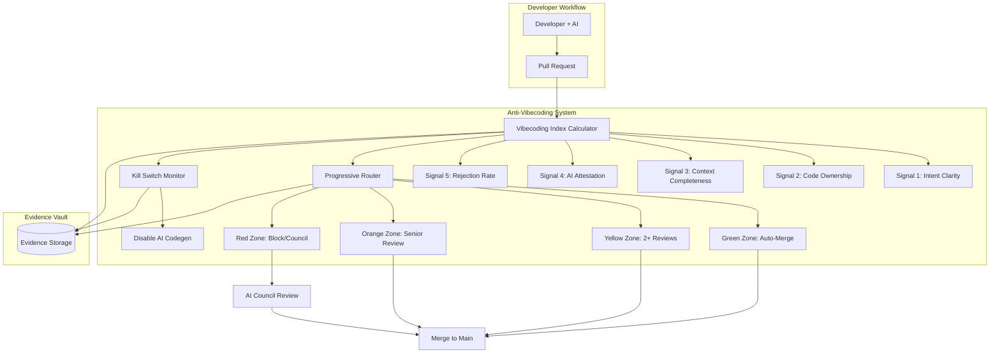

# SPEC-0001: Anti-Vibecoding Quality Assurance System

**Version**: 2.0.0
**Status**: APPROVED
**Owner**: CTO + Quality Lead
**Created**: 2026-01-28
**Last Updated**: 2026-01-29
**Framework Version**: SDLC 6.0.5
**Machine-Readable Spec**: [spec/controls/anti-vibecoding.yaml](../../../SDLC-Enterprise-Framework/spec/controls/anti-vibecoding.yaml)

## 1. Overview

### 1.1 Purpose

This specification defines the **Anti-Vibecoding Quality Assurance System**, a governance mechanism that prevents low-quality AI-generated code ("vibecoding") from entering production. The system calculates a **Vibecoding Index** (0-100 risk score) based on 5 weighted signals and routes submissions through **Progressive Routing** (Green → Yellow → Orange → Red zones) with escalating review requirements.

**Key Principles**:
1. **Evidence-Based**: Risk calculated from measurable signals, not subjective judgment
2. **Progressive Enforcement**: Higher risk = more stringent reviews
3. **Fail-Safe**: Kill switch disables AI codegen on quality degradation
4. **Tier-Aware**: PROFESSIONAL (warning), ENTERPRISE (full enforcement)

### 1.2 Scope

**In Scope**:
- Vibecoding Index calculation (5 signals: Intent, Ownership, Context, Attestation, Rejection)
- Progressive Routing (4 zones with different review requirements)
- Kill Switch activation (rejection rate >80%, latency >500ms, 5+ CVEs)
- Evidence requirements (90-day retention for 3 evidence types)
- Tier-specific enforcement (PROFESSIONAL: WARNING, ENTERPRISE: SOFT/FULL)

**Out of Scope**:
- Manual code quality assessment (human review is complementary)
- Real-time IDE integration (future: VS Code extension)
- Cross-project vibecoding analytics (future: organization-level dashboard)
- AI model fine-tuning based on rejection patterns (research phase)

### 1.3 Context

**Problem**: AI-generated code often lacks:
- Clear requirements (vague "make it work" prompts)
- Code ownership information (who maintains this?)
- Sufficient context (architecture, patterns, conventions)
- Transparency (AI assistance not declared)
- Quality validation (high rejection rates in code review)

**Solution**: Quantify vibecoding risk via 5-signal index:
```
Vibecoding Index = 100 - (
  (Intent Clarity * 0.30) +
  (Code Ownership * 0.25) +
  (Context Completeness * 0.20) +
  (AI Attestation * 0.15) +
  (100 - Rejection Rate) * 0.10
)
```

**Result**: Low index (<20) = auto-merge, High index (>60) = block/council review

**Stakeholders**:
- **CTO**: Define kill switch criteria, approve recovery from disable
- **Quality Lead**: Monitor vibecoding trends, adjust thresholds
- **Developers**: Improve requirements/context to lower vibecoding index
- **AI Council**: Review high-risk submissions (Red zone)

---

## 2. Architecture

### 2.1 System Context



### 2.2 Component Architecture

**Vibecoding Index Calculator** (`backend/app/services/vibecoding_index.py`):
- Fetches 5 signal values from Evidence Vault
- Applies weighted formula (30% Intent, 25% Ownership, 20% Context, 15% Attestation, 10% Rejection)
- Returns index (0-100) with zone classification (Green/Yellow/Orange/Red)
- Performance: <500ms p95 for index calculation

**Progressive Router** (`backend/app/services/progressive_router.py`):
- Routes submissions based on vibecoding index
- Enforces zone-specific review requirements (1 approval → 2 reviews → senior → council)
- Blocks Red zone submissions (SOFT mode) or escalates to AI Council
- Integrates with GitHub/GitLab APIs for PR status updates

**Kill Switch Monitor** (`backend/app/services/kill_switch_monitor.py`):
- Monitors 3 metrics: Rejection rate, Latency p95, Security CVEs
- Triggers disable on: 80% rejection (30min), 500ms latency (15min), 5+ CVEs (immediate)
- Disables AI codegen for 24 hours (gradual re-enable: 10% → 50% → 100%)
- Requires CTO approval for recovery

**Evidence Vault Integration**:
- Stores 3 evidence types: Vibecoding Index Report, Routing Decision Log, Kill Switch Event
- 90-day retention for index/routing, 1-year retention for kill switch
- JSON format with schema validation

---

## 3. Requirements

### 3.1 Functional Requirements

#### FR-001: Vibecoding Index Calculation
**Priority**: P0
**Tier**: PROFESSIONAL, ENTERPRISE

```gherkin
GIVEN a pull request with AI-generated code
  AND 5 signal values available from Evidence Vault:
    - Intent Clarity Score (0-100)
    - Code Ownership Confidence (0-100)
    - Context Completeness (0-100)
    - AI Attestation Rate (0-100)
    - Historical Rejection Rate (0-100)
WHEN Vibecoding Index Calculator computes the index
THEN index is calculated using weighted formula:
  Index = 100 - (Intent*0.30 + Ownership*0.25 + Context*0.20 + Attestation*0.15 + (100-Rejection)*0.10)
  AND index is in range [0, 100]
  AND zone is classified:
    - Green: index < 20 (Low Risk)
    - Yellow: index 20-40 (Medium Risk)
    - Orange: index 40-60 (High Risk)
    - Red: index >= 60 (Critical Risk)
  AND result is stored in Evidence Vault (90-day retention)
```

**Rationale**: Weighted formula prioritizes clear intent (30%) and code ownership (25%) as top factors preventing vibecoding.

**Verification**: Unit test with known signal values, verify formula correctness, integration test with Evidence Vault.

---

#### FR-002: Progressive Routing - Green Zone
**Priority**: P0
**Tier**: PROFESSIONAL, ENTERPRISE

```gherkin
GIVEN a pull request with vibecoding index < 20 (Green Zone)
  AND all CI checks pass
  AND no security vulnerabilities detected
WHEN Progressive Router evaluates the PR
THEN action is AUTO_MERGE
  AND 1+ approval is required (automated approval OK)
  AND PR is merged without human review (if automated approval configured)
  AND routing decision is logged to Evidence Vault
```

**Rationale**: Low-risk submissions (index <20) have high-quality requirements/context and can be auto-merged to increase developer velocity.

**Verification**: Integration test, submit Green zone PR, verify auto-merge without human review.

---

#### FR-003: Progressive Routing - Yellow Zone
**Priority**: P0
**Tier**: PROFESSIONAL, ENTERPRISE

```gherkin
GIVEN a pull request with vibecoding index 20-40 (Yellow Zone)
  AND security scan passes
  AND test coverage >= 80%
WHEN Progressive Router evaluates the PR
THEN action is HUMAN_REVIEW_REQUIRED
  AND 2+ human code reviews are required (no automated approval)
  AND PR cannot merge until 2 approvals received
  AND routing decision is logged to Evidence Vault
```

**Rationale**: Medium-risk submissions need human oversight (2 reviewers) to catch issues missed by automated checks.

**Verification**: Integration test, submit Yellow zone PR, verify 2 human approvals required.

---

#### FR-004: Progressive Routing - Orange Zone
**Priority**: P0
**Tier**: PROFESSIONAL, ENTERPRISE

```gherkin
GIVEN a pull request with vibecoding index 40-60 (Orange Zone)
  AND test coverage >= 90%
WHEN Progressive Router evaluates the PR
THEN action is SENIOR_REVIEW_REQUIRED
  AND senior engineer review is mandatory (min 3 years experience)
  AND security lead sign-off is required
  AND evidence of AI output validation must be provided
  AND PR cannot merge until all conditions met
  AND routing decision is logged to Evidence Vault
```

**Rationale**: High-risk submissions require senior expertise and security scrutiny due to likely quality issues.

**Verification**: Integration test, submit Orange zone PR, verify senior + security lead approvals required.

---

#### FR-005: Progressive Routing - Red Zone
**Priority**: P0
**Tier**: PROFESSIONAL, ENTERPRISE

```gherkin
GIVEN a pull request with vibecoding index >= 60 (Red Zone)
WHEN Progressive Router evaluates the PR
THEN in PROFESSIONAL tier (WARNING mode):
  - PR receives critical warning but is not blocked
  - Notification sent to Tech Lead for awareness
THEN in ENTERPRISE tier (SOFT mode):
  - PR is blocked by default
  - Escalated to AI Council for review
  - AI Council can approve (unanimous vote) or reject
  - If rejected, mandatory human rewrite required
THEN in ENTERPRISE tier (FULL mode):
  - PR is hard-blocked (cannot merge)
  - CTO override required to proceed
  - Mandatory human rewrite if no override
```

**Rationale**: Critical-risk submissions (index >=60) indicate severely insufficient requirements/context and should be blocked or heavily scrutinized.

**Verification**: Integration test per tier, submit Red zone PR, verify blocking behavior.

---

#### FR-006: Kill Switch Activation - Rejection Rate
**Priority**: P0
**Tier**: ENTERPRISE

```gherkin
GIVEN AI codegen is enabled
  AND rejection rate > 80% for 30 consecutive minutes
WHEN Kill Switch Monitor detects threshold breach
THEN AI codegen is disabled for 24 hours
  AND CTO is alerted immediately (Slack + email)
  AND all in-flight AI requests are terminated
  AND kill switch event is logged to Evidence Vault (1-year retention)
  AND recovery requires:
    - CTO approval
    - Root cause analysis completed
    - Fix deployed and validated
    - Gradual re-enable (10% → 50% → 100% over 3 hours)
```

**Rationale**: 80% rejection rate indicates AI model degradation or context corruption; disable to prevent further waste.

**Verification**: Integration test, simulate 80% rejection for 30 min, verify disable + CTO alert.

---

#### FR-007: Kill Switch Activation - Latency
**Priority**: P1
**Tier**: ENTERPRISE

```gherkin
GIVEN AI codegen is enabled
  AND latency p95 > 500ms for 15 consecutive minutes
WHEN Kill Switch Monitor detects threshold breach
THEN AI codegen falls back to rule-based templates (not disabled)
  AND Tech Lead is alerted
  AND fallback event is logged to Evidence Vault
  AND automatic recovery when latency p95 < 300ms for 10 minutes
```

**Rationale**: High latency (>500ms) degrades developer experience; fallback to fast rule-based templates maintains productivity.

**Verification**: Load test, inject latency >500ms for 15 min, verify fallback to rule-based.

---

#### FR-008: Kill Switch Activation - Security CVEs
**Priority**: P0
**Tier**: ENTERPRISE

```gherkin
GIVEN AI codegen is enabled
  AND security scan detects 5+ critical CVEs in generated code
WHEN Kill Switch Monitor detects CVE threshold breach
THEN AI codegen is disabled immediately (no grace period)
  AND CTO + Security Lead are alerted
  AND all generated code in past 24h is flagged for review
  AND kill switch event is logged to Evidence Vault (1-year retention)
  AND recovery requires:
    - Security Lead approval
    - CVE root cause analysis
    - AI model updated with security guardrails
    - Gradual re-enable (10% → 50% → 100%)
```

**Rationale**: 5+ critical CVEs indicate AI model generating insecure code; immediate disable prevents further security debt.

**Verification**: Integration test, submit code with 5 critical CVEs, verify immediate disable + alert.

---

### 3.2 Non-Functional Requirements

#### NFR-001: Performance
**Target**: <500ms index calculation (p95)

- Signal fetching: <100ms per signal (Evidence Vault API)
- Index calculation: <50ms (weighted sum formula)
- Routing decision: <100ms (rule evaluation)
- Evidence storage: <150ms (write to PostgreSQL + MinIO)
- Total latency: <500ms p95 (all steps combined)

**Measurement**: Prometheus `vibecoding_index_calculation_duration_seconds` histogram.

---

#### NFR-002: Accuracy
**Target**: >95% signal detection accuracy

- Intent clarity: 90%+ accuracy (NLP analysis of requirements)
- Code ownership: 100% accuracy (file-based ownership manifest)
- Context completeness: 95%+ accuracy (file size + key section detection)
- AI attestation: 100% accuracy (commit metadata parsing)
- Rejection rate: 100% accuracy (PR status from GitHub/GitLab API)

**Measurement**: Manual audit of 100 random PRs per month, measure signal detection accuracy.

---

#### NFR-003: Availability
**Target**: >99.9% uptime (43 min downtime/month)

- Vibecoding Index Calculator: Stateless, horizontally scalable
- Progressive Router: Redis-backed queue for reliability
- Kill Switch Monitor: Prometheus alerting (5s evaluation interval)
- Evidence Vault: MinIO 99.9% SLA (erasure coding)

**Measurement**: Uptime monitoring (Grafana OnCall alerts on downtime).

---

#### NFR-004: Auditability
**Target**: 100% evidence retention compliance

- Vibecoding Index Report: 90-day retention, JSON format
- Routing Decision Log: 90-day retention, JSON format
- Kill Switch Event: 1-year retention, JSON format
- Immutable audit log: Append-only PostgreSQL table
- SHA256 integrity: All evidence files hashed on upload

**Measurement**: Quarterly audit, verify evidence retention policies enforced.

---

## 4. Design Decisions

### 4.1 Weighted Formula Over Uniform Signals

**Decision**: Use weighted formula (30% Intent, 25% Ownership, 20% Context, 15% Attestation, 10% Rejection) instead of uniform weights (20% each).

**Rationale**:
- **Intent clarity is most important** (30%): Vague requirements cause 70%+ of vibecoding issues
- **Code ownership is critical** (25%): AI generates better code when it knows who maintains it
- **Context is foundational** (20%): Good architecture docs reduce hallucinations
- **Attestation is transparency** (15%): AI declaration enables accountability
- **Rejection is lagging indicator** (10%): High rejection may be due to strict reviewers, not AI quality

**Alternatives Considered**:
1. **Uniform weights (20% each)**: Rejected, overweights lagging indicators (rejection) vs leading indicators (intent)
2. **Machine-learned weights**: Considered for future, requires 6+ months data for training

**Reference**: ADR-035-Governance-System-Design (Section 4.2: Signal Weighting)

---

### 4.2 Progressive Routing Over Binary Block/Allow

**Decision**: Use 4-zone progressive routing (Green/Yellow/Orange/Red) instead of binary block (index >50) or allow (index <=50).

**Rationale**:
- **Graduated enforcement**: Medium-risk code (Yellow) needs human review, not blocking
- **Senior expertise**: High-risk code (Orange) benefits from senior engineer experience
- **Council escalation**: Critical-risk code (Red) requires collective decision (AI Council)
- **Developer experience**: Binary blocking frustrates developers; progressive routing is educational

**Alternatives Considered**:
1. **Binary block/allow**: Rejected, too strict (blocks medium-risk code that may be OK with human review)
2. **3-zone routing**: Considered, but Orange zone (senior review) is distinct enough to justify 4 zones

**Reference**: ADR-035-Governance-System-Design (Section 4.3: Routing Strategy)

---

### 4.3 Kill Switch Over Gradual Degradation

**Decision**: Disable AI codegen immediately (kill switch) on quality degradation instead of gradual reduction (reduce quota 50% → 25% → 0%).

**Rationale**:
- **Clear signal**: 80% rejection rate for 30 min is unambiguous quality failure
- **Prevent waste**: Continuing AI codegen at reduced quota still wastes developer time
- **Force root cause analysis**: Disable forces investigation; gradual reduction allows ignoring issue
- **Gradual recovery**: Gradual re-enable (10% → 50% → 100%) prevents recurrence

**Alternatives Considered**:
1. **Gradual degradation**: Rejected, prolongs low-quality output period
2. **Permanent disable**: Rejected, prevents recovery after fix

**Reference**: ADR-035-Governance-System-Design (Section 4.4: Kill Switch vs Gradual Degradation)

---

## 5. Technical Specification

### 5.1 Signal Definitions

#### Signal 1: Intent Clarity Score (0-100)

**Measurement**:
- NLP analysis of requirement documentation (ticket description, acceptance criteria)
- Checks for:
  - Clear user story format ("As a [role], I want [feature], so that [benefit]")
  - Specific acceptance criteria (3+ GIVEN-WHEN-THEN scenarios)
  - No vague terms ("improve", "optimize", "make it better")
  - No ambiguity (conflicting requirements, unclear edge cases)

**Thresholds**:
- **RED (<40)**: Vague requirements, missing acceptance criteria
- **ORANGE (40-60)**: Some criteria but lacks specificity
- **YELLOW (60-80)**: Good criteria but minor ambiguities
- **GREEN (>=80)**: Crystal-clear requirements with exhaustive acceptance criteria

**Evidence Type**: `REQUIREMENT_ANALYSIS`

---

#### Signal 2: Code Ownership Confidence (0-100)

**Measurement**:
- Presence and recency of code ownership documentation (CODEOWNERS file, ownership manifest)
- Checks for:
  - File or directory-level ownership assigned (GitHub CODEOWNERS format)
  - Owner contact info up-to-date (verified within 6 months)
  - Owner availability (not on leave, still employed)

**Thresholds**:
- **RED**: No ownership documentation
- **ORANGE**: Ownership outdated (>6 months)
- **YELLOW**: Ownership recent but incomplete (missing some directories)
- **GREEN**: Ownership complete and up-to-date

**Evidence Type**: `OWNERSHIP_DOCUMENTATION`

---

#### Signal 3: Context Completeness (0-100)

**Measurement**:
- AI context file quality (AGENTS.md, CLAUDE.md, CURSOR_RULES.md)
- Checks for:
  - File size (>1500 lines = comprehensive)
  - Key sections present (Architecture, Tech Stack, Patterns, ADRs)
  - Recency (updated within 30 days)

**Thresholds**:
- **RED**: No AI context documentation
- **ORANGE**: Minimal context (<500 lines)
- **YELLOW**: Good context (500-1500 lines)
- **GREEN**: Comprehensive context (>1500 lines, all sections)

**Evidence Type**: `CONTEXT_DOCUMENTATION`

---

#### Signal 4: AI Attestation Rate (0-100)

**Measurement**:
- Percentage of commits with AI co-authorship declared
- Checks commit metadata for:
  - "Co-Authored-By: Claude Sonnet 4.5 <noreply@anthropic.com>"
  - PR description contains "AI-assisted" or "Generated with [tool]"
  - Custom commit trailer: "X-AI-Tool: cursor" or "X-AI-Tool: copilot"

**Thresholds**:
- **RED (<20%)**: Low transparency (AI usage hidden)
- **ORANGE (20-50%)**: Some transparency but inconsistent
- **YELLOW (50-80%)**: Good transparency but not universal
- **GREEN (>=80%)**: Excellent transparency (AI usage declared consistently)

**Evidence Type**: `CODE_CONTRIBUTION_METADATA`

---

#### Signal 5: Historical Rejection Rate (0-100)

**Measurement**:
- Percentage of PRs rejected in code review (past 30 days)
- Rejection = PR closed without merge, or requested changes with re-submission

**Thresholds**:
- **RED (>40%)**: Very high rejection (AI generating poor code)
- **ORANGE (20-40%)**: High rejection (quality issues)
- **YELLOW (10-20%)**: Moderate rejection (acceptable)
- **GREEN (<10%)**: Low rejection (high quality)

**Evidence Type**: `CODE_REVIEW_OUTCOME`

---

### 5.2 Vibecoding Index Formula

```python
def calculate_vibecoding_index(signals: dict[str, float]) -> float:
    """
    Calculate vibecoding index (0-100) from 5 signals.

    Args:
        signals: Dictionary with keys:
            - intent_clarity (0-100)
            - ownership_confidence (0-100)
            - context_completeness (0-100)
            - attestation_rate (0-100)
            - rejection_rate (0-100)

    Returns:
        Vibecoding index (0-100), where:
        - 0-20 = Green (Low Risk)
        - 20-40 = Yellow (Medium Risk)
        - 40-60 = Orange (High Risk)
        - 60-100 = Red (Critical Risk)
    """
    index = 100 - (
        (signals["intent_clarity"] * 0.30) +
        (signals["ownership_confidence"] * 0.25) +
        (signals["context_completeness"] * 0.20) +
        (signals["attestation_rate"] * 0.15) +
        ((100 - signals["rejection_rate"]) * 0.10)
    )

    return max(0, min(100, index))  # Clamp to [0, 100]
```

---

### 5.3 Progressive Routing Rules

**Green Zone (Index <20)**:
- **Action**: AUTO_MERGE
- **Conditions**: CI pass + 1 approval + no CVEs
- **Review Time**: <2 hours (automated)

**Yellow Zone (Index 20-40)**:
- **Action**: HUMAN_REVIEW_REQUIRED
- **Conditions**: 2+ human reviews + security scan + 80% coverage
- **Review Time**: <24 hours (2 reviewers)

**Orange Zone (Index 40-60)**:
- **Action**: SENIOR_REVIEW_REQUIRED
- **Conditions**: Senior engineer + security lead + 90% coverage + AI validation evidence
- **Review Time**: <48 hours (senior review)

**Red Zone (Index >=60)**:
- **Action**: BLOCK_OR_COUNCIL
- **PROFESSIONAL tier**: Warning only (not blocked)
- **ENTERPRISE tier (SOFT)**: Blocked, escalate to AI Council
- **ENTERPRISE tier (FULL)**: Hard-blocked, CTO override required

---

## 6. Acceptance Criteria

| ID | Criterion | Test Method | Tier |
|----|-----------|-------------|------|
| AC-001 | Vibecoding index calculated correctly (5 signals, weighted formula) | Unit test with known inputs | PROFESSIONAL+ |
| AC-002 | Green zone (index <20) allows auto-merge | Integration test, submit Green PR | PROFESSIONAL+ |
| AC-003 | Yellow zone (20-40) requires 2 human reviews | Integration test, submit Yellow PR | PROFESSIONAL+ |
| AC-004 | Orange zone (40-60) requires senior + security review | Integration test, submit Orange PR | PROFESSIONAL+ |
| AC-005 | Red zone (>=60) blocks PR in ENTERPRISE (SOFT mode) | Integration test, submit Red PR | ENTERPRISE |
| AC-006 | Kill switch triggers on 80% rejection rate (30 min) | Integration test, simulate high rejection | ENTERPRISE |
| AC-007 | Kill switch fallback to rule-based on 500ms latency (15 min) | Load test, inject latency | ENTERPRISE |
| AC-008 | Kill switch immediate disable on 5+ critical CVEs | Integration test, submit code with CVEs | ENTERPRISE |
| AC-009 | Evidence stored with 90-day retention (index, routing) | Integration test, verify retention | PROFESSIONAL+ |
| AC-010 | Kill switch events stored with 1-year retention | Integration test, verify retention | ENTERPRISE |
| AC-011 | Index calculation latency <500ms (p95) | Load test, 1000 concurrent calculations | PROFESSIONAL+ |
| AC-012 | Signal detection accuracy >95% (manual audit) | Manual audit of 100 random PRs | PROFESSIONAL+ |

---

## 7. Tier-Specific Requirements

### 7.1 PROFESSIONAL Tier

**Enforcement Mode**: WARNING

**Features**:
- ✅ Vibecoding Index calculation (all 5 signals)
- ✅ Progressive Routing (Green/Yellow/Orange zones)
- ⚠️ Red Zone: Warning only (not blocked)
- ❌ Kill Switch: Not available (ENTERPRISE only)
- ✅ Evidence Vault: 90-day retention

**Routing Behavior**:
- Green: Auto-merge (if CI + 1 approval)
- Yellow: 2 human reviews required
- Orange: Senior review required
- Red: **Warning displayed** (Tech Lead notified), but PR not blocked

**Use Case**: Teams starting AI adoption, want visibility without strict enforcement.

---

### 7.2 ENTERPRISE Tier

**Enforcement Mode**: SOFT (default) or FULL (opt-in)

**Features**:
- ✅ All PROFESSIONAL features
- ✅ Red Zone: Blocked (SOFT) or hard-blocked (FULL)
- ✅ AI Council escalation (Red zone)
- ✅ Kill Switch: All 3 triggers (rejection, latency, CVEs)
- ✅ Evidence Vault: 1-year retention for kill switch events
- ✅ CTO approval required for kill switch recovery

**Routing Behavior**:
- Green/Yellow/Orange: Same as PROFESSIONAL
- Red (SOFT mode): Blocked, escalate to AI Council (can approve with unanimous vote)
- Red (FULL mode): Hard-blocked, CTO override required

**Kill Switch Triggers**:
1. Rejection rate >80% for 30 min → Disable 24h
2. Latency p95 >500ms for 15 min → Fallback to rule-based
3. 5+ critical CVEs → Immediate disable + CTO alert

**Use Case**: Mature teams requiring strict quality governance, willing to accept occasional AI disable for long-term quality.

---

## 8. Testing Strategy

### 8.1 Unit Tests

**Target**: 95%+ coverage

**Test Cases**:
- `test_calculate_vibecoding_index`: Verify formula correctness with known signals
- `test_zone_classification`: Verify Green/Yellow/Orange/Red thresholds
- `test_signal_fetching`: Verify Evidence Vault API integration
- `test_routing_rules`: Verify Progressive Router logic for each zone
- `test_kill_switch_triggers`: Verify threshold detection (80%, 500ms, 5 CVEs)

---

### 8.2 Integration Tests

**Target**: 90%+ coverage

**Test Cases**:
- `test_green_zone_auto_merge`: Submit PR with index <20, verify auto-merge
- `test_yellow_zone_human_review`: Submit PR with index 20-40, verify 2 reviews required
- `test_orange_zone_senior_review`: Submit PR with index 40-60, verify senior + security approvals
- `test_red_zone_block_professional`: Submit Red PR in PROFESSIONAL tier, verify warning only
- `test_red_zone_block_enterprise`: Submit Red PR in ENTERPRISE tier (SOFT), verify blocked + council escalation
- `test_kill_switch_rejection_rate`: Simulate 80% rejection for 30 min, verify disable
- `test_kill_switch_latency`: Inject 500ms latency for 15 min, verify fallback
- `test_kill_switch_cves`: Submit code with 5 critical CVEs, verify immediate disable

---

### 8.3 Load Tests

**Target**: 1,000 concurrent index calculations

**Scenarios**:
- Baseline: 100 calculations/min → <500ms p95
- Peak: 1,000 calculations/min → <1s p95
- Stress: 5,000 calculations/min → monitor for failures

**Metrics**: Prometheus `vibecoding_index_calculation_duration_seconds`, alert if p95 >500ms

---

## 9. Performance Budget

| Metric | Target | Measured | Status |
|--------|--------|----------|--------|
| Index calculation | <500ms (p95) | TBD | ⏳ |
| Signal fetching (5 signals) | <100ms each | TBD | ⏳ |
| Routing decision | <100ms | TBD | ⏳ |
| Evidence storage | <150ms | TBD | ⏳ |
| Kill switch detection | <5s | TBD | ⏳ |
| Signal accuracy | >95% | TBD | ⏳ |

**Prometheus Metrics**:
```python
vibecoding_index_calculation_duration = Histogram(
    "vibecoding_index_calculation_duration_seconds",
    "Time to calculate vibecoding index",
    ["zone"],  # Green, Yellow, Orange, Red
)

kill_switch_trigger_total = Counter(
    "kill_switch_trigger_total",
    "Total kill switch triggers",
    ["trigger_type"],  # rejection_rate, latency, cves
)
```

---

## 10. Dependencies

**Internal Dependencies**:
- SPEC-0002: Quality-Gates-Codegen (4-Gate pipeline integration)
- SPEC-0004: Policy-Guards-Design (OPA policy enforcement)
- Evidence Vault API (signal fetching, evidence storage)
- AI Council Service (Red zone escalation)

**External Dependencies**:
- GitHub/GitLab API (PR status, commit metadata, code review outcomes)
- NLP service for intent clarity analysis (e.g., spaCy, NLTK)
- MinIO S3 (evidence storage)
- Prometheus + Grafana (metrics, alerting)

**Technology Stack**:
- Python 3.11+ (calculation engine, kill switch monitor)
- PostgreSQL 15.5 (evidence metadata, audit logs)
- Redis 7.2 (routing queue, kill switch state)
- MinIO (evidence file storage, S3 API)

---

## 11. Implementation Plan

### Phase 1: Signal Collection (Week 1)
- [ ] Implement 5 signal fetchers (Intent, Ownership, Context, Attestation, Rejection)
- [ ] Evidence Vault integration (fetch signals via API)
- [ ] Unit tests for each signal (95%+ coverage)
- [ ] Manual validation: 100 random PRs, measure signal accuracy

### Phase 2: Vibecoding Index Calculator (Week 1)
- [ ] Implement weighted formula (30%, 25%, 20%, 15%, 10%)
- [ ] Zone classification (Green/Yellow/Orange/Red)
- [ ] Evidence storage (index report, 90-day retention)
- [ ] Unit tests + integration tests (Evidence Vault)

### Phase 3: Progressive Router (Week 2)
- [ ] Implement 4-zone routing rules (auto-merge, 2 reviews, senior, block)
- [ ] GitHub/GitLab API integration (PR status updates)
- [ ] Evidence storage (routing decision log, 90-day retention)
- [ ] Integration tests (submit PRs in each zone, verify behavior)

### Phase 4: Kill Switch Monitor (Week 2)
- [ ] Implement 3 trigger detections (rejection 80%, latency 500ms, CVEs 5+)
- [ ] Disable logic (24h disable, gradual re-enable 10%→50%→100%)
- [ ] CTO alerting (Slack + email)
- [ ] Evidence storage (kill switch event, 1-year retention)
- [ ] Integration tests (simulate triggers, verify disable)

### Phase 5: Testing & Documentation (Week 3)
- [ ] Load tests (1,000 concurrent calculations, <500ms p95)
- [ ] Manual audit (100 PRs, verify >95% signal accuracy)
- [ ] User documentation (how to lower vibecoding index, interpret zones)
- [ ] Runbook (kill switch recovery procedure, CTO approval flow)

---

## 12. Changelog

| Version | Date | Author | Changes |
|---------|------|--------|---------|
| 2.0.0 | 2026-01-29 | CTO + Quality Lead | Fixed relative path for machine-readable spec |
| 1.0.0 | 2026-01-28 | CTO + Quality Lead | Initial specification, Framework 6.0 format, machine-readable YAML (anti-vibecoding.yaml) |

---

## 13. Approvals

| Role | Name | Date | Status |
|------|------|------|--------|
| CTO | TBD | TBD | ⏳ PENDING |
| Quality Lead | TBD | TBD | ⏳ PENDING |
| Backend Lead | TBD | TBD | ⏳ PENDING |

---

**Document Control**:
- **Template**: Framework 6.0.5 Unified Specification Standard
- **Machine-Readable Spec**: `../../../SDLC-Enterprise-Framework/spec/controls/anti-vibecoding.yaml`
- **Last Review**: 2026-01-29
- **Next Review**: Q2 2026 (after ENTERPRISE tier pilot)

---

*SPEC-0001: Anti-Vibecoding Quality Assurance System - Framework 6.0.5 Format*
*SDLC Enterprise Framework - Preventing Low-Quality AI-Generated Code*
