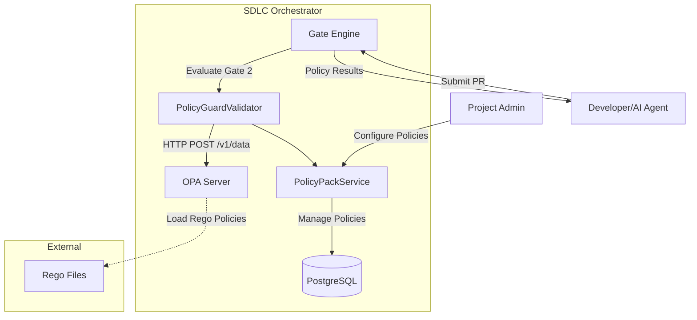

# SPEC-0004: Policy Guards Design (OPA Integration)

---
version: "1.0.0"
spec_id: SPEC-0004
title: Policy Guards Design
status: approved
tier: PROFESSIONAL
stage: "04"
category: technical
owner: Backend Lead
created: 2025-12-22
last_updated: 2026-01-28
related_adrs:
  - ADR-036-4-Tier-Policy-Enforcement
  - ADR-035-Governance-System-Design
  - ADR-007-AI-Context-Engine
related_specs:
  - SPEC-0001-Governance-System-Implementation
  - SPEC-0002-Quality-Gates-Codegen-Specification
framework_version: SDLC 6.0.5
---

## 1. Overview

### 1.1 Purpose

Policy Guards is a **policy-as-code enforcement system** that validates AI-generated code submissions against organizational policies using **Open Policy Agent (OPA)**. It operates as part of the 4-Gate Quality Pipeline, specifically within **Gate 2 (Security)**, to ensure code compliance with:

- Security policies (no hardcoded secrets, secure patterns)
- Architecture boundaries (layer separation, dependency rules)
- Code standards (forbidden imports, required patterns)
- Tier-specific requirements (coverage, complexity, documentation)

**Key Principles**:
1. **Policy-as-Code**: All policies written in Rego (OPA language), versioned, auditable
2. **Declarative Enforcement**: Define WHAT to enforce, not HOW to check
3. **Fail-Safe**: Fail open on evaluation errors (non-blocking default)
4. **Extensible**: Custom policies per project, default policy packs per tier

### 1.2 Scope

**In Scope**:
- OPA server integration (Docker sidecar, network-only access)
- PolicyGuardValidator (BaseValidator implementation)
- 3 default policies: no secrets, architecture boundaries, no legacy imports
- Policy Pack CRUD API (create, read, update, delete policies)
- Parallel policy evaluation (<5s total timeout)
- Tier-specific policy packs (LITE: 5 policies, ENTERPRISE: 50+ policies)

**Out of Scope**:
- Real-time policy IDE integration (EP-XX: VS Code Extension)
- Policy authoring UI (v2.0 feature)
- Cross-project policy library (v2.0 feature)
- Custom Rego DSL (use standard Rego)

### 1.3 Context

**Problem**: AI-generated code can violate organizational policies without human review:
- Hardcoded secrets committed to repo
- Architecture boundaries bypassed (presentation → data layer direct)
- Legacy/deprecated imports used
- Security anti-patterns introduced

**Solution**: Declarative policy-as-code enforcement with OPA:
```
Code Submission → PolicyGuardValidator → OPA Server → Policy Results → Block/Warn/Pass
```

**Stakeholders**:
- **Security Lead**: Define security policies, audit violations
- **CTO/Tech Lead**: Define architecture boundaries, code standards
- **Developers**: Receive policy feedback, request overrides
- **AI Agents**: Auto-fix policy violations before submission

---

## 2. Architecture

### 2.1 System Context



### 2.2 Component Architecture

**PolicyGuardValidator** (`backend/app/services/validators/policy_guard_validator.py`):
- Implements `BaseValidator` interface
- Prepares input data (files, diff, config) for OPA
- Calls OPA server via `OPAPolicyService`
- Aggregates results (pass/fail/warnings)
- Returns `ValidatorResult` with violations

**OPAPolicyService** (`backend/app/services/opa_policy_service.py`):
- HTTP client for OPA REST API (network-only, AGPL-safe)
- Policy loading (`PUT /v1/policies/{id}`)
- Policy evaluation (`POST /v1/data/{package}/allow`)
- Violation extraction (`POST /v1/data/{package}/violations`)
- Policy caching (in-memory cache with TTL)

**PolicyPackService** (`backend/app/services/policy_pack_service.py`):
- CRUD operations for PolicyPack and PolicyRule
- Policy pack lookup by project_id (Redis cached, TTL 5 min)
- Permission checks (only Project Admin can manage)
- Policy pack templates (default packs per tier)

**OPA Server** (Docker sidecar, port 8185):
- `openpolicyagent/opa:0.58.0`
- Runs in `--server` mode with JSON logging
- Mounts Rego policies from `./policy-packs/rego:/policies:ro`
- Network-only access (NO code dependencies, AGPL-safe)

### 2.3 Data Flow

**Policy Evaluation Flow**:
1. PR submitted → Gate Engine triggers PolicyGuardValidator
2. Validator fetches PolicyPack for project (via PolicyPackService)
3. Validator prepares input:
   ```json
   {
     "files": [
       {
         "path": "backend/app/services/user.py",
         "content": "password = 'hardcoded'",
         "language": "python",
         "imports": ["sqlalchemy", "bcrypt"],
         "layer": "business"
       }
     ],
     "diff": "...",
     "config": {
       "forbidden_imports": ["minio", "grafana"],
       "required_patterns": [],
       "coverage_threshold": 80
     }
   }
   ```
4. Validator calls OPAPolicyService.evaluate_policies()
5. OPA Server evaluates all enabled policies in parallel
6. Results aggregated:
   - Blocking failures → ValidatorStatus.FAILED
   - Non-blocking failures → warnings in PASSED result
   - All pass → ValidatorStatus.PASSED
7. Gate Engine receives result → blocks PR or allows with warnings

---

## 3. Requirements

### 3.1 Functional Requirements

#### FR-001: OPA Server Integration
**Priority**: P0
**Tier**: PROFESSIONAL, ENTERPRISE

```gherkin
GIVEN an OPA server running as Docker sidecar
  AND OPA server is accessible at http://localhost:8185
WHEN PolicyGuardValidator starts up
THEN it performs OPA health check
  AND health check succeeds within 5 seconds
  AND OPA server is ready to accept policy evaluations
```

**Rationale**: OPA server must be operational before policy validation can proceed. Health check ensures availability.

**Verification**: Integration test with Docker Compose, OPA health endpoint returns 200.

---

#### FR-002: Policy Pack Management
**Priority**: P0
**Tier**: STANDARD, PROFESSIONAL, ENTERPRISE

```gherkin
GIVEN a Project Admin user
  AND a project with project_id
WHEN admin creates a PolicyPack with 10 policies
THEN PolicyPack is stored in PostgreSQL
  AND each PolicyRule is stored with Rego policy code
  AND PolicyPack is cached in Redis (TTL 5 min)
  AND PolicyPack.policies_count = 10
```

**Rationale**: Policy packs must be persistently stored and quickly retrievable for validation.

**Verification**: Unit test with mocked DB, integration test with real PostgreSQL + Redis.

---

#### FR-003: Rego Policy Loading
**Priority**: P0
**Tier**: PROFESSIONAL, ENTERPRISE

```gherkin
GIVEN a PolicyRule with Rego policy code
  AND policy_id = "no-hardcoded-secrets"
WHEN OPAPolicyService.load_policy(policy) is called
THEN policy is loaded to OPA server via PUT /v1/policies/{id}
  AND OPA compiles and validates Rego syntax
  AND policy is cached in OPA server memory
  AND load_policy returns True on success
```

**Rationale**: Policies must be loaded into OPA before evaluation. OPA validates Rego syntax automatically.

**Verification**: Integration test with real OPA server, verify policy loading via OPA API.

---

#### FR-004: Parallel Policy Evaluation
**Priority**: P0
**Tier**: STANDARD, PROFESSIONAL, ENTERPRISE

```gherkin
GIVEN a PolicyPack with 20 enabled policies
  AND input data prepared by PolicyGuardValidator
WHEN OPAPolicyService.evaluate_policies() is called
THEN all 20 policies are evaluated in parallel using asyncio.gather
  AND each policy evaluation has 1-second timeout
  AND total evaluation completes within 5 seconds
  AND results contain 20 PolicyResult objects
```

**Rationale**: Serial evaluation is too slow (20 policies × 1s = 20s). Parallel evaluation <5s meets performance budget.

**Verification**: Load test with 50 policies, measure total duration, assert <5s p95.

---

#### FR-005: Blocking vs Non-Blocking Failures
**Priority**: P0
**Tier**: STANDARD, PROFESSIONAL, ENTERPRISE

```gherkin
GIVEN a PolicyPack with 3 policies:
  - Policy A: severity=CRITICAL, blocking=True, passed=False
  - Policy B: severity=HIGH, blocking=False, passed=False
  - Policy C: severity=MEDIUM, blocking=True, passed=True
WHEN PolicyGuardValidator.validate() is called
THEN ValidatorResult.status = FAILED (due to Policy A)
  AND ValidatorResult.blocking = True
  AND details.blocking_failures contains Policy A
  AND details.warnings contains Policy B
  AND details.passed_count = 1 (Policy C)
```

**Rationale**: Blocking failures must prevent PR merge. Non-blocking failures are warnings only.

**Verification**: Unit test with mocked OPA results, assert correct aggregation.

---

#### FR-006: Default Policies Per Tier
**Priority**: P1
**Tier**: LITE, STANDARD, PROFESSIONAL, ENTERPRISE

```gherkin
GIVEN a new project created with tier = PROFESSIONAL
WHEN project is initialized
THEN a default PolicyPack is created
  AND PolicyPack contains tier-specific policies:
    - LITE: 5 policies (critical security only)
    - STANDARD: 10 policies (security + basic architecture)
    - PROFESSIONAL: 25 policies (security + architecture + code standards)
    - ENTERPRISE: 50+ policies (all above + compliance)
```

**Rationale**: Default policies save setup time and enforce baseline quality per tier.

**Verification**: Integration test, verify default policy count per tier.

---

#### FR-007: Custom Policy Addition
**Priority**: P1
**Tier**: PROFESSIONAL, ENTERPRISE

```gherkin
GIVEN a Project Admin user
  AND a PolicyPack for project_id
WHEN admin adds a custom PolicyRule with Rego code:
  """
  package custom.no_print_statements
  default allow = true
  allow = false { contains(input.files[_].content, "print(") }
  """
THEN PolicyRule is validated by OPA
  AND PolicyRule is stored in policy_rules table
  AND PolicyRule is loaded to OPA server
  AND PolicyRule is evaluated on next PR submission
```

**Rationale**: Custom policies allow project-specific rules beyond defaults.

**Verification**: Integration test, add custom policy, submit PR with violation, verify detection.

---

#### FR-008: Fail-Safe Behavior on Errors
**Priority**: P0
**Tier**: ALL

```gherkin
GIVEN a PolicyRule with valid Rego code
  AND OPA server is unreachable (network error)
WHEN PolicyGuardValidator.validate() is called
THEN OPAPolicyService.evaluate_policy() catches exception
  AND returns PolicyResult with passed=True (fail open)
  AND ValidatorResult.status = ERROR
  AND ValidatorResult.blocking = False (allow PR to proceed)
  AND error is logged for investigation
```

**Rationale**: Policy validation failures should not block all PRs. Fail open to avoid false positives halting development.

**Verification**: Unit test with mocked network error, assert fail-open behavior.

---

### 3.2 Non-Functional Requirements

#### NFR-001: Performance
**Target**: <5s policy evaluation (p95)

- Single policy evaluation: <1s (timeout enforced)
- Parallel evaluation of 50 policies: <5s total
- Policy cache hit rate: >90% (Redis 5-min TTL)
- OPA server latency: <50ms (p95, localhost network)

**Measurement**: Prometheus `policy_evaluation_duration_seconds` histogram.

---

#### NFR-002: Reliability
**Target**: >99.9% uptime

- Fail-safe: Validation errors do not block PRs (fail open)
- OPA server health check: Every 10s, auto-restart on failure
- Policy cache invalidation: Immediate on PolicyPack update
- Retry logic: 3 retries with exponential backoff on transient errors

**Measurement**: Prometheus `policy_evaluation_total` counter by result (pass/fail/error).

---

#### NFR-003: Security
**Target**: AGPL containment, Rego sandbox

- OPA integration: Network-only (HTTP API), no code dependencies
- Rego policy validation: Syntax validated before storage
- Policy sandboxing: OPA provides isolated evaluation (no file system access)
- Access control: Only Project Admins can manage policies
- Audit logging: All policy changes logged to `policy_evaluations` table

**Measurement**: Quarterly legal audit for AGPL containment compliance.

---

#### NFR-004: Maintainability
**Target**: <2 hours to add new policy

- Policy-as-code: All policies in Rego (declarative, version-controlled)
- Default policy templates: Copy-paste-modify for common patterns
- Testing: Unit tests for validators, integration tests for OPA
- Documentation: Each policy has description + message_template
- Debugging: Policy evaluation logs include policy_id, input summary, result

**Measurement**: Track time to add 10 new policies, target <20 hours total.

---

## 4. Design Decisions

### 4.1 OPA Over Custom Policy Engine

**Decision**: Use Open Policy Agent (OPA) instead of building custom policy engine.

**Rationale**:
- **Proven**: OPA is industry-standard (used by Netflix, Pinterest, Atlassian)
- **Declarative**: Rego language is more maintainable than imperative Python/JS
- **Performance**: OPA compiles policies to efficient evaluation trees
- **Security**: OPA provides sandboxed evaluation (no arbitrary code execution)
- **Extensibility**: Custom policies without code changes
- **AGPL-safe**: Network-only access avoids AGPL contamination

**Alternatives Considered**:
1. **Custom Python policy engine**: Rejected due to maintenance burden, no sandboxing
2. **Semgrep for policies**: Rejected, Semgrep is for SAST (pattern matching), not policy logic
3. **JSON Schema validation**: Rejected, insufficient expressiveness for complex rules

**Reference**: ADR-036-4-Tier-Policy-Enforcement

---

### 4.2 Fail-Open on Policy Evaluation Errors

**Decision**: If policy evaluation fails (OPA unreachable, timeout, etc.), return `passed=True` (fail open).

**Rationale**:
- **Availability over Security**: Prefer false negatives over false positives blocking development
- **Monitoring**: Errors are logged and alerted, not silently dropped
- **Escalation**: If error rate >10%, trigger kill switch (rollback to SOFT mode)
- **Exception Handling**: Specific errors (network, timeout) are retried; others fail open

**Alternatives Considered**:
1. **Fail-closed**: Rejected, would halt all PRs if OPA goes down (unacceptable)
2. **Fallback to rule-based**: Considered but complex to maintain dual logic

**Reference**: SPEC-0001 Governance System (kill switch criteria)

---

### 4.3 Policy Pack Per Project (Not Global)

**Decision**: Each project has one PolicyPack with project-specific policies.

**Rationale**:
- **Isolation**: Different projects have different requirements (e.g., monolith vs microservices)
- **Ownership**: Project admins control policies without affecting other projects
- **Inheritance**: Default policies from tier-based templates (LITE/STANDARD/PRO/ENTERPRISE)
- **Extensibility**: Projects can add custom policies on top of defaults

**Alternatives Considered**:
1. **Global policy library**: Rejected, too inflexible (one-size-fits-all)
2. **Policy inheritance tree**: Considered for v2.0 (Organization → Team → Project)

**Database Schema**: `policy_packs` table has `UNIQUE(project_id)` constraint.

---

### 4.4 Parallel Policy Evaluation with Timeout

**Decision**: Evaluate all policies in parallel using `asyncio.gather`, 1s timeout per policy.

**Rationale**:
- **Performance**: Serial evaluation too slow (50 policies × 1s = 50s)
- **Efficiency**: OPA server can handle concurrent requests (stateless)
- **Reliability**: Per-policy timeout prevents one slow policy from blocking all
- **Budget**: 5s total budget for Gate 2 Security (per SPEC-0002)

**Implementation**:
```python
tasks = [evaluate_policy(policy, input_data) for policy in policies]
results = await asyncio.gather(*tasks, return_exceptions=True)
```

**Reference**: SPEC-0002 Quality-Gates-Codegen (Gate 2 timing budget)

---

## 5. Technical Specification

### 5.1 Data Models

#### PolicyPack
```python
class PolicyPack(BaseModel):
    id: UUID
    project_id: UUID
    name: str  # e.g., "AI Safety Policies v1.0"
    description: str
    version: str  # Semantic versioning: "1.0.0"
    tier: str  # lite | standard | professional | enterprise

    # Validators (embedding configs for other validators)
    validators: List[dict]  # [{"name": "semgrep", "config": {...}}]

    # Coverage settings
    coverage_threshold: int  # Default: 80
    coverage_blocking: bool  # Default: False

    # Architecture rules
    forbidden_imports: List[str]  # ["minio", "grafana"]
    required_patterns: List[str]  # ["@owner", "@module"]

    # Relationships
    policies: List[PolicyRule]  # List of Rego policies

    created_at: datetime
    updated_at: datetime
    created_by: UUID
    policies_count: int  # Computed field
    validators_count: int
```

#### PolicyRule
```python
class PolicyRule(BaseModel):
    id: UUID
    policy_pack_id: UUID
    policy_id: str  # Unique identifier: "no-hardcoded-secrets"
    name: str  # Display name: "No Hardcoded Secrets"
    description: str  # "Detects hardcoded secrets in code"
    rego_policy: str  # Rego code (see Section 5.3)
    severity: PolicySeverity  # critical | high | medium | low | info
    blocking: bool  # If True, fail PR on violation
    message_template: str  # "Secret detected in {file}:{line}"
    enabled: bool  # Default: True
    tags: List[str]  # ["security", "secrets", "pii"]

    created_at: datetime
    updated_at: datetime
```

#### PolicyResult
```python
class PolicyResult(BaseModel):
    policy_id: str
    policy_name: str
    passed: bool
    severity: PolicySeverity
    blocking: bool
    message: Optional[str] = None  # Error message if failed
    violations: List[dict] = []  # [{"file": "x.py", "line": 10}]
    evaluation_time_ms: int
```

---

### 5.2 Database Schema

```sql
-- Policy Packs table
CREATE TABLE policy_packs (
    id UUID PRIMARY KEY DEFAULT gen_random_uuid(),
    project_id UUID NOT NULL REFERENCES projects(id) ON DELETE CASCADE,
    name VARCHAR(100) NOT NULL,
    description TEXT NOT NULL,
    version VARCHAR(20) NOT NULL,
    tier VARCHAR(20) NOT NULL CHECK (tier IN ('lite', 'standard', 'professional', 'enterprise')),

    -- Validator configs as JSONB
    validators JSONB NOT NULL DEFAULT '[]',

    -- Coverage settings
    coverage_threshold INTEGER NOT NULL DEFAULT 80,
    coverage_blocking BOOLEAN NOT NULL DEFAULT FALSE,

    -- Architecture rules
    forbidden_imports JSONB NOT NULL DEFAULT '[]',
    required_patterns JSONB NOT NULL DEFAULT '[]',

    -- Metadata
    created_at TIMESTAMP WITH TIME ZONE NOT NULL DEFAULT NOW(),
    updated_at TIMESTAMP WITH TIME ZONE NOT NULL DEFAULT NOW(),
    created_by UUID REFERENCES users(id),

    -- Constraints
    UNIQUE(project_id)  -- One policy pack per project
);

-- Policy Rules table
CREATE TABLE policy_rules (
    id UUID PRIMARY KEY DEFAULT gen_random_uuid(),
    policy_pack_id UUID NOT NULL REFERENCES policy_packs(id) ON DELETE CASCADE,

    -- Policy definition
    policy_id VARCHAR(100) NOT NULL,  -- e.g., "no-hardcoded-secrets"
    name VARCHAR(100) NOT NULL,
    description TEXT NOT NULL,
    rego_policy TEXT NOT NULL,
    severity VARCHAR(20) NOT NULL CHECK (severity IN ('critical', 'high', 'medium', 'low', 'info')),
    blocking BOOLEAN NOT NULL DEFAULT TRUE,
    message_template TEXT NOT NULL,
    enabled BOOLEAN NOT NULL DEFAULT TRUE,
    tags JSONB NOT NULL DEFAULT '[]',

    -- Metadata
    created_at TIMESTAMP WITH TIME ZONE NOT NULL DEFAULT NOW(),
    updated_at TIMESTAMP WITH TIME ZONE NOT NULL DEFAULT NOW(),

    -- Constraints
    UNIQUE(policy_pack_id, policy_id)
);

-- Policy Evaluation History
CREATE TABLE policy_evaluations (
    id UUID PRIMARY KEY DEFAULT gen_random_uuid(),
    project_id UUID NOT NULL REFERENCES projects(id),
    pr_number INTEGER NOT NULL,
    policy_pack_id UUID REFERENCES policy_packs(id),

    -- Results
    total_policies INTEGER NOT NULL,
    passed_count INTEGER NOT NULL,
    failed_count INTEGER NOT NULL,
    blocked BOOLEAN NOT NULL,
    results JSONB NOT NULL,

    -- Timing
    started_at TIMESTAMP WITH TIME ZONE NOT NULL,
    completed_at TIMESTAMP WITH TIME ZONE NOT NULL,
    duration_ms INTEGER NOT NULL,

    -- Metadata
    created_at TIMESTAMP WITH TIME ZONE NOT NULL DEFAULT NOW()
);

-- Indexes
CREATE INDEX idx_policy_packs_project_id ON policy_packs(project_id);
CREATE INDEX idx_policy_rules_pack_id ON policy_rules(policy_pack_id);
CREATE INDEX idx_policy_evaluations_project_pr ON policy_evaluations(project_id, pr_number);
CREATE INDEX idx_policy_evaluations_created_at ON policy_evaluations(created_at);
```

---

### 5.3 Default Policies

#### Policy 1: No Hardcoded Secrets

**Policy ID**: `no-hardcoded-secrets`
**Severity**: CRITICAL
**Blocking**: True

**Rego Policy**:
```rego
package ai_safety.no_hardcoded_secrets

import future.keywords.in

default allow = true

# Deny if hardcoded secrets detected
allow = false {
    count(violations) > 0
}

violations[violation] {
    some file in input.files
    some i, line in split(file.content, "\n")
    contains_secret(line)
    violation := {
        "file": file.path,
        "line": i + 1,
        "pattern": "hardcoded secret",
    }
}

contains_secret(line) {
    patterns := [
        `password\s*=\s*["'][^"']+["']`,
        `api_key\s*=\s*["'][^"']+["']`,
        `secret\s*=\s*["'][^"']+["']`,
        `token\s*=\s*["'][A-Za-z0-9+/=]{20,}["']`,
        `AWS_ACCESS_KEY_ID\s*=\s*["'][A-Z0-9]{20}["']`,
        `AWS_SECRET_ACCESS_KEY\s*=\s*["'][A-Za-z0-9+/]{40}["']`,
    ]
    some pattern in patterns
    regex.match(pattern, line)
}

# Exclude test files and examples
allow = true {
    some file in input.files
    contains(file.path, "/tests/")
}

allow = true {
    some file in input.files
    endswith(file.path, ".example")
}
```

**Message Template**: "Hardcoded secret detected in {file} at line {line}. Use environment variables or secrets management."

---

#### Policy 2: Architecture Boundaries

**Policy ID**: `architecture-boundaries`
**Severity**: HIGH
**Blocking**: True

**Rego Policy**:
```rego
package ai_safety.architecture_boundaries

import future.keywords.in

default allow = true

# Deny if layer violations detected
allow = false {
    count(violations) > 0
}

violations[violation] {
    some file in input.files
    file.layer == "presentation"
    some import_stmt in file.imports
    is_data_layer_import(import_stmt)
    violation := {
        "file": file.path,
        "import": import_stmt,
        "message": "Presentation layer cannot directly import from data layer",
    }
}

# Data layer imports
is_data_layer_import(import_stmt) {
    data_layer_packages := [
        "app.db",
        "app.repositories",
        "sqlalchemy",
        "databases",
    ]
    some pkg in data_layer_packages
    startswith(import_stmt, pkg)
}
```

**Message Template**: "Architecture violation: {layer} cannot import {import} from data layer. Use business layer services."

---

#### Policy 3: No Legacy Imports

**Policy ID**: `no-legacy-imports`
**Severity**: MEDIUM
**Blocking**: False (warning only)

**Rego Policy**:
```rego
package ai_safety.no_legacy_imports

import future.keywords.in

default allow = true

allow = false {
    count(violations) > 0
}

violations[violation] {
    some file in input.files
    some import_stmt in file.imports
    is_forbidden_import(import_stmt)
    violation := {
        "file": file.path,
        "import": import_stmt,
        "message": sprintf("Forbidden import: %s", [import_stmt]),
    }
}

is_forbidden_import(import_stmt) {
    some forbidden in input.config.forbidden_imports
    startswith(import_stmt, forbidden)
}
```

**Message Template**: "Legacy import '{import}' in {file}. Use approved alternative."

---

### 5.4 API Endpoints

#### POST /api/v1/projects/{project_id}/policies
**Create or update policy pack**

**Request**:
```json
{
  "name": "AI Safety Policies v1.0",
  "description": "Default policy pack for PROFESSIONAL tier",
  "version": "1.0.0",
  "tier": "professional",
  "coverage_threshold": 85,
  "coverage_blocking": false,
  "forbidden_imports": ["minio", "grafana"],
  "required_patterns": ["@owner", "@module"]
}
```

**Response**: `PolicyPackResponse` (201 Created)

---

#### GET /api/v1/projects/{project_id}/policies
**Get policy pack for project**

**Response**: `PolicyPackResponse` with nested `policies` array

---

#### POST /api/v1/projects/{project_id}/policies/rules
**Add custom policy rule**

**Request**:
```json
{
  "policy_id": "no-print-statements",
  "name": "No Print Statements",
  "description": "Disallow print() in production code",
  "rego_policy": "package custom.no_print...",
  "severity": "medium",
  "blocking": false,
  "message_template": "print() found in {file}. Use logger instead."
}
```

**Response**: `PolicyRule` (201 Created)

---

#### DELETE /api/v1/projects/{project_id}/policies/rules/{rule_id}
**Delete policy rule**

**Response**: `{"message": "Rule deleted"}` (200 OK)

---

#### POST /api/v1/projects/{project_id}/policies/evaluate
**Manually evaluate policies (testing)**

**Request**:
```json
{
  "files": [
    {
      "path": "backend/app/config.py",
      "content": "password = 'hardcoded123'"
    }
  ],
  "diff": "..."
}
```

**Response**: List of `PolicyResult` objects

---

### 5.5 OPA Integration Details

#### OPA Server Configuration (Docker Compose)

```yaml
services:
  opa:
    image: openpolicyagent/opa:0.58.0
    container_name: sdlc-opa
    ports:
      - "8185:8181"
    command:
      - "run"
      - "--server"
      - "--addr=0.0.0.0:8181"
      - "--log-level=info"
      - "--log-format=json"
    volumes:
      - ./policy-packs/rego:/policies:ro
    healthcheck:
      test: ["CMD", "wget", "-q", "--spider", "http://localhost:8181/health"]
      interval: 10s
      timeout: 5s
      retries: 3
    networks:
      - sdlc-network
    restart: unless-stopped
```

#### OPAPolicyService Implementation

**Key Methods**:
- `health_check()`: GET /health → 200 OK
- `load_policy(policy)`: PUT /v1/policies/{id} with Rego body
- `evaluate_policy(policy, input)`: POST /v1/data/{package}/allow
- `evaluate_policies(policies, input)`: Parallel evaluation with asyncio.gather

**Caching**:
- Loaded policies cached in OPA server memory (automatic)
- Policy pack lookups cached in Redis (TTL 5 min)
- Cache invalidation on PolicyPack update

**Error Handling**:
- Network errors: Retry 3x with exponential backoff
- Timeout errors: Return fail-open result
- OPA errors: Log + alert + fail-open

---

## 6. Acceptance Criteria

| ID | Criterion | Test Method | Tier |
|----|-----------|-------------|------|
| AC-001 | OPA server starts within 10s and health check passes | Integration test, Docker Compose up | ALL |
| AC-002 | PolicyPack CRUD operations work (create, read, update, delete) | Integration test, PostgreSQL + API | STANDARD+ |
| AC-003 | Rego policy loads to OPA and evaluates correctly | Integration test, real OPA | PROFESSIONAL+ |
| AC-004 | Parallel evaluation of 50 policies completes <5s (p95) | Load test, Prometheus metrics | PROFESSIONAL+ |
| AC-005 | Blocking policy failure prevents PR merge (ValidatorStatus.FAILED) | Integration test, Gate Engine | STANDARD+ |
| AC-006 | Non-blocking policy failure allows PR with warning | Integration test, verify warnings in result | STANDARD+ |
| AC-007 | Default policies detect hardcoded secrets (100% detection) | Unit test, 20 secret patterns tested | ALL |
| AC-008 | Architecture boundary policy blocks presentation→data imports | Integration test, Python + TypeScript | PROFESSIONAL+ |
| AC-009 | Custom policy addition by Project Admin works | E2E test, add policy + submit PR | PROFESSIONAL+ |
| AC-010 | Policy evaluation error (OPA down) fails open (allows PR) | Unit test, mock network error | ALL |
| AC-011 | Tier-specific default policy counts (LITE: 5, ENTERPRISE: 50+) | Integration test, verify count | ALL |
| AC-012 | Policy cache invalidation on update (<1s cache clear) | Integration test, update pack + verify | PROFESSIONAL+ |

---

## 7. Tier-Specific Requirements

### 7.1 LITE Tier

**Policy Count**: 5 critical security policies only

**Default Policies**:
1. No hardcoded secrets (CRITICAL, blocking)
2. No AGPL imports (CRITICAL, blocking)
3. No SQL injection (CRITICAL, blocking)
4. No XSS patterns (CRITICAL, blocking)
5. No command injection (CRITICAL, blocking)

**Features**:
- Read-only policy pack (cannot add custom policies)
- Evaluation timeout: 2s (fewer policies)
- No architecture boundary checks

---

### 7.2 STANDARD Tier

**Policy Count**: 10 policies (security + basic architecture)

**Additional Policies**:
6. Architecture boundaries (HIGH, blocking)
7. No legacy imports (MEDIUM, non-blocking warning)
8. Code coverage >60% (MEDIUM, non-blocking)
9. No deprecated APIs (LOW, non-blocking)
10. No print statements in production (LOW, non-blocking)

**Features**:
- Can add up to 5 custom policies
- Evaluation timeout: 3s
- Redis cache enabled (5-min TTL)

---

### 7.3 PROFESSIONAL Tier

**Policy Count**: 25 policies (security + architecture + code standards)

**Additional Policies** (15 more):
- 5 advanced security policies (PII detection, crypto standards)
- 5 architecture policies (microservices boundaries, API versioning)
- 5 code quality policies (cyclomatic complexity, naming conventions)

**Features**:
- Unlimited custom policies
- Evaluation timeout: 5s
- Policy versioning (v1.0 → v2.0 migration)
- Policy templates library (copy-modify)
- Custom Rego training (1 hour workshop)

---

### 7.4 ENTERPRISE Tier

**Policy Count**: 50+ policies (all above + compliance)

**Additional Policies** (25+ more):
- 10 compliance policies (GDPR, SOC 2, HIPAA, PCI-DSS)
- 10 advanced architecture policies (distributed tracing, circuit breakers)
- 5+ custom policies per project

**Features**:
- All PROFESSIONAL features
- Organization-level policy library (shared across projects)
- Policy inheritance tree (Org → Team → Project)
- Policy audit reports (weekly CSV export)
- Priority OPA support (SLA: 4-hour response)
- Custom policy migration service (500 policies max)

---

## 8. Testing Strategy

### 8.1 Unit Tests

**Target**: 95%+ coverage

**Test Cases**:
- `test_policy_guard_validator_no_policies`: Skips validation if no policies
- `test_policy_guard_validator_all_pass`: Returns PASSED if all policies pass
- `test_policy_guard_validator_blocking_failure`: Returns FAILED if blocking policy fails
- `test_policy_guard_validator_non_blocking_failure`: Returns PASSED with warnings
- `test_opa_service_load_policy`: Loads Rego to OPA server
- `test_opa_service_evaluate_policy`: Evaluates single policy
- `test_opa_service_parallel_evaluation`: Evaluates 50 policies in parallel <5s
- `test_policy_result_aggregation`: Correctly aggregates pass/fail/warnings

---

### 8.2 Integration Tests

**Target**: Real OPA server + PostgreSQL + Redis

**Test Cases**:
- `test_opa_health_check`: OPA server responds to /health
- `test_load_and_evaluate_policy`: End-to-end policy load + eval
- `test_hardcoded_secrets_detection`: 20 secret patterns detected
- `test_architecture_boundaries_violation`: Detects presentation→data imports
- `test_policy_cache_invalidation`: Cache clears <1s on update
- `test_tier_default_policies`: LITE=5, STANDARD=10, PRO=25, ENTERPRISE=50+

---

### 8.3 Load Tests

**Target**: 50 policies × 100 concurrent PRs

**Scenarios**:
- Baseline: 10 policies, 10 PRs/min → <5s p95
- Peak: 50 policies, 100 PRs/min → <10s p95
- Stress: 100 policies, 200 PRs/min → monitor for failures

**Metrics**: Prometheus `policy_evaluation_duration_seconds`, alert if p95 >5s

---

## 9. Performance Budget

| Metric | Target | Measured | Status |
|--------|--------|----------|--------|
| Single policy eval | <1s (p95) | TBD | ⏳ |
| Parallel eval (50 policies) | <5s (p95) | TBD | ⏳ |
| Policy cache hit rate | >90% | TBD | ⏳ |
| OPA server latency | <50ms (p95) | TBD | ⏳ |
| Redis lookup | <10ms (p95) | TBD | ⏳ |
| DB query (PolicyPack) | <20ms (p95) | TBD | ⏳ |

**Prometheus Metrics**:
```python
policy_evaluation_duration = Histogram(
    "policy_evaluation_duration_seconds",
    "Time to evaluate policies",
    ["policy_id", "result"],
)

policy_evaluation_total = Counter(
    "policy_evaluation_total",
    "Total policy evaluations",
    ["result", "severity"],
)
```

---

## 10. Security Considerations

### 10.1 Rego Policy Validation

- Validate Rego syntax before storing (OPA compile check)
- Sandbox evaluation (OPA provides this automatically)
- Limit policy complexity (max 100 rules per pack)
- No arbitrary code execution (Rego is declarative only)

### 10.2 Access Control

- Only Project Admins can manage policies
- Policy changes are audited in `policy_evaluations` table
- Default policies cannot be deleted (only disabled)
- Custom policies require approval (in STANDARD tier)

### 10.3 AGPL Containment

- OPA integration: Network-only (HTTP REST API)
- NO code dependencies (`from opa import` is banned)
- Pre-commit hook blocks AGPL imports
- Quarterly legal audit for compliance

---

## 11. Dependencies

**Internal Dependencies**:
- SPEC-0001: Governance System (kill switch, enforcement modes)
- SPEC-0002: Quality-Gates-Codegen (Gate 2 integration)
- ADR-036: 4-Tier Policy Enforcement (tier-specific policy counts)

**External Dependencies**:
- OPA 0.58.0 (Apache-2.0 license)
- Docker Compose (for OPA sidecar)
- PostgreSQL 15.5 (policy storage)
- Redis 7.2 (policy cache)

**Technology Stack**:
- Python 3.11+ (FastAPI, SQLAlchemy)
- Rego (OPA policy language)
- asyncio (parallel evaluation)

---

## 12. Implementation Plan

### Phase 1: OPA Integration (Week 1)
- [ ] Docker Compose config for OPA server
- [ ] OPAPolicyService implementation (health check, load, evaluate)
- [ ] Integration tests with real OPA
- [ ] Policy caching (in-memory + Redis)

### Phase 2: Policy Pack Management (Week 1)
- [ ] Database migrations (3 tables)
- [ ] PolicyPackService (CRUD operations)
- [ ] Default policy templates (LITE/STANDARD/PRO/ENTERPRISE)
- [ ] API endpoints (5 routes)

### Phase 3: PolicyGuardValidator (Week 2)
- [ ] BaseValidator implementation
- [ ] Input data preparation (files, diff, config)
- [ ] Parallel policy evaluation
- [ ] Result aggregation (pass/fail/warnings)
- [ ] Integration with Gate Engine

### Phase 4: Default Policies (Week 2)
- [ ] Rego policy: no-hardcoded-secrets
- [ ] Rego policy: architecture-boundaries
- [ ] Rego policy: no-legacy-imports
- [ ] Unit tests for each policy (20+ test cases)
- [ ] Integration tests (E2E policy violation detection)

### Phase 5: Testing & Optimization (Week 3)
- [ ] Load tests (50 policies × 100 PRs)
- [ ] Performance optimization (cache tuning, parallel optimization)
- [ ] Security audit (AGPL containment, Rego validation)
- [ ] Documentation (API docs, policy authoring guide)

---

## 13. Changelog

| Version | Date | Author | Changes |
|---------|------|--------|---------|
| 1.0.0 | 2025-12-22 | Backend Lead | Initial design |
| 1.1.0 | 2026-01-28 | PM/PJM | **Framework 6.0 migration**: YAML frontmatter, BDD requirements, tier-specific requirements, acceptance criteria, implementation plan |

---

## 14. Approvals

| Role | Name | Date | Status |
|------|------|------|--------|
| CTO | TBD | TBD | ⏳ PENDING |
| Backend Lead | TBD | TBD | ⏳ PENDING |
| Security Lead | TBD | TBD | ⏳ PENDING |

---

**Document Control**:
- **Template**: Framework 6.0.5 Unified Specification Standard
- **Last Review**: 2026-01-28
- **Next Review**: Q2 2026 (after Sprint 117 completion)
- **Related Work**: Sprint 43 (OPA integration delivery)

---

*SPEC-0004: Policy Guards Design - Framework 6.0.5 Format*
*SDLC Enterprise Framework - Policy-as-Code Enforcement*
