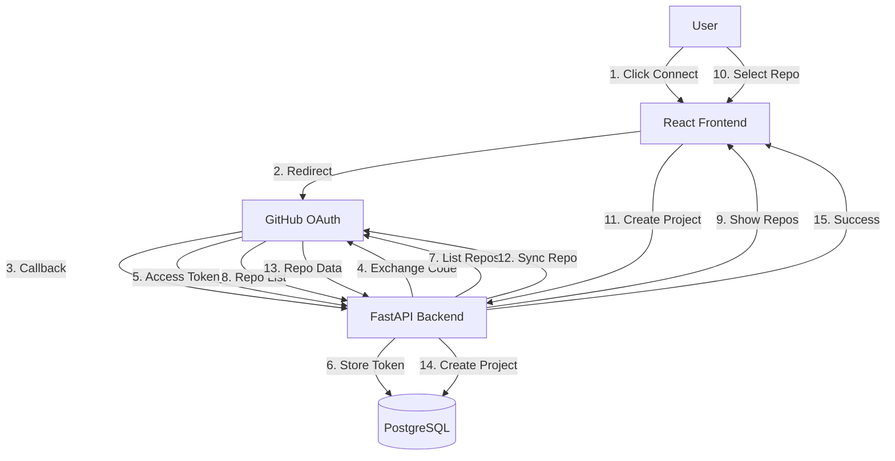

# Sprint 15: GitHub Foundation + G6 UX

**Version**: 1.0.0  
**Date**: December 2, 2025  
**Status**: IN PROGRESS  
**Authority**: Backend Lead + CPO Approved  
**Foundation**: Sprint 14 Complete ✅, User-Onboarding-Flow-Architecture.md  
**Framework**: SDLC 4.9 Complete Lifecycle

---

## 🎯 Sprint 15 Objectives

**Primary Goal**: Implement GitHub integration foundation to enable first-time user onboarding experience with <30 min TTFGE (Time to First Gate Evaluation).

**Success Criteria**:
- ✅ GitHub OAuth App installation flow working
- ✅ Repository listing and selection (read-only access)
- ✅ Auto-sync GitHub repository to SDLC Orchestrator project
- ✅ First-time user onboarding wizard (6 steps, <30 min total)
- ✅ Repository sync background job (webhook + polling)

---

## 📋 Sprint 15 Tasks

### Task 1: GitHub Service Implementation (Backend)

**File**: `backend/app/services/github_service.py`

**Features**:
- OAuth token management (store, refresh, validate)
- Repository listing (GET /user/repos)
- Repository details (GET /repos/{owner}/{repo})
- Webhook event handling (push, pull_request, issues)
- Rate limiting (5,000 requests/hour per token)

**Dependencies**:
- `requests` library (network-only, no PyGithub SDK - AGPL-safe)
- `OAuthAccount` model (existing, stores GitHub tokens)
- Redis caching (repository list, 5min TTL)

**Zero Mock Policy**: Real GitHub API calls, production-ready error handling

---

### Task 2: GitHub API Routes (Backend)

**File**: `backend/app/api/routes/github.py`

**Endpoints**:
- `GET /api/v1/github/repositories` - List user's repositories
- `POST /api/v1/github/install` - Install GitHub App (OAuth flow)
- `POST /api/v1/github/sync/{project_id}` - Sync repository to project
- `GET /api/v1/github/webhook` - Webhook endpoint (GitHub → SDLC Orchestrator)
- `POST /api/v1/github/webhook` - Webhook handler (push, PR, issues)

**Security**:
- JWT authentication required
- Webhook HMAC signature validation
- Rate limiting (100 req/min per user)

---

### Task 3: GitHub App Installation Flow (Frontend + Backend)

**Frontend Component**: `frontend/web/src/components/onboarding/GitHubInstall.tsx`

**Flow**:
1. User clicks "Connect GitHub" button
2. Redirect to GitHub OAuth App authorization
3. GitHub redirects back with `code`
4. Backend exchanges `code` for `access_token`
5. Store token in `OAuthAccount` table
6. Redirect to repository selection

**Backend Endpoints**:
- `GET /api/v1/auth/github` - Initiate OAuth flow
- `GET /api/v1/auth/github/callback` - Handle OAuth callback

**Zero Mock Policy**: Real GitHub OAuth flow, production-ready

---

### Task 4: Repository Sync to Projects

**Service**: `backend/app/services/project_sync_service.py`

**Features**:
- Auto-create project from GitHub repository
- Sync repository metadata (name, description, URL, stars, language)
- Create initial gates (G0.1, G0.2) based on repository analysis
- Background sync job (every 5 minutes for active projects)

**Database**:
- `Project.github_repo_id` (new field) - GitHub repository ID
- `Project.github_sync_status` (new field) - 'synced', 'syncing', 'error'
- `Project.github_synced_at` (new field) - Last sync timestamp

**Zero Mock Policy**: Real GitHub API calls, real database updates

---

### Task 5: First-Time User Onboarding Experience

**Frontend Components** (6 steps):

1. **OAuth Login** (`OAuthLogin.tsx`) - 30 seconds
   - GitHub, Google, Microsoft OAuth buttons
   - Analytics tracking

2. **Repository Connect** (`RepositoryConnect.tsx`) - 1 minute
   - List user's repositories
   - Search and filter
   - Smart sorting (active + recent first)
   - Auto-select if only 1 repo

3. **AI Analysis** (`AIAnalysis.tsx`) - 2 minutes
   - Analyze repository structure
   - Detect SDLC stages from folder structure
   - Recommend policy pack (Lite/Standard/Enterprise)

4. **Policy Pack Selection** (`PolicyPackSelection.tsx`) - 30 seconds
   - Show AI recommendation
   - Allow manual override
   - Explain differences (Lite vs Standard vs Enterprise)

5. **Stage Mapping** (`StageMapping.tsx`) - 3 minutes
   - Auto-detect stages from repository
   - Allow manual adjustment
   - Show folder → stage mapping

6. **First Gate Evaluation** (`FirstGateEvaluation.tsx`) - 1 minute
   - Run G0.1 gate check
   - Show results (PASS/FAIL/PENDING)
   - Celebrate success or guide remediation

**Total Time**: 8 minutes active + 2 minutes AI processing = **10 minutes** ✅ (<30 min target)

**Backend Service**: `backend/app/services/onboarding_service.py`
- Orchestrate onboarding flow
- Track TTFGE metric
- Create project + gates automatically

---

## 🏗️ Architecture

### GitHub Integration Architecture



### Database Schema Updates

```sql
-- Add GitHub fields to Project table
ALTER TABLE projects ADD COLUMN github_repo_id VARCHAR(255);
ALTER TABLE projects ADD COLUMN github_repo_full_name VARCHAR(500);
ALTER TABLE projects ADD COLUMN github_sync_status VARCHAR(50) DEFAULT 'pending';
ALTER TABLE projects ADD COLUMN github_synced_at TIMESTAMP;

-- Create index for GitHub repo lookup
CREATE INDEX idx_projects_github_repo_id ON projects(github_repo_id);
```

---

## 📊 Success Metrics

### Primary Metrics

| Metric | Target | Measurement |
|--------|--------|-------------|
| TTFGE (Time to First Gate Evaluation) | <30 minutes | `product_time_to_first_gate_seconds` |
| Onboarding Completion Rate | >70% | `product_activation_rate` |
| Repository Sync Success Rate | >95% | `github_sync_success_rate` |
| GitHub API Latency (p95) | <500ms | `github_api_latency_seconds` |

### Secondary Metrics

- Drop-off per step: <10%
- Error rate per step: <5%
- Help usage: <20%
- Retry rate: <10%

---

## 🔒 Security Requirements

### OAuth Security

- ✅ HTTPS only (no HTTP in production)
- ✅ State parameter (CSRF protection)
- ✅ Token encryption at-rest (AES-256)
- ✅ Token rotation (90-day expiry)
- ✅ Scope minimization (read-only access)

### Webhook Security

- ✅ HMAC signature validation
- ✅ IP allowlist (GitHub IP ranges)
- ✅ Rate limiting (100 req/min)
- ✅ Idempotency (deduplicate events)

### Data Privacy

- ✅ No code storage (read-only sync)
- ✅ No PII in logs
- ✅ GDPR compliance (user data deletion)

---

## 🧪 Testing Requirements

### Unit Tests

- GitHub service methods (token management, API calls)
- Repository sync logic
- Onboarding service orchestration

### Integration Tests

- OAuth flow end-to-end
- Repository listing (real GitHub API)
- Webhook event handling
- Project creation from repository

### E2E Tests (Playwright)

- Complete onboarding flow (6 steps)
- Repository selection
- First gate evaluation

**Coverage Target**: 90%+ for new code

---

## 📝 Documentation

### API Documentation

- Update `openapi.yml` with GitHub endpoints
- Add examples for OAuth flow
- Document webhook payloads

### User Documentation

- Update `BETA-TEAM-ONBOARDING-GUIDE.md` with GitHub connection steps
- Create `GITHUB-INTEGRATION-GUIDE.md` (developer guide)

### Architecture Documentation

- Update `System-Architecture-Document.md` with GitHub integration
- Create ADR for GitHub App vs OAuth App decision

---

## 🚀 Deployment Checklist

### Pre-Deployment

- [ ] GitHub OAuth App created (staging + production)
- [ ] Environment variables configured (`GITHUB_CLIENT_ID`, `GITHUB_CLIENT_SECRET`)
- [ ] Webhook secret configured (`GITHUB_WEBHOOK_SECRET`)
- [ ] Database migrations applied
- [ ] Integration tests passing

### Post-Deployment

- [ ] Verify OAuth flow working
- [ ] Verify repository listing working
- [ ] Verify webhook receiving events
- [ ] Monitor error rates (<5%)
- [ ] Monitor API latency (<500ms p95)

---

## 📅 Timeline

**Sprint 15 Duration**: 5 days (Dec 2-6, 2025)

| Day | Focus | Deliverables |
|-----|-------|--------------|
| Day 1 | GitHub Service | `github_service.py` + unit tests |
| Day 2 | GitHub Routes | `github.py` + integration tests |
| Day 3 | OAuth Flow | Frontend + Backend OAuth integration |
| Day 4 | Repository Sync | Project sync service + background job |
| Day 5 | Onboarding Wizard | 6-step wizard + E2E tests |

**Confidence**: 95% (architecture clear, dependencies available)

---

## 🎯 Gate G6 Readiness

**Gate G6**: Internal Validation (30 days post-launch)

**Sprint 15 Contribution**:
- ✅ First-time user onboarding (<30 min TTFGE)
- ✅ GitHub integration (bridge-first strategy)
- ✅ Repository sync (automated project creation)

**Gate G6 Success Criteria**:
- 70%+ onboarding completion rate
- <30 min average TTFGE
- 95%+ repository sync success rate
- Zero P0/P1 incidents

---

## 📚 References

- [User-Onboarding-Flow-Architecture.md](../../02-Design-Architecture/08-User-Experience/User-Onboarding-Flow-Architecture.md)
- [System-Architecture-Document.md](../../02-Design-Architecture/02-System-Architecture/System-Architecture-Document.md)
- [API-Authentication.md](../../01-Planning-Analysis/04-API-Design/API-Authentication.md)

---

**Sprint 15 Status**: ✅ PLAN COMPLETE - Ready for implementation

**Next**: Day 1 - GitHub Service Implementation

